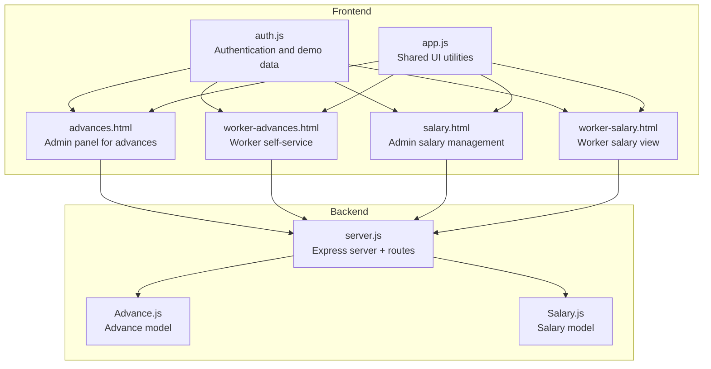
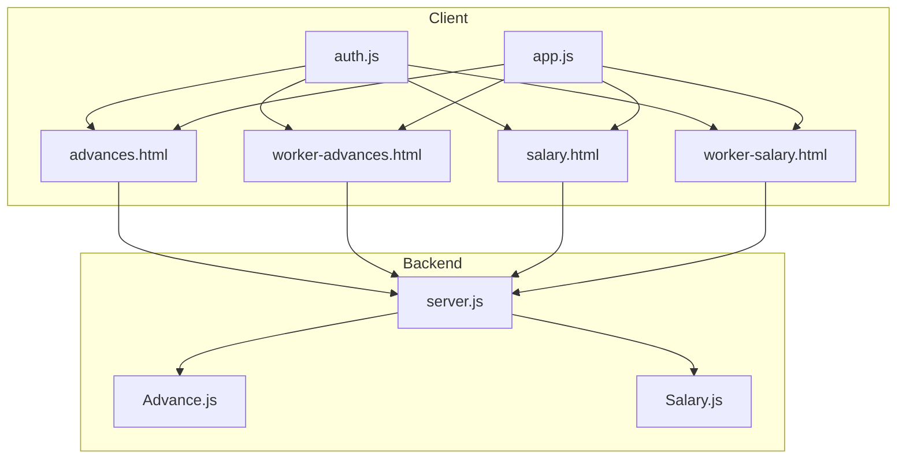
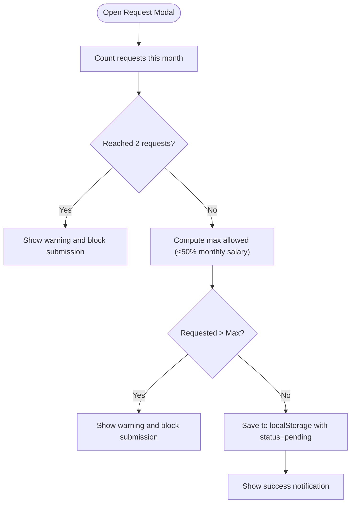
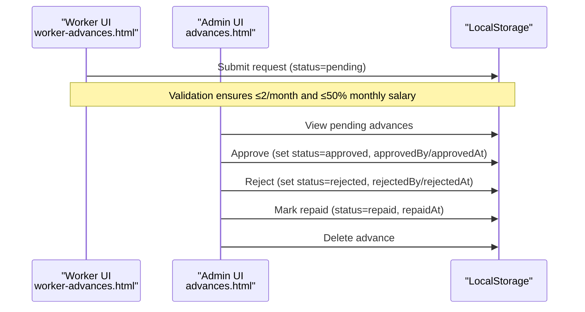
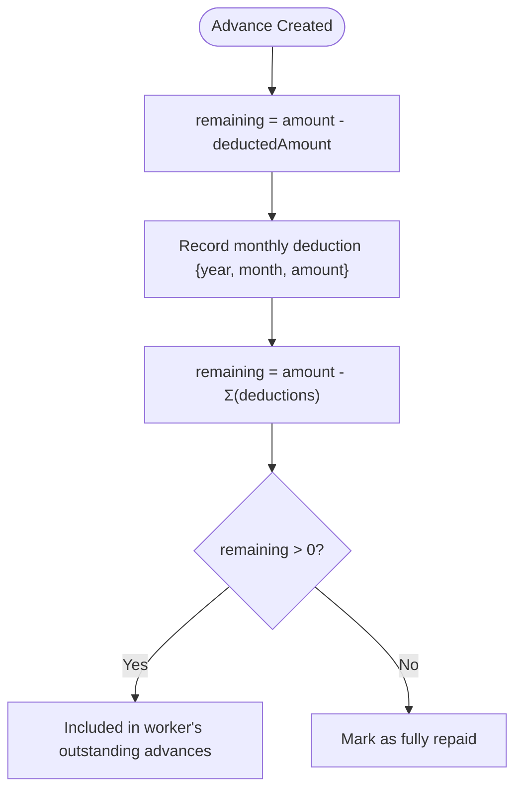
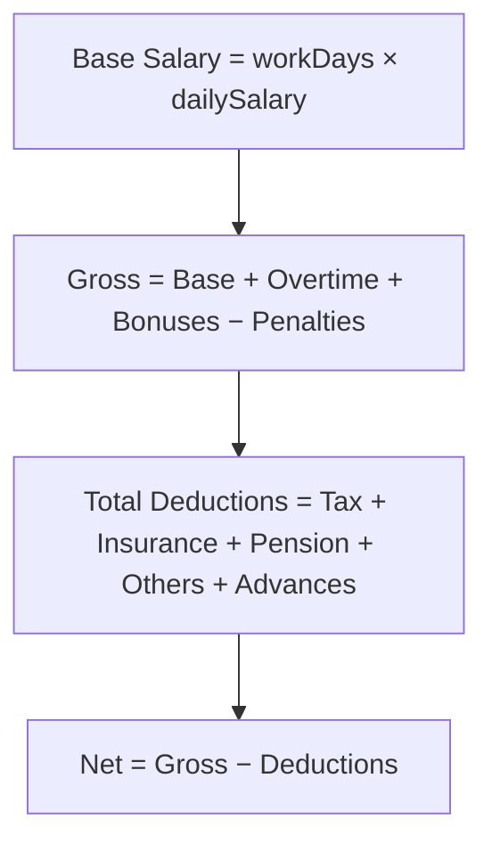
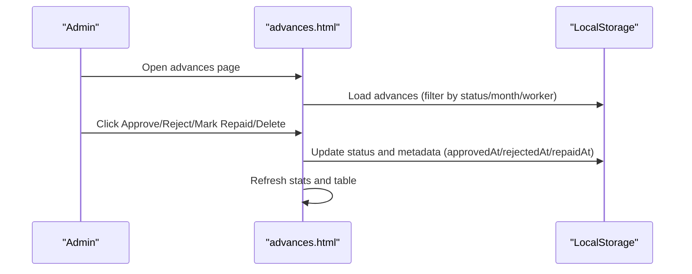
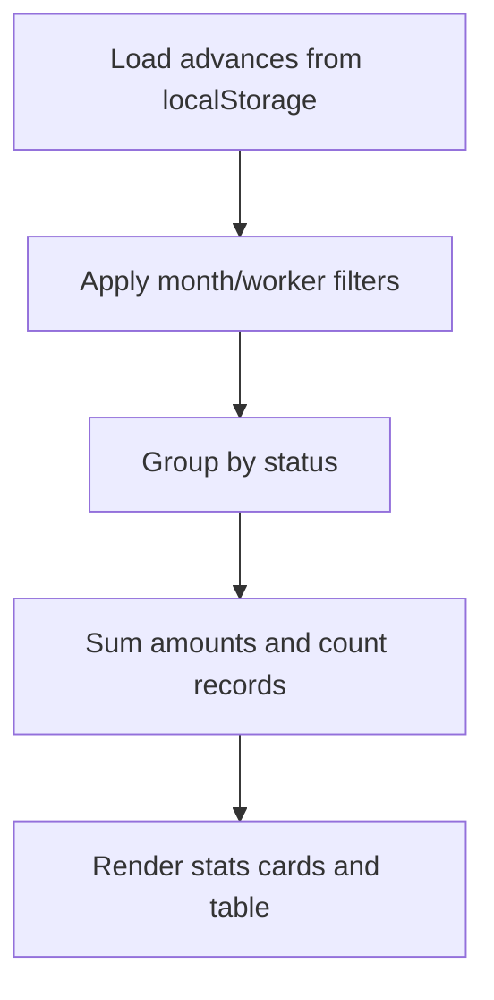
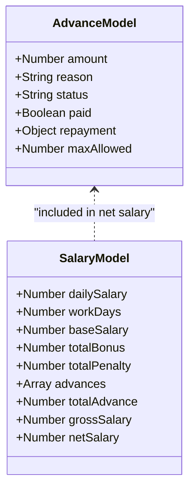
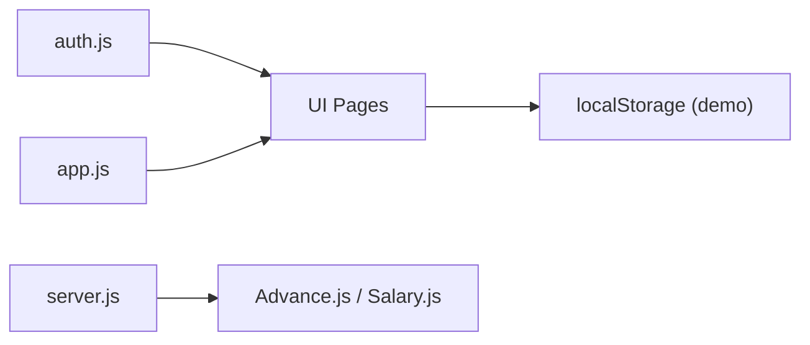

# Advance Payments

<cite>
**Referenced Files in This Document**
- [server.js](file://backend/server.js)
- [Advance.js](file://backend/models/Advance.js)
- [Salary.js](file://backend/models/Salary.js)
- [advances.html](file://advances.html)
- [worker-advances.html](file://worker-advances.html)
- [salary.html](file://salary.html)
- [worker-salary.html](file://worker-salary.html)
- [auth.js](file://auth.js)
- [app.js](file://app.js)
</cite>

## Table of Contents
1. [Introduction](#introduction)
2. [Project Structure](#project-structure)
3. [Core Components](#core-components)
4. [Architecture Overview](#architecture-overview)
5. [Detailed Component Analysis](#detailed-component-analysis)
6. [Dependency Analysis](#dependency-analysis)
7. [Performance Considerations](#performance-considerations)
8. [Troubleshooting Guide](#troubleshooting-guide)
9. [Conclusion](#conclusion)

## Introduction
This document explains the advance payment management system for the 555 İnşaat Worker Management System. It covers how workers request advances, how administrators approve or reject them, how repayment is tracked and deducted from future salaries, and how the system integrates with salary calculations and payroll. It also documents administrative controls, worker self-service capabilities, approval hierarchies, and reporting features for outstanding advances and financial impact tracking.

## Project Structure
The system comprises:
- Frontend pages for administration and worker self-service
- Shared frontend utilities and authentication helpers
- Backend server wiring and route exposure
- Backend data models for advances and salary computation

**Diagram sources**
- [server.js:95-118](file://backend/server.js#L95-L118)
- [Advance.js:1-146](file://backend/models/Advance.js#L1-L146)
- [Salary.js:1-325](file://backend/models/Salary.js#L1-L325)
- [advances.html:1-405](file://advances.html#L1-L405)
- [worker-advances.html:1-280](file://worker-advances.html#L1-L280)
- [salary.html:1-260](file://salary.html#L1-L260)
- [worker-salary.html:1-373](file://worker-salary.html#L1-L373)
- [auth.js:1-213](file://auth.js#L1-L213)
- [app.js:1-412](file://app.js#L1-L412)

**Section sources**
- [server.js:95-118](file://backend/server.js#L95-L118)
- [auth.js:15-53](file://auth.js#L15-L53)

## Core Components
- Advance model: Defines the schema for advance requests, approvals, payments, and repayment tracking with MongoDB/Mongoose.
- Salary model: Encapsulates salary computation, including advances as a deduction component.
- Admin UI (advances.html): Approve/reject advances, mark repayment, filter and report on statuses.
- Worker UI (worker-advances.html): Submit advance requests, enforce monthly limits and maximum amounts, track status.
- Salary UIs: Admin salary calculation and worker salary view for transparency and reconciliation.

Key implementation references:
- Advance model fields and indexes: [Advance.js:3-107](file://backend/models/Advance.js#L3-L107)
- Advance pre-save to compute remaining amount: [Advance.js:114-122](file://backend/models/Advance.js#L114-L122)
- Worker pending advances aggregation: [Advance.js:124-144](file://backend/models/Advance.js#L124-L144)
- Salary pre-save totals and net salary calculation including advances: [Salary.js:231-263](file://backend/models/Salary.js#L231-L263)
- Admin advance page actions (approve/reject/mark-repaid/delete): [advances.html:330-380](file://advances.html#L330-L380)
- Worker request validation (monthly cap and max amount): [worker-advances.html:217-265](file://worker-advances.html#L217-L265)

**Section sources**
- [Advance.js:3-146](file://backend/models/Advance.js#L3-L146)
- [Salary.js:231-263](file://backend/models/Salary.js#L231-L263)
- [advances.html:330-380](file://advances.html#L330-L380)
- [worker-advances.html:217-265](file://worker-advances.html#L217-L265)

## Architecture Overview
The system uses a client-side-first approach with localStorage for demo data and shared utilities. Administrative and worker UIs share common helpers for formatting, alerts, and navigation. The backend exposes routes for core modules and initializes MongoDB connections and cron jobs.

**Diagram sources**
- [server.js:95-118](file://backend/server.js#L95-L118)
- [Advance.js:1-146](file://backend/models/Advance.js#L1-L146)
- [Salary.js:1-325](file://backend/models/Salary.js#L1-L325)
- [auth.js:90-127](file://auth.js#L90-L127)
- [app.js:107-128](file://app.js#L107-L128)

## Detailed Component Analysis

### Advance Request Submission (Worker Self-Service)
Worker self-service allows submitting advance requests with validation:
- Monthly request cap: Two requests per month enforced by counting existing requests in the current month.
- Maximum amount: Cannot exceed 50% of the worker’s monthly salary (computed from daily salary or monthly salary).
- Request fields: amount, reason, optional repay date; status defaults to pending.

**Diagram sources**
- [worker-advances.html:217-265](file://worker-advances.html#L217-L265)
- [auth.js:130-132](file://auth.js#L130-L132)

**Section sources**
- [worker-advances.html:217-265](file://worker-advances.html#L217-L265)
- [auth.js:130-132](file://auth.js#L130-L132)

### Approval Workflows (Administrative Controls)
Administrators can manage advance requests:
- Pending requests: Approve or reject; on approval, set approvedBy/approvedAt; on rejection, set rejectedBy/rejectedAt.
- Approved but unpaid: Mark as repaid and update repaidAt; status transitions to repaid.
- Delete: Remove an advance record.

**Diagram sources**
- [advances.html:330-380](file://advances.html#L330-L380)
- [worker-advances.html:217-265](file://worker-advances.html#L217-L265)

**Section sources**
- [advances.html:330-380](file://advances.html#L330-L380)

### Repayment Scheduling and Deduction Tracking
Repayment tracking is supported via the Advance model:
- Deducted from salary flag and per-month deductions array enable tracking of how much was deducted each pay period.
- Remaining amount computed automatically based on total amount minus cumulative deductions.
- Aggregation helper computes a worker’s total outstanding advances across pending, approved, and paid statuses with remaining balance > 0.

**Diagram sources**
- [Advance.js:67-87](file://backend/models/Advance.js#L67-L87)
- [Advance.js:114-122](file://backend/models/Advance.js#L114-L122)
- [Advance.js:124-144](file://backend/models/Advance.js#L124-L144)

**Section sources**
- [Advance.js:67-87](file://backend/models/Advance.js#L67-L87)
- [Advance.js:114-122](file://backend/models/Advance.js#L114-L122)
- [Advance.js:124-144](file://backend/models/Advance.js#L124-L144)

### Amount Calculation Methodologies
- Worker monthly salary: Derived from daily salary × 30 or configured monthly salary.
- Maximum advance: Up to 50% of monthly salary for a single request.
- Net salary computation: Gross salary (base + overtime + bonuses − penalties) minus taxes, insurance, pension, other deductions, and total advances.

**Diagram sources**
- [Salary.js:242-260](file://backend/models/Salary.js#L242-L260)
- [worker-advances.html:239-248](file://worker-advances.html#L239-L248)

**Section sources**
- [Salary.js:242-260](file://backend/models/Salary.js#L242-L260)
- [worker-advances.html:239-248](file://worker-advances.html#L239-L248)

### Advance Types
The current implementation does not differentiate between advance types (e.g., salary advances, equipment purchases, emergency funds) in the UI or model. Requests include a reason field, but no explicit type enumeration exists. Administrators can approve or reject based on reason and policy.

Recommendation: Introduce an advanceType field in the Advance model and UI to categorize requests for better reporting and policy enforcement.

**Section sources**
- [Advance.js:22-27](file://backend/models/Advance.js#L22-L27)
- [advances.html:152-168](file://advances.html#L152-L168)

### Administrative Controls and Approval Hierarchies
- Admin-only access to advance management page.
- Approval actions: approve, reject, mark repaid, delete.
- Status badges and action buttons reflect current state and available actions.

**Diagram sources**
- [advances.html:396-401](file://advances.html#L396-L401)
- [advances.html:330-380](file://advances.html#L330-L380)

**Section sources**
- [advances.html:396-401](file://advances.html#L396-L401)
- [advances.html:330-380](file://advances.html#L330-L380)

### Reporting Features
- Admin dashboard shows counts and totals for pending, approved, monthly advances, and unpaid balances.
- Filtering by month and worker enables targeted reporting.
- Worker self-service displays personal stats: total advance, approved count, pending count, unpaid amount.

**Diagram sources**
- [advances.html:216-234](file://advances.html#L216-L234)
- [worker-advances.html:178-191](file://worker-advances.html#L178-L191)

**Section sources**
- [advances.html:216-234](file://advances.html#L216-L234)
- [worker-advances.html:178-191](file://worker-advances.html#L178-L191)

### Integration with Salary Calculations and Payroll
- Salary model includes an advances array and totalAdvance field; net salary subtracts totalAdvance.
- Worker salary view computes monthly totals from daily salary and performance data; advances appear as a deduction in the payslip-like breakdown.

**Diagram sources**
- [Advance.js:3-107](file://backend/models/Advance.js#L3-L107)
- [Salary.js:111-131](file://backend/models/Salary.js#L111-L131)
- [Salary.js:239-260](file://backend/models/Salary.js#L239-L260)

**Section sources**
- [Advance.js:3-107](file://backend/models/Advance.js#L3-L107)
- [Salary.js:111-131](file://backend/models/Salary.js#L111-L131)
- [Salary.js:239-260](file://backend/models/Salary.js#L239-L260)

## Dependency Analysis
- Frontend depends on shared utilities (tooltips, modals, alerts, CSV export) and authentication helpers.
- Backend exposes routes and initializes database connectivity and cron jobs.
- Advance and Salary models define domain logic and pre-save computations.

**Diagram sources**
- [auth.js:130-132](file://auth.js#L130-L132)
- [app.js:107-128](file://app.js#L107-L128)
- [server.js:79-93](file://backend/server.js#L79-L93)
- [Advance.js:1-146](file://backend/models/Advance.js#L1-L146)
- [Salary.js:1-325](file://backend/models/Salary.js#L1-L325)

**Section sources**
- [auth.js:130-132](file://auth.js#L130-L132)
- [app.js:107-128](file://app.js#L107-L128)
- [server.js:79-93](file://backend/server.js#L79-L93)

## Performance Considerations
- Client-side filtering and sorting are efficient for small datasets; consider pagination or server-side filtering for larger data volumes.
- Pre-save aggregations in models reduce runtime computation and ensure consistency.
- Debouncing and throttling utilities are available for search and input handling.

## Troubleshooting Guide
Common issues and resolutions:
- Worker cannot submit more than two advances per month: Verify monthly request count logic and reset on month change.
- Request exceeds maximum allowed: Ensure daily salary is set and monthly salary calculation is correct.
- Repayment not reflected in salary: Confirm that deductions are recorded per month and remaining amount updates accordingly.
- Admin actions not persisting: Check localStorage availability and browser privacy settings.

**Section sources**
- [worker-advances.html:220-248](file://worker-advances.html#L220-L248)
- [Advance.js:114-122](file://backend/models/Advance.js#L114-L122)
- [salary.html:145-218](file://salary.html#L145-L218)

## Conclusion
The 555 İnşaat advance payment system provides a practical foundation for managing worker advances with worker self-service and administrative oversight. The system integrates repayment tracking with salary calculations and offers reporting capabilities. Enhancements such as advance type categorization, server-backed persistence, and formal approval workflows would strengthen governance and scalability.