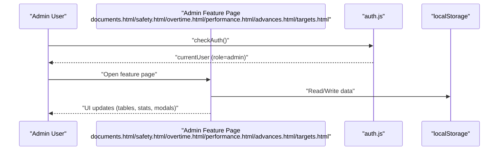
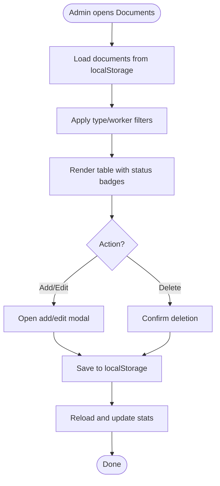
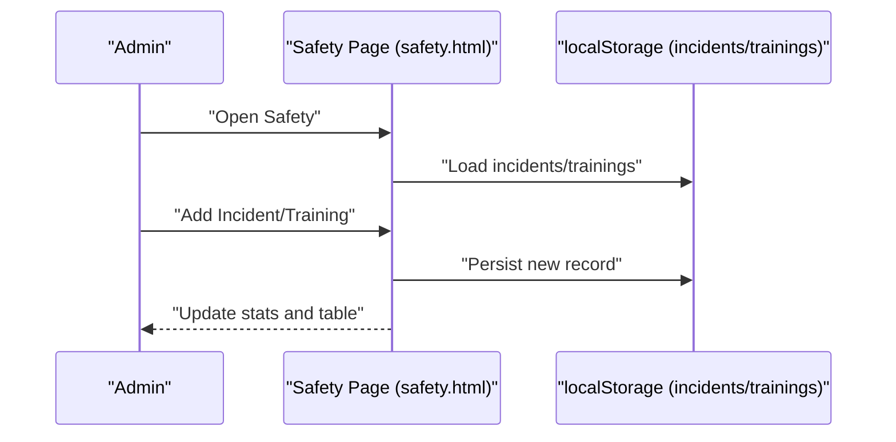
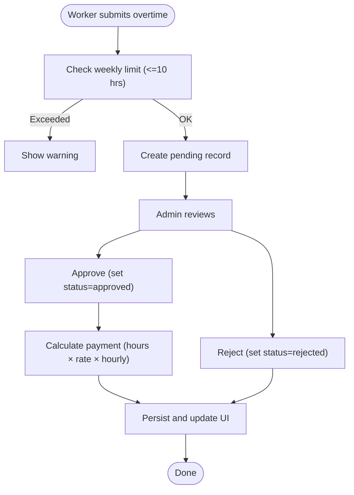
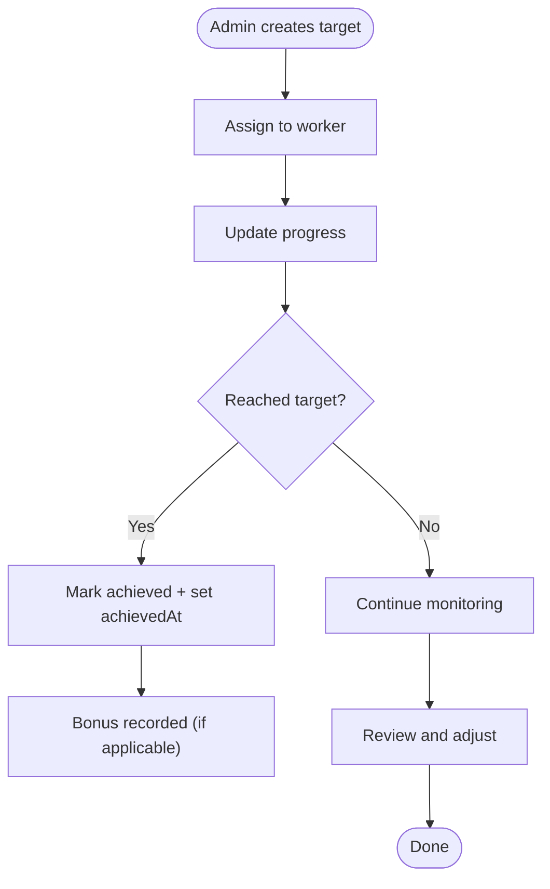
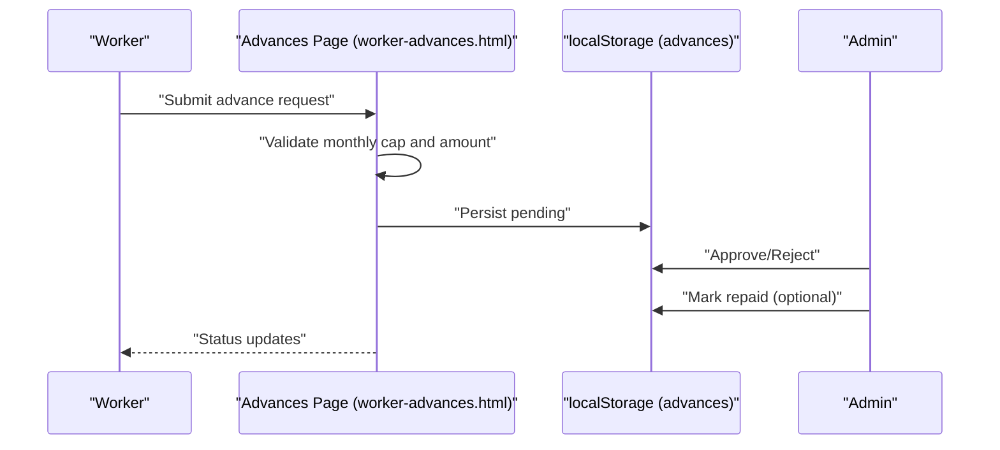
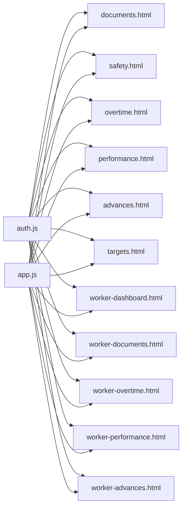

# Advanced Features

<cite>
**Referenced Files in This Document**
- [documents.html](file://documents.html)
- [safety.html](file://safety.html)
- [overtime.html](file://overtime.html)
- [performance.html](file://performance.html)
- [advances.html](file://advances.html)
- [targets.html](file://targets.html)
- [auth.js](file://auth.js)
- [app.js](file://app.js)
- [worker-dashboard.html](file://worker-dashboard.html)
- [worker-documents.html](file://worker-documents.html)
- [worker-overtime.html](file://worker-overtime.html)
- [worker-performance.html](file://worker-performance.html)
- [worker-advances.html](file://worker-advances.html)
</cite>

## Table of Contents
1. [Introduction](#introduction)
2. [Project Structure](#project-structure)
3. [Core Components](#core-components)
4. [Architecture Overview](#architecture-overview)
5. [Detailed Component Analysis](#detailed-component-analysis)
6. [Dependency Analysis](#dependency-analysis)
7. [Performance Considerations](#performance-considerations)
8. [Troubleshooting Guide](#troubleshooting-guide)
9. [Conclusion](#conclusion)

## Introduction
This document explains the advanced features of the workforce management system with a focus on:
- Document management for storing and organizing worker documents
- Safety protocol management for construction site safety procedures
- Overtime tracking for additional work hours
- Performance targets for setting and tracking worker objectives
- Advance payment management for partial salary disbursements

It details data models, workflows, administrative controls, worker access permissions, reporting capabilities, and integration points with core system components.

## Project Structure
The system is organized into admin and worker dashboards with dedicated pages for each advanced feature. Data is persisted client-side via localStorage with shared utilities for authentication, formatting, and UI helpers.

```mermaid
graph TB
subgraph "Admin Pages"
A_docs["documents.html"]
A_safety["safety.html"]
A_overtime["overtime.html"]
A_performance["performance.html"]
A_advances["advances.html"]
A_targets["targets.html"]
end
subgraph "Worker Pages"
W_dashboard["worker-dashboard.html"]
W_docs["worker-documents.html"]
W_overtime["worker-overtime.html"]
W_performance["worker-performance.html"]
W_advances["worker-advances.html"]
end
Auth["auth.js"]
App["app.js"]
A_docs --> Auth
A_safety --> Auth
A_overtime --> Auth
A_performance --> Auth
A_advances --> Auth
A_targets --> Auth
W_dashboard --> Auth
W_docs --> Auth
W_overtime --> Auth
W_performance --> Auth
W_advances --> Auth
A_docs --> App
A_safety --> App
A_overtime --> App
A_performance --> App
A_advances --> App
A_targets --> App
W_dashboard --> App
W_docs --> App
W_overtime --> App
W_performance --> App
W_advances --> App
```

**Diagram sources**
- [documents.html](file://documents.html)
- [safety.html](file://safety.html)
- [overtime.html](file://overtime.html)
- [performance.html](file://performance.html)
- [advances.html](file://advances.html)
- [targets.html](file://targets.html)
- [worker-dashboard.html](file://worker-dashboard.html)
- [worker-documents.html](file://worker-documents.html)
- [worker-overtime.html](file://worker-overtime.html)
- [worker-performance.html](file://worker-performance.html)
- [worker-advances.html](file://worker-advances.html)
- [auth.js](file://auth.js)
- [app.js](file://app.js)

**Section sources**
- [documents.html](file://documents.html)
- [safety.html](file://safety.html)
- [overtime.html](file://overtime.html)
- [performance.html](file://performance.html)
- [advances.html](file://advances.html)
- [targets.html](file://targets.html)
- [worker-dashboard.html](file://worker-dashboard.html)
- [worker-documents.html](file://worker-documents.html)
- [worker-overtime.html](file://worker-overtime.html)
- [worker-performance.html](file://worker-performance.html)
- [worker-advances.html](file://worker-advances.html)
- [auth.js](file://auth.js)
- [app.js](file://app.js)

## Core Components
- Authentication and data initialization: [auth.js](file://auth.js)
- Shared UI utilities and helpers: [app.js](file://app.js)
- Feature pages:
  - Documents: [documents.html](file://documents.html)
  - Safety: [safety.html](file://safety.html)
  - Overtime: [overtime.html](file://overtime.html)
  - Performance: [performance.html](file://performance.html)
  - Advances: [advances.html](file://advances.html)
  - Targets: [targets.html](file://targets.html)
  - Worker views:
    - Dashboard: [worker-dashboard.html](file://worker-dashboard.html)
    - Documents: [worker-documents.html](file://worker-documents.html)
    - Overtime: [worker-overtime.html](file://worker-overtime.html)
    - Performance: [worker-performance.html](file://worker-performance.html)
    - Advances: [worker-advances.html](file://worker-advances.html)

Key shared utilities:
- Formatting helpers: [auth.js](file://auth.js)
- Modal, tabs, alerts, and DOM helpers: [app.js](file://app.js)

**Section sources**
- [auth.js](file://auth.js)
- [app.js](file://app.js)

## Architecture Overview
The system uses a client-side architecture with localStorage as the persistence layer. Admin pages enforce role-based access and provide centralized management. Worker pages expose read-only or request-based workflows with limited write privileges.

**Diagram sources**
- [documents.html](file://documents.html)
- [safety.html](file://safety.html)
- [overtime.html](file://overtime.html)
- [performance.html](file://performance.html)
- [advances.html](file://advances.html)
- [targets.html](file://targets.html)
- [auth.js](file://auth.js)

## Detailed Component Analysis

### Document Management
Purpose: Store and organize worker documents (contracts, identity, certificates, medical, others) with expiry tracking.

Data model (localStorage key: documents):
- Document entity: id, workerId, name, type, number, date, expiryDate, notes, createdAt
- Types: contract, id, certificate, medical, other
- Status computed from expiryDate vs. current date

Workflows:
- Admin adds/edit/delete documents via modal
- Filtering by type and worker
- Stats: total, active, expiring soon, expired
- Worker view shows personal documents with status badges

Administrative controls:
- Role gating: only admin can add/edit/delete
- Worker access: personal documents only

Reporting:
- Stats cards per status
- Table with action buttons (edit/delete)

Integration points:
- Uses shared helpers: [auth.js](file://auth.js), [app.js](file://app.js)

**Diagram sources**
- [documents.html](file://documents.html)
- [auth.js](file://auth.js)
- [app.js](file://app.js)

**Section sources**
- [documents.html](file://documents.html)
- [auth.js](file://auth.js)
- [app.js](file://app.js)

### Safety Protocol Management
Purpose: Track safety incidents, training records, and equipment requirements.

Data models (localStorage keys: incidents, trainings):
- Incidents: id, workerId, date, type, severity, description, actions, createdAt
- Trainings: id, workerId, name, date, certificate, expiryDate, createdAt
- Types/severities: predefined lists

Workflows:
- Admin logs incidents and training sessions
- Stats: trained workers, certifications, monthly incidents, serious incidents
- Tabs: incidents, trainings, equipment overview

Administrative controls:
- Role gating: admin-only creation
- Worker access: read-only view via worker-safety concept

Reporting:
- Stats cards and tabular data
- Severity badges and status indicators

**Diagram sources**
- [safety.html](file://safety.html)
- [auth.js](file://auth.js)
- [app.js](file://app.js)

**Section sources**
- [safety.html](file://safety.html)
- [auth.js](file://auth.js)
- [app.js](file://app.js)

### Overtime Tracking
Purpose: Record and approve additional work hours with configurable rates.

Data model (localStorage key: overtime):
- Entity: id, workerId, date, hours, reason, rate, payment, status, createdAt, approvedBy, approvedAt
- Status: pending, approved, rejected
- Rate multipliers: 1.5x (standard), 2x (holiday/rest), 2.5x (night shift)

Workflows:
- Worker requests overtime (limited weekly hours)
- Admin approves/rejects
- Payment calculated from worker dailySalary and rate
- Stats: total hours, total payment, pending/approved counts

Administrative controls:
- Worker: request only (no edit/delete)
- Admin: approve/reject/delete

Reporting:
- Stats cards and filtered table
- Progression from pending to approved with payment

**Diagram sources**
- [overtime.html](file://overtime.html)
- [worker-overtime.html](file://worker-overtime.html)
- [auth.js](file://auth.js)
- [app.js](file://app.js)

**Section sources**
- [overtime.html](file://overtime.html)
- [worker-overtime.html](file://worker-overtime.html)
- [auth.js](file://auth.js)
- [app.js](file://app.js)

### Performance Targets
Purpose: Define measurable goals with deadlines and bonuses; track progress and achievements.

Data model (localStorage key: targets):
- Entity: id, workerId, name, description, targetValue, unit, currentValue, deadline, bonus, status, createdAt, achievedAt
- Status: active, achieved, missed
- Units: m2, m3, count, hour, day, project

Workflows:
- Admin creates targets for workers
- Progress updated by admin or worker
- Auto-mark achieved when currentValue ≥ targetValue
- Stats: active, achieved, total bonus, success rate

Administrative controls:
- Admin: create/update/delete, mark achieved
- Worker: view and limited updates

Reporting:
- Stats cards and progress bars
- Deadline warnings for overdue targets

**Diagram sources**
- [targets.html](file://targets.html)
- [auth.js](file://auth.js)
- [app.js](file://app.js)

**Section sources**
- [targets.html](file://targets.html)
- [auth.js](file://auth.js)
- [app.js](file://app.js)

### Advance Payment Management
Purpose: Manage partial salary disbursements with approval and repayment tracking.

Data model (localStorage key: advances):
- Entity: id, workerId, amount, reason, repayDate, date, status, createdBy, approvedBy, approvedAt, rejectedBy, rejectedAt, repaid, repaidAt
- Status: pending, approved, rejected, repaid

Workflows:
- Worker requests advances (monthly cap and amount limits)
- Admin approves/rejects
- Repayment tracking (automatic from next salary or manual mark)

Administrative controls:
- Worker: request only
- Admin: approve/reject/mark repaid/delete

Reporting:
- Stats: pending/approved, monthly total, unpaid balance
- Tabbed view by status

**Diagram sources**
- [advances.html](file://advances.html)
- [worker-advances.html](file://worker-advances.html)
- [auth.js](file://auth.js)
- [app.js](file://app.js)

**Section sources**
- [advances.html](file://advances.html)
- [worker-advances.html](file://worker-advances.html)
- [auth.js](file://auth.js)
- [app.js](file://app.js)

### Worker Access Permissions
- Admin pages enforce role-based access; non-admins redirected to worker-dashboard.
- Worker pages restrict actions to read/view or controlled requests (e.g., overtime requests, advance requests).
- Worker views show personal data only (documents, overtime history, performance stats, advances).

**Section sources**
- [documents.html](file://documents.html)
- [safety.html](file://safety.html)
- [overtime.html](file://overtime.html)
- [performance.html](file://performance.html)
- [advances.html](file://advances.html)
- [targets.html](file://targets.html)
- [worker-dashboard.html](file://worker-dashboard.html)
- [worker-documents.html](file://worker-documents.html)
- [worker-overtime.html](file://worker-overtime.html)
- [worker-performance.html](file://worker-performance.html)
- [worker-advances.html](file://worker-advances.html)
- [auth.js](file://auth.js)

### Administrative Controls
- Authentication and role enforcement handled centrally.
- Modals and forms validated via shared helpers.
- Stats and filtering implemented consistently across pages.

**Section sources**
- [auth.js](file://auth.js)
- [app.js](file://app.js)

### Reporting Capabilities
- Stats cards for quick overview (documents, safety, overtime, targets, advances).
- Filterable tables with status badges and action buttons.
- Worker dashboards summarize personal performance and documents.

**Section sources**
- [documents.html](file://documents.html)
- [safety.html](file://safety.html)
- [overtime.html](file://overtime.html)
- [performance.html](file://performance.html)
- [advances.html](file://advances.html)
- [targets.html](file://targets.html)
- [worker-dashboard.html](file://worker-dashboard.html)

## Dependency Analysis
- All feature pages depend on [auth.js](file://auth.js) for authentication and data accessors.
- UI helpers and utilities are centralized in [app.js](file://app.js).
- Worker dashboards depend on shared data from [auth.js](file://auth.js) and localStorage.

**Diagram sources**
- [auth.js](file://auth.js)
- [app.js](file://app.js)
- [documents.html](file://documents.html)
- [safety.html](file://safety.html)
- [overtime.html](file://overtime.html)
- [performance.html](file://performance.html)
- [advances.html](file://advances.html)
- [targets.html](file://targets.html)
- [worker-dashboard.html](file://worker-dashboard.html)
- [worker-documents.html](file://worker-documents.html)
- [worker-overtime.html](file://worker-overtime.html)
- [worker-performance.html](file://worker-performance.html)
- [worker-advances.html](file://worker-advances.html)

**Section sources**
- [auth.js](file://auth.js)
- [app.js](file://app.js)

## Performance Considerations
- Client-side filtering and sorting are efficient for small datasets; consider pagination or server-side filtering for larger volumes.
- Stats calculations are O(n) per view; cache results when possible.
- Avoid frequent localStorage writes; batch updates where feasible.

## Troubleshooting Guide
Common issues and resolutions:
- Authentication errors: ensure currentUser exists and role is admin for admin pages.
- Empty tables: verify localStorage keys exist and are populated.
- Alerts and notifications: use shared helpers for consistent UX.
- Modal interactions: ensure proper open/close handlers and backdrop clicks.

**Section sources**
- [auth.js](file://auth.js)
- [app.js](file://app.js)

## Conclusion
The advanced features are implemented with a clean separation of concerns: centralized authentication and utilities, feature-specific pages, and consistent UI patterns. Admin pages provide comprehensive management, while worker pages offer controlled access to personal data and request workflows. The system leverages localStorage for simplicity and immediate feedback, suitable for small to medium deployments.