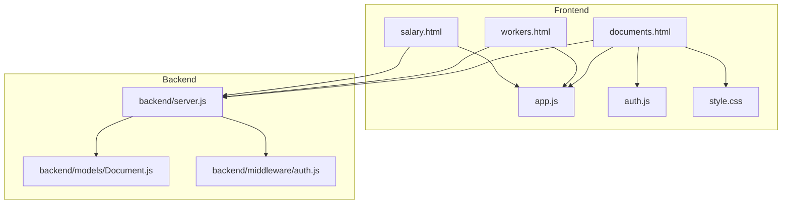
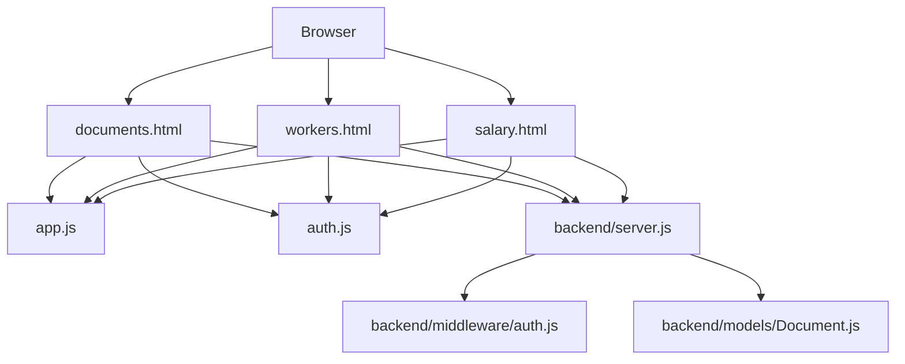
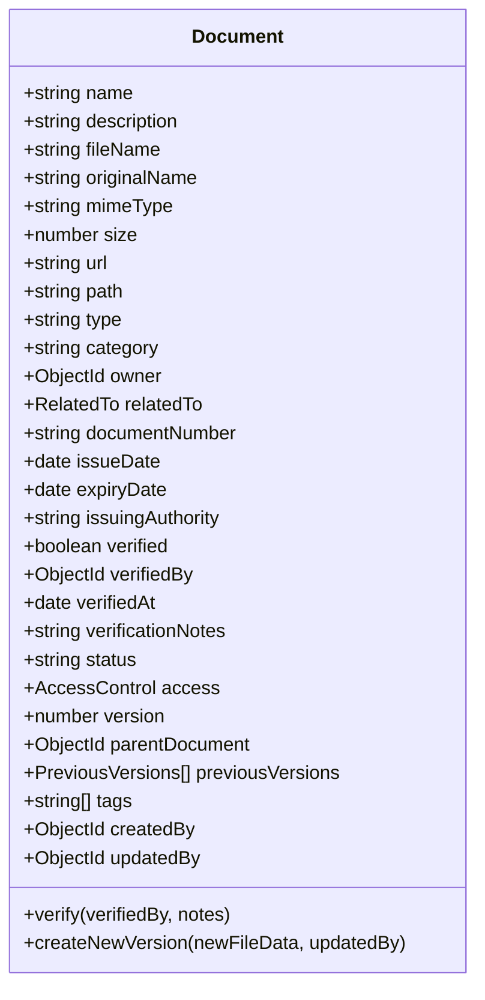
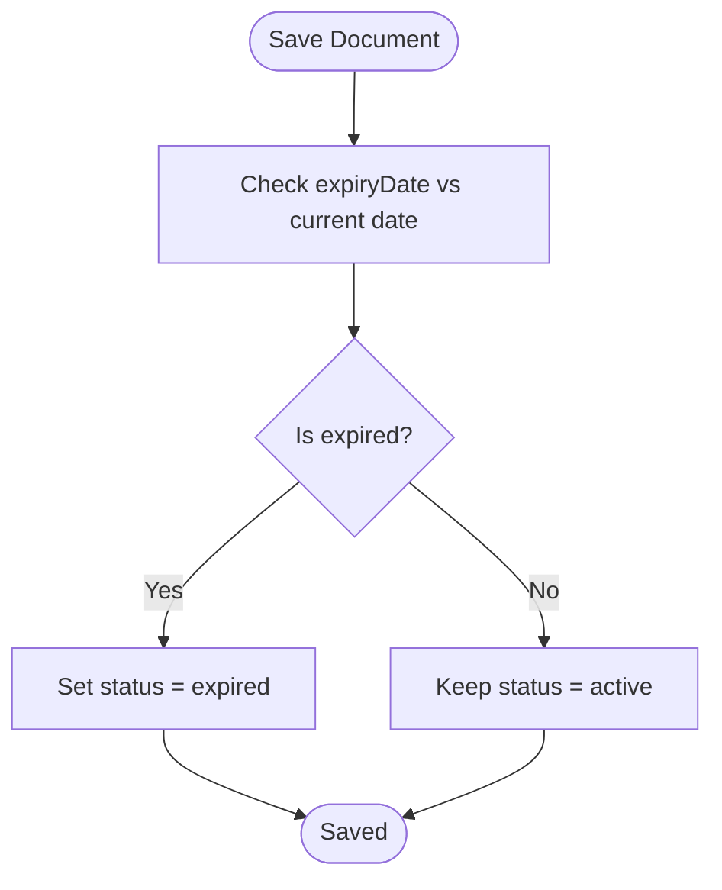
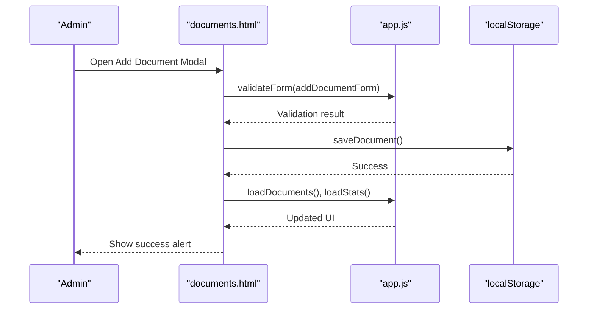
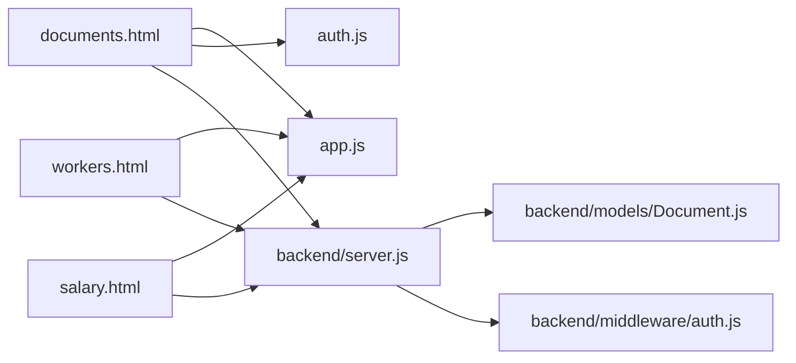

# Document Management

<cite>
**Referenced Files in This Document**
- [documents.html](file://documents.html)
- [app.js](file://app.js)
- [auth.js](file://auth.js)
- [style.css](file://style.css)
- [backend/server.js](file://backend/server.js)
- [backend/models/Document.js](file://backend/models/Document.js)
- [backend/middleware/auth.js](file://backend/middleware/auth.js)
- [workers.html](file://workers.html)
- [salary.html](file://salary.html)
</cite>

## Table of Contents
1. [Introduction](#introduction)
2. [Project Structure](#project-structure)
3. [Core Components](#core-components)
4. [Architecture Overview](#architecture-overview)
5. [Detailed Component Analysis](#detailed-component-analysis)
6. [Dependency Analysis](#dependency-analysis)
7. [Performance Considerations](#performance-considerations)
8. [Troubleshooting Guide](#troubleshooting-guide)
9. [Conclusion](#conclusion)

## Introduction
This document describes the document management system for the 555 İnşaat construction workforce management platform. It covers supported document types, worker assignment, lifecycle management, creation workflow, filtering/search, status tracking, statistics dashboard, administrative controls, and integrations with worker profiles and salary/permission systems.

## Project Structure
The system comprises:
- Frontend pages for administration and worker views
- Shared frontend utilities and styling
- Backend server exposing REST APIs and managing persistence via MongoDB/Mongoose
- Models defining document schema and lifecycle behaviors
- Middleware for authentication and authorization

**Diagram sources**
- [documents.html](file://documents.html)
- [app.js](file://app.js)
- [auth.js](file://auth.js)
- [style.css](file://style.css)
- [backend/server.js](file://backend/server.js)
- [backend/models/Document.js](file://backend/models/Document.js)
- [backend/middleware/auth.js](file://backend/middleware/auth.js)
- [workers.html](file://workers.html)
- [salary.html](file://salary.html)

**Section sources**
- [documents.html](file://documents.html)
- [app.js](file://app.js)
- [auth.js](file://auth.js)
- [style.css](file://style.css)
- [backend/server.js](file://backend/server.js)
- [backend/models/Document.js](file://backend/models/Document.js)
- [backend/middleware/auth.js](file://backend/middleware/auth.js)
- [workers.html](file://workers.html)
- [salary.html](file://salary.html)

## Core Components
- Document types supported in the backend include identity, passport, diploma, certificate, contract, permit, license, medical, insurance, resume, photo, blueprint, invoice, report, and other. These types inform categorization and status handling.
- Worker assignment: Documents are associated with workers via owner and relatedTo fields in the model, enabling per-worker document visibility and lifecycle tracking.
- Lifecycle management: Documents can be active, expired, revoked, or pending verification. Expiration is enforced automatically when saving documents whose expiry date has passed.
- Creation workflow: The frontend allows selecting a worker, entering document name, type, number, issue date, expiry date, and notes. Required fields are validated before saving.
- Filtering and search: The documents page supports filtering by type and worker, plus a global search bar on the workers page for cross-reference.
- Status tracking: Documents are categorized as active, expiring soon (within 30 days), or expired. The statistics dashboard displays totals for all documents, active contracts, expiring soon, and expired.
- Administrative controls: Add, edit, and delete actions are available in the UI; edit is currently a placeholder and will be implemented in future iterations.
- Integrations: Documents integrate with worker profiles (via owner/relatedTo), salary calculations (where documents impact verification/status affecting payroll), and permissions (access control via allowedUsers and allowedRoles).

**Section sources**
- [backend/models/Document.js](file://backend/models/Document.js)
- [documents.html](file://documents.html)
- [app.js](file://app.js)
- [auth.js](file://auth.js)
- [workers.html](file://workers.html)
- [salary.html](file://salary.html)

## Architecture Overview
The system follows a client-server architecture:
- Frontend pages render UI, manage local state, and coordinate with backend APIs.
- Backend server exposes REST endpoints, enforces authentication/authorization, and persists data using Mongoose models.
- MongoDB stores documents with rich metadata, categories, ownership, and lifecycle fields.

**Diagram sources**
- [documents.html](file://documents.html)
- [workers.html](file://workers.html)
- [salary.html](file://salary.html)
- [app.js](file://app.js)
- [auth.js](file://auth.js)
- [backend/server.js](file://backend/server.js)
- [backend/middleware/auth.js](file://backend/middleware/auth.js)
- [backend/models/Document.js](file://backend/models/Document.js)

## Detailed Component Analysis

### Document Types and Categories
Supported document types include identity, passport, diploma, certificate, contract, permit, license, medical, insurance, resume, photo, blueprint, invoice, report, and other. Categories include personal, work, project, financial, legal, and other. These fields enable classification and targeted access control.

**Diagram sources**
- [backend/models/Document.js](file://backend/models/Document.js)

**Section sources**
- [backend/models/Document.js](file://backend/models/Document.js)

### Document Lifecycle Management
Lifecycle states: active, expired, revoked, pending_verification. Automatic status updates occur on save when expiryDate passes. Virtual fields compute expiration status and days until expiry. Static helpers support expiring document queries and owner-scoped retrieval.

**Diagram sources**
- [backend/models/Document.js](file://backend/models/Document.js)

**Section sources**
- [backend/models/Document.js](file://backend/models/Document.js)

### Document Creation Workflow
The frontend form collects:
- Worker selection (required)
- Document name (required)
- Type (required)
- Document number (optional)
- Issue date (required)
- Expiry date (optional)
- Notes (optional)

Validation ensures required fields are present before persisting. The form uses modal UI and local storage for quick prototyping.

**Diagram sources**
- [documents.html](file://documents.html)
- [app.js](file://app.js)

**Section sources**
- [documents.html](file://documents.html)
- [app.js](file://app.js)

### Filtering and Search Capabilities
- Type filter: Dropdown to filter by document type.
- Worker filter: Dropdown populated from worker list.
- Global search: Implemented on the workers page to filter worker records.

These features enable efficient navigation across large document sets.

**Section sources**
- [documents.html](file://documents.html)
- [workers.html](file://workers.html)

### Document Status Tracking
The system computes:
- Total documents
- Active contracts (type = contract and not expired)
- Expiring soon (expires within 30 days)
- Expired (expiry date passed)

Status badges are rendered per row reflecting active, expiring soon, or expired.

**Section sources**
- [documents.html](file://documents.html)

### Statistics Dashboard
The dashboard presents four KPIs:
- Total documents
- Active contracts
- Expiring soon
- Expired

Values are computed from stored documents and displayed in stat cards.

**Section sources**
- [documents.html](file://documents.html)

### Administrative Controls
- Add: Opens modal, validates, saves, refreshes lists and stats.
- Edit: Placeholder for future implementation.
- Delete: Confirms deletion, removes from storage, refreshes UI.

**Section sources**
- [documents.html](file://documents.html)

### Integration with Worker Profiles
- Documents are owned by workers (owner field) and can be linked to specific workers via relatedTo.
- Worker profile data is used to populate dropdowns and display worker names in the documents table.
- Salary and permission systems can reference document verification and status for access control and payroll decisions.

**Section sources**
- [backend/models/Document.js](file://backend/models/Document.js)
- [documents.html](file://documents.html)
- [auth.js](file://auth.js)
- [workers.html](file://workers.html)
- [salary.html](file://salary.html)

## Dependency Analysis
Key dependencies and relationships:
- documents.html depends on app.js for shared utilities and auth.js for session management.
- backend/server.js orchestrates routes and integrates with MongoDB via Mongoose.
- backend/models/Document.js defines the schema and lifecycle behaviors.
- backend/middleware/auth.js provides authentication and authorization guards.
- workers.html and salary.html provide worker and payroll data used by the document system.

**Diagram sources**
- [documents.html](file://documents.html)
- [app.js](file://app.js)
- [auth.js](file://auth.js)
- [workers.html](file://workers.html)
- [salary.html](file://salary.html)
- [backend/server.js](file://backend/server.js)
- [backend/models/Document.js](file://backend/models/Document.js)
- [backend/middleware/auth.js](file://backend/middleware/auth.js)

**Section sources**
- [documents.html](file://documents.html)
- [app.js](file://app.js)
- [auth.js](file://auth.js)
- [workers.html](file://workers.html)
- [salary.html](file://salary.html)
- [backend/server.js](file://backend/server.js)
- [backend/models/Document.js](file://backend/models/Document.js)
- [backend/middleware/auth.js](file://backend/middleware/auth.js)

## Performance Considerations
- Client-side filtering and rendering are suitable for small datasets; for larger deployments, consider server-side pagination and filtering.
- Local storage usage simplifies development but is not scalable; migrate to backend APIs for production.
- Use database indexes on frequently queried fields (owner, type, category, status, expiryDate) to improve query performance.

## Troubleshooting Guide
Common issues and resolutions:
- Authentication errors: Ensure proper login and session presence; verify localStorage availability.
- Missing worker data: Confirm demo initialization and localStorage population.
- Edit/Delete actions: Currently, edit is a placeholder; implement edit modal and API endpoints.
- Expiration not updating: Verify document expiryDate and save operation triggers pre-save middleware.

**Section sources**
- [auth.js](file://auth.js)
- [documents.html](file://documents.html)
- [backend/models/Document.js](file://backend/models/Document.js)

## Conclusion
The document management system provides a robust foundation for storing, categorizing, and tracking worker-related documents. It supports essential lifecycle features, integrates with worker and payroll systems, and offers a clear path for future enhancements such as server-side persistence, advanced access control, and expanded administrative capabilities.