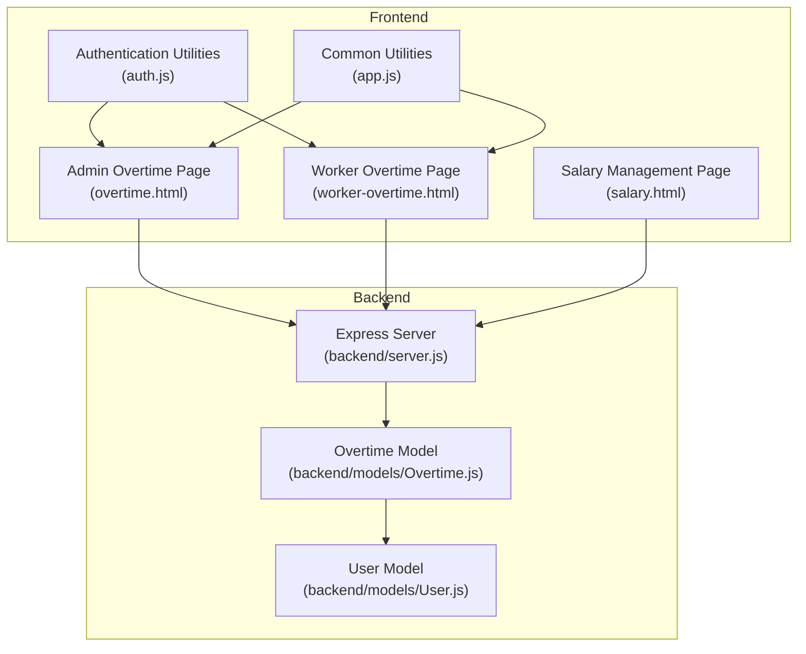
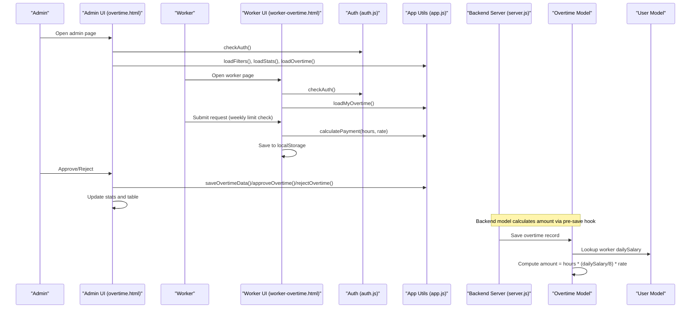
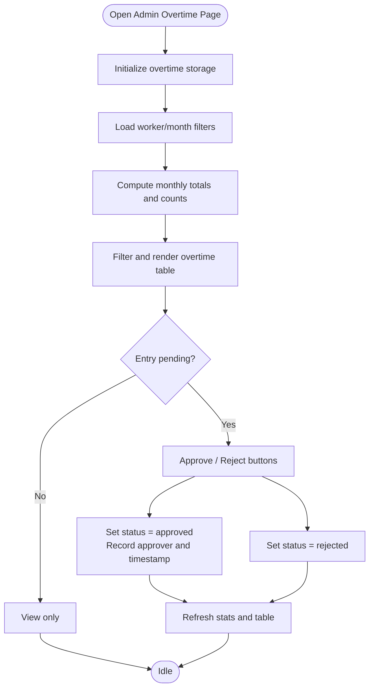
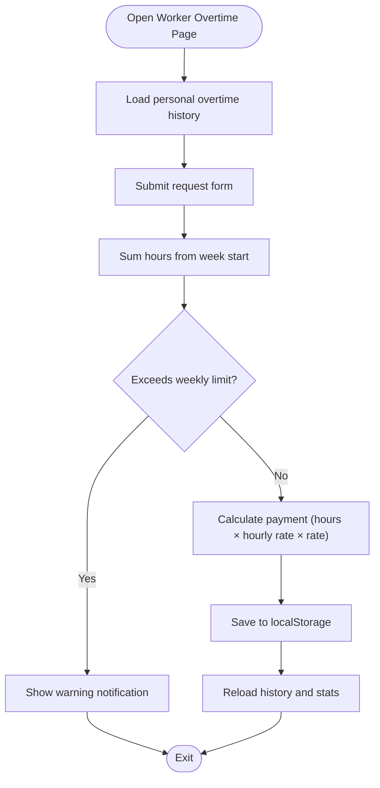
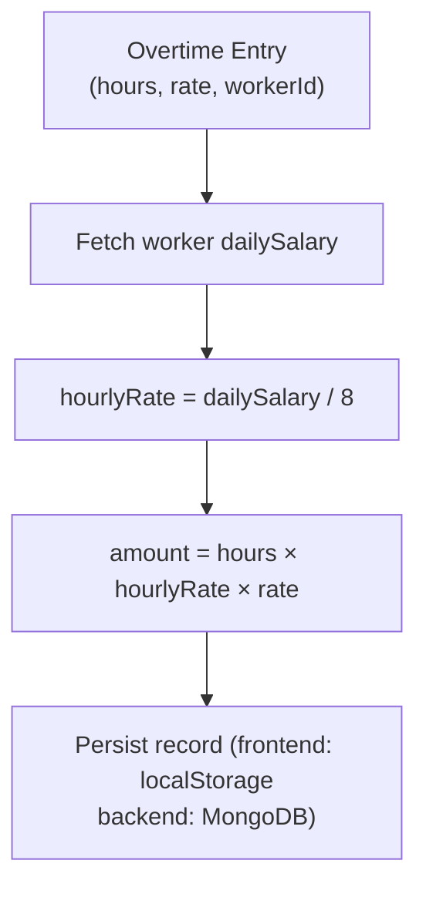
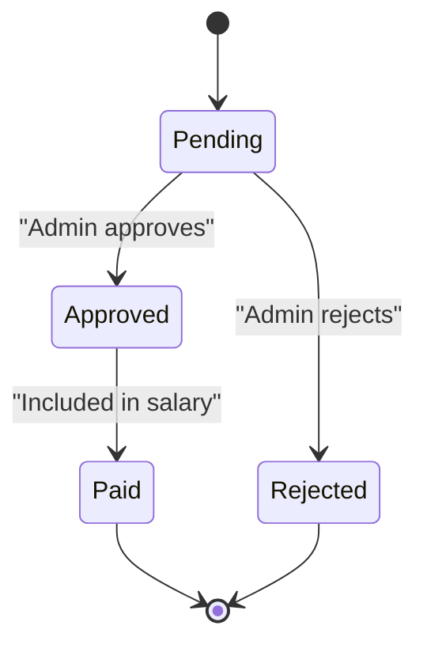
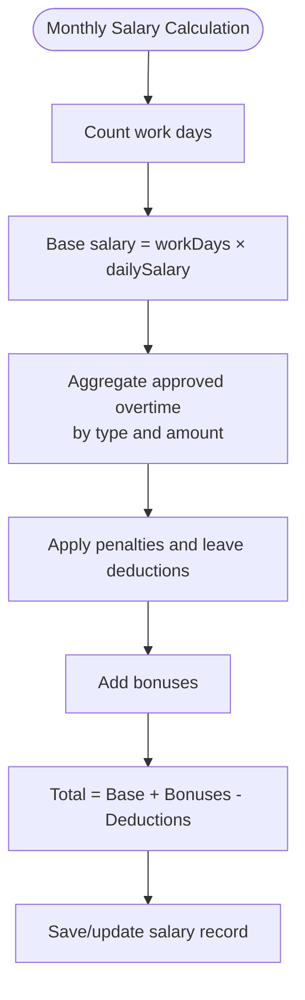
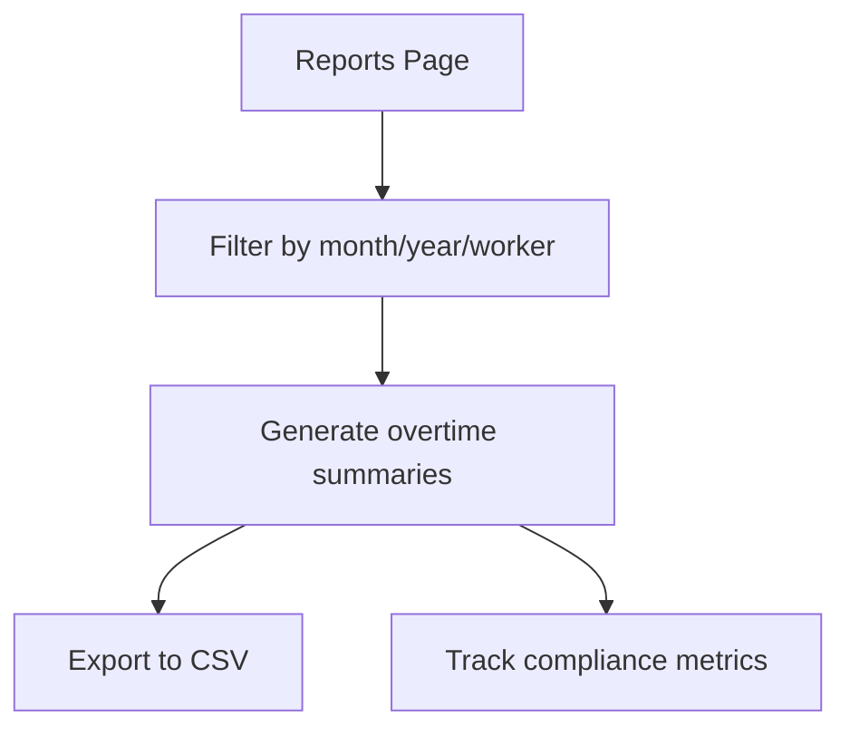
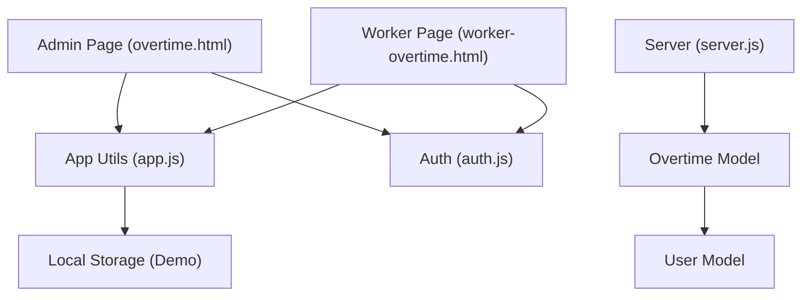

# Overtime Tracking

<cite>
**Referenced Files in This Document**
- [overtime.html](file://overtime.html)
- [worker-overtime.html](file://worker-overtime.html)
- [auth.js](file://auth.js)
- [app.js](file://app.js)
- [salary.html](file://salary.html)
- [backend/server.js](file://backend/server.js)
- [backend/models/Overtime.js](file://backend/models/Overtime.js)
- [backend/models/User.js](file://backend/models/User.js)
</cite>

## Table of Contents
1. [Introduction](#introduction)
2. [Project Structure](#project-structure)
3. [Core Components](#core-components)
4. [Architecture Overview](#architecture-overview)
5. [Detailed Component Analysis](#detailed-component-analysis)
6. [Dependency Analysis](#dependency-analysis)
7. [Performance Considerations](#performance-considerations)
8. [Troubleshooting Guide](#troubleshooting-guide)
9. [Conclusion](#conclusion)

## Introduction
This document explains the overtime tracking system used in the 555 İnşaat worker management application. It covers the end-to-end workflow for submitting and approving overtime requests, the hourly wage multiplier system, time calculation algorithms, logging procedures, and integration with salary calculations. It also details admin oversight features, worker self-service capabilities, automated compensation calculations, reporting features, and the relationship between overtime tracking and payroll processing.

## Project Structure
The overtime tracking system spans both frontend pages and backend models:
- Admin interface for managing overtime entries and approvals
- Worker self-service page for submitting overtime requests
- Shared utilities for authentication, data helpers, and formatting
- Backend server wiring and model definitions for persistence and calculations

**Diagram sources**
- [overtime.html](file://overtime.html)
- [worker-overtime.html](file://worker-overtime.html)
- [auth.js](file://auth.js)
- [app.js](file://app.js)
- [salary.html](file://salary.html)
- [backend/server.js](file://backend/server.js)
- [backend/models/Overtime.js](file://backend/models/Overtime.js)
- [backend/models/User.js](file://backend/models/User.js)

**Section sources**
- [overtime.html](file://overtime.html)
- [worker-overtime.html](file://worker-overtime.html)
- [auth.js](file://auth.js)
- [app.js](file://app.js)
- [salary.html](file://salary.html)
- [backend/server.js](file://backend/server.js)
- [backend/models/Overtime.js](file://backend/models/Overtime.js)
- [backend/models/User.js](file://backend/models/User.js)

## Core Components
- Admin Overtime Management: Allows administrators to add overtime entries, filter by month/worker/status, approve/reject, and view statistics.
- Worker Self-Service: Enables workers to submit overtime requests, view their history, and see calculated payments.
- Calculation Engine: Computes overtime payment based on worker daily salary, hours worked, and rate multiplier.
- Data Persistence: Stores overtime records with status, approval metadata, and payment tracking.
- Salary Integration: Aggregates approved overtime into monthly salary calculations and supports manual adjustments.

Key implementation references:
- Admin page initialization, filtering, and approval actions
- Worker request submission with weekly limits
- Payment calculation using hourly rate derived from daily salary
- Backend model with pre-save calculation and aggregation utilities

**Section sources**
- [overtime.html](file://overtime.html)
- [worker-overtime.html](file://worker-overtime.html)
- [auth.js](file://auth.js)
- [app.js](file://app.js)
- [backend/models/Overtime.js](file://backend/models/Overtime.js)
- [backend/models/User.js](file://backend/models/User.js)

## Architecture Overview
The system follows a client-side-first approach with local storage for demonstration, while the backend provides a production-ready foundation with MongoDB and Express. The overtime calculation logic exists in both frontend utilities and backend models, ensuring consistency regardless of deployment mode.

**Diagram sources**
- [overtime.html](file://overtime.html)
- [worker-overtime.html](file://worker-overtime.html)
- [auth.js](file://auth.js)
- [app.js](file://app.js)
- [backend/server.js](file://backend/server.js)
- [backend/models/Overtime.js](file://backend/models/Overtime.js)
- [backend/models/User.js](file://backend/models/User.js)

## Detailed Component Analysis

### Admin Overtime Management
Responsibilities:
- Initialize and manage overtime records
- Filter and sort entries by month, worker, and status
- Approve or reject pending requests
- Calculate and display statistics (total hours, payments, counts)
- Add overtime entries manually for workers

Key behaviors:
- Loads worker and month filters dynamically
- Calculates payment per entry using hourly rate derived from daily salary
- Updates status and audit fields upon approval/rejection
- Maintains counters for pending/approved statuses

**Diagram sources**
- [overtime.html](file://overtime.html)

**Section sources**
- [overtime.html](file://overtime.html)

### Worker Self-Service Overtime Requests
Responsibilities:
- Allow workers to submit requests with date, hours, reason, and rate
- Enforce weekly limit (10 hours) across approved/pending requests
- Display personal overtime history with status badges and calculated payments
- Show informational hints about multipliers and limits

Key behaviors:
- Weekly hours accumulation computed from all overtime entries for the current week
- Payment calculated using the worker’s daily salary
- UI notifications for warnings and success messages

**Diagram sources**
- [worker-overtime.html](file://worker-overtime.html)

**Section sources**
- [worker-overtime.html](file://worker-overtime.html)

### Hourly Wage Multiplier System and Time Calculation
Calculation logic:
- Hourly rate = worker.dailySalary / 8 (assuming 8-hour workday)
- Payment = hours × hourlyRate × rateMultiplier
- Rate multipliers supported:
  - Standard weekday: 1.5x
  - Weekend/holiday: 2x
  - Night shift: 2.5x

Frontend calculation:
- Uses worker’s dailySalary to derive hourly rate and compute payment
- Applied in both admin-managed entries and worker self-submitted requests

Backend calculation:
- Pre-save middleware recalculates amount based on worker’s dailySalary
- Ensures consistency when records are persisted to the database

**Diagram sources**
- [worker-overtime.html](file://worker-overtime.html)
- [overtime.html](file://overtime.html)
- [backend/models/Overtime.js](file://backend/models/Overtime.js)
- [backend/models/User.js](file://backend/models/User.js)

**Section sources**
- [worker-overtime.html](file://worker-overtime.html)
- [overtime.html](file://overtime.html)
- [backend/models/Overtime.js](file://backend/models/Overtime.js)
- [backend/models/User.js](file://backend/models/User.js)

### Approval Workflow
Workflow stages:
- Submission: Worker submits request (pending)
- Review: Admin reviews and approves or rejects
- Audit: Approved entries capture approver and timestamp
- Payment/Payroll: Approved entries contribute to salary calculations

Status transitions:
- pending → approved (with approver metadata)
- pending → rejected
- approved → paid (via salary processing)

**Diagram sources**
- [overtime.html](file://overtime.html)
- [salary.html](file://salary.html)

**Section sources**
- [overtime.html](file://overtime.html)
- [salary.html](file://salary.html)

### Integration with Salary Calculations
Salary computation integrates overtime as follows:
- Base salary = workDays × dailySalary
- Approved overtime is considered in monthly totals
- Bonuses and penalties are applied separately
- Export functionality supports CSV downloads

**Diagram sources**
- [salary.html](file://salary.html)

**Section sources**
- [salary.html](file://salary.html)

### Reporting and Compliance Monitoring
Reporting features include:
- Monthly and yearly filters for salary records
- Export to CSV for external reporting
- Overtime summary by type (weekday, weekend, holiday, night)
- Compliance checks via weekly limits and status tracking

**Diagram sources**
- [salary.html](file://salary.html)

**Section sources**
- [salary.html](file://salary.html)

## Dependency Analysis
The system exhibits clear separation of concerns:
- Frontend pages depend on shared utilities for formatting, alerts, and data helpers
- Backend server exposes routes and connects to MongoDB
- Overtime model depends on User model for dailySalary lookup
- Both frontend and backend implement the same calculation logic to ensure consistency

**Diagram sources**
- [overtime.html](file://overtime.html)
- [worker-overtime.html](file://worker-overtime.html)
- [auth.js](file://auth.js)
- [app.js](file://app.js)
- [backend/server.js](file://backend/server.js)
- [backend/models/Overtime.js](file://backend/models/Overtime.js)
- [backend/models/User.js](file://backend/models/User.js)

**Section sources**
- [overtime.html](file://overtime.html)
- [worker-overtime.html](file://worker-overtime.html)
- [auth.js](file://auth.js)
- [app.js](file://app.js)
- [backend/server.js](file://backend/server.js)
- [backend/models/Overtime.js](file://backend/models/Overtime.js)
- [backend/models/User.js](file://backend/models/User.js)

## Performance Considerations
- Frontend filtering and sorting operate on client-side arrays; for large datasets, consider pagination or server-side filtering.
- Pre-save middleware ensures amount recalculation only when hours or rate change, minimizing unnecessary computations.
- Aggregation queries in the backend model can leverage indexes on worker, date, status, and type for improved performance.

## Troubleshooting Guide
Common issues and resolutions:
- Weekly limit exceeded: Worker submissions are blocked when adding hours would exceed the weekly cap; reduce requested hours or adjust timing.
- Payment mismatch: Verify that the worker’s dailySalary is set correctly; hourly rate is derived from dailySalary ÷ 8.
- Approval not reflected: Ensure the admin updated the status and refreshed the page; pending entries require explicit action.
- Export failures: Confirm there is data to export and that the browser allows downloads.

**Section sources**
- [worker-overtime.html](file://worker-overtime.html)
- [overtime.html](file://overtime.html)
- [salary.html](file://salary.html)

## Conclusion
The overtime tracking system combines robust frontend self-service and admin oversight with a backend model that enforces consistent calculations and status tracking. The hourly wage multiplier system, weekly limits, and integration with salary processing provide a comprehensive framework for managing overtime efficiently and compliantly. Extending the system to a production backend with MongoDB and Express enables scalable persistence, advanced reporting, and seamless payroll integration.