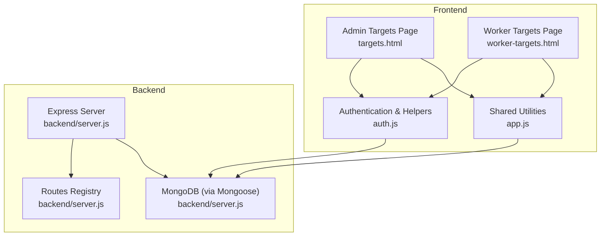
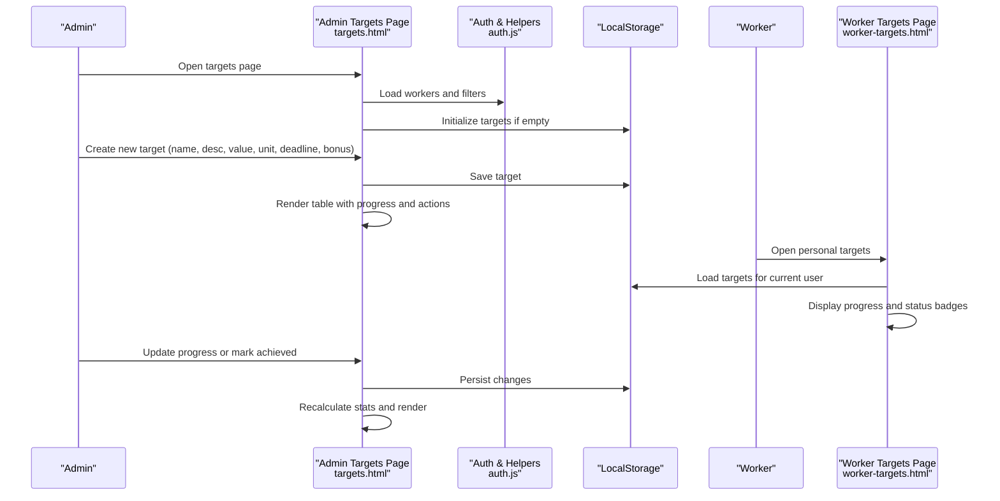
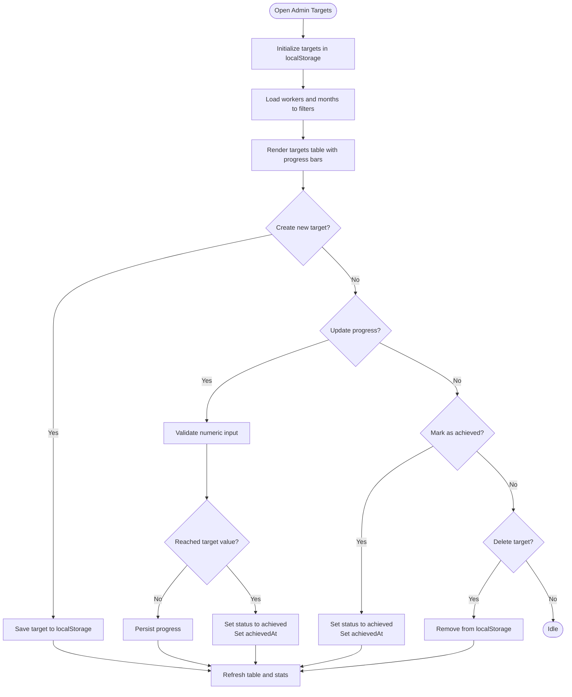
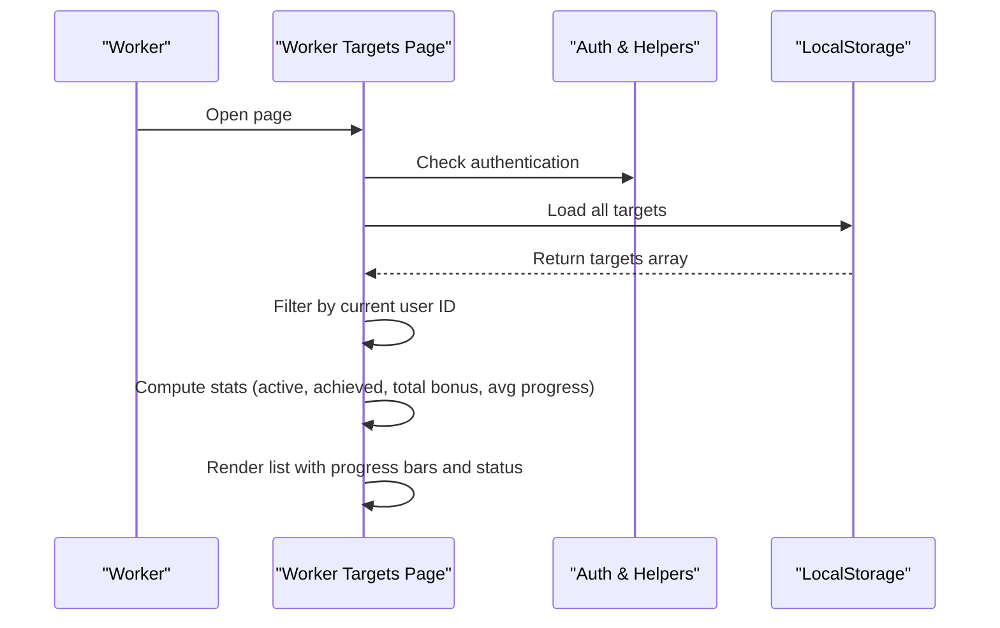
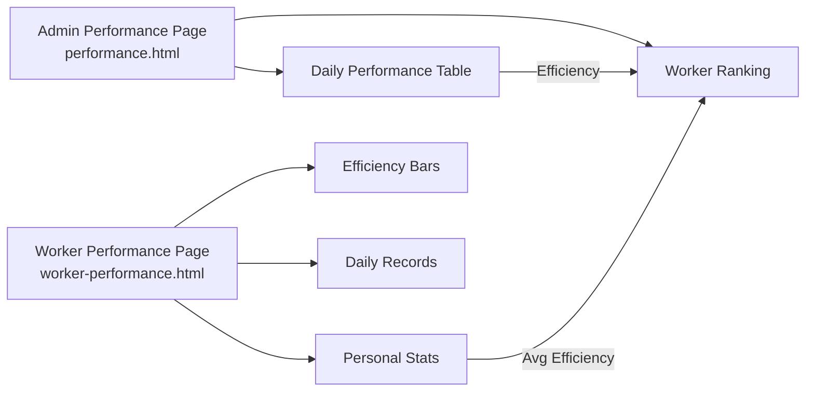
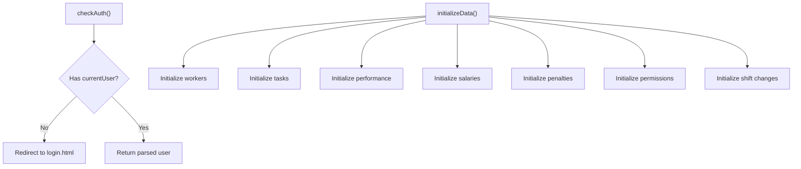
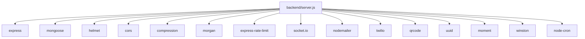

# Performance Targets

<cite>
**Referenced Files in This Document**
- [targets.html](file://targets.html)
- [worker-targets.html](file://worker-targets.html)
- [performance.html](file://performance.html)
- [worker-performance.html](file://worker-performance.html)
- [auth.js](file://auth.js)
- [app.js](file://app.js)
- [backend/server.js](file://backend/server.js)
- [backend/package.json](file://backend/package.json)
</cite>

## Table of Contents
1. [Introduction](#introduction)
2. [Project Structure](#project-structure)
3. [Core Components](#core-components)
4. [Architecture Overview](#architecture-overview)
5. [Detailed Component Analysis](#detailed-component-analysis)
6. [Dependency Analysis](#dependency-analysis)
7. [Performance Considerations](#performance-considerations)
8. [Troubleshooting Guide](#troubleshooting-guide)
9. [Conclusion](#conclusion)

## Introduction
This document explains the performance targets system implemented in the 555 İnşaat worker management platform. It covers how targets are defined, assigned, tracked, and evaluated, along with administrative controls, worker self-assessment capabilities, supervisor approvals, and integration with performance reviews and bonus calculations. The system currently uses client-side storage for demonstration and includes a backend server with a comprehensive route structure for future expansion.

## Project Structure
The performance targets feature spans two primary pages:
- Administrative targets management: targets.html
- Worker self-view and progress tracking: worker-targets.html

Supporting components:
- Authentication and data helpers: auth.js
- Shared UI utilities and helpers: app.js
- Backend server and routing: backend/server.js
- Backend dependencies: backend/package.json

**Diagram sources**
- [targets.html:1-418](file://targets.html#L1-L418)
- [worker-targets.html:1-201](file://worker-targets.html#L1-L201)
- [auth.js:1-213](file://auth.js#L1-L213)
- [app.js:1-412](file://app.js#L1-L412)
- [backend/server.js:1-184](file://backend/server.js#L1-L184)

**Section sources**
- [targets.html:1-418](file://targets.html#L1-L418)
- [worker-targets.html:1-201](file://worker-targets.html#L1-L201)
- [auth.js:1-213](file://auth.js#L1-L213)
- [app.js:1-412](file://app.js#L1-L412)
- [backend/server.js:1-184](file://backend/server.js#L1-L184)

## Core Components
- Target definition and assignment (admin): creation of targets with name, description, target value, unit, deadline, and bonus; filtering by month and worker; progress updates and achievement marking.
- Progress tracking (worker): personal view of assigned targets, progress bars, deadlines, and bonus amounts.
- Performance integration: daily performance tracking and ranking; bonus calculation integrated with salary data.
- Administrative controls: add, edit, delete targets; supervisor approval via achievement marking; alert and modal systems.
- Worker self-assessment: worker view allows monitoring progress and understanding personal targets.
- Supervisor approval: admin marks targets as achieved; auto-approval when progress reaches target value; manual override available.

Key data model for targets:
- Fields: id, workerId, name, description, targetValue, unit, currentValue, deadline, bonus, status, createdAt, achievedAt (when applicable).
- Status lifecycle: active → achieved or missed (auto or manual).
- Units supported: m², m³, piece, hour, day, project.

**Section sources**
- [targets.html:135-192](file://targets.html#L135-L192)
- [targets.html:208-214](file://targets.html#L208-L214)
- [targets.html:250-313](file://targets.html#L250-L313)
- [targets.html:315-341](file://targets.html#L315-L341)
- [targets.html:343-382](file://targets.html#L343-L382)
- [worker-targets.html:115-195](file://worker-targets.html#L115-L195)

## Architecture Overview
The system follows a client-side-first approach with local storage for data persistence during the demo phase. The backend server is configured with Express, Mongoose, and numerous middleware/security packages, exposing a wide range of routes for workers, attendance, payroll, tasks, projects, permissions, and more. The performance targets feature currently relies on frontend utilities and localStorage.

**Diagram sources**
- [targets.html:201-214](file://targets.html#L201-L214)
- [targets.html:250-313](file://targets.html#L250-L313)
- [targets.html:315-341](file://targets.html#L315-L341)
- [targets.html:343-382](file://targets.html#L343-L382)
- [worker-targets.html:115-195](file://worker-targets.html#L115-L195)
- [auth.js:129-165](file://auth.js#L129-L165)

## Detailed Component Analysis

### Administrative Targets Management (targets.html)
Responsibilities:
- Create targets with worker selection, name, description, target value, unit, deadline, and bonus.
- Filter targets by month and worker.
- Update progress and mark targets as achieved.
- Delete targets.
- Display statistics: active targets, achieved targets, total bonus, success rate.
- Render progress bars and status badges.

Key workflows:
- New target creation persists to localStorage and refreshes UI and stats.
- Progress updates validate numeric input and auto-mark achieved when threshold met.
- Achievement marking sets status to achieved and captures achievedAt timestamp.
- Deletion removes target and recalculates stats.

**Diagram sources**
- [targets.html:201-214](file://targets.html#L201-L214)
- [targets.html:216-232](file://targets.html#L216-L232)
- [targets.html:250-313](file://targets.html#L250-L313)
- [targets.html:315-341](file://targets.html#L315-L341)
- [targets.html:343-382](file://targets.html#L343-L382)

**Section sources**
- [targets.html:135-192](file://targets.html#L135-L192)
- [targets.html:201-214](file://targets.html#L201-L214)
- [targets.html:216-232](file://targets.html#L216-L232)
- [targets.html:234-248](file://targets.html#L234-L248)
- [targets.html:250-313](file://targets.html#L250-L313)
- [targets.html:315-341](file://targets.html#L315-L341)
- [targets.html:343-382](file://targets.html#L343-L382)

### Worker Targets View (worker-targets.html)
Responsibilities:
- Display personal targets assigned to the logged-in worker.
- Show progress bars, deadlines, and bonus amounts.
- Calculate and display personal stats: active targets, achieved targets, total bonus, average progress.
- Present empty state when no targets exist.

Key behaviors:
- Filters targets by current user ID.
- Computes average progress across all personal targets.
- Renders status badges and overdue indicators.

**Diagram sources**
- [worker-targets.html:105-114](file://worker-targets.html#L105-L114)
- [worker-targets.html:115-195](file://worker-targets.html#L115-L195)
- [auth.js:55-63](file://auth.js#L55-L63)

**Section sources**
- [worker-targets.html:115-195](file://worker-targets.html#L115-L195)
- [auth.js:55-63](file://auth.js#L55-L63)

### Performance Integration (performance.html and worker-performance.html)
While separate from targets, performance integrates with:
- Daily performance entries with status, hours worked, efficiency, and notes.
- Ranking computation combining average efficiency and attendance rate.
- Bonus linkage through salary data (bonus fields in salary entries).

**Diagram sources**
- [performance.html:134-178](file://performance.html#L134-L178)
- [performance.html:180-195](file://performance.html#L180-L195)
- [performance.html:197-212](file://performance.html#L197-L212)
- [performance.html:214-229](file://performance.html#L214-L229)
- [performance.html:322-375](file://performance.html#L322-L375)
- [performance.html:377-449](file://performance.html#L377-L449)
- [worker-performance.html:269-330](file://worker-performance.html#L269-L330)
- [worker-performance.html:332-398](file://worker-performance.html#L332-L398)

**Section sources**
- [performance.html:322-375](file://performance.html#L322-L375)
- [performance.html:377-449](file://performance.html#L377-L449)
- [worker-performance.html:269-330](file://worker-performance.html#L269-L330)
- [worker-performance.html:332-398](file://worker-performance.html#L332-L398)

### Authentication and Data Utilities (auth.js)
- Demo users and initialization of localStorage with workers, tasks, performance, salaries, penalties, permissions, and shift changes.
- Authentication checks and redirects based on role.
- Helper functions for data retrieval, saving, ID generation, date formatting, currency formatting, and worker statistics.

**Diagram sources**
- [auth.js:55-63](file://auth.js#L55-L63)
- [auth.js:15-53](file://auth.js#L15-L53)

**Section sources**
- [auth.js:55-63](file://auth.js#L55-L63)
- [auth.js:15-53](file://auth.js#L15-L53)

### Shared Utilities (app.js)
- Common UI helpers: tooltips, mobile menu, theme toggle, alerts, modals, tabs, sorting, CSV export, printing, debouncing/throttling, animations, URL params, storage with expiry, validation, clipboard, scrolling, loading spinners.
- These utilities support the targets and performance pages with consistent UX.

**Section sources**
- [app.js:21-47](file://app.js#L21-L47)
- [app.js:70-94](file://app.js#L70-L94)
- [app.js:107-127](file://app.js#L107-L127)
- [app.js:129-152](file://app.js#L129-L152)
- [app.js:154-172](file://app.js#L154-L172)
- [app.js:198-222](file://app.js#L198-L222)
- [app.js:224-244](file://app.js#L224-L244)
- [app.js:274-297](file://app.js#L274-L297)
- [app.js:299-313](file://app.js#L299-L313)
- [app.js:315-326](file://app.js#L315-L326)
- [app.js:328-350](file://app.js#L328-L350)
- [app.js:352-379](file://app.js#L352-L379)
- [app.js:381-397](file://app.js#L381-L397)
- [app.js:399-412](file://app.js#L399-L412)

## Dependency Analysis
- Frontend dependencies:
  - Bootstrap Icons CDN for UI icons.
  - Local storage for data persistence during demo.
  - Minimal JavaScript utilities for UI interactions and data formatting.
- Backend dependencies (server):
  - Express, Mongoose, Helmet, CORS, compression, Morgan, rate limiting, Socket.IO, Nodemailer, Twilio, QR code generation, UUID, Moment, Winston logging, Cron jobs, and others.
  - Extensive route coverage for workers, attendance, payroll, tasks, projects, permissions, bonuses, reports, notifications, documents, training, advances, overtime, sales, materials, audit logs, settings, dashboard, and QR.

**Diagram sources**
- [backend/server.js:6-14](file://backend/server.js#L6-L14)
- [backend/server.js:95-118](file://backend/server.js#L95-L118)
- [backend/package.json:11-32](file://backend/package.json#L11-L32)

**Section sources**
- [backend/server.js:6-14](file://backend/server.js#L6-L14)
- [backend/server.js:95-118](file://backend/server.js#L95-L118)
- [backend/package.json:11-32](file://backend/package.json#L11-L32)

## Performance Considerations
- Client-side storage: Efficient for small datasets but may become a bottleneck with large volumes of targets and performance records. Consider migrating to backend APIs for scalability.
- UI rendering: Sorting and filtering are performed in-memory; pagination or virtualization could improve responsiveness for large lists.
- Alerts and modals: Lightweight DOM manipulation; ensure minimal reflows by batching updates.
- Theme switching: Uses CSS class toggling; keep styles modular to avoid layout thrashing.

## Troubleshooting Guide
Common issues and resolutions:
- Authentication failures:
  - Ensure correct username, password, and role selection on login.
  - Verify localStorage initialization and demo users availability.
- Missing targets data:
  - Confirm targets initialization and localStorage population.
  - Check browser console for errors and localStorage quota limits.
- Progress not updating:
  - Validate numeric input and ensure target value thresholds are met.
  - Confirm status transitions and achievedAt timestamps.
- Filtering not working:
  - Verify month and worker filter selections.
  - Ensure worker options are populated from localStorage.
- Styling and icons:
  - Confirm Bootstrap Icons CDN availability.
  - Check dark mode toggle and theme persistence.

**Section sources**
- [auth.js:66-82](file://auth.js#L66-L82)
- [auth.js:15-53](file://auth.js#L15-L53)
- [targets.html:201-214](file://targets.html#L201-L214)
- [targets.html:216-232](file://targets.html#L216-L232)
- [app.js:70-94](file://app.js#L70-L94)

## Conclusion
The performance targets system provides a clear framework for setting, assigning, tracking, and evaluating individual and team performance goals. Administrators can define targets with measurable units, deadlines, and bonuses, while workers can monitor their progress and achievements. The system integrates with daily performance tracking and bonus calculations, laying the groundwork for performance reviews and career development planning. For production readiness, migrate data persistence to backend APIs and implement robust validation, notifications, and reporting features.