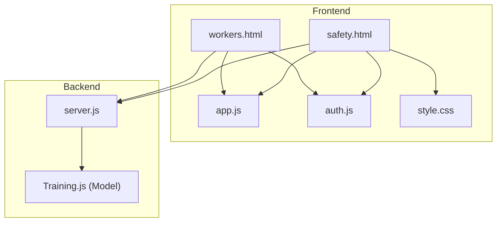
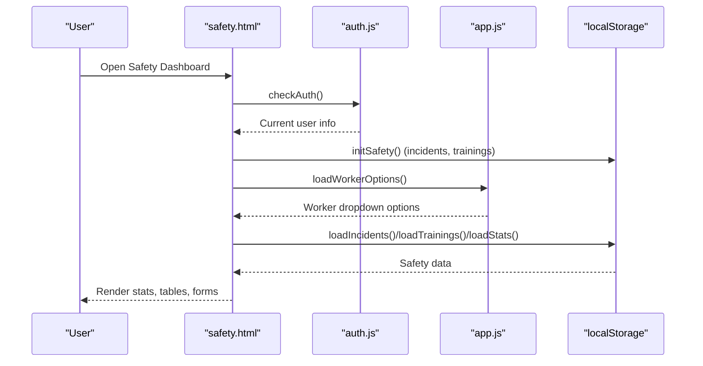
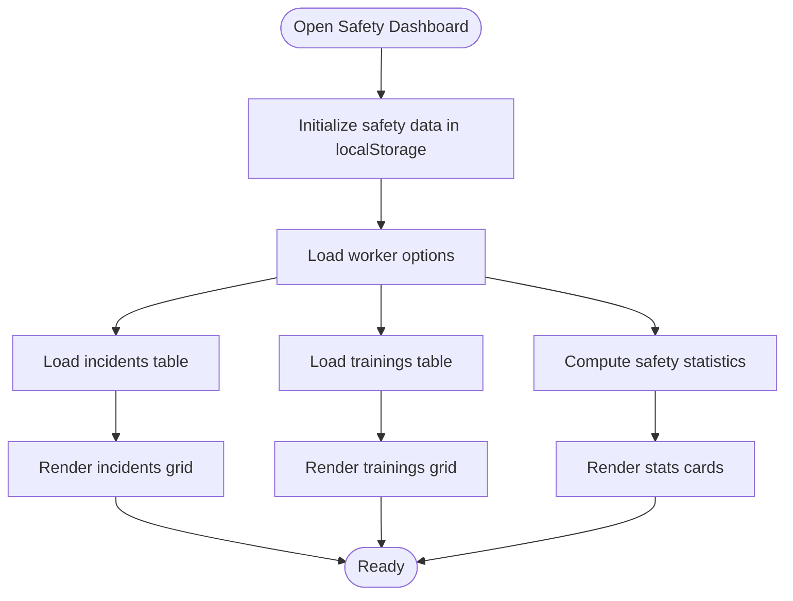
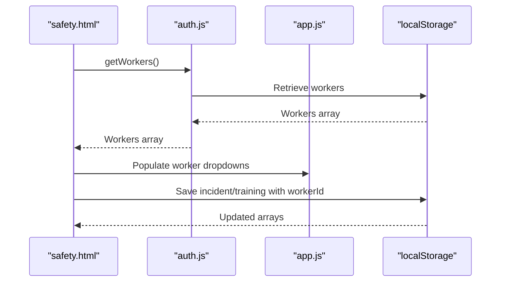
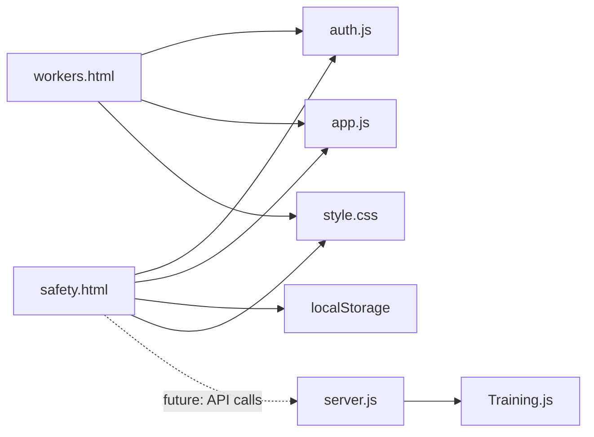

# Safety Protocols

<cite>
**Referenced Files in This Document**
- [safety.html](file://safety.html)
- [app.js](file://app.js)
- [auth.js](file://auth.js)
- [workers.html](file://workers.html)
- [style.css](file://style.css)
- [server.js](file://backend/server.js)
- [Training.js](file://backend/models/Training.js)
</cite>

## Table of Contents
1. [Introduction](#introduction)
2. [Project Structure](#project-structure)
3. [Core Components](#core-components)
4. [Architecture Overview](#architecture-overview)
5. [Detailed Component Analysis](#detailed-component-analysis)
6. [Dependency Analysis](#dependency-analysis)
7. [Performance Considerations](#performance-considerations)
8. [Troubleshooting Guide](#troubleshooting-guide)
9. [Conclusion](#conclusion)

## Introduction
This document describes the safety protocol management system for the 555 Construction Worker Management System. It explains how safety procedures are represented in the frontend, how safety data is persisted locally, and how the system integrates with the broader worker management domain. It also outlines the backend capabilities that support safety-related features such as training certificates, safety categories, and audit trails.

The safety module focuses on:
- Safety rules awareness
- Safety incident recording
- Safety training administration and certification
- Safety equipment reminders
- Statistics and reporting for safety metrics

## Project Structure
The safety system is primarily a client-side feature with local persistence. It integrates with the worker database and uses shared UI utilities and styling.



**Diagram sources**
- [safety.html:1-519](file://safety.html#L1-L519)
- [workers.html:1-625](file://workers.html#L1-L625)
- [app.js:1-412](file://app.js#L1-L412)
- [auth.js:1-213](file://auth.js#L1-L213)
- [style.css:1-200](file://style.css#L1-L200)
- [server.js:1-184](file://backend/server.js#L1-L184)
- [Training.js:1-365](file://backend/models/Training.js#L1-L365)

**Section sources**
- [safety.html:1-519](file://safety.html#L1-L519)
- [workers.html:1-625](file://workers.html#L1-L625)
- [app.js:1-412](file://app.js#L1-L412)
- [auth.js:1-213](file://auth.js#L1-L213)
- [style.css:1-200](file://style.css#L1-L200)
- [server.js:1-184](file://backend/server.js#L1-L184)
- [Training.js:1-365](file://backend/models/Training.js#L1-L365)

## Core Components
- Safety Dashboard (safety.html): Presents safety rules, statistics, and three tabs: Incidents, Trainings, and Equipment.
- Local Data Persistence: Uses localStorage for incidents and training records.
- Worker Integration: Loads worker lists for selecting workers during incident and training creation.
- UI Utilities: Shared modal, tab, alert, and theme utilities from app.js; authentication helpers from auth.js.
- Backend Model: Training model supports safety categories and certification issuance.

Key responsibilities:
- Display and manage safety incidents with severity and actions.
- Record and track safety training completions and certificates.
- Provide equipment reminders aligned with safety rules.
- Compute safety statistics (trained workers, certifications, monthly incidents, serious incidents).

**Section sources**
- [safety.html:56-213](file://safety.html#L56-L213)
- [safety.html:322-371](file://safety.html#L322-L371)
- [safety.html:381-448](file://safety.html#L381-L448)
- [safety.html:450-497](file://safety.html#L450-L497)
- [auth.js:130-160](file://auth.js#L130-L160)
- [app.js:129-172](file://app.js#L129-L172)

## Architecture Overview
The safety module is a single-page application feature with local state. It does not currently integrate with backend APIs for safety data. Instead, it initializes and manages safety data in localStorage and relies on the shared authentication and UI utilities.



**Diagram sources**
- [safety.html:317-321](file://safety.html#L317-L321)
- [safety.html:322-330](file://safety.html#L322-L330)
- [safety.html:340-346](file://safety.html#L340-L346)
- [safety.html:381-389](file://safety.html#L381-L389)
- [safety.html:419-448](file://safety.html#L419-L448)
- [safety.html:450-473](file://safety.html#L450-L473)
- [auth.js:55-63](file://auth.js#L55-L63)
- [app.js:129-144](file://app.js#L129-L144)

## Detailed Component Analysis

### Safety Dashboard (safety.html)
Responsibilities:
- Renders safety rules card with mandatory equipment reminders.
- Displays four statistics cards: trained workers, certified workers, incidents this month, serious incidents.
- Provides three tabs:
  - Incidents: Lists incidents with type, severity, and status badges.
  - Trainings: Lists training records with dates, certificates, and status indicators.
  - Equipment: Shows safety equipment reminders (helmets, gloves, boots, eye protection).

Data initialization and loading:
- Initializes localStorage keys for incidents and trainings if missing.
- Loads worker options for incident/training forms.
- Computes statistics based on current month and certificate expiry.

Forms and actions:
- Incident form captures worker, date, type, severity, description, and corrective actions.
- Training form captures worker, training name, date, certificate number, and expiry date.
- Saves entries to localStorage and refreshes views and statistics.



**Diagram sources**
- [safety.html:322-330](file://safety.html#L322-L330)
- [safety.html:340-346](file://safety.html#L340-L346)
- [safety.html:381-417](file://safety.html#L381-L417)
- [safety.html:419-448](file://safety.html#L419-L448)
- [safety.html:449-473](file://safety.html#L449-L473)

**Section sources**
- [safety.html:56-107](file://safety.html#L56-L107)
- [safety.html:110-114](file://safety.html#L110-L114)
- [safety.html:116-142](file://safety.html#L116-L142)
- [safety.html:144-171](file://safety.html#L144-L171)
- [safety.html:173-212](file://safety.html#L173-L212)
- [safety.html:322-371](file://safety.html#L322-L371)
- [safety.html:381-448](file://safety.html#L381-L448)
- [safety.html:450-497](file://safety.html#L450-L497)

### Worker Profiles and Safety Integration
- Worker list is loaded from localStorage and used to populate incident and training assignment dropdowns.
- Worker profile fields include personal info, position, role, daily/monthly salary, and status.
- Safety data (incidents and trainings) references worker IDs to associate safety events with workers.



**Diagram sources**
- [auth.js:130-132](file://auth.js#L130-L132)
- [safety.html:340-346](file://safety.html#L340-L346)
- [safety.html:450-467](file://safety.html#L450-L467)
- [safety.html:475-491](file://safety.html#L475-L491)

**Section sources**
- [workers.html:160-187](file://workers.html#L160-L187)
- [workers.html:353-402](file://workers.html#L353-L402)
- [auth.js:130-132](file://auth.js#L130-L132)
- [safety.html:340-346](file://safety.html#L340-L346)

### Backend Training Model and Safety Certifications
While the frontend safety module persists data locally, the backend provides a robust training model that supports safety categories and certification issuance. This enables future integration of safety training records with backend APIs.

Highlights:
- Category includes a safety option for categorizing training content.
- Supports certification offering, validity periods, and automatic certificate issuance upon passing evaluations.
- Tracks participant registration, attendance, scores, and results.

```mermaid
erDiagram
TRAINING {
string title
string description
enum category
enum type
date startDate
date endDate
number maxParticipants
enum status
}
PARTICIPANT {
ObjectId worker
enum status
number attendance.sessionsAttended
number attendance.totalSessions
number score
enum result
boolean certificate.issued
string certificate.number
date certificate.issuedAt
date certificate.expiryDate
}
TRAINING ||--o{ PARTICIPANT : "has"
```

**Diagram sources**
- [Training.js:3-246](file://backend/models/Training.js#L3-L246)
- [Training.js:110-151](file://backend/models/Training.js#L110-L151)
- [Training.js:180-192](file://backend/models/Training.js#L180-L192)

**Section sources**
- [Training.js:16-24](file://backend/models/Training.js#L16-L24)
- [Training.js:180-192](file://backend/models/Training.js#L180-L192)
- [Training.js:275-340](file://backend/models/Training.js#L275-L340)

### Administrative Controls and UI Utilities
- Modal management: open/close modals for adding incidents and trainings.
- Tab switching: switch between incidents, trainings, and equipment views.
- Alerts: show success/warning/danger messages with auto-dismiss.
- Theme toggle: persist dark/light mode preference.
- Worker filtering/search: used in workers.html; similar patterns can be applied to safety data tables.

**Section sources**
- [app.js:129-172](file://app.js#L129-L172)
- [app.js:96-127](file://app.js#L96-L127)
- [app.js:70-94](file://app.js#L70-L94)
- [workers.html:500-573](file://workers.html#L500-L573)

## Dependency Analysis
- safety.html depends on:
  - auth.js for authentication checks and worker retrieval
  - app.js for modal/tab/alert utilities
  - localStorage for persistence of incidents and trainings
- workers.html provides the worker dataset used by safety.html
- style.css provides shared UI styles for cards, tables, badges, and modals
- server.js exposes backend routes and infrastructure; while safety.html does not currently call backend endpoints, the backend training model supports safety-related features



**Diagram sources**
- [safety.html:315-316](file://safety.html#L315-L316)
- [workers.html:339-340](file://workers.html#L339-L340)
- [auth.js:1-213](file://auth.js#L1-L213)
- [app.js:1-412](file://app.js#L1-L412)
- [style.css:1-200](file://style.css#L1-L200)
- [server.js:95-118](file://backend/server.js#L95-L118)
- [Training.js:1-365](file://backend/models/Training.js#L1-L365)

**Section sources**
- [safety.html:315-316](file://safety.html#L315-L316)
- [workers.html:339-340](file://workers.html#L339-L340)
- [server.js:95-118](file://backend/server.js#L95-L118)

## Performance Considerations
- Local data operations are fast but limited to a single browser session. For multi-user environments, migrate safety data to backend APIs and database collections.
- Filtering and sorting in the frontend are lightweight; however, large datasets may benefit from pagination or virtualization.
- Certificate expiry and monthly incident calculations are O(n) over the respective arrays; keep arrays reasonably sized or implement server-side aggregation.

## Troubleshooting Guide
Common issues and resolutions:
- Authentication redirect loops: Ensure the current user exists in localStorage and has admin role; otherwise, the dashboard redirects to the worker dashboard.
- Empty tables: Verify that localStorage keys for incidents and trainings exist and are populated; the initialization routine creates empty arrays if missing.
- Worker dropdowns empty: Confirm that workers exist in localStorage; the worker initialization routine seeds demo workers if missing.
- Alerts not dismissing: The global alert initialization runs on DOMContentLoaded; ensure the page loads before invoking custom alerts.

**Section sources**
- [safety.html:317-321](file://safety.html#L317-L321)
- [safety.html:322-330](file://safety.html#L322-L330)
- [auth.js:15-53](file://auth.js#L15-L53)
- [auth.js:55-63](file://auth.js#L55-L63)
- [app.js:96-105](file://app.js#L96-L105)

## Conclusion
The safety protocol management system is a practical frontend-first solution that:
- Enforces safety rules awareness
- Records incidents and tracks training completions
- Reminds users of essential safety equipment
- Provides actionable statistics for safety performance

Future enhancements should include:
- Backend API integration for safety data
- Real-time collaboration via WebSocket
- Audit logs for safety actions
- Compliance dashboards and automated reminders for certificate renewals
- Reporting exports for regulatory submissions