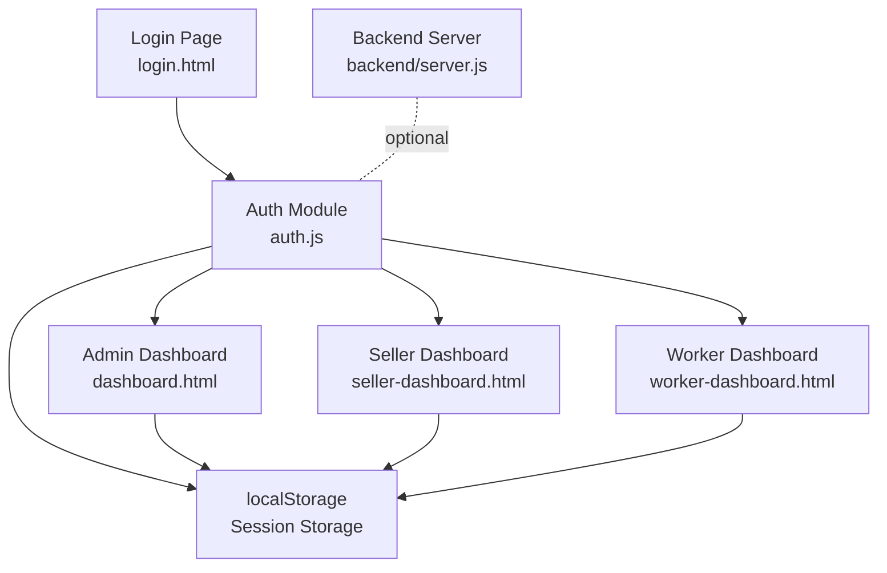
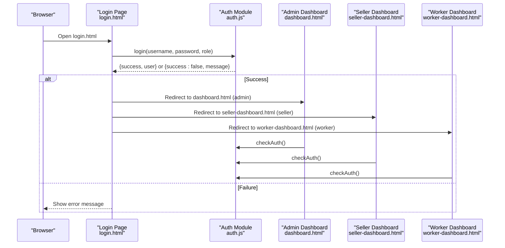
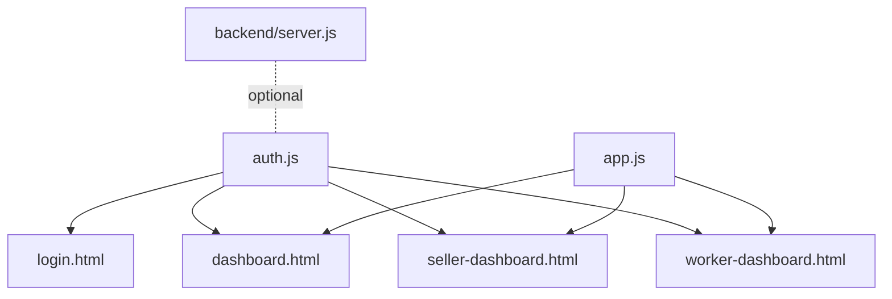

# Authentication & User Management

<cite>
**Referenced Files in This Document**
- [auth.js](file://auth.js)
- [login.html](file://login.html)
- [app.js](file://app.js)
- [dashboard.html](file://dashboard.html)
- [seller-dashboard.html](file://seller-dashboard.html)
- [worker-dashboard.html](file://worker-dashboard.html)
- [backend/server.js](file://backend/server.js)
</cite>

## Table of Contents
1. [Introduction](#introduction)
2. [Project Structure](#project-structure)
3. [Core Components](#core-components)
4. [Architecture Overview](#architecture-overview)
5. [Detailed Component Analysis](#detailed-component-analysis)
6. [Dependency Analysis](#dependency-analysis)
7. [Performance Considerations](#performance-considerations)
8. [Troubleshooting Guide](#troubleshooting-guide)
9. [Conclusion](#conclusion)

## Introduction
This document explains the authentication and user management system used in the project. It covers role-based access control with three user roles: admin, seller, and worker. It details the login flow, session management using localStorage, automatic redirection based on roles, demo user data structure, password handling security practices, session persistence, user object properties, role-based permissions, and maintaining user state across page reloads. It also includes troubleshooting for common authentication issues, session timeout handling, and security considerations for client-side authentication.

## Project Structure
The authentication system spans client-side JavaScript modules and HTML pages:
- Authentication logic and demo data are centralized in a single module.
- Login page renders the form and triggers authentication.
- Role-specific dashboards enforce access control and redirect unauthorized users.
- A backend server exists for production-grade features, but the current demo runs client-side with localStorage.

**Diagram sources**
- [login.html:1-169](file://login.html#L1-L169)
- [auth.js:1-213](file://auth.js#L1-L213)
- [dashboard.html:1-381](file://dashboard.html#L1-L381)
- [seller-dashboard.html:1-441](file://seller-dashboard.html#L1-L441)
- [worker-dashboard.html:1-568](file://worker-dashboard.html#L1-L568)
- [backend/server.js:1-184](file://backend/server.js#L1-L184)

**Section sources**
- [login.html:1-169](file://login.html#L1-L169)
- [auth.js:1-213](file://auth.js#L1-L213)
- [dashboard.html:1-381](file://dashboard.html#L1-L381)
- [seller-dashboard.html:1-441](file://seller-dashboard.html#L1-L441)
- [worker-dashboard.html:1-568](file://worker-dashboard.html#L1-L568)
- [backend/server.js:1-184](file://backend/server.js#L1-L184)

## Core Components
- Authentication module: Provides login, logout, session initialization, and helper functions for data management.
- Login page: Presents the login form, handles validation, and invokes authentication.
- Role-specific dashboards: Enforce access control and redirect unauthorized users.
- Utility module: Provides common UI helpers and localStorage utilities.

Key responsibilities:
- Validate credentials and role selection.
- Persist user session in localStorage.
- Redirect to role-appropriate dashboard.
- Initialize demo data on first visit.
- Provide helper functions for data retrieval and formatting.

**Section sources**
- [auth.js:66-88](file://auth.js#L66-L88)
- [auth.js:55-63](file://auth.js#L55-L63)
- [auth.js:15-53](file://auth.js#L15-L53)
- [login.html:90-126](file://login.html#L90-L126)
- [dashboard.html:274-278](file://dashboard.html#L274-L278)
- [seller-dashboard.html:299-303](file://seller-dashboard.html#L299-L303)
- [worker-dashboard.html:292-296](file://worker-dashboard.html#L292-L296)

## Architecture Overview
The system uses a client-side authentication model with localStorage for session persistence. On login, credentials and role are validated against demo users. Upon success, the user object (without sensitive fields) is stored in localStorage and the user is redirected to the appropriate dashboard. Role checks occur on each dashboard to prevent unauthorized access.

**Diagram sources**
- [login.html:90-126](file://login.html#L90-L126)
- [auth.js:66-88](file://auth.js#L66-L88)
- [auth.js:55-63](file://auth.js#L55-L63)
- [dashboard.html:274-278](file://dashboard.html#L274-L278)
- [seller-dashboard.html:299-303](file://seller-dashboard.html#L299-L303)
- [worker-dashboard.html:292-296](file://worker-dashboard.html#L292-L296)

## Detailed Component Analysis

### Authentication Module (auth.js)
Responsibilities:
- Define demo users with id, username, password, role, and additional fields.
- Initialize localStorage with demo data on first visit.
- Validate login credentials and role.
- Store session in localStorage and return user object without sensitive fields.
- Provide helper functions for data retrieval and formatting.

User object properties:
- id: Unique identifier.
- username: Login identifier.
- role: One of admin, seller, worker.
- name: Full name.
- email: Contact email.
- dailySalary: Included for worker role.
- position: Included for worker role.

Session management:
- On successful login, the user object (excluding password) is stored under the key used for session persistence.
- Session is checked on each page load to enforce access control.

Security considerations:
- Passwords are stored in plaintext in localStorage in the demo.
- No encryption or hashing is performed in the demo.
- No CSRF protection or secure cookies are used.

Redirection logic:
- After login, the user is redirected to the appropriate dashboard based on role.

Helper functions:
- Data retrieval helpers for workers, tasks, performance, salaries, penalties, permissions, and shift changes.
- Formatting helpers for dates and currency.
- Utilities for generating IDs and calculating worker statistics.

**Section sources**
- [auth.js:6-13](file://auth.js#L6-L13)
- [auth.js:15-53](file://auth.js#L15-L53)
- [auth.js:55-63](file://auth.js#L55-L63)
- [auth.js:66-88](file://auth.js#L66-L88)
- [auth.js:129-165](file://auth.js#L129-L165)
- [auth.js:167-191](file://auth.js#L167-L191)
- [auth.js:193-213](file://auth.js#L193-L213)

### Login Page (login.html)
Features:
- Form collects username, password, and role selection.
- Validates presence of all fields.
- Invokes login function and displays errors.
- Provides demo accounts for quick login.

Behavior:
- Submits to auth.js login handler.
- On success, redirects to role-specific dashboard.
- On failure, shows an error message.

**Section sources**
- [login.html:57-94](file://login.html#L57-L94)
- [login.html:90-126](file://login.html#L90-L126)

### Admin Dashboard (dashboard.html)
Access control:
- Checks authentication and redirects non-admin users to worker-dashboard.html.

Session maintenance:
- Uses checkAuth() to ensure the user is still logged in.
- Updates UI with current user’s name.

Data loading:
- Loads workers, performance, salaries, penalties, permissions, and shift changes from localStorage.
- Computes and displays statistics and summaries.

**Section sources**
- [dashboard.html:274-278](file://dashboard.html#L274-L278)
- [dashboard.html:280-319](file://dashboard.html#L280-L319)
- [dashboard.html:320-375](file://dashboard.html#L320-L375)

### Seller Dashboard (seller-dashboard.html)
Access control:
- Checks authentication and redirects non-seller users to login.html.

Session maintenance:
- Uses checkAuth() to ensure the user is still logged in.
- Updates UI with current user’s name.

Data loading:
- Initializes demo sales data if not present.
- Computes and displays sales statistics and summaries.

**Section sources**
- [seller-dashboard.html:299-303](file://seller-dashboard.html#L299-L303)
- [seller-dashboard.html:305-349](file://seller-dashboard.html#L305-L349)

### Worker Dashboard (worker-dashboard.html)
Access control:
- Checks authentication and redirects non-worker users to dashboard.html.

Session maintenance:
- Uses checkAuth() to ensure the user is still logged in.
- Updates UI with current user’s name and position.

Data loading:
- Loads performance, salaries, penalties, and tasks for the current worker.
- Computes and displays salary calculations, attendance summaries, and recent penalties.

Check-in/out flow:
- Manages pending and approved attendance records.
- Shows appropriate buttons based on current day’s status.

**Section sources**
- [worker-dashboard.html:292-296](file://worker-dashboard.html#L292-L296)
- [worker-dashboard.html:298-370](file://worker-dashboard.html#L298-L370)
- [worker-dashboard.html:442-526](file://worker-dashboard.html#L442-L526)

### Utility Module (app.js)
Provides:
- Common UI helpers (tooltips, mobile menu, theme toggle, alerts).
- Modal management.
- Tab functionality.
- Search and sorting utilities.
- Export to CSV and print functionality.
- Form validation and clearing.
- Copy to clipboard.
- URL parameter manipulation.
- LocalStorage with expiration support.

These utilities support the dashboards and enhance user experience but do not directly participate in authentication.

**Section sources**
- [app.js:7-19](file://app.js#L7-L19)
- [app.js:107-127](file://app.js#L107-L127)
- [app.js:129-152](file://app.js#L129-L152)
- [app.js:154-172](file://app.js#L154-L172)
- [app.js:174-196](file://app.js#L174-L196)
- [app.js:198-222](file://app.js#L198-L222)
- [app.js:224-244](file://app.js#L224-L244)
- [app.js:246-265](file://app.js#L246-L265)
- [app.js:267-272](file://app.js#L267-L272)
- [app.js:274-297](file://app.js#L274-L297)
- [app.js:299-313](file://app.js#L299-L313)
- [app.js:315-326](file://app.js#L315-L326)
- [app.js:328-350](file://app.js#L328-L350)
- [app.js:352-379](file://app.js#L352-L379)
- [app.js:381-388](file://app.js#L381-L388)
- [app.js:390-397](file://app.js#L390-L397)
- [app.js:399-412](file://app.js#L399-L412)

### Backend Server (backend/server.js)
The backend server provides production-grade infrastructure including:
- Security middleware (Helmet).
- Rate limiting.
- CORS configuration.
- Compression and logging.
- MongoDB connection and cron jobs.
- API routes for various modules.
- Health check and API documentation endpoints.

Note: The current demo uses client-side localStorage. The backend is available for future integration.

**Section sources**
- [backend/server.js:31-63](file://backend/server.js#L31-L63)
- [backend/server.js:79-93](file://backend/server.js#L79-L93)
- [backend/server.js:95-118](file://backend/server.js#L95-L118)
- [backend/server.js:120-151](file://backend/server.js#L120-L151)
- [backend/server.js:177-181](file://backend/server.js#L177-L181)

## Dependency Analysis
The dashboards depend on the authentication module for session checks and on the utility module for UI enhancements. The login page depends on the authentication module for validation and redirection. The backend server is separate and intended for production use.

**Diagram sources**
- [auth.js:1-213](file://auth.js#L1-L213)
- [login.html:1-169](file://login.html#L1-L169)
- [dashboard.html:1-381](file://dashboard.html#L1-L381)
- [seller-dashboard.html:1-441](file://seller-dashboard.html#L1-L441)
- [worker-dashboard.html:1-568](file://worker-dashboard.html#L1-L568)
- [app.js:1-412](file://app.js#L1-L412)
- [backend/server.js:1-184](file://backend/server.js#L1-L184)

**Section sources**
- [auth.js:1-213](file://auth.js#L1-L213)
- [login.html:1-169](file://login.html#L1-L169)
- [dashboard.html:1-381](file://dashboard.html#L1-L381)
- [seller-dashboard.html:1-441](file://seller-dashboard.html#L1-L441)
- [worker-dashboard.html:1-568](file://worker-dashboard.html#L1-L568)
- [app.js:1-412](file://app.js#L1-L412)
- [backend/server.js:1-184](file://backend/server.js#L1-L184)

## Performance Considerations
- Client-side data retrieval is fast due to localStorage usage.
- Dashboard computations (e.g., totals, averages) operate on small datasets in memory.
- Consider lazy-loading heavy dashboards and deferring non-critical computations to improve perceived performance.
- For larger datasets, consider pagination and virtualization.

## Troubleshooting Guide
Common issues and resolutions:
- Login fails with invalid credentials or mismatched role:
  - Verify username, password, and role selection match demo users.
  - Ensure the login form is filled completely before submission.
- Unauthorized access to a dashboard:
  - The system checks authentication on page load and redirects if missing or incorrect role.
  - Ensure localStorage contains a valid session and the user’s role matches the dashboard.
- Session lost after refresh:
  - The system relies on localStorage. If cleared, users must log in again.
  - There is no automatic session timeout in the demo; sessions persist until removed.
- Demo data missing:
  - First-time visits initialize demo data automatically.
  - If data appears missing, reload the page to trigger initialization.
- Currency/date formatting issues:
  - Formatting functions rely on locale settings; ensure browser locale is configured appropriately.

Security considerations:
- Client-side authentication with localStorage is not secure for production.
- Do not transmit secrets over unencrypted channels.
- Implement HTTPS, secure cookies, and server-side session management for production.
- Hash passwords and never store plaintext passwords.
- Add CSRF protection and rate limiting.

**Section sources**
- [auth.js:55-63](file://auth.js#L55-L63)
- [auth.js:15-53](file://auth.js#L15-L53)
- [auth.js:167-191](file://auth.js#L167-L191)
- [dashboard.html:274-278](file://dashboard.html#L274-L278)
- [seller-dashboard.html:299-303](file://seller-dashboard.html#L299-L303)
- [worker-dashboard.html:292-296](file://worker-dashboard.html#L292-L296)

## Conclusion
The project implements a straightforward client-side authentication and user management system with role-based access control. It uses localStorage for session persistence and redirects users to role-appropriate dashboards. While functional for demonstration, production deployments should integrate the backend server with secure authentication, encrypted storage, and robust session management.