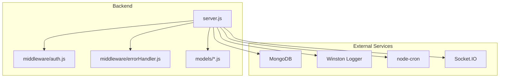
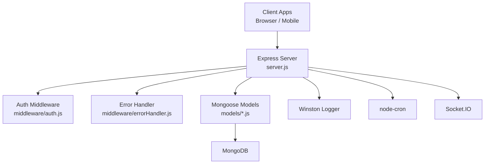
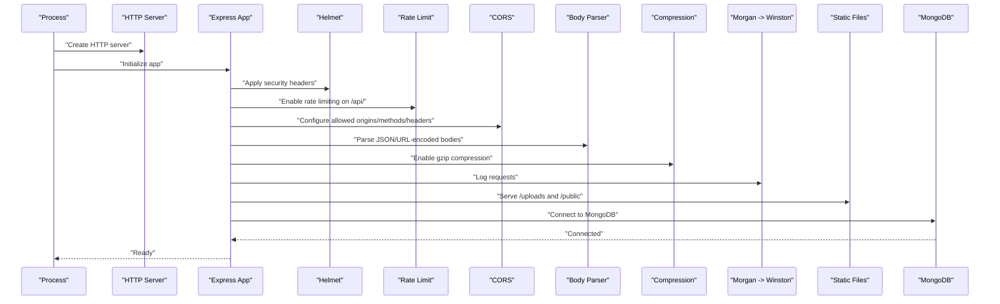
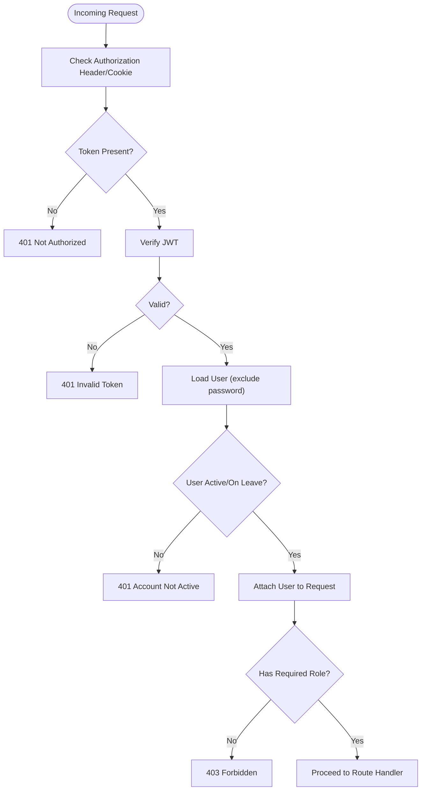
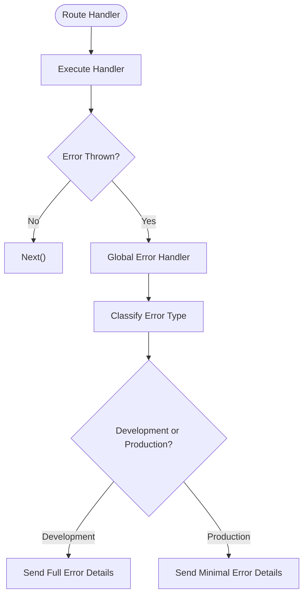
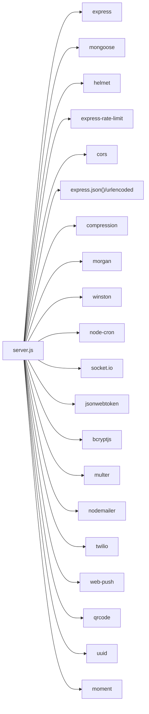

# Backend Server

<cite>
**Referenced Files in This Document**
- [package.json](file://backend/package.json)
- [server.js](file://backend/server.js)
- [auth.js](file://backend/middleware/auth.js)
- [errorHandler.js](file://backend/middleware/errorHandler.js)
- [User.js](file://backend/models/User.js)
- [index.js](file://backend/models/index.js)
</cite>

## Table of Contents
1. [Introduction](#introduction)
2. [Project Structure](#project-structure)
3. [Core Components](#core-components)
4. [Architecture Overview](#architecture-overview)
5. [Detailed Component Analysis](#detailed-component-analysis)
6. [Dependency Analysis](#dependency-analysis)
7. [Performance Considerations](#performance-considerations)
8. [Troubleshooting Guide](#troubleshooting-guide)
9. [Conclusion](#conclusion)
10. [Appendices](#appendices)

## Introduction
This document describes the backend server implementation for the 555 Insaat Worker Management System. It covers the Node.js server setup, middleware stack, static file serving, database connectivity, routing, security configurations, environment variables, and deployment considerations. It also explains the relationship between frontend and backend components, API endpoints, data persistence strategies, development workflow, testing procedures, and production best practices.

## Project Structure
The backend is organized around a modular Express server with clear separation of concerns:
- server.js: Bootstraps the server, configures middleware, connects to MongoDB, mounts routes, and exposes health and API documentation endpoints.
- middleware/: Contains authentication, error handling, upload, and audit logging utilities.
- models/: Mongoose models representing domain entities (users, attendance, salary, tasks, etc.).

**Diagram sources**
- [server.js:1-184](file://backend/server.js#L1-L184)
- [auth.js:1-345](file://backend/middleware/auth.js#L1-L345)
- [errorHandler.js:1-137](file://backend/middleware/errorHandler.js#L1-L137)

**Section sources**
- [server.js:1-184](file://backend/server.js#L1-L184)

## Core Components
- Express server with HTTP server creation and Socket.IO integration.
- Security middleware: Helmet for CSP and HTTP headers, rate limiting, CORS configuration.
- Body parsing and compression.
- Static file serving for uploads and public assets.
- MongoDB connection via Mongoose with connection lifecycle logging.
- Modular routing under /api/* prefixes.
- Health check and API documentation endpoints.
- Centralized error handling and async handler wrapper.
- Authentication middleware supporting JWT-based protection, role-based authorization, permission checks, and account status validation.

**Section sources**
- [server.js:23-181](file://backend/server.js#L23-L181)
- [auth.js:10-344](file://backend/middleware/auth.js#L10-L344)
- [errorHandler.js:64-136](file://backend/middleware/errorHandler.js#L64-L136)

## Architecture Overview
The backend follows a layered architecture:
- Presentation Layer: Express routes mounted under /api/*.
- Application Layer: Route handlers and controllers (referenced by routes).
- Domain Layer: Mongoose models and business logic.
- Infrastructure Layer: Database connectivity, logging, scheduling, and external integrations.

**Diagram sources**
- [server.js:95-118](file://backend/server.js#L95-L118)
- [auth.js:10-194](file://backend/middleware/auth.js#L10-L194)
- [errorHandler.js:64-112](file://backend/middleware/errorHandler.js#L64-L112)

## Detailed Component Analysis

### Server Initialization and Middleware Stack
- Initializes Express app and HTTP server, then integrates Socket.IO.
- Applies security middleware: Helmet with CSP directives, rate limiting for /api/, and CORS allowing specific origins per environment.
- Configures body parsing with size limits, compression, and Morgan logging routed to Winston.
- Serves static files from /uploads and /public.
- Connects to MongoDB and sets up cron jobs after successful connection.
- Mounts modular routes under /api/* and defines /api/health and /api endpoints.
- Registers global error handler and unhandled rejection/exception listeners.
- Starts listening on configured port with environment-aware logging.

**Diagram sources**
- [server.js:25-93](file://backend/server.js#L25-L93)

**Section sources**
- [server.js:23-181](file://backend/server.js#L23-L181)

### Authentication and Authorization Middleware
- Token extraction from Authorization header or cookies.
- JWT verification and user lookup, attaching user to request.
- Role-based authorization and permission-based access control.
- Ownership checks for resources.
- Role-based rate limiting and account status validation (password age, email verification).
- Token generation (access/refresh), cookie setting/clearing with secure flags.

**Diagram sources**
- [auth.js:10-69](file://backend/middleware/auth.js#L10-L69)
- [auth.js:105-123](file://backend/middleware/auth.js#L105-L123)
- [auth.js:128-156](file://backend/middleware/auth.js#L128-L156)
- [auth.js:161-194](file://backend/middleware/auth.js#L161-L194)

**Section sources**
- [auth.js:10-344](file://backend/middleware/auth.js#L10-L344)

### Error Handling and Async Utilities
- Centralized error handling with classification of operational vs. internal errors.
- Specific handlers for duplicate keys, validation errors, casting errors, JWT errors, and expired tokens.
- Async handler wrapper to safely wrap async route handlers.
- Not found handler for unmatched routes.

**Diagram sources**
- [errorHandler.js:64-112](file://backend/middleware/errorHandler.js#L64-L112)
- [errorHandler.js:117-121](file://backend/middleware/errorHandler.js#L117-L121)

**Section sources**
- [errorHandler.js:64-136](file://backend/middleware/errorHandler.js#L64-L136)

### Data Models and Persistence
- Mongoose models represent domain entities such as User, Attendance, Salary, Tasks, Projects, Permissions, Notifications, Documents, Materials, Sales, Bonuses, Penalties, Overtime, Advances, Audit Logs, Settings, and Shift Changes.
- The models directory exports an index file aggregating model references for centralized access.
- The server connects to MongoDB using environment-provided URI and logs connection status.

```mermaid
classDiagram
class User {
+string email
+string role
+string status
+string[] permissions
+Date passwordChangedAt
+boolean emailVerified
}
class Attendance {
+Date date
+String~status~
+ObjectId workerId
}
class Salary {
+Number baseAmount
+Number bonus
+Number deduction
+Date month
+ObjectId workerId
}
class Task {
+string title
+string description
+Date dueDate
+String~status~
+ObjectId projectId
}
class Project {
+string name
+string description
+Date startDate
+Date endDate
}
class Permission {
+string name
+string description
}
class Notification {
+string type
+string message
+boolean read
+Date createdAt
}
class Document {
+string title
+string url
+String~category~
}
class Material {
+string name
+Number quantity
+Number unitPrice
}
class Sale {
+string productName
+Number quantity
+Number price
}
class Bonus {
+Number amount
+string reason
+Date awardedAt
}
class Penalty {
+Number amount
+string reason
+Date appliedAt
}
class Overtime {
+Number hours
+Date date
}
class Advance {
+Number amount
+Date requestedAt
}
class AuditLog {
+string action
+string tableName
+ObjectId userId
+Date timestamp
}
class Settings {
+string key
+any value
}
class ShiftChange {
+Date originalShift
+Date requestedShift
+String~status~
}
class Training {
+string title
+string provider
+Date completionDate
}
```

**Diagram sources**
- [User.js](file://backend/models/User.js)
- [index.js](file://backend/models/index.js)

**Section sources**
- [server.js:80-93](file://backend/server.js#L80-L93)
- [index.js](file://backend/models/index.js)

## Dependency Analysis
The backend leverages a comprehensive set of Node.js packages:
- Web framework and HTTP server: Express, HTTP.
- Database: Mongoose ODM for MongoDB.
- Security: bcryptjs for hashing, jsonwebtoken for tokens, helmet for headers, cors for cross-origin policies.
- Validation and file handling: express-validator, multer.
- Communication: nodemailer, twilio, web-push, qrcode.
- Utilities: uuid, moment, compression, morgan, winston, node-cron, socket.io.

**Diagram sources**
- [package.json:11-32](file://backend/package.json#L11-L32)
- [server.js:6-14](file://backend/server.js#L6-L14)

**Section sources**
- [package.json:11-32](file://backend/package.json#L11-L32)

## Performance Considerations
- Compression: Enabled via compression middleware to reduce payload sizes.
- Rate limiting: Applied to /api/ endpoints with configurable window and max requests via environment variables.
- Body parsing limits: JSON and URL-encoded bodies are limited to prevent large payload attacks.
- Static file serving: Efficiently serves uploaded assets and public resources.
- Logging: Morgan logs to Winston for structured, scalable logging.
- Background tasks: node-cron scheduled jobs support automated maintenance tasks.
- Monitoring: Consider integrating metrics and health checks for production deployments.

[No sources needed since this section provides general guidance]

## Troubleshooting Guide
Common issues and resolutions:
- MongoDB connection failures: Verify MONGODB_URI and network access; check logs for connection errors.
- CORS errors: Confirm allowed origins match frontend deployment URLs; ensure credentials are enabled when required.
- JWT-related errors: Validate JWT_SECRET/JWT_REFRESH_SECRET; ensure token expiration and signing align with client expectations.
- 404 routes: Confirm route registration under /api/* and correct base paths.
- Unhandled rejections and uncaught exceptions: The server logs and exits gracefully; review Winston logs for stack traces.

**Section sources**
- [server.js:90-93](file://backend/server.js#L90-L93)
- [server.js:164-175](file://backend/server.js#L164-L175)
- [errorHandler.js:69-76](file://backend/middleware/errorHandler.js#L69-L76)

## Conclusion
The backend provides a robust, modular foundation for the 555 Insaat Worker Management System. It integrates security, validation, authentication, logging, and persistence while exposing a comprehensive API surface. Proper environment configuration, deployment hardening, and monitoring practices are essential for production readiness.

[No sources needed since this section summarizes without analyzing specific files]

## Appendices

### Environment Variables
Required and commonly used environment variables:
- NODE_ENV: Environment mode (development/production).
- PORT: Server port (default 5000).
- MONGODB_URI: MongoDB connection string.
- JWT_SECRET: Secret for signing access tokens.
- JWT_REFRESH_SECRET: Secret for signing refresh tokens.
- JWT_EXPIRE: Access token expiry (e.g., 7d).
- JWT_REFRESH_EXPIRE: Refresh token expiry (e.g., 30d).
- RATE_LIMIT_WINDOW_MS: Rate limit window in milliseconds.
- RATE_LIMIT_MAX_REQUESTS: Max requests per window for /api/.

**Section sources**
- [server.js:45-53](file://backend/server.js#L45-L53)
- [server.js:57-63](file://backend/server.js#L57-L63)
- [server.js:178](file://backend/server.js#L178)
- [auth.js:284-298](file://backend/middleware/auth.js#L284-L298)
- [auth.js:314-330](file://backend/middleware/auth.js#L314-L330)

### API Endpoints
The server exposes the following API groups under /api/*:
- Authentication, Users, Workers, Attendance, Salary, Tasks, Projects, Permissions, Shift Changes, Penalties, Bonuses, Reports, Notifications, Documents, Trainings, Advances, Overtime, Sales, Materials, Audit Logs, Settings, Dashboard, QR.

Health and metadata endpoints:
- GET /api/health: Returns server status, timestamp, uptime, and environment.
- GET /api: Returns API name, version, and available endpoint groups.

**Section sources**
- [server.js:96-118](file://backend/server.js#L96-L118)
- [server.js:121-151](file://backend/server.js#L121-L151)

### Frontend-Backend Relationship
- The backend serves static assets from /uploads and /public for file storage and public resources.
- The frontend (HTML/CSS/JS) communicates with the backend via REST APIs under /api/*.
- Socket.IO is initialized for real-time features; ensure frontend clients connect accordingly.

**Section sources**
- [server.js:76-77](file://backend/server.js#L76-L77)
- [server.js:28-29](file://backend/server.js#L28-L29)

### Development Workflow
- Scripts:
  - start: Runs the production server.
  - dev: Starts the server with hot reload via nodemon.
  - test: Executes tests with Jest.
- Recommended workflow:
  - Use dev for local iteration.
  - Add unit/integration tests under tests/ and run via npm test.
  - Keep environment variables in a .env file loaded by dotenv.

**Section sources**
- [package.json:6-10](file://backend/package.json#L6-L10)

### Production Deployment Best Practices
- Environment configuration:
  - Set NODE_ENV=production.
  - Configure HTTPS, strict cookies, and secure headers.
  - Use strong secrets for JWT and enable refresh token rotation.
- Scaling:
  - Run behind a reverse proxy/load balancer.
  - Use clustering or container orchestration for horizontal scaling.
- Observability:
  - Centralize logs via Winston and export to a log aggregation service.
  - Monitor health endpoints and error rates.
- Security:
  - Enforce CORS only for trusted origins.
  - Apply rate limits per user role where appropriate.
  - Validate and sanitize all inputs using express-validator and sanitization.

**Section sources**
- [server.js:32-42](file://backend/server.js#L32-L42)
- [server.js:56-63](file://backend/server.js#L56-L63)
- [auth.js:314-330](file://backend/middleware/auth.js#L314-L330)