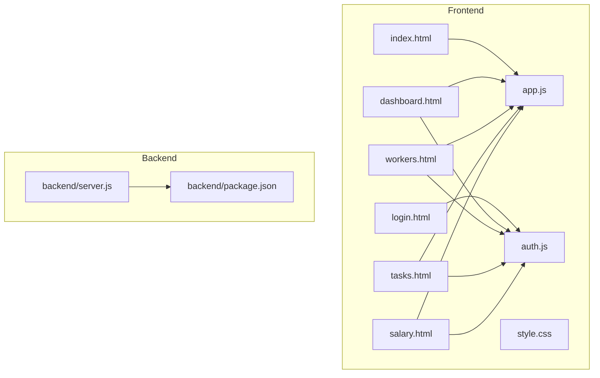
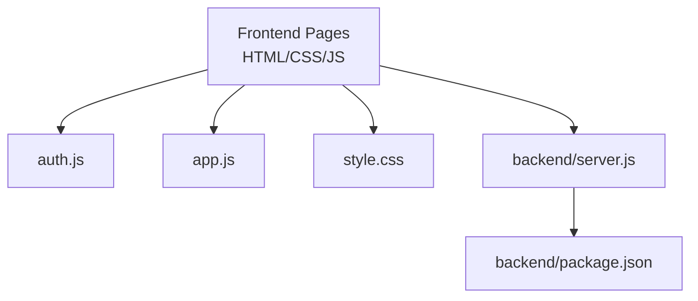
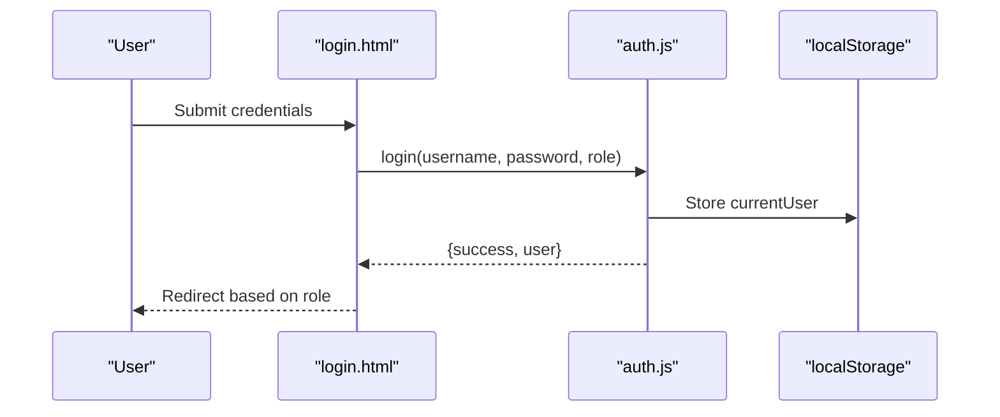
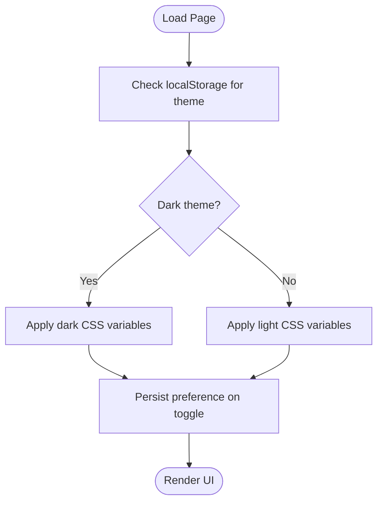
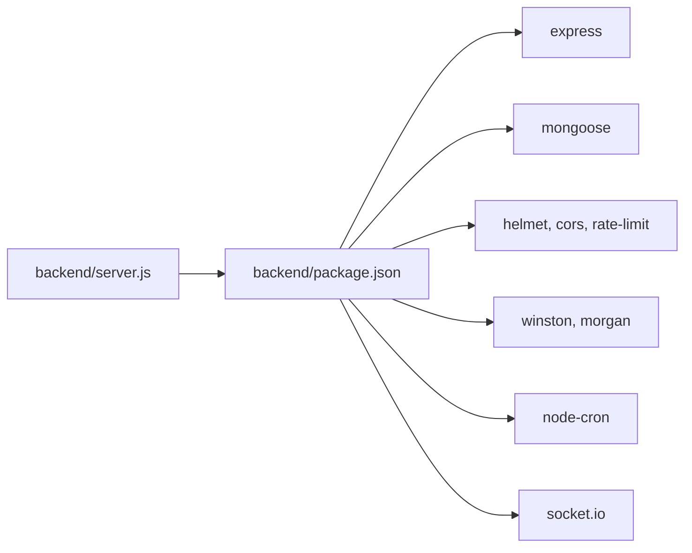

# Customization & Extension Guide

<cite>
**Referenced Files in This Document**
- [server.js](file://backend/server.js)
- [package.json](file://backend/package.json)
- [auth.js](file://auth.js)
- [app.js](file://app.js)
- [style.css](file://style.css)
- [index.html](file://index.html)
- [login.html](file://login.html)
- [dashboard.html](file://dashboard.html)
- [workers.html](file://workers.html)
- [tasks.html](file://tasks.html)
- [salary.html](file://salary.html)
</cite>

## Table of Contents
1. [Introduction](#introduction)
2. [Project Structure](#project-structure)
3. [Core Components](#core-components)
4. [Architecture Overview](#architecture-overview)
5. [Detailed Component Analysis](#detailed-component-analysis)
6. [Dependency Analysis](#dependency-analysis)
7. [Performance Considerations](#performance-considerations)
8. [Troubleshooting Guide](#troubleshooting-guide)
9. [Conclusion](#conclusion)
10. [Appendices](#appendices)

## Introduction
This guide explains how to customize and extend the 555 İnşaat construction management system for different construction company requirements. It covers branding and theming, adding new features and user roles, modifying workflows, extending the data model, integrating external systems, maintaining backward compatibility, and deployment considerations. The system currently uses client-side storage for demonstration and a modular frontend architecture, with a backend server exposing REST endpoints.

## Project Structure
The project is organized into:
- Frontend: Single-page application with shared UI utilities and per-page HTML/CSS/JS modules
- Backend: Node.js/Express server with route modules and shared utilities
- Theming: Centralized CSS variables and responsive styles

**Diagram sources**
- [server.js](file://backend/server.js)
- [package.json](file://backend/package.json)
- [auth.js](file://auth.js)
- [app.js](file://app.js)
- [style.css](file://style.css)
- [index.html](file://index.html)
- [login.html](file://login.html)
- [dashboard.html](file://dashboard.html)
- [workers.html](file://workers.html)
- [tasks.html](file://tasks.html)
- [salary.html](file://salary.html)

**Section sources**
- [server.js](file://backend/server.js)
- [package.json](file://backend/package.json)
- [auth.js](file://auth.js)
- [app.js](file://app.js)
- [style.css](file://style.css)
- [index.html](file://index.html)
- [login.html](file://login.html)
- [dashboard.html](file://dashboard.html)
- [workers.html](file://workers.html)
- [tasks.html](file://tasks.html)
- [salary.html](file://salary.html)

## Core Components
- Authentication module: In-memory demo users, session management, and helpers for data access and formatting
- Shared UI utilities: Tooltips, modals, tabs, search/sort, CSV export, printing, animations, and local storage helpers
- Theming: CSS variables for primary/secondary colors, shadows, radii, and responsive breakpoints
- Pages: Role-specific dashboards and forms for workers, tasks, salary, permissions, and more
- Backend server: Express server with middleware, routes, health checks, and global error handling

Key customization entry points:
- Branding and theming via CSS variables and component classes
- Feature additions by extending page templates and JavaScript handlers
- New user roles by updating authentication and navigation logic
- Workflow changes by adjusting page logic and data helpers

**Section sources**
- [auth.js](file://auth.js)
- [app.js](file://app.js)
- [style.css](file://style.css)
- [dashboard.html](file://dashboard.html)
- [workers.html](file://workers.html)
- [tasks.html](file://tasks.html)
- [salary.html](file://salary.html)
- [server.js](file://backend/server.js)

## Architecture Overview
The system follows a thin-client architecture:
- Frontend pages communicate with backend endpoints via fetch/XHR
- Backend exposes REST endpoints grouped by domain (users, workers, attendance, salary, etc.)
- Authentication is role-based; navigation and access vary by role
- Styling is centralized in a single stylesheet with CSS variables

**Diagram sources**
- [server.js](file://backend/server.js)
- [package.json](file://backend/package.json)
- [auth.js](file://auth.js)
- [app.js](file://app.js)
- [style.css](file://style.css)

## Detailed Component Analysis

### Authentication and Session Management
- Demo users with predefined roles (admin, seller, worker)
- Session stored in localStorage without passwords
- Helpers for data initialization, retrieval, and formatting
- Role-based redirection and access control on pages

Customization tips:
- Replace demo users with database-backed users
- Add JWT-based sessions and secure cookies
- Extend roles and permissions matrix
- Integrate with external identity providers

**Diagram sources**
- [login.html](file://login.html)
- [auth.js](file://auth.js)

**Section sources**
- [auth.js](file://auth.js)
- [login.html](file://login.html)

### Theming and Branding
- Centralized CSS variables for colors, typography, spacing, and shadows
- Dark/light theme toggle persisted in localStorage
- Responsive design with media queries
- Consistent component classes for cards, badges, buttons, and tables

Customization steps:
- Modify CSS variables to change brand colors
- Add new component variants by extending class sets
- Adjust breakpoints for device-specific layouts
- Provide alternate themes by switching variable sets

**Diagram sources**
- [app.js](file://app.js)
- [style.css](file://style.css)

**Section sources**
- [app.js](file://app.js)
- [style.css](file://style.css)

### Data Model Extensions and Business Rules
Current data model (client-side):
- Workers: personal info, daily salary, position
- Tasks: title, description, assigned worker, priority, status
- Performance: daily records with status and metrics
- Salaries: monthly computed totals with bonuses/penalties
- Permissions: leave requests with approval lifecycle
- Shift changes: swap requests between workers

Extending the model:
- Add new collections (e.g., projects, materials, sales)
- Extend existing entities with new fields
- Add business rules in page scripts or backend handlers
- Maintain backward compatibility by defaulting new fields

Guidelines:
- Keep backward-compatible defaults for new fields
- Validate on both client and server sides
- Use consistent date/time and currency formatting helpers

**Section sources**
- [auth.js](file://auth.js)
- [tasks.html](file://tasks.html)
- [salary.html](file://salary.html)

### Adding New User Roles and Permissions
- Define roles in authentication and enforce in page logic
- Update navigation menus per role
- Gate access to sensitive pages (e.g., admin-only dashboards)

Steps:
- Add role to demo users and localStorage initialization
- Update page access checks (e.g., redirect non-admins)
- Extend navigation items and sidebar logic

**Section sources**
- [auth.js](file://auth.js)
- [dashboard.html](file://dashboard.html)
- [workers.html](file://workers.html)

### Workflow Modifications
Examples of workflow changes:
- Task lifecycle: add states (review, blocked), transitions, and approvals
- Salary calculation: incorporate overtime, deductions, and tax rules
- Leave policy: define accrual, carry-over, and blackout dates

Implementation pattern:
- Extend page logic to reflect new states and actions
- Update data helpers to compute derived values
- Preserve existing UI while adding new controls

**Section sources**
- [tasks.html](file://tasks.html)
- [salary.html](file://salary.html)

### Extending Existing Functionality
Common extensions:
- Reports: add new report pages and export formats
- Notifications: integrate push/email/SMS for approvals
- Documents: attach files to workers/tasks with upload/download
- Audit logs: track changes to sensitive records

Patterns:
- Add new route endpoints in backend
- Create new HTML pages with shared utilities
- Extend data helpers and maintain backward compatibility

**Section sources**
- [server.js](file://backend/server.js)
- [app.js](file://app.js)

### Integrating with External Systems
- Payment gateways: add salary disbursement hooks
- SMS/email: send notifications on approvals
- HRIS: sync workers and permissions externally
- Timesheet integrations: import attendance data

Approach:
- Expose webhook endpoints for inbound events
- Use background jobs for async integrations
- Secure endpoints with API keys or signatures

**Section sources**
- [server.js](file://backend/server.js)
- [package.json](file://backend/package.json)

### Maintaining Backward Compatibility
- Default new fields to safe values
- Version APIs and handle schema migrations
- Keep legacy endpoints during transition
- Test with real-world datasets before rollout

[No sources needed since this section provides general guidance]

### Deployment Considerations
- Environment variables for production domains, rate limits, and secrets
- Static asset hosting for uploads/public folders
- HTTPS enforcement and CSP policies
- Health checks and monitoring

**Section sources**
- [server.js](file://backend/server.js)
- [package.json](file://backend/package.json)

## Dependency Analysis
Frontend dependencies are minimal and focused on UI utilities and theming. Backend dependencies include Express, MongoDB, security middleware, logging, scheduling, and real-time capabilities.

**Diagram sources**
- [server.js](file://backend/server.js)
- [package.json](file://backend/package.json)

**Section sources**
- [server.js](file://backend/server.js)
- [package.json](file://backend/package.json)

## Performance Considerations
- Minimize DOM updates by batching UI refreshes
- Use debounced search and throttled scroll handlers
- Lazy-load heavy components and defer non-critical scripts
- Optimize exports and printing by isolating styles

[No sources needed since this section provides general guidance]

## Troubleshooting Guide
Common issues and resolutions:
- Authentication failures: verify credentials and role match
- Data not persisting: check localStorage availability and quotas
- Styling inconsistencies: ensure CSS variables are applied and theme is toggled correctly
- Cross-origin errors: confirm CORS configuration matches deployment origins

**Section sources**
- [auth.js](file://auth.js)
- [app.js](file://app.js)
- [style.css](file://style.css)
- [server.js](file://backend/server.js)

## Conclusion
The 555 İnşaat system offers a flexible foundation for customization. By leveraging CSS variables for branding, extending page logic for new features, and carefully managing data model changes, companies can tailor the system to diverse construction workflows. Integrations, robust security, and backward compatibility should guide all extensions.

[No sources needed since this section summarizes without analyzing specific files]

## Appendices

### A. Theming Reference
- Primary/secondary colors: adjust CSS variables for brand alignment
- Typography and spacing: use consistent units and radii
- Responsive breakpoints: adapt grid and layout for devices

**Section sources**
- [style.css](file://style.css)

### B. Page-to-Logic Mapping
- Dashboard: stats aggregation and recent activity
- Workers: CRUD operations and filtering
- Tasks: lifecycle management and assignment
- Salary: computation and adjustments

**Section sources**
- [dashboard.html](file://dashboard.html)
- [workers.html](file://workers.html)
- [tasks.html](file://tasks.html)
- [salary.html](file://salary.html)