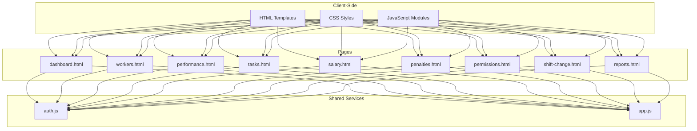
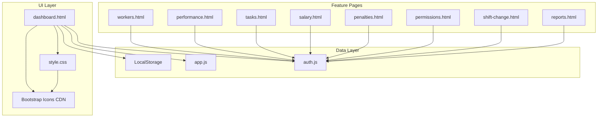

# Admin Dashboard

<cite>
**Referenced Files in This Document**
- [dashboard.html](file://dashboard.html)
- [auth.js](file://auth.js)
- [app.js](file://app.js)
- [style.css](file://style.css)
- [workers.html](file://workers.html)
- [performance.html](file://performance.html)
- [tasks.html](file://tasks.html)
- [salary.html](file://salary.html)
- [penalties.html](file://penalties.html)
- [permissions.html](file://permissions.html)
- [shift-change.html](file://shift-change.html)
- [reports.html](file://reports.html)
</cite>

## Table of Contents
1. [Introduction](#introduction)
2. [Project Structure](#project-structure)
3. [Core Components](#core-components)
4. [Architecture Overview](#architecture-overview)
5. [Detailed Component Analysis](#detailed-component-analysis)
6. [Dependency Analysis](#dependency-analysis)
7. [Performance Considerations](#performance-considerations)
8. [Troubleshooting Guide](#troubleshooting-guide)
9. [Conclusion](#conclusion)

## Introduction
This document provides comprehensive documentation for the Admin Dashboard, covering all administrative features and analytics. It explains the sidebar navigation structure, statistics grid, recent activities, top workers ranking system, pending requests overview, today's attendance summary, quick actions, responsive layout, theme switching, and user session management. It also describes how dashboard statistics are calculated from stored data and provides examples of data visualization.

## Project Structure
The Admin Dashboard is built as a single-page application with shared layouts across multiple HTML pages. The dashboard page integrates real-time analytics and interactive widgets, while supporting navigation to specialized administrative areas such as workers, performance, tasks, salary, penalties, permissions, shift changes, and reports.

```mermaid
graph TB
Dashboard["Dashboard (dashboard.html)"]
Auth["Authentication (auth.js)"]
App["Application Utilities (app.js)"]
Style["Styles (style.css)"]
Workers["Workers (workers.html)"]
Performance["Performance (performance.html)"]
Tasks["Tasks (tasks.html)"]
Salary["Salary (salary.html)"]
Penalties["Penalties (penalties.html)"]
Permissions["Permissions (permissions.html)"]
ShiftChange["Shift Change (shift-change.html)"]
Reports["Reports (reports.html)"]
Dashboard --> Auth
Dashboard --> App
Dashboard --> Style
Workers --> Auth
Workers --> App
Performance --> Auth
Performance --> App
Tasks --> Auth
Tasks --> App
Salary --> Auth
Salary --> App
Penalties --> Auth
Penalties --> App
Permissions --> Auth
Permissions --> App
ShiftChange --> Auth
ShiftChange --> App
Reports --> Auth
Reports --> App
```

**Diagram sources**
- [dashboard.html](file://dashboard.html)
- [auth.js](file://auth.js)
- [app.js](file://app.js)
- [style.css](file://style.css)
- [workers.html](file://workers.html)
- [performance.html](file://performance.html)
- [tasks.html](file://tasks.html)
- [salary.html](file://salary.html)
- [penalties.html](file://penalties.html)
- [permissions.html](file://permissions.html)
- [shift-change.html](file://shift-change.html)
- [reports.html](file://reports.html)

**Section sources**
- [dashboard.html](file://dashboard.html)
- [auth.js](file://auth.js)
- [app.js](file://app.js)
- [style.css](file://style.css)

## Core Components
- Sidebar Navigation: Links to workers, performance, tasks, salary, penalties, permissions, shift changes, and reports. Active state highlights the current page.
- Statistics Grid: Displays total workers, active workers, total bonus, and total penalty metrics.
- Recent Activities: Shows recent system events with empty state handling.
- Top Workers Ranking: Lists top 5 workers by average efficiency with progress bars.
- Pending Requests Overview: Shows pending permission and shift change counts with quick navigation.
- Today's Attendance Summary: Displays present, absent, late, and excused counts.
- Quick Actions: Rapid access to worker management, task creation, and salary calculation.
- Responsive Layout: Adapts to desktop, tablet, and mobile screens.
- Theme Switching: Dark/light mode toggle with persistent preference.
- User Session Management: Role-based access control and logout functionality.

**Section sources**
- [dashboard.html](file://dashboard.html)
- [auth.js](file://auth.js)
- [app.js](file://app.js)
- [style.css](file://style.css)

## Architecture Overview
The Admin Dashboard follows a modular client-side architecture:
- Shared layout and styles across pages
- Centralized authentication and data utilities
- Modular JavaScript for UI interactions and animations
- Local storage-backed data persistence

**Diagram sources**
- [dashboard.html](file://dashboard.html)
- [auth.js](file://auth.js)
- [app.js](file://app.js)
- [style.css](file://style.css)
- [workers.html](file://workers.html)
- [performance.html](file://performance.html)
- [tasks.html](file://tasks.html)
- [salary.html](file://salary.html)
- [penalties.html](file://penalties.html)
- [permissions.html](file://permissions.html)
- [shift-change.html](file://shift-change.html)
- [reports.html](file://reports.html)

## Detailed Component Analysis

### Sidebar Navigation
The sidebar provides centralized access to all administrative areas:
- Dashboard: Current page indicator
- Workers: Employee management
- Performance: Work performance tracking
- Tasks: Assignment and progress tracking
- Salary: Payroll calculations and management
- Penalties: Disciplinary actions
- Permissions: Leave and absence approvals
- Shift Changes: Day-off swap requests
- Reports: Comprehensive analytics

Navigation items include icons, labels, and active state highlighting. The sidebar footer displays user avatar, name, and role, with logout functionality.

**Section sources**
- [dashboard.html](file://dashboard.html)

### Statistics Grid
The statistics grid presents four key metrics:
- Total Workers: Count of all registered employees
- Active Workers: Count of currently active employees
- Total Bonus: Sum of all bonuses across salary records
- Total Penalty: Sum of all penalties across penalty records

Each metric card includes an icon, label, and formatted value. Currency formatting is applied to bonus and penalty totals.

**Section sources**
- [dashboard.html](file://dashboard.html)

### Recent Activities
The recent activities section displays system events in reverse chronological order. When no activities exist, it shows an empty state with an icon and message.

**Section sources**
- [dashboard.html](file://dashboard.html)

### Top Workers Ranking System
The top workers ranking calculates average efficiency per worker based on performance records:
1. Aggregate performance data by worker
2. Compute average efficiency percentage
3. Sort workers in descending order
4. Display top 5 with progress bars

Each ranking entry shows position, worker name, and efficiency percentage with a visual progress indicator.

**Section sources**
- [dashboard.html](file://dashboard.html)

### Pending Requests Overview
The pending requests section shows counts for:
- Pending Permissions: Leave and absence requests awaiting approval
- Pending Shift Changes: Day-off swap requests awaiting approval

Each category includes a quick action button linking to the respective management page.

**Section sources**
- [dashboard.html](file://dashboard.html)

### Today's Attendance Summary
The attendance summary displays real-time counts for:
- Present: Workers who arrived on time
- Absent: Workers who did not appear
- Late: Workers who arrived after start time
- Excused: Workers with approved leave

Counts are derived from performance records matching today's date.

**Section sources**
- [dashboard.html](file://dashboard.html)

### Quick Actions
Quick actions provide rapid access to common administrative tasks:
- Add Worker: Navigate to worker registration
- Create Task: Navigate to task creation
- Calculate Salary: Navigate to payroll calculation

These actions streamline frequent workflows for administrators.

**Section sources**
- [dashboard.html](file://dashboard.html)

### Responsive Layout Implementation
The dashboard implements a responsive grid system:
- Desktop: Two-column layout with main content and sidebar
- Tablet: Single column layout for improved readability
- Mobile: Collapsible sidebar with mobile menu button
- Adaptive components: Stats grid, attendance summary, and dashboard grid adjust to screen size

Media queries handle breakpoint-specific styling and component arrangement.

**Section sources**
- [style.css](file://style.css)
- [dashboard.html](file://dashboard.html)

### Theme Switching Functionality
The theme toggle enables dark/light mode switching:
- Clicking the moon/sun icon toggles body class "dark-mode"
- Icon updates to reflect current theme
- Preference stored in localStorage for persistence
- Smooth transitions between themes

**Section sources**
- [app.js](file://app.js)
- [style.css](file://style.css)

### User Session Management
Session management ensures secure access:
- Authentication check on page load
- Role-based redirection (admin vs worker)
- User information display in sidebar
- Logout functionality clears session and redirects

Demo users with predefined credentials support development and testing.

**Section sources**
- [auth.js](file://auth.js)
- [dashboard.html](file://dashboard.html)

### Dashboard Data Visualization Examples
The dashboard demonstrates several visualization patterns:
- Progress bars for efficiency metrics
- Stat cards with colored icons
- Grid layouts for responsive content
- Empty state placeholders
- Interactive modals for detailed views

These patterns provide consistent user experience across different data types.

**Section sources**
- [dashboard.html](file://dashboard.html)
- [style.css](file://style.css)

## Dependency Analysis
The dashboard relies on several key dependencies and relationships:

**Diagram sources**
- [dashboard.html](file://dashboard.html)
- [auth.js](file://auth.js)
- [app.js](file://app.js)
- [style.css](file://style.css)
- [workers.html](file://workers.html)
- [performance.html](file://performance.html)
- [tasks.html](file://tasks.html)
- [salary.html](file://salary.html)
- [penalties.html](file://penalties.html)
- [permissions.html](file://permissions.html)
- [shift-change.html](file://shift-change.html)
- [reports.html](file://reports.html)

Key dependency relationships:
- Dashboard depends on auth.js for user session and data retrieval
- All pages depend on app.js for utility functions and UI interactions
- Local storage serves as the primary data persistence mechanism
- Bootstrap Icons CDN provides consistent iconography
- CSS variables define theme colors and typography

**Section sources**
- [dashboard.html](file://dashboard.html)
- [auth.js](file://auth.js)
- [app.js](file://app.js)
- [style.css](file://style.css)

## Performance Considerations
The dashboard implements several performance optimizations:
- Efficient DOM manipulation through template concatenation
- Debounced and throttled utility functions for search and filtering
- Lazy loading of non-critical components
- CSS transforms for smooth animations
- Minimal external dependencies
- Optimized grid layouts for responsive performance

Recommendations for further optimization include:
- Implementing virtual scrolling for large datasets
- Adding data caching strategies
- Optimizing image assets and SVG icons
- Using requestAnimationFrame for animations
- Implementing service workers for offline functionality

## Troubleshooting Guide
Common issues and solutions:

### Authentication Problems
- Symptom: Redirect to login page immediately
- Cause: Missing or invalid user session
- Solution: Verify localStorage contains "currentUser" key

### Data Not Loading
- Symptom: Empty statistics or tables
- Cause: Missing localStorage data initialization
- Solution: Ensure auth.js initializeData() runs on page load

### Theme Toggle Issues
- Symptom: Theme does not persist or toggle incorrectly
- Cause: localStorage key mismatch or icon class replacement errors
- Solution: Check "theme" key and icon class updates

### Responsive Layout Problems
- Symptom: Sidebar overlaps content on mobile
- Cause: Missing media query implementation
- Solution: Verify @media rules and transform properties

**Section sources**
- [auth.js](file://auth.js)
- [app.js](file://app.js)
- [style.css](file://style.css)

## Conclusion
The Admin Dashboard provides a comprehensive administrative interface with robust data visualization, responsive design, and efficient user workflows. Its modular architecture supports easy maintenance and extension, while the centralized authentication and utility systems ensure consistent functionality across all pages. The dashboard successfully balances functionality with usability, offering administrators powerful tools for workforce management and analytics.