# Dashboard Navigation & Layout

<cite>
**Referenced Files in This Document**
- [app.js](file://app.js)
- [auth.js](file://auth.js)
- [style.css](file://style.css)
- [dashboard.html](file://dashboard.html)
- [worker-dashboard.html](file://worker-dashboard.html)
- [seller-dashboard.html](file://seller-dashboard.html)
- [workers.html](file://workers.html)
- [projects.html](file://projects.html)
- [login.html](file://login.html)
- [index.html](file://index.html)
</cite>

## Table of Contents
1. [Introduction](#introduction)
2. [Project Structure](#project-structure)
3. [Core Components](#core-components)
4. [Architecture Overview](#architecture-overview)
5. [Detailed Component Analysis](#detailed-component-analysis)
6. [Dependency Analysis](#dependency-analysis)
7. [Performance Considerations](#performance-considerations)
8. [Troubleshooting Guide](#troubleshooting-guide)
9. [Conclusion](#conclusion)

## Introduction
This document describes the dashboard navigation system and layout architecture used across the 555 İnşaat workforce management application. It covers the sidebar navigation patterns, responsive layout with collapsible sidebar, grid-based dashboard organization, card-based widgets, theme switching, user avatar display, logout functionality, authentication-based routing, and the consistent header structure with search, theme toggle, and user information display. The system supports three distinct dashboard types: Admin, Worker, and Seller, each with tailored navigation menus and functionality while sharing a unified layout framework.

## Project Structure
The application follows a modular HTML/CSS/JavaScript architecture with shared styles and scripts across dashboards:
- Shared layout: admin-layout with fixed sidebar and main content area
- Role-specific dashboards: dashboard.html (admin), worker-dashboard.html (worker), seller-dashboard.html (seller)
- Supporting pages: workers.html, projects.html, and others under the admin scope
- Shared utilities: app.js (UI helpers), auth.js (authentication and data helpers)
- Centralized styling: style.css (layout, responsive design, theming)

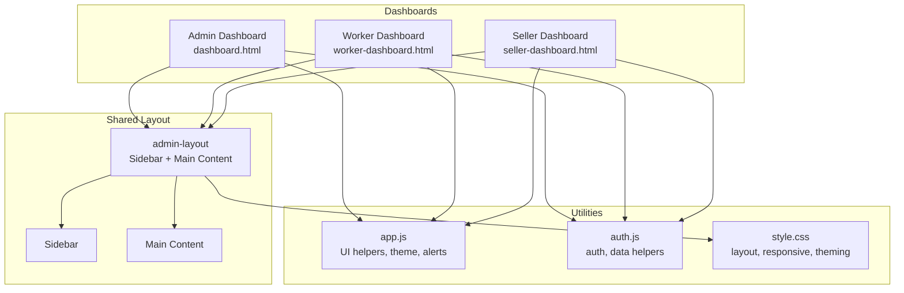

**Diagram sources**
- [dashboard.html:11-296](file://dashboard.html#L11-L296)
- [worker-dashboard.html:11-287](file://worker-dashboard.html#L11-L287)
- [seller-dashboard.html:11-239](file://seller-dashboard.html#L11-L239)
- [app.js:1-412](file://app.js#L1-L412)
- [auth.js:1-213](file://auth.js#L1-L213)
- [style.css:670-1200](file://style.css#L670-L1200)

**Section sources**
- [dashboard.html:11-296](file://dashboard.html#L11-L296)
- [worker-dashboard.html:11-287](file://worker-dashboard.html#L11-L287)
- [seller-dashboard.html:11-239](file://seller-dashboard.html#L11-L239)
- [style.css:670-1200](file://style.css#L670-L1200)

## Core Components
- Sidebar navigation: Fixed vertical navigation with icons, labels, hover states, and active state highlighting
- Topbar/header: Consistent header with title, search box, theme toggle, and user actions
- Main content area: Grid-based dashboard layout with cards/widgets
- Theme system: Toggle between light/dark modes persisted in localStorage
- Authentication routing: Role-based redirection and logout
- Utility functions: Alerts, modals, tabs, search, sorting, printing, and form helpers

Key implementation references:
- Sidebar structure and active state: [dashboard.html:22-87](file://dashboard.html#L22-L87), [worker-dashboard.html:22-67](file://worker-dashboard.html#L22-L67), [seller-dashboard.html:22-43](file://seller-dashboard.html#L22-L43)
- Topbar/header: [dashboard.html:103-120](file://dashboard.html#L103-L120), [worker-dashboard.html:87-103](file://worker-dashboard.html#L87-L103), [seller-dashboard.html:63-76](file://seller-dashboard.html#L63-L76)
- Main content grid: [style.css:1303-1313](file://style.css#L1303-L1313)
- Theme toggle: [app.js:70-94](file://app.js#L70-L94), [style.css:1221-1238](file://style.css#L1221-L1238)
- Authentication routing: [auth.js:56-88](file://auth.js#L56-L88), [dashboard.html:301-310](file://dashboard.html#L301-L310), [worker-dashboard.html:292-305](file://worker-dashboard.html#L292-L305), [seller-dashboard.html:299-308](file://seller-dashboard.html#L299-L308)

**Section sources**
- [dashboard.html:22-120](file://dashboard.html#L22-L120)
- [worker-dashboard.html:22-103](file://worker-dashboard.html#L22-L103)
- [seller-dashboard.html:22-76](file://seller-dashboard.html#L22-L76)
- [style.css:1303-1313](file://style.css#L1303-L1313)
- [app.js:70-94](file://app.js#L70-L94)
- [auth.js:56-88](file://auth.js#L56-L88)

## Architecture Overview
The system uses a shared layout pattern across all dashboards with role-specific navigation menus. The sidebar is fixed and collapses on smaller screens. The main content area uses a two-column grid layout that stacks on narrow screens. Utilities in app.js provide cross-cutting concerns like theme switching, alerts, and modals. Authentication in auth.js manages user sessions and role-based routing.

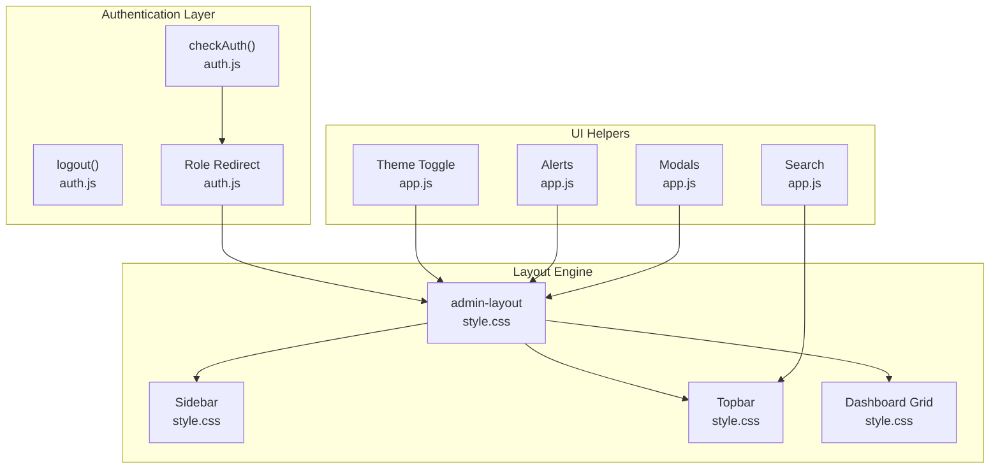

**Diagram sources**
- [auth.js:56-127](file://auth.js#L56-L127)
- [style.css:670-1313](file://style.css#L670-L1313)
- [app.js:70-153](file://app.js#L70-L153)

**Section sources**
- [auth.js:56-127](file://auth.js#L56-L127)
- [style.css:670-1313](file://style.css#L670-L1313)
- [app.js:70-153](file://app.js#L70-L153)

## Detailed Component Analysis

### Sidebar Navigation Patterns
All dashboards share a consistent sidebar structure:
- Header with logo and role label
- Navigation items with Bootstrap Icons, labels, hover effects, and active state
- Footer with user avatar, user details, and logout button

Active state management:
- Active item receives a left border highlight and background change
- Hover states apply subtle transitions and color changes

Responsive behavior:
- On mobile, the sidebar translates off-screen and becomes overlayed
- A mobile menu button toggles visibility

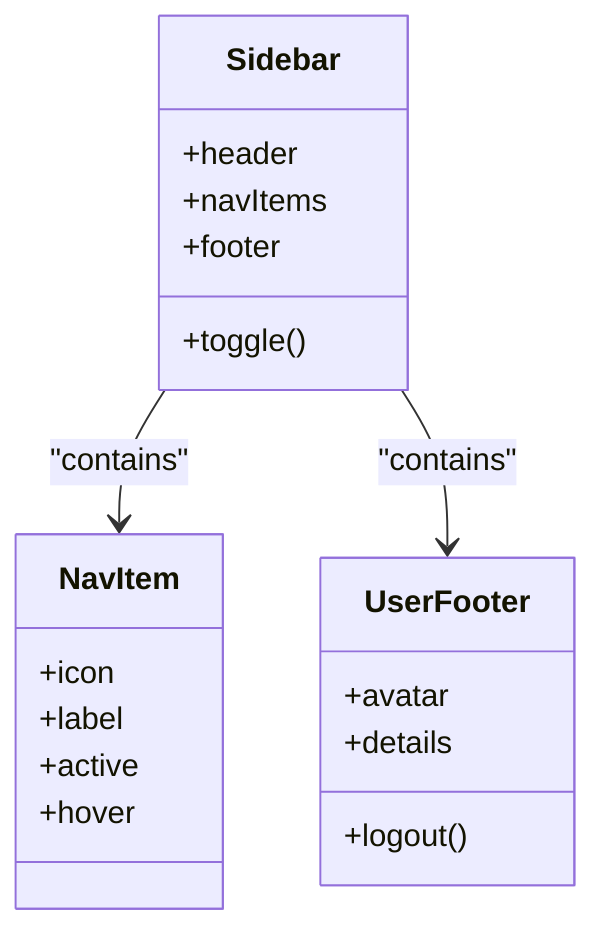

**Diagram sources**
- [dashboard.html:13-98](file://dashboard.html#L13-L98)
- [worker-dashboard.html:13-82](file://worker-dashboard.html#L13-L82)
- [seller-dashboard.html:13-58](file://seller-dashboard.html#L13-L58)
- [style.css:676-798](file://style.css#L676-L798)

**Section sources**
- [dashboard.html:13-98](file://dashboard.html#L13-L98)
- [worker-dashboard.html:13-82](file://worker-dashboard.html#L13-L82)
- [seller-dashboard.html:13-58](file://seller-dashboard.html#L13-L58)
- [style.css:676-798](file://style.css#L676-L798)

### Responsive Layout and Grid System
The layout adapts to different screen sizes:
- Desktop: Fixed 280px wide sidebar, main content to the right
- Tablet/Mobile: Sidebar slides in/out via transform; main content adjusts margins
- Two-column dashboard grid (2:1 ratio) stacks into single column on narrower screens

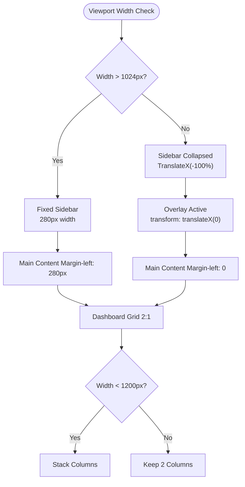

**Diagram sources**
- [style.css:1221-1238](file://style.css#L1221-L1238)
- [style.css:1239-1289](file://style.css#L1239-L1289)
- [style.css:1303-1313](file://style.css#L1303-L1313)

**Section sources**
- [style.css:1221-1289](file://style.css#L1221-L1289)
- [style.css:1303-1313](file://style.css#L1303-L1313)

### Theme Switching Mechanism
The theme toggle switches between light and dark modes:
- Clicking the theme button toggles a body class and updates the icon
- Theme preference is stored in localStorage and restored on page load
- Dark mode uses a moon/sun icon swap

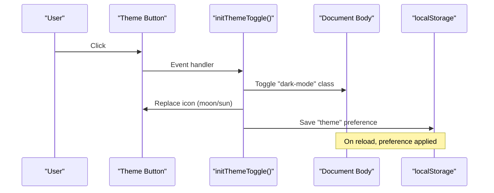

**Diagram sources**
- [app.js:70-94](file://app.js#L70-L94)
- [style.css:1221-1238](file://style.css#L1221-L1238)

**Section sources**
- [app.js:70-94](file://app.js#L70-L94)

### User Avatar Display and Logout
- Avatars are rendered as initials inside circular containers
- User details (name, role/title) appear in the sidebar footer
- Logout triggers removal of the current user session and redirects to login

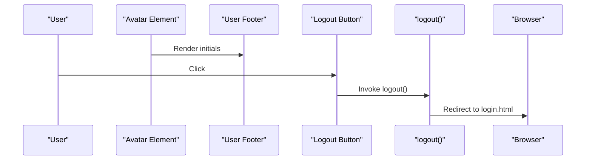

**Diagram sources**
- [dashboard.html:89-98](file://dashboard.html#L89-L98)
- [worker-dashboard.html:69-81](file://worker-dashboard.html#L69-L81)
- [seller-dashboard.html:45-57](file://seller-dashboard.html#L45-L57)
- [auth.js:84-88](file://auth.js#L84-L88)

**Section sources**
- [dashboard.html:89-98](file://dashboard.html#L89-L98)
- [worker-dashboard.html:69-81](file://worker-dashboard.html#L69-L81)
- [seller-dashboard.html:45-57](file://seller-dashboard.html#L45-L57)
- [auth.js:84-88](file://auth.js#L84-L88)

### Authentication-Based Navigation Routing
- checkAuth validates session presence and redirects unauthenticated users to login
- Role-based redirects send users to appropriate dashboards:
  - admin → dashboard.html
  - seller → seller-dashboard.html
  - worker → worker-dashboard.html
- Logout clears session and navigates to login

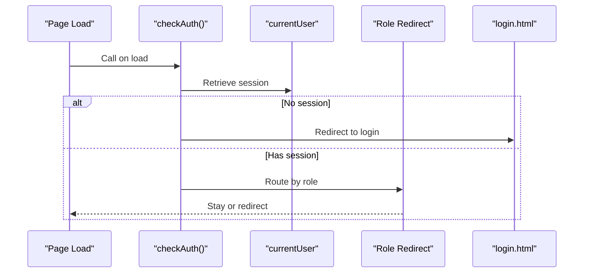

**Diagram sources**
- [auth.js:56-88](file://auth.js#L56-L88)
- [dashboard.html:301-310](file://dashboard.html#L301-L310)
- [worker-dashboard.html:292-305](file://worker-dashboard.html#L292-L305)
- [seller-dashboard.html:299-308](file://seller-dashboard.html#L299-L308)

**Section sources**
- [auth.js:56-88](file://auth.js#L56-L88)
- [dashboard.html:301-310](file://dashboard.html#L301-L310)
- [worker-dashboard.html:292-305](file://worker-dashboard.html#L292-L305)
- [seller-dashboard.html:299-308](file://seller-dashboard.html#L299-L308)

### Consistent Header Structure
Each dashboard includes a consistent header:
- Left section: page title and description
- Right section: search box, theme toggle, and action buttons (where applicable)

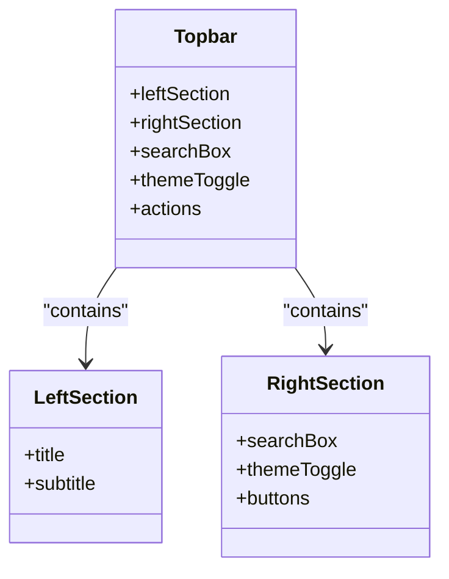

**Diagram sources**
- [dashboard.html:103-120](file://dashboard.html#L103-L120)
- [worker-dashboard.html:87-103](file://worker-dashboard.html#L87-L103)
- [seller-dashboard.html:63-76](file://seller-dashboard.html#L63-L76)

**Section sources**
- [dashboard.html:103-120](file://dashboard.html#L103-L120)
- [worker-dashboard.html:87-103](file://worker-dashboard.html#L87-L103)
- [seller-dashboard.html:63-76](file://seller-dashboard.html#L63-L76)

### Card-Based Widget System
Dashboard pages use a grid of cards for statistics and summaries:
- Stats grid: responsive grid of stat cards with icons and values
- Content grid: two-column layout for primary content areas
- Individual cards: headers, bodies, and optional action buttons

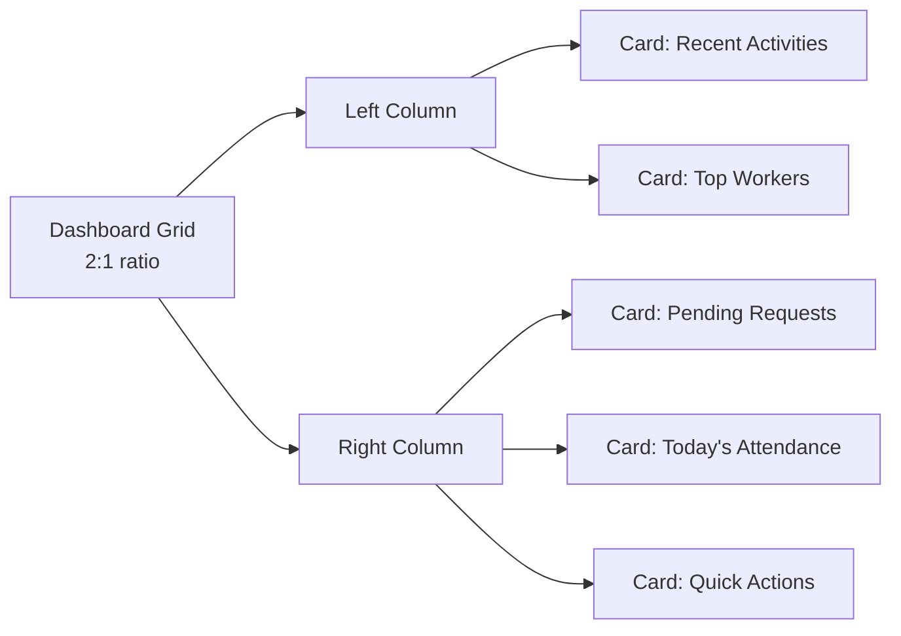

**Diagram sources**
- [dashboard.html:164-293](file://dashboard.html#L164-L293)
- [style.css:1303-1313](file://style.css#L1303-L1313)

**Section sources**
- [dashboard.html:164-293](file://dashboard.html#L164-L293)
- [style.css:1303-1313](file://style.css#L1303-L1313)

### Role-Specific Navigation Menus
- Admin dashboard: comprehensive menu covering workers, attendance, performance, projects, tasks, overtime, advances, salary, penalties, targets, permissions, shift changes, documents, safety, and reports
- Worker dashboard: focused on personal performance, tasks, projects, overtime, advances, salary, targets, permissions, documents, and shift changes
- Seller dashboard: streamlined menu for materials, sales, orders, and reports

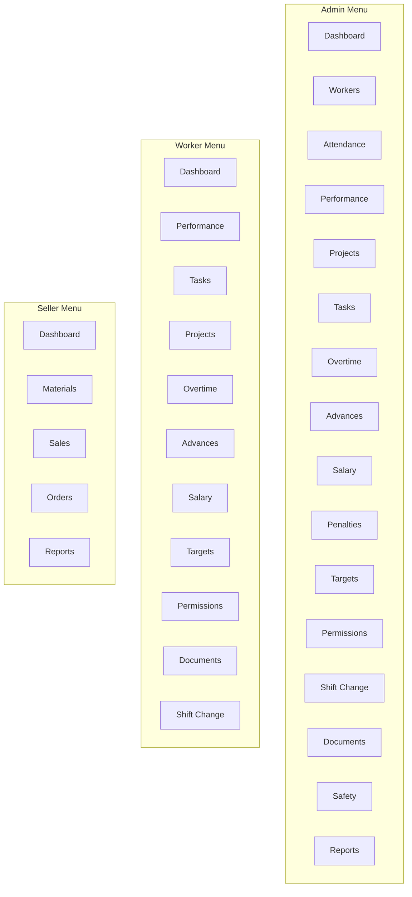

**Diagram sources**
- [dashboard.html:22-87](file://dashboard.html#L22-L87)
- [worker-dashboard.html:22-67](file://worker-dashboard.html#L22-L67)
- [seller-dashboard.html:22-43](file://seller-dashboard.html#L22-L43)

**Section sources**
- [dashboard.html:22-87](file://dashboard.html#L22-L87)
- [worker-dashboard.html:22-67](file://worker-dashboard.html#L22-L67)
- [seller-dashboard.html:22-43](file://seller-dashboard.html#L22-L43)

## Dependency Analysis
The dashboards depend on shared utilities and styles:
- All dashboards import auth.js and app.js
- Style.css defines layout, responsive breakpoints, and theming
- Each dashboard enforces authentication checks and role-based routing

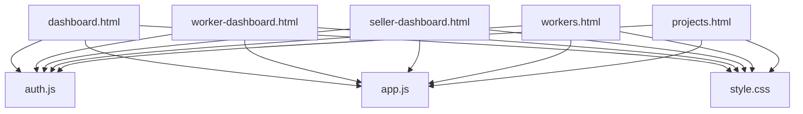

**Diagram sources**
- [dashboard.html:298-299](file://dashboard.html#L298-L299)
- [worker-dashboard.html:289-290](file://worker-dashboard.html#L289-L290)
- [seller-dashboard.html:296-297](file://seller-dashboard.html#L296-L297)
- [workers.html:339-340](file://workers.html#L339-L340)
- [projects.html:175-176](file://projects.html#L175-L176)

**Section sources**
- [dashboard.html:298-299](file://dashboard.html#L298-L299)
- [worker-dashboard.html:289-290](file://worker-dashboard.html#L289-L290)
- [seller-dashboard.html:296-297](file://seller-dashboard.html#L296-L297)
- [workers.html:339-340](file://workers.html#L339-L340)
- [projects.html:175-176](file://projects.html#L175-L176)

## Performance Considerations
- CSS Grid and Flexbox layouts minimize reflows and improve rendering performance
- Transform-based sidebar toggle avoids layout thrashing
- localStorage-based theme persistence reduces server round trips
- Debounced and throttled utilities (app.js) help manage frequent events
- Card-based widgets keep DOM manageable and improve perceived performance

## Troubleshooting Guide
Common issues and resolutions:
- Authentication failures: verify localStorage contains a currentUser entry; ensure checkAuth executes on page load
- Theme not persisting: confirm localStorage key exists and icon classes are swapped correctly
- Sidebar not toggling: check for active class on sidebar and overlay; ensure click handlers are attached
- Search not filtering: verify selector correctness and that initSearch is called with proper parameters
- Modals not closing: ensure modal close handlers remove active class and reset body overflow

**Section sources**
- [auth.js:56-88](file://auth.js#L56-L88)
- [app.js:70-94](file://app.js#L70-L94)
- [app.js:147-152](file://app.js#L147-L152)
- [app.js:175-196](file://app.js#L175-L196)
- [app.js:130-144](file://app.js#L130-L144)

## Conclusion
The dashboard navigation and layout system provides a consistent, responsive, and role-aware user interface across three distinct dashboards. The shared layout engine, combined with robust authentication routing, theme management, and utility functions, delivers a cohesive experience while allowing each role to focus on relevant features. The grid-based card system and sidebar navigation patterns ensure scalability and maintainability as new features are added.