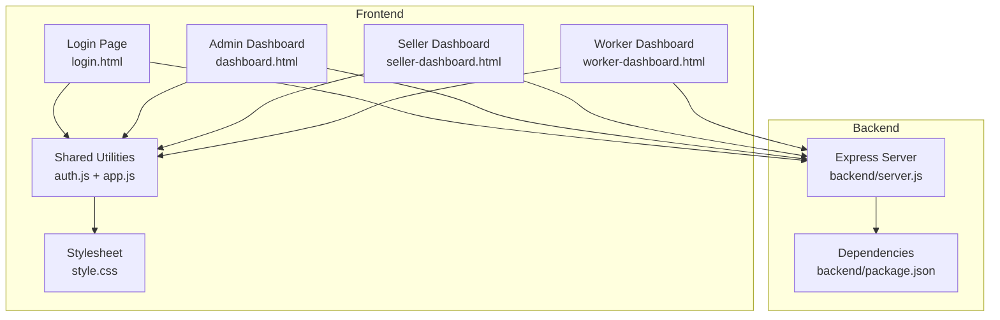
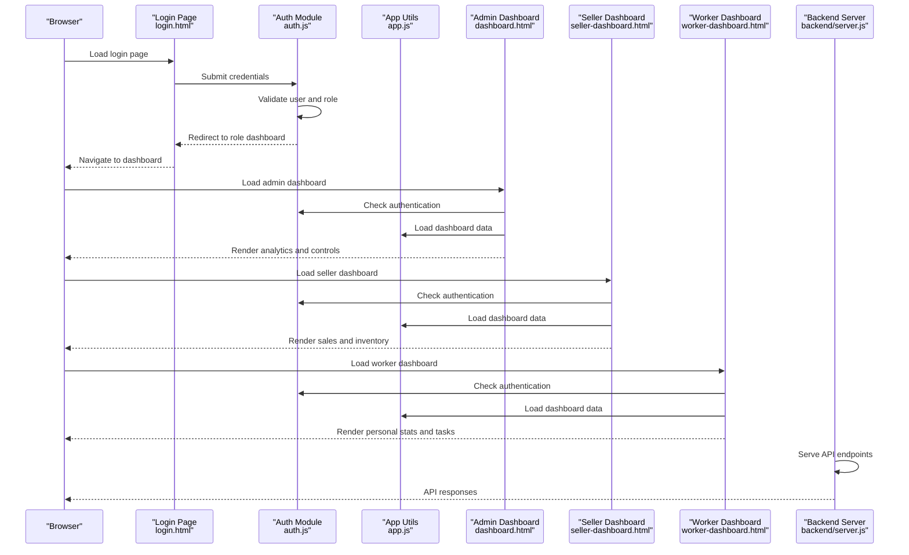
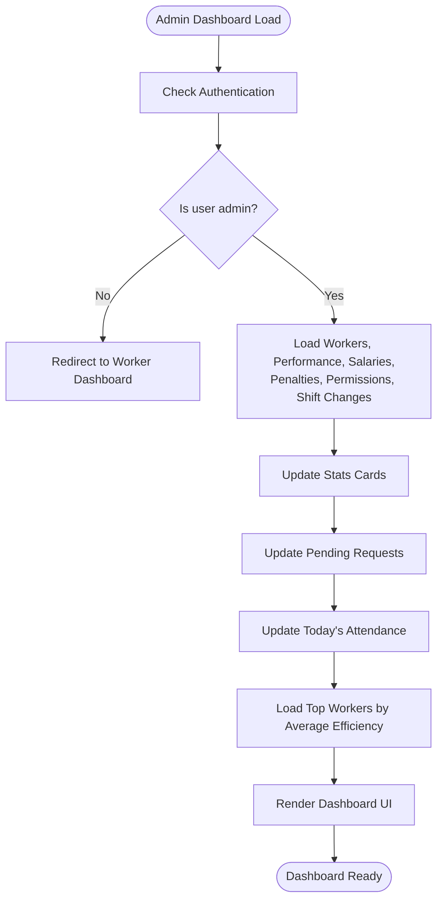
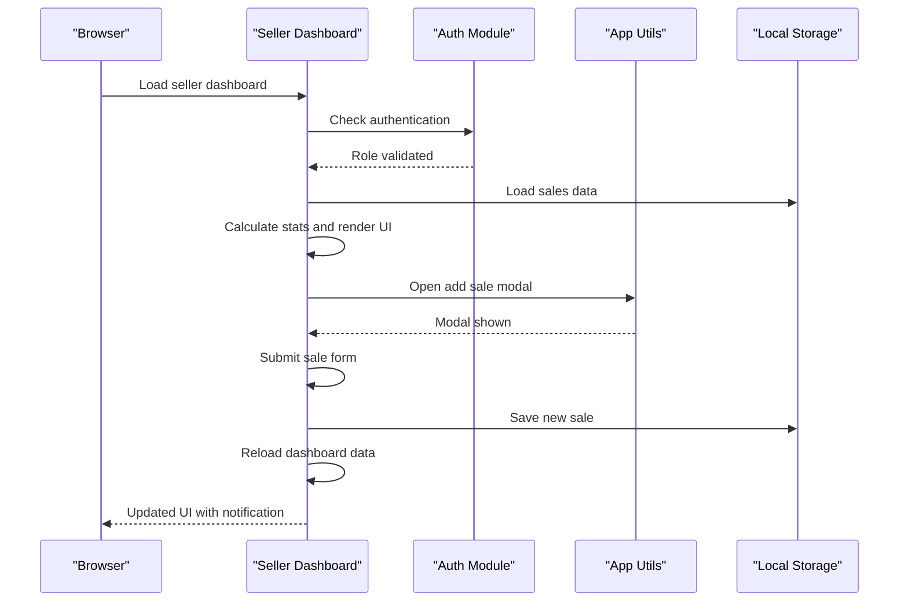
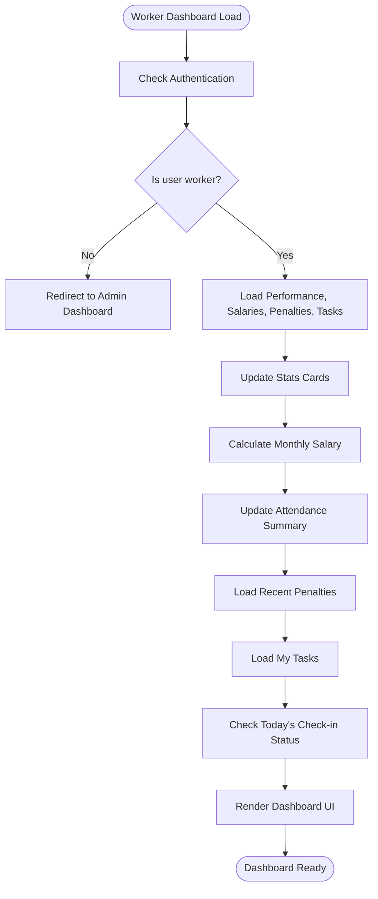
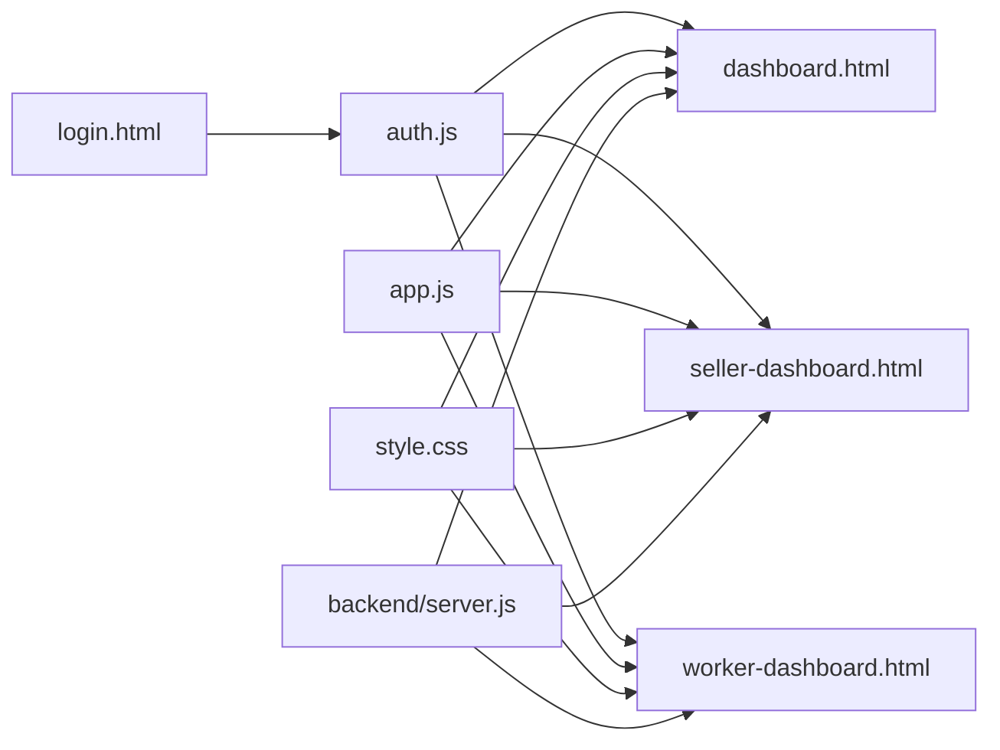

# Dashboard System

<cite>
**Referenced Files in This Document**
- [dashboard.html](file://dashboard.html)
- [seller-dashboard.html](file://seller-dashboard.html)
- [worker-dashboard.html](file://worker-dashboard.html)
- [auth.js](file://auth.js)
- [app.js](file://app.js)
- [style.css](file://style.css)
- [login.html](file://login.html)
- [backend/server.js](file://backend/server.js)
- [backend/package.json](file://backend/package.json)
</cite>

## Table of Contents
1. [Introduction](#introduction)
2. [Project Structure](#project-structure)
3. [Core Components](#core-components)
4. [Architecture Overview](#architecture-overview)
5. [Detailed Component Analysis](#detailed-component-analysis)
6. [Dependency Analysis](#dependency-analysis)
7. [Performance Considerations](#performance-considerations)
8. [Troubleshooting Guide](#troubleshooting-guide)
9. [Conclusion](#conclusion)
10. [Appendices](#appendices)

## Introduction
This document provides comprehensive documentation for the dashboard system, covering role-specific interfaces for Admin, Seller, and Worker dashboards. It explains system analytics, administrative controls, sales and inventory management, personal statistics, current month salary calculations, task assignments, navigation patterns, dashboard layout, notification systems, and responsive design implementation. The system uses local storage for data persistence during development and includes a production-ready backend server with Express.js and MongoDB.

## Project Structure
The dashboard system consists of three primary HTML pages for each role, shared JavaScript utilities for authentication and common UI behaviors, and a centralized stylesheet for responsive design and styling. A backend server is included for production deployment and API integration.

**Diagram sources**
- [login.html:1-169](file://login.html#L1-L169)
- [dashboard.html:1-381](file://dashboard.html#L1-L381)
- [seller-dashboard.html:1-441](file://seller-dashboard.html#L1-L441)
- [worker-dashboard.html:1-568](file://worker-dashboard.html#L1-L568)
- [auth.js:1-213](file://auth.js#L1-L213)
- [app.js:1-412](file://app.js#L1-L412)
- [style.css:1-2177](file://style.css#L1-L2177)
- [backend/server.js:1-184](file://backend/server.js#L1-L184)
- [backend/package.json:1-47](file://backend/package.json#L1-L47)

**Section sources**
- [login.html:1-169](file://login.html#L1-L169)
- [dashboard.html:1-381](file://dashboard.html#L1-L381)
- [seller-dashboard.html:1-441](file://seller-dashboard.html#L1-L441)
- [worker-dashboard.html:1-568](file://worker-dashboard.html#L1-L568)
- [auth.js:1-213](file://auth.js#L1-L213)
- [app.js:1-412](file://app.js#L1-L412)
- [style.css:1-2177](file://style.css#L1-L2177)
- [backend/server.js:1-184](file://backend/server.js#L1-L184)
- [backend/package.json:1-47](file://backend/package.json#L1-L47)

## Core Components
- Role-based dashboards:
  - Admin Dashboard: Analytics, pending requests overview, administrative controls.
  - Seller Dashboard: Sales management, inventory control, quick actions.
  - Worker Dashboard: Personal statistics, current month salary, task assignments.
- Shared utilities:
  - Authentication module handles login/logout and user session management.
  - Common application module provides UI helpers, modals, tabs, search, sorting, and animations.
- Styling and responsiveness:
  - Centralized CSS with responsive breakpoints for desktop, tablet, and mobile.
  - Dashboard grid layout adapts to screen size.
- Backend server:
  - Express server with security middleware, CORS, rate limiting, logging, and modular routes.

**Section sources**
- [dashboard.html:1-381](file://dashboard.html#L1-L381)
- [seller-dashboard.html:1-441](file://seller-dashboard.html#L1-L441)
- [worker-dashboard.html:1-568](file://worker-dashboard.html#L1-L568)
- [auth.js:1-213](file://auth.js#L1-L213)
- [app.js:1-412](file://app.js#L1-L412)
- [style.css:1220-1313](file://style.css#L1220-L1313)
- [backend/server.js:1-184](file://backend/server.js#L1-L184)

## Architecture Overview
The system follows a client-side role routing model with local storage for demo data and a production-ready backend server. Dashboards are rendered with Bootstrap Icons and styled via a centralized stylesheet. The backend exposes RESTful endpoints for various modules and integrates Socket.IO for real-time capabilities.

**Diagram sources**
- [login.html:1-169](file://login.html#L1-L169)
- [auth.js:55-127](file://auth.js#L55-L127)
- [dashboard.html:273-379](file://dashboard.html#L273-L379)
- [seller-dashboard.html:298-438](file://seller-dashboard.html#L298-L438)
- [worker-dashboard.html:291-555](file://worker-dashboard.html#L291-L555)
- [backend/server.js:95-119](file://backend/server.js#L95-L119)

## Detailed Component Analysis

### Admin Dashboard
The Admin Dashboard provides system-wide analytics, pending requests overview, administrative controls, and quick actions. It displays:
- Stats cards for total workers, active workers, total bonuses, and total penalties.
- Recent activities and top workers with performance metrics.
- Pending requests for permissions and shift changes.
- Today’s attendance summary.
- Quick actions for adding workers, creating tasks, and calculating salaries.

Key implementation details:
- Authentication guard ensures only admins access the dashboard.
- Data aggregation from local storage for performance, salaries, penalties, permissions, and shift changes.
- Dynamic rendering of top workers based on average efficiency.
- Real-time-like updates via DOM manipulation on page load.

**Diagram sources**
- [dashboard.html:273-379](file://dashboard.html#L273-L379)
- [auth.js:55-63](file://auth.js#L55-L63)

**Section sources**
- [dashboard.html:1-381](file://dashboard.html#L1-L381)
- [auth.js:55-63](file://auth.js#L55-L63)

### Seller Dashboard
The Seller Dashboard focuses on sales management and inventory control. It includes:
- Stats cards for today’s sales, total orders, materials, and monthly sales.
- Recent sales table with status badges.
- Low stock materials section.
- Quick actions for adding sales, viewing materials, managing orders, and accessing sales reports.
- Modal for adding new sales with dynamic total calculation.

Key implementation details:
- Authentication guard redirects non-sellers to login.
- Demo data initialization for sales in local storage.
- Form validation and submission handling for new sales.
- Notification system for user feedback.

**Diagram sources**
- [seller-dashboard.html:298-438](file://seller-dashboard.html#L298-L438)
- [auth.js:299-303](file://auth.js#L299-L303)
- [app.js:129-152](file://app.js#L129-L152)

**Section sources**
- [seller-dashboard.html:1-441](file://seller-dashboard.html#L1-L441)
- [auth.js:299-303](file://auth.js#L299-L303)
- [app.js:129-152](file://app.js#L129-L152)

### Worker Dashboard
The Worker Dashboard presents personal statistics, current month salary calculation, attendance summary, and task assignments. It features:
- Welcome card with avatar and current date.
- Stats cards for today’s salary, total bonuses, total penalties, and workdays in the current month.
- Monthly salary calculation breakdown with base salary, bonus, penalty, and total.
- Attendance summary for present, late, absent, and excused days.
- Recent penalties table and “My Tasks” list.
- Quick actions for requesting permissions and shift changes.
- Check-in/out functionality with status indicators.

Key implementation details:
- Authentication guard redirects non-workers to admin dashboard.
- Data filtering by current worker ID for performance, salaries, penalties, and tasks.
- Current month salary computation based on daily salary and workdays.
- Attendance status detection and UI updates for check-in/check-out buttons.
- Notification system for user feedback.

**Diagram sources**
- [worker-dashboard.html:291-555](file://worker-dashboard.html#L291-L555)
- [auth.js:292-296](file://auth.js#L292-L296)

**Section sources**
- [worker-dashboard.html:1-568](file://worker-dashboard.html#L1-L568)
- [auth.js:292-296](file://auth.js#L292-L296)

### Navigation Patterns and Layout
- Sidebar navigation with role-specific items and active state highlighting.
- Topbar with search, theme toggle, and user profile actions.
- Dashboard grid layout with two-column structure on larger screens and single-column on smaller screens.
- Mobile menu toggle for sidebar accessibility on tablets and phones.

Responsive behavior:
- Sidebar transforms off-screen on tablets and phones with a mobile menu button.
- Stats grid switches to a single column on smaller screens.
- Topbar stacks vertically on smaller screens.
- Forms adjust layout for better mobile usability.

**Section sources**
- [style.css:1220-1313](file://style.css#L1220-L1313)
- [style.css:1291-1300](file://style.css#L1291-L1300)
- [style.css:1302-1313](file://style.css#L1302-L1313)

### Notification Systems
The system includes a flexible notification mechanism:
- Inline notifications with icons and types (success, info, warning).
- Toast-style notifications with slide-in/slide-out animations.
- Auto-dismiss functionality after a delay.
- Utility functions for creating and removing notifications dynamically.

**Section sources**
- [app.js:507-548](file://app.js#L507-L548)
- [style.css:1970-2015](file://style.css#L1970-L2015)

### Real-time Data Updates
While the frontend primarily uses local storage for demo data, the backend server is designed for real-time capabilities:
- Socket.IO integration for live updates and notifications.
- Modular route structure supporting real-time features.
- Production-grade middleware for security and performance.

**Section sources**
- [backend/server.js:27-29](file://backend/server.js#L27-L29)
- [backend/server.js:95-119](file://backend/server.js#L95-L119)

### Responsive Design Implementation
The stylesheet defines comprehensive responsive breakpoints:
- Desktop: Full sidebar, two-column dashboard grid.
- Tablet: Sidebar slides in/out, dashboard grid becomes single column.
- Mobile: Stacked topbar, simplified navigation, and adaptive forms.

Additional responsive features:
- Stats grid adjusts to single column on smaller screens.
- Attendance summary and other components adapt to available space.
- Print styles optimize content for printing.

**Section sources**
- [style.css:1220-1289](file://style.css#L1220-L1289)
- [style.css:1291-1313](file://style.css#L1291-L1313)
- [style.css:2160-2177](file://style.css#L2160-L2177)

### Usage Examples
- Admin:
  - Access the Admin Dashboard after logging in with admin credentials.
  - Review system analytics, approve pending requests, and manage administrative tasks.
- Seller:
  - Log in as a seller and navigate to the Seller Dashboard.
  - Add new sales via the modal, monitor low stock materials, and track monthly sales.
- Worker:
  - Log in as a worker and view personal statistics and current month salary.
  - Check in/out for attendance, view recent penalties, and manage assigned tasks.

**Section sources**
- [login.html:100-125](file://login.html#L100-L125)
- [auth.js:66-82](file://auth.js#L66-L82)
- [dashboard.html:273-379](file://dashboard.html#L273-L379)
- [seller-dashboard.html:298-438](file://seller-dashboard.html#L298-L438)
- [worker-dashboard.html:291-555](file://worker-dashboard.html#L291-L555)

### Data Visualization Components
The dashboards incorporate several visualization elements:
- Stats cards with icons and formatted values.
- Progress bars for performance metrics.
- Attendance summaries with colored indicators.
- Salary calculation breakdowns.
- Recent penalties and task lists with status badges.
- Charts for efficiency bars and progress cells.

These components enhance user comprehension of key metrics and improve decision-making.

**Section sources**
- [style.css:1341-1354](file://style.css#L1341-L1354)
- [style.css:1814-1861](file://style.css#L1814-L1861)
- [style.css:1862-1882](file://style.css#L1862-L1882)
- [style.css:1884-1912](file://style.css#L1884-L1912)

## Dependency Analysis
The frontend relies on shared utilities and a centralized stylesheet. The backend provides a robust foundation for API integration and real-time features.

**Diagram sources**
- [auth.js:1-213](file://auth.js#L1-L213)
- [app.js:1-412](file://app.js#L1-L412)
- [style.css:1-2177](file://style.css#L1-L2177)
- [login.html:1-169](file://login.html#L1-L169)
- [backend/server.js:1-184](file://backend/server.js#L1-L184)

**Section sources**
- [auth.js:1-213](file://auth.js#L1-L213)
- [app.js:1-412](file://app.js#L1-L412)
- [style.css:1-2177](file://style.css#L1-L2177)
- [login.html:1-169](file://login.html#L1-L169)
- [backend/server.js:1-184](file://backend/server.js#L1-L184)

## Performance Considerations
- Local storage usage: Efficient for demo scenarios but may require server-side persistence for production.
- DOM manipulation: Batched updates on page load reduce reflows.
- CSS animations: Lightweight transitions improve UX without heavy computations.
- Responsive design: Media queries minimize layout thrashing on viewport changes.
- Backend scalability: Express server with middleware supports production deployment.

[No sources needed since this section provides general guidance]

## Troubleshooting Guide
Common issues and resolutions:
- Authentication failures:
  - Verify credentials and role selection on the login page.
  - Ensure demo users exist in local storage initialization.
- Dashboard not loading:
  - Check console for errors related to missing data or authentication checks.
  - Confirm that localStorage keys for workers, tasks, performance, salaries, penalties, permissions, and shift changes are initialized.
- Modal not opening:
  - Ensure modal IDs match between HTML and JavaScript functions.
  - Verify that the modal overlay and close handlers are functioning.
- Notifications not appearing:
  - Check notification creation and removal logic.
  - Confirm CSS styles for notification positioning and animations.
- Responsive layout issues:
  - Inspect media query breakpoints and grid layouts.
  - Test on various screen sizes to ensure proper adaptation.

**Section sources**
- [auth.js:55-82](file://auth.js#L55-L82)
- [app.js:129-152](file://app.js#L129-L152)
- [app.js:507-548](file://app.js#L507-L548)
- [style.css:1220-1289](file://style.css#L1220-L1289)

## Conclusion
The dashboard system provides role-specific interfaces with comprehensive analytics, administrative controls, sales management, and personal statistics. The responsive design ensures usability across devices, while the shared utilities and centralized styling promote maintainability. The backend server offers a scalable foundation for production deployment and real-time features.

[No sources needed since this section summarizes without analyzing specific files]

## Appendices
- Backend dependencies include Express, Mongoose, Socket.IO, Helmet, rate limiting, compression, and logging utilities.
- API endpoints are organized by functional modules and include health checks and documentation endpoints.

**Section sources**
- [backend/package.json:11-32](file://backend/package.json#L11-L32)
- [backend/server.js:95-151](file://backend/server.js#L95-L151)