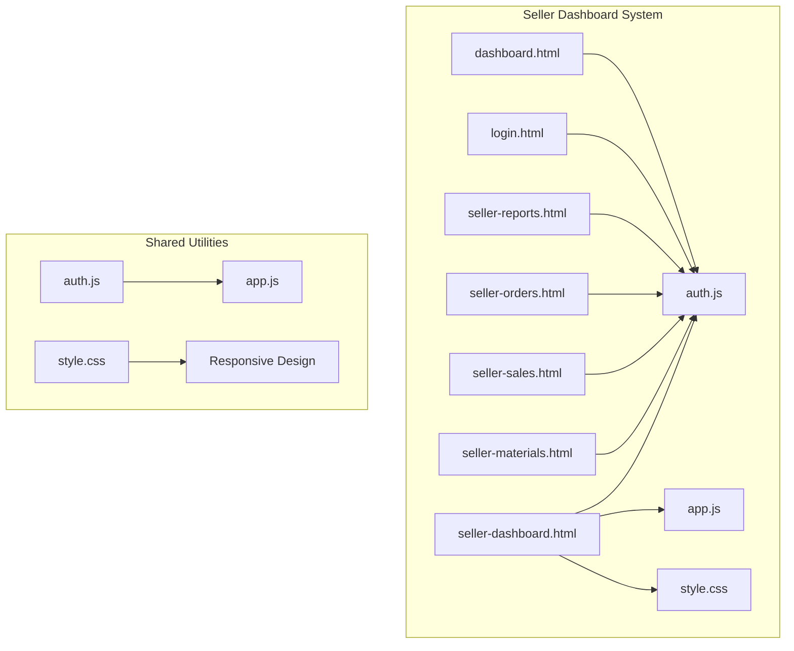
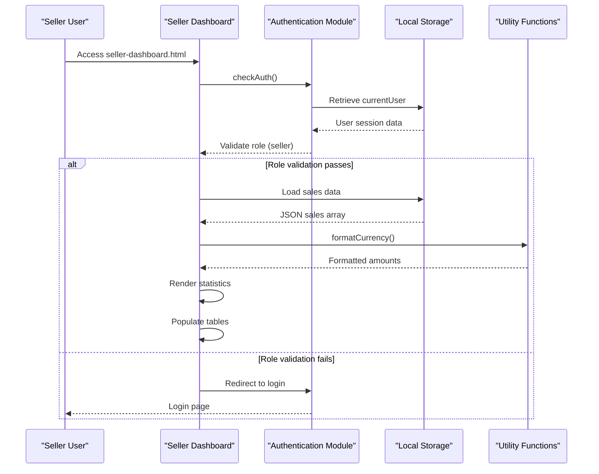
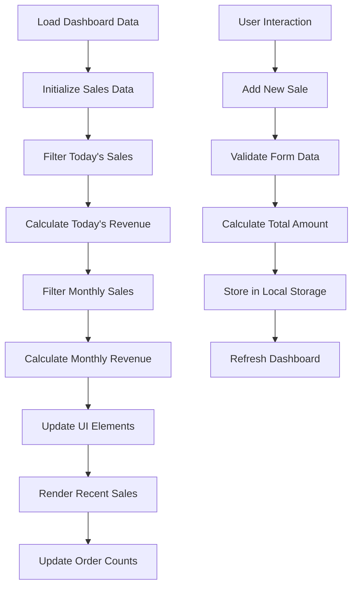
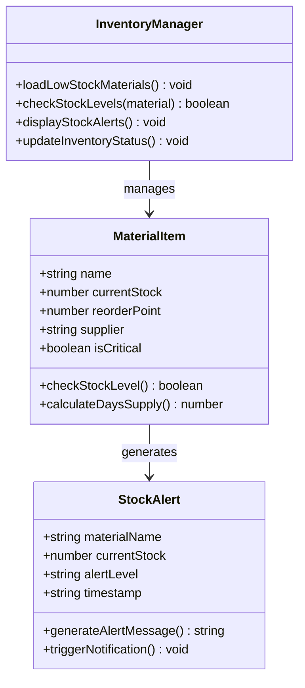
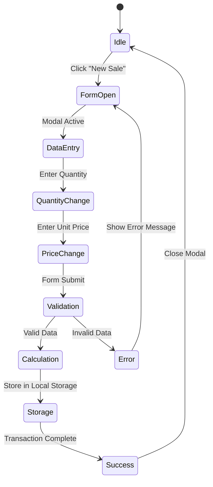
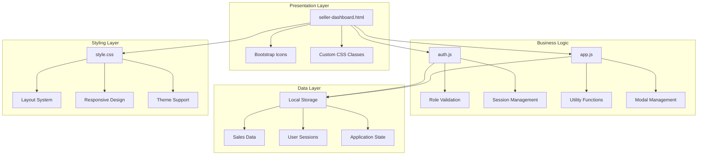

# Seller Dashboard

<cite>
**Referenced Files in This Document**
- [seller-dashboard.html](file://seller-dashboard.html)
- [auth.js](file://auth.js)
- [app.js](file://app.js)
- [style.css](file://style.css)
- [reports.html](file://reports.html)
</cite>

## Table of Contents
1. [Introduction](#introduction)
2. [Project Structure](#project-structure)
3. [Core Components](#core-components)
4. [Architecture Overview](#architecture-overview)
5. [Detailed Component Analysis](#detailed-component-analysis)
6. [Dependency Analysis](#dependency-analysis)
7. [Performance Considerations](#performance-considerations)
8. [Troubleshooting Guide](#troubleshooting-guide)
9. [Conclusion](#conclusion)

## Introduction
The Seller Dashboard is a specialized administrative interface designed for sales representatives within the 555 İnşaat construction management system. This dashboard optimizes the sales workflow by providing real-time visibility into sales performance, inventory status, and customer interactions. The interface is tailored specifically for sellers with role-based navigation, sales analytics, and inventory management controls that streamline day-to-day sales operations.

The dashboard implements a modern, responsive design that adapts seamlessly across desktop and mobile devices while maintaining focus on the core sales representative responsibilities. Built with vanilla JavaScript and Bootstrap Icons, the system provides immediate feedback through interactive elements and comprehensive data visualization.

## Project Structure
The Seller Dashboard follows a modular HTML/CSS/JavaScript architecture with centralized styling and shared utilities. The system consists of four primary components:

**Diagram sources**
- [seller-dashboard.html:1-441](file://seller-dashboard.html#L1-L441)
- [auth.js:1-213](file://auth.js#L1-L213)
- [app.js:1-412](file://app.js#L1-L412)
- [style.css:1-2177](file://style.css#L1-L2177)

The system employs a consistent layout pattern featuring a collapsible sidebar navigation, sticky topbar with theme controls, and responsive grid-based content areas. Each page maintains the same foundational structure while implementing role-specific functionality.

**Section sources**
- [seller-dashboard.html:10-239](file://seller-dashboard.html#L10-L239)
- [style.css:670-878](file://style.css#L670-L878)

## Core Components
The Seller Dashboard comprises several interconnected components that work together to provide a comprehensive sales management solution:

### Navigation System
The sidebar navigation provides role-specific access to all seller-related functionality. The active state is maintained through CSS classes and JavaScript, ensuring users always know their current location within the system.

### Statistics Dashboard
Four primary metric cards display key sales performance indicators:
- Today's Sales: Real-time revenue calculation for the current day
- Total Orders: Complete count of all sales transactions
- Available Materials: Current inventory status indicator
- Monthly Sales: Aggregate revenue for the current calendar month

### Recent Activity Panels
Dual-column layout featuring recent sales transactions and low-stock material alerts, providing immediate visibility into operational needs.

### Quick Action Center
Streamlined access to frequently used seller functions including new sale creation, material inventory management, order processing, and detailed reporting.

**Section sources**
- [seller-dashboard.html:80-236](file://seller-dashboard.html#L80-L236)
- [style.css:880-950](file://style.css#L880-L950)

## Architecture Overview
The Seller Dashboard implements a client-side architecture with local storage persistence and role-based access control:

**Diagram sources**
- [seller-dashboard.html:298-320](file://seller-dashboard.html#L298-L320)
- [auth.js:55-88](file://auth.js#L55-L88)
- [auth.js:173-179](file://auth.js#L173-L179)

The architecture emphasizes offline-first functionality through local storage, enabling sales representatives to access critical information without network connectivity. The design supports both online and offline scenarios through intelligent data caching and fallback mechanisms.

**Section sources**
- [auth.js:15-53](file://auth.js#L15-L53)
- [app.js:328-350](file://app.js#L328-L350)

## Detailed Component Analysis

### Sales Analytics Overview
The dashboard's central analytics panel provides comprehensive sales performance metrics through four strategically positioned statistic cards:

**Diagram sources**
- [seller-dashboard.html:322-349](file://seller-dashboard.html#L322-L349)
- [seller-dashboard.html:389-419](file://seller-dashboard.html#L389-L419)

The sales analytics system implements real-time calculations using JavaScript's filter and reduce methods to process sales data stored in browser local storage. Currency formatting ensures consistent presentation of financial data across all transactions.

### Inventory Tracking Interface
The inventory management component provides dual functionality through material listings and stock alert systems:

**Diagram sources**
- [seller-dashboard.html:151-165](file://seller-dashboard.html#L151-L165)
- [seller-dashboard.html:310-320](file://seller-dashboard.html#L310-L320)

The inventory interface leverages Bootstrap Icons for visual status indicators and implements color-coded alert systems to immediately highlight critical stock situations. The design accommodates both positive and negative states through appropriate iconography and color schemes.

### Product Management Capabilities
The product management system centers around a comprehensive modal form that enables sellers to create new sales transactions with real-time calculations:

**Diagram sources**
- [seller-dashboard.html:241-294](file://seller-dashboard.html#L241-L294)
- [seller-dashboard.html:389-419](file://seller-dashboard.html#L389-L419)

The product management interface implements dynamic pricing calculations that automatically update the total amount as users modify quantity or unit price inputs. The form validation ensures data integrity while providing immediate feedback for required fields.

### Customer Interaction Tools
The dashboard integrates multiple customer interaction mechanisms through quick action buttons and navigation links that streamline common sales representative workflows:

| Feature | Implementation | Purpose |
|---------|---------------|---------|
| Quick Actions | List group items with icons | Rapid access to frequently used functions |
| Recent Sales | Data table with status badges | Track transaction history and status |
| Material Alerts | Color-coded warning indicators | Highlight low-stock situations |
| Theme Toggle | Interactive button with icon switching | Enable dark/light mode preference |

**Section sources**
- [seller-dashboard.html:170-235](file://seller-dashboard.html#L170-L235)
- [style.css:1018-1051](file://style.css#L1018-L1051)

## Dependency Analysis
The Seller Dashboard system exhibits a well-structured dependency hierarchy with clear separation of concerns:

**Diagram sources**
- [seller-dashboard.html:296-297](file://seller-dashboard.html#L296-L297)
- [auth.js:55-88](file://auth.js#L55-L88)
- [app.js:129-144](file://app.js#L129-L144)

The dependency structure demonstrates loose coupling between presentation and business logic through centralized utility functions. The authentication module serves as a single point of access for user session management, while the application module provides shared functionality across all pages.

**Section sources**
- [auth.js:1-213](file://auth.js#L1-L213)
- [app.js:1-412](file://app.js#L1-L412)

## Performance Considerations
The Seller Dashboard is optimized for performance through several key strategies:

### Client-Side Optimization
- **Local Storage Usage**: All data persists locally, reducing server requests and improving response times
- **Lazy Loading**: Non-critical resources are loaded only when needed
- **Event Delegation**: Efficient event handling reduces memory footprint
- **CSS Optimization**: Minimal stylesheets with efficient selectors

### Memory Management
- **Modal Cleanup**: Proper removal of modal elements from DOM after use
- **Event Listener Cleanup**: Prevention of memory leaks through proper event handling
- **Data Serialization**: Efficient JSON serialization for localStorage operations

### Network Efficiency
- **Static Asset Delivery**: Bootstrap Icons served via CDN for global availability
- **Reduced Dependencies**: Minimal external libraries minimize bundle size
- **Caching Strategy**: Browser caching of static assets improves subsequent loads

**Section sources**
- [app.js:129-152](file://app.js#L129-L152)
- [auth.js:158-165](file://auth.js#L158-L165)

## Troubleshooting Guide
Common issues and their solutions within the Seller Dashboard system:

### Authentication Issues
**Problem**: Users redirected to login page despite valid credentials
**Solution**: Verify localStorage contains 'currentUser' key and role matches 'seller'

### Data Persistence Problems
**Problem**: Sales data not persisting between sessions
**Solution**: Check browser localStorage capacity and clear corrupted entries

### UI Responsiveness Issues
**Problem**: Dashboard elements not displaying properly on mobile devices
**Solution**: Verify viewport meta tag and responsive CSS media queries

### Performance Degradation
**Problem**: Slow loading times with large datasets
**Solution**: Implement pagination for sales tables and optimize localStorage queries

**Section sources**
- [auth.js:55-88](file://auth.js#L55-L88)
- [app.js:96-105](file://app.js#L96-L105)
- [style.css:1220-1289](file://style.css#L1220-L1289)

## Conclusion
The Seller Dashboard represents a comprehensive solution for sales representatives within the 555 İnşaat ecosystem. Through its role-based architecture, real-time analytics, and responsive design, the system effectively streamlines sales operations while maintaining accessibility across various device types.

The implementation demonstrates best practices in client-side development through strategic use of local storage, efficient DOM manipulation, and modular JavaScript architecture. The dashboard successfully balances functionality with usability, providing sales representatives with immediate access to critical business metrics and operational controls.

Future enhancements could include server synchronization capabilities, advanced reporting features, and integration with external inventory management systems. The current foundation provides a solid platform for extending functionality while maintaining the responsive, user-focused design philosophy that defines the Seller Dashboard experience.