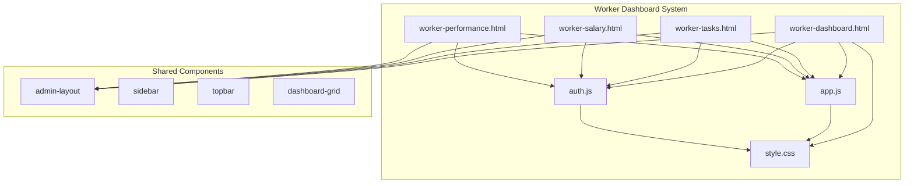
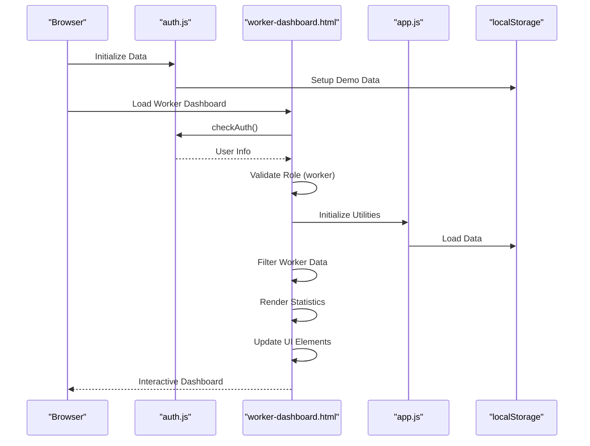
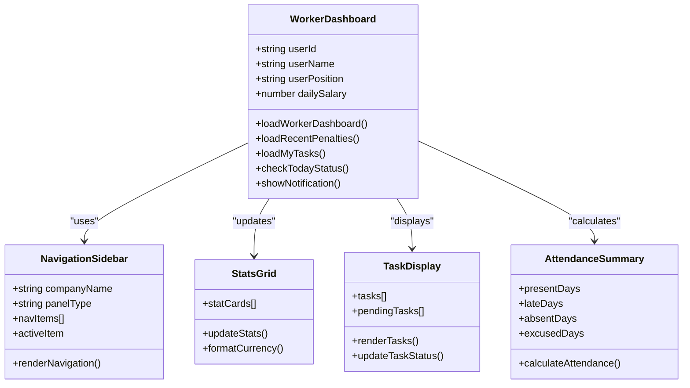
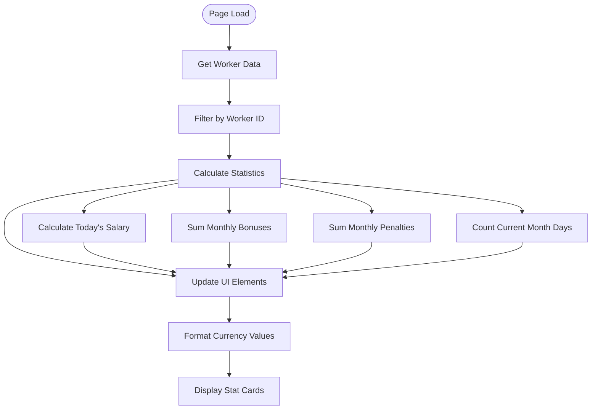
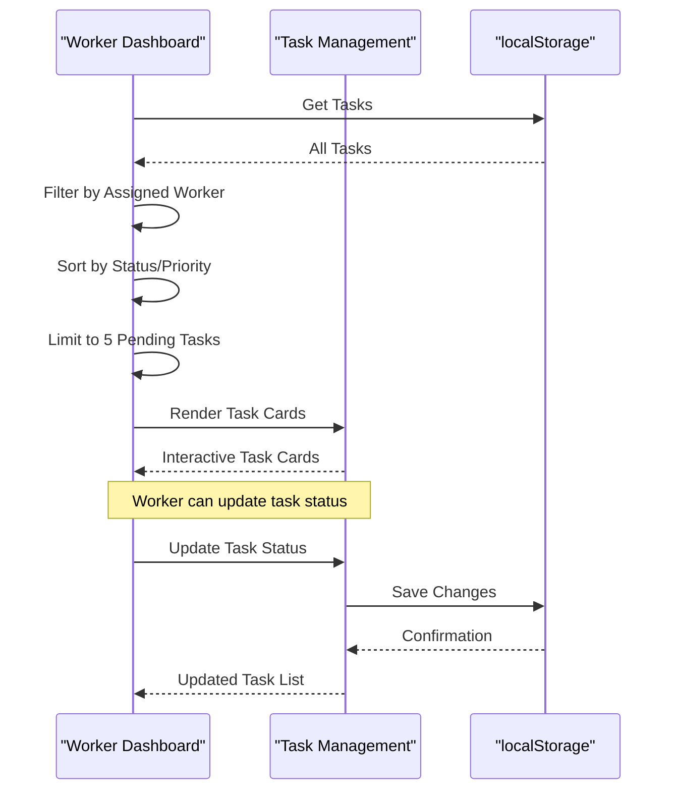
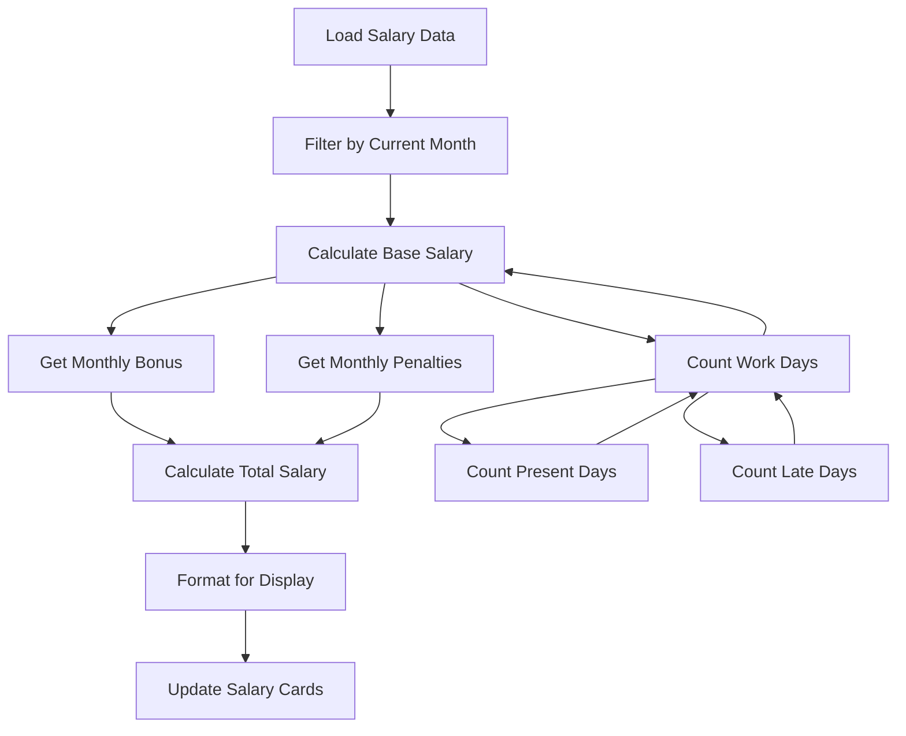
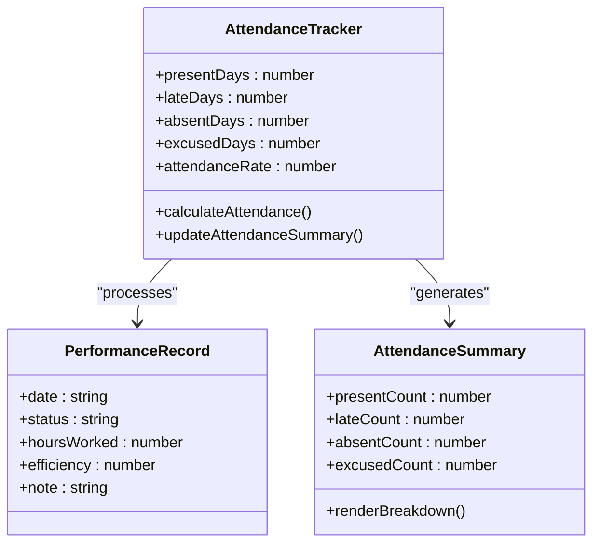
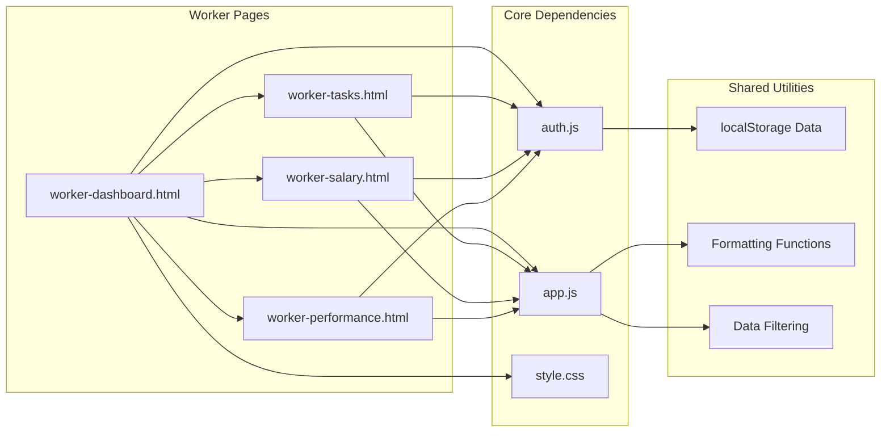

# Worker Dashboard

<cite>
**Referenced Files in This Document**
- [worker-dashboard.html](file://worker-dashboard.html)
- [dashboard.html](file://dashboard.html)
- [app.js](file://app.js)
- [auth.js](file://auth.js)
- [style.css](file://style.css)
- [worker-tasks.html](file://worker-tasks.html)
- [worker-salary.html](file://worker-salary.html)
- [worker-performance.html](file://worker-performance.html)
</cite>

## Table of Contents
1. [Introduction](#introduction)
2. [Project Structure](#project-structure)
3. [Core Components](#core-components)
4. [Architecture Overview](#architecture-overview)
5. [Detailed Component Analysis](#detailed-component-analysis)
6. [Dependency Analysis](#dependency-analysis)
7. [Performance Considerations](#performance-considerations)
8. [Troubleshooting Guide](#troubleshooting-guide)
9. [Conclusion](#conclusion)

## Introduction
The Worker Dashboard is a specialized interface designed for individual construction workers within the 555 İnşaat project management system. It provides a personalized workspace focused on worker-specific information, including personal statistics, current month salary summaries, task assignments, attendance tracking, and quick action shortcuts. The dashboard is optimized for both desktop and mobile viewing, with a clean, responsive layout that emphasizes worker-centric data presentation.

The dashboard implements role-based access control, ensuring that only workers can access their personalized views while maintaining clear navigation to related worker-specific pages such as performance tracking, task management, and salary details.

## Project Structure
The Worker Dashboard is built as a standalone HTML application with integrated JavaScript functionality and CSS styling. The system follows a modular architecture with separate files for authentication, shared utilities, and worker-specific pages.

**Diagram sources**
- [worker-dashboard.html:1-568](file://worker-dashboard.html#L1-L568)
- [app.js:1-412](file://app.js#L1-L412)
- [auth.js:1-213](file://auth.js#L1-L213)
- [style.css:670-1200](file://style.css#L670-L1200)

**Section sources**
- [worker-dashboard.html:1-568](file://worker-dashboard.html#L1-L568)
- [app.js:1-412](file://app.js#L1-L412)
- [auth.js:1-213](file://auth.js#L1-L213)
- [style.css:670-1200](file://style.css#L670-L1200)

## Core Components
The Worker Dashboard consists of several key components that work together to provide a comprehensive worker experience:

### Authentication and Role Management
The system implements role-based access control through the authentication module, which manages user sessions and redirects based on user roles. The worker dashboard specifically checks for the 'worker' role and restricts access to unauthorized users.

### Personal Navigation System
The dashboard features a comprehensive sidebar navigation tailored specifically for workers, including links to:
- Dashboard overview
- Performance tracking
- Task management
- Project assignments
- Overtime requests
- Advances and salary details
- Permissions and leave requests
- Documents and shift changes

### Personal Statistics Overview
The dashboard presents four key statistical cards showing:
- Today's salary amount
- Total bonuses earned
- Total penalties incurred
- Work days in the current month

### Current Month Salary Summary
A dedicated salary calculation section displays:
- Base salary calculation based on daily wage and work days
- Monthly bonus additions
- Penalty deductions
- Final monthly salary total

### Task Assignment Display
The dashboard includes a "My Tasks" section showing up to five pending tasks, with status indicators and quick access to the full task management system.

### Attendance History
A monthly attendance summary displays counts for:
- Present days
- Late days
- Absent days
- Excused days

### Quick Action System
Shortcuts for common worker actions include:
- Leave request submission
- Shift change requests
- Performance monitoring
- Document access

**Section sources**
- [worker-dashboard.html:13-67](file://worker-dashboard.html#L13-L67)
- [worker-dashboard.html:118-156](file://worker-dashboard.html#L118-L156)
- [worker-dashboard.html:161-186](file://worker-dashboard.html#L161-L186)
- [worker-dashboard.html:245-259](file://worker-dashboard.html#L245-L259)
- [worker-dashboard.html:206-243](file://worker-dashboard.html#L206-L243)

## Architecture Overview
The Worker Dashboard follows a client-side architecture pattern with local data storage and dynamic content rendering. The system uses localStorage for data persistence and implements a modular JavaScript structure for functionality.

**Diagram sources**
- [auth.js:15-53](file://auth.js#L15-L53)
- [auth.js:55-82](file://auth.js#L55-L82)
- [worker-dashboard.html:291-315](file://worker-dashboard.html#L291-L315)
- [app.js:7-19](file://app.js#L7-L19)

The architecture ensures that worker data remains isolated and secure, with each worker only accessing their own information through proper authentication and filtering mechanisms.

**Section sources**
- [auth.js:15-53](file://auth.js#L15-L53)
- [auth.js:55-82](file://auth.js#L55-L82)
- [worker-dashboard.html:291-370](file://worker-dashboard.html#L291-L370)

## Detailed Component Analysis

### Worker Dashboard Layout and Navigation
The dashboard implements a responsive admin layout with a fixed sidebar and main content area. The layout adapts to different screen sizes through CSS media queries and maintains consistent navigation across all worker-specific pages.

**Diagram sources**
- [worker-dashboard.html:317-440](file://worker-dashboard.html#L317-L440)
- [worker-dashboard.html:118-284](file://worker-dashboard.html#L118-L284)

The navigation system provides clear access to all worker-specific functionality while maintaining a consistent visual identity across pages.

**Section sources**
- [worker-dashboard.html:118-284](file://worker-dashboard.html#L118-L284)
- [style.css:670-805](file://style.css#L670-L805)

### Personal Statistics and Data Presentation
The dashboard employs a card-based statistics system that presents key worker metrics in an easily digestible format. Each stat card includes an icon, label, and formatted value with appropriate styling for different metric types.

**Diagram sources**
- [worker-dashboard.html:317-370](file://worker-dashboard.html#L317-L370)
- [auth.js:193-213](file://auth.js#L193-L213)

The statistics system provides immediate visibility into worker performance and financial status, enabling quick decision-making and progress tracking.

**Section sources**
- [worker-dashboard.html:317-370](file://worker-dashboard.html#L317-L370)
- [auth.js:193-213](file://auth.js#L193-L213)

### Task Assignment Management
The task assignment display system filters tasks based on the currently logged-in worker and presents them in a card-based layout with status indicators and priority badges.

**Diagram sources**
- [worker-dashboard.html:411-440](file://worker-dashboard.html#L411-L440)
- [worker-tasks.html:183-272](file://worker-tasks.html#L183-L272)

The task management system integrates seamlessly with the dashboard, providing workers with immediate access to their assignments and the ability to update task statuses.

**Section sources**
- [worker-dashboard.html:411-440](file://worker-dashboard.html#L411-L440)
- [worker-tasks.html:183-356](file://worker-tasks.html#L183-L356)

### Salary Calculation and Visualization
The salary system provides comprehensive monthly salary calculations with detailed breakdowns of base pay, bonuses, penalties, and final totals. The system calculates salary based on daily wage multiplied by work days, with additional bonus and penalty adjustments.

**Diagram sources**
- [worker-dashboard.html:348-358](file://worker-dashboard.html#L348-L358)
- [worker-salary.html:272-336](file://worker-salary.html#L272-L336)

The salary visualization system provides clear transparency into earnings calculations and enables workers to track their financial progress over time.

**Section sources**
- [worker-dashboard.html:348-358](file://worker-dashboard.html#L348-L358)
- [worker-salary.html:272-366](file://worker-salary.html#L272-L366)

### Attendance Tracking and Monitoring
The attendance system tracks worker presence with detailed categorization including present, late, absent, and excused days. The system provides both summary statistics and detailed historical records.

**Diagram sources**
- [worker-dashboard.html:359-364](file://worker-dashboard.html#L359-L364)
- [worker-performance.html:269-330](file://worker-performance.html#L269-L330)

The attendance tracking system provides comprehensive oversight of worker participation patterns and enables performance analysis over time.

**Section sources**
- [worker-dashboard.html:359-364](file://worker-dashboard.html#L359-L364)
- [worker-performance.html:269-398](file://worker-performance.html#L269-L398)

## Dependency Analysis
The Worker Dashboard system exhibits a well-structured dependency hierarchy with clear separation of concerns and minimal coupling between components.

**Diagram sources**
- [auth.js:129-165](file://auth.js#L129-L165)
- [app.js:129-165](file://app.js#L129-L165)
- [worker-dashboard.html:289-290](file://worker-dashboard.html#L289-L290)

The dependency structure ensures that authentication and utility functions remain centralized while allowing each page to focus on its specific functionality. This design promotes maintainability and reduces code duplication across worker-specific pages.

**Section sources**
- [auth.js:129-165](file://auth.js#L129-L165)
- [app.js:129-165](file://app.js#L129-L165)
- [worker-dashboard.html:289-290](file://worker-dashboard.html#L289-L290)

## Performance Considerations
The Worker Dashboard is designed with performance optimization in mind, utilizing client-side data filtering and efficient DOM manipulation techniques.

### Data Filtering Performance
The system implements efficient data filtering using JavaScript array methods with O(n) complexity for worker-specific data retrieval. The filtering process occurs client-side using localStorage data, minimizing server requests and improving response times.

### Memory Management
The dashboard employs lazy loading techniques for dynamic content, rendering only necessary elements and updating them efficiently when data changes. The use of template literals for HTML generation reduces DOM manipulation overhead.

### Responsive Design Optimization
The CSS-based responsive design minimizes JavaScript dependencies for layout changes, relying on media queries and flexible grid systems that adapt automatically to different screen sizes.

### Caching Strategies
The system utilizes localStorage for data persistence, eliminating repeated network requests for the same dataset. Authentication state is maintained through localStorage, reducing login verification overhead during navigation.

## Troubleshooting Guide
Common issues and their solutions for the Worker Dashboard system:

### Authentication Issues
**Problem**: Users unable to access worker dashboard
**Solution**: Verify user role in localStorage matches 'worker' value. Check browser console for authentication errors and ensure proper redirect logic is functioning.

**Problem**: Session expiration or logout issues
**Solution**: Clear localStorage 'currentUser' entry and refresh page. Verify logout function removes session data correctly.

### Data Loading Problems
**Problem**: Empty statistics or missing task lists
**Solution**: Check localStorage initialization in auth.js. Verify worker data exists under 'workers' key and tasks under 'tasks' key. Ensure proper filtering by workerId.

**Problem**: Incorrect salary calculations
**Solution**: Verify dailySalary property exists in worker data. Check performance data filtering for current month and year. Confirm penalty and bonus data availability.

### UI Rendering Issues
**Problem**: Layout problems on mobile devices
**Solution**: Check CSS media query breakpoints and ensure proper viewport meta tag. Verify mobile menu functionality and sidebar positioning.

**Problem**: Task status updates not reflecting
**Solution**: Verify localStorage 'tasks' key updates correctly. Check saveData function implementation and confirm proper event handlers for status changes.

### Performance Issues
**Problem**: Slow page loading or rendering
**Solution**: Monitor console for JavaScript errors and excessive DOM manipulation. Optimize data filtering operations and consider implementing pagination for large datasets.

**Section sources**
- [auth.js:55-82](file://auth.js#L55-L82)
- [auth.js:158-165](file://auth.js#L158-L165)
- [worker-dashboard.html:442-526](file://worker-dashboard.html#L442-L526)

## Conclusion
The Worker Dashboard represents a comprehensive solution for construction worker management within the 555 İnşaat system. The dashboard successfully balances functionality with simplicity, providing workers with immediate access to their personal information while maintaining clear navigation to related services.

Key strengths of the implementation include:
- **Role-based Access Control**: Secure worker-only access with proper authentication validation
- **Responsive Design**: Adaptive layout that works effectively across desktop and mobile devices
- **Personalized Data Presentation**: Worker-specific filtering and display of relevant information
- **Integrated Workflow**: Seamless navigation between related worker pages and functions
- **Performance Optimization**: Efficient client-side data handling with minimal server dependencies

The dashboard serves as an effective foundation for worker productivity and engagement, providing clear visibility into work performance, financial status, and upcoming responsibilities. The modular architecture ensures maintainability and scalability for future enhancements while preserving the streamlined worker experience that forms the system's core value proposition.