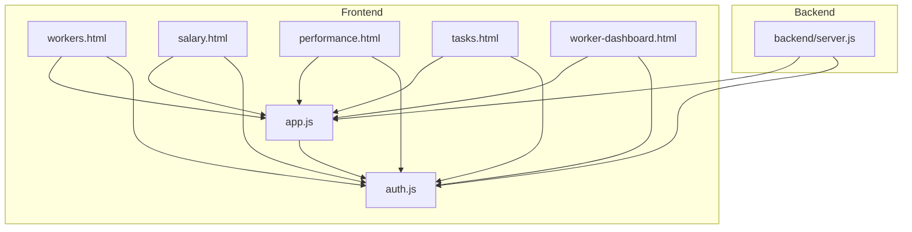
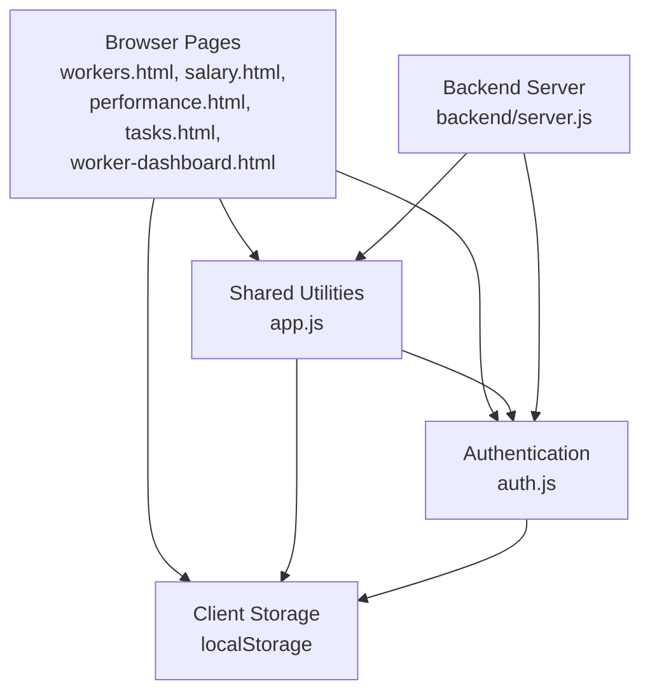
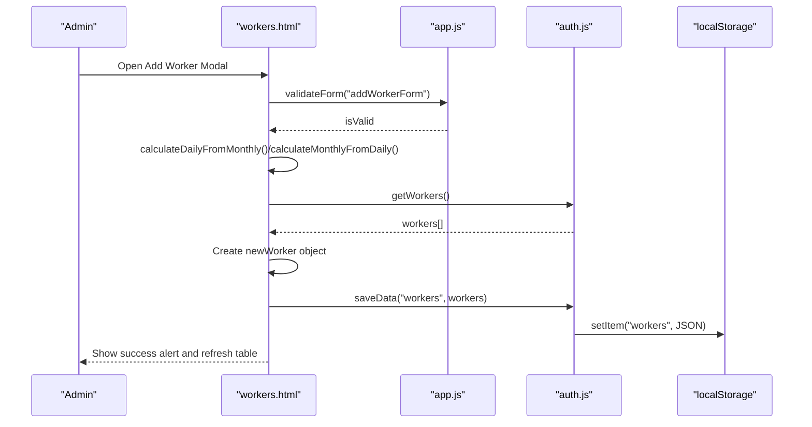
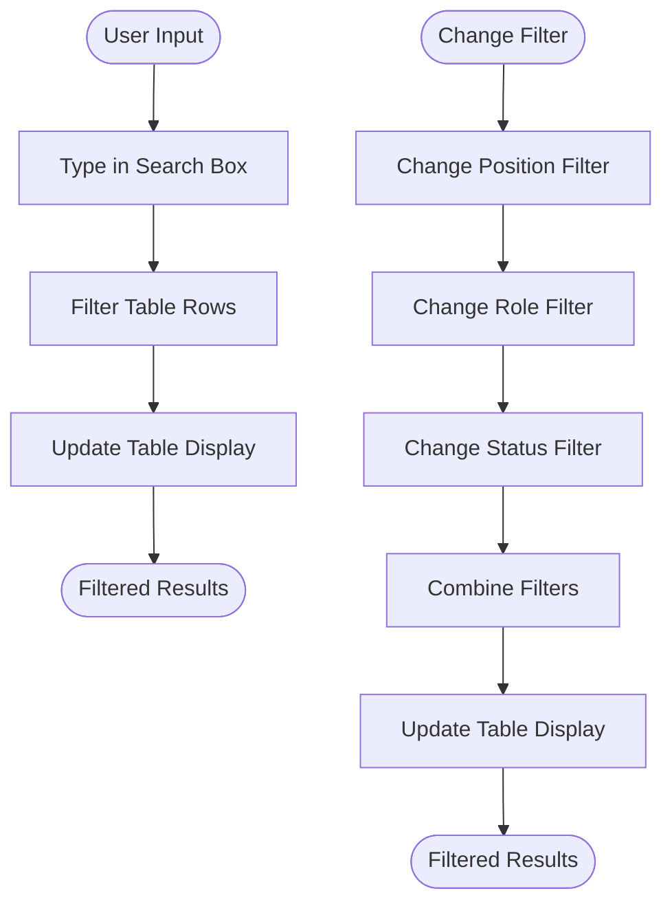
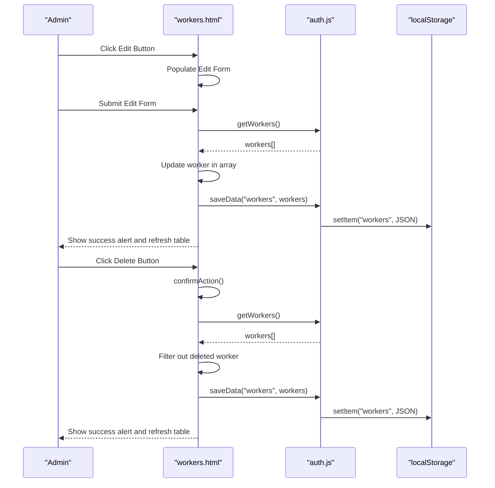
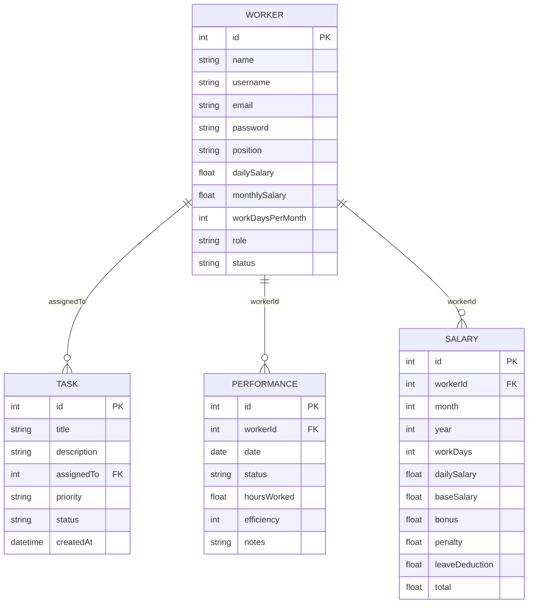
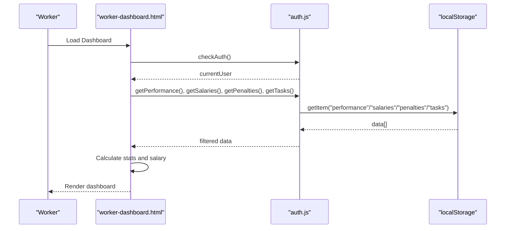
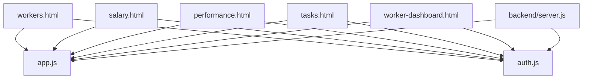

# Employee Management

<cite>
**Referenced Files in This Document**
- [backend/server.js](file://backend/server.js)
- [app.js](file://app.js)
- [auth.js](file://auth.js)
- [workers.html](file://workers.html)
- [salary.html](file://salary.html)
- [performance.html](file://performance.html)
- [tasks.html](file://tasks.html)
- [worker-dashboard.html](file://worker-dashboard.html)
</cite>

## Table of Contents
1. [Introduction](#introduction)
2. [Project Structure](#project-structure)
3. [Core Components](#core-components)
4. [Architecture Overview](#architecture-overview)
5. [Detailed Component Analysis](#detailed-component-analysis)
6. [Dependency Analysis](#dependency-analysis)
7. [Performance Considerations](#performance-considerations)
8. [Troubleshooting Guide](#troubleshooting-guide)
9. [Conclusion](#conclusion)

## Introduction
This document describes the employee management system for 555 İnşaat, focusing on worker registration, profile management, position assignment, and the relationships with tasks, performance tracking, and salary calculations. The system currently uses client-side storage (localStorage) for demonstration and development, with a backend server configured to support future migration to a production database.

## Project Structure
The project consists of:
- A frontend application with multiple HTML pages for administration and worker dashboards
- A shared JavaScript module for common utilities and helpers
- An authentication module managing sessions and demo data
- A backend server configured with Express, MongoDB connectivity, and route endpoints

**Diagram sources**
- [backend/server.js:95-118](file://backend/server.js#L95-L118)
- [workers.html](file://workers.html#L1)
- [salary.html](file://salary.html#L1)
- [performance.html](file://performance.html#L1)
- [tasks.html](file://tasks.html#L1)
- [worker-dashboard.html](file://worker-dashboard.html#L1)
- [app.js](file://app.js#L1)
- [auth.js](file://auth.js#L1)

**Section sources**
- [backend/server.js:1-184](file://backend/server.js#L1-L184)
- [workers.html:1-597](file://workers.html#L1-L597)
- [salary.html:1-253](file://salary.html#L1-L253)
- [performance.html:1-460](file://performance.html#L1-L460)
- [tasks.html:1-180](file://tasks.html#L1-L180)
- [worker-dashboard.html:1-568](file://worker-dashboard.html#L1-L568)
- [app.js:1-412](file://app.js#L1-L412)
- [auth.js:1-213](file://auth.js#L1-L213)

## Core Components
- Worker Registration and Profile Management
  - Registration via modal form with fields for name, username, email, password, position, role, and salary fields
  - Profile updates with daily/monthly salary conversion and status toggling
  - Local storage persistence for workers and related entities

- Position Assignment and Roles
  - Positions include "Baş Usta", "Usta", "Köməkçi"
  - Roles include "worker" and "seller"
  - Status controls activation/deactivation

- Worker Search and Filtering
  - Real-time search across worker table
  - Filter by position, role, and status

- CRUD Operations
  - Create: Add new worker
  - Read: List workers and related data
  - Update: Edit worker profile and salary
  - Delete: Remove worker

- Relationship with Tasks, Performance, and Salaries
  - Tasks assigned to workers
  - Performance records linked to workers
  - Salary calculations based on performance and permissions

**Section sources**
- [workers.html:164-310](file://workers.html#L164-L310)
- [workers.html:376-470](file://workers.html#L376-L470)
- [workers.html:483-545](file://workers.html#L483-L545)
- [auth.js:130-160](file://auth.js#L130-L160)
- [salary.html:138-211](file://salary.html#L138-L211)
- [performance.html:294-346](file://performance.html#L294-L346)
- [tasks.html:102-127](file://tasks.html#L102-L127)

## Architecture Overview
The system architecture combines a frontend application with client-side data storage and a backend server configured for production readiness. The frontend pages communicate with shared utilities and authentication modules, while the backend exposes REST endpoints for potential future integration.

**Diagram sources**
- [backend/server.js:95-118](file://backend/server.js#L95-L118)
- [workers.html:311-312](file://workers.html#L311-L312)
- [salary.html](file://salary.html#L88)
- [performance.html:261-262](file://performance.html#L261-L262)
- [tasks.html](file://tasks.html#L96)
- [worker-dashboard.html:289-290](file://worker-dashboard.html#L289-L290)
- [app.js](file://app.js#L1)
- [auth.js](file://auth.js#L1)

## Detailed Component Analysis

### Worker Registration and Profile Management
- Registration Modal
  - Fields: name, username, email, password, position, role, dailySalary, monthlySalary, workDaysPerMonth
  - Automatic salary conversion between daily and monthly based on workDaysPerMonth
  - Validation via required attributes and form validation helper
- Profile Editing
  - Edit modal with pre-filled values
  - Status selection and role updates
- Data Persistence
  - Workers stored in localStorage under the "workers" key
  - Related entities initialized with demo data

**Diagram sources**
- [workers.html:376-407](file://workers.html#L376-L407)
- [workers.html:547-591](file://workers.html#L547-L591)
- [app.js:352-370](file://app.js#L352-L370)
- [auth.js:130-160](file://auth.js#L130-L160)

**Section sources**
- [workers.html:164-310](file://workers.html#L164-L310)
- [workers.html:376-407](file://workers.html#L376-L407)
- [workers.html:547-591](file://workers.html#L547-L591)
- [app.js:352-370](file://app.js#L352-L370)
- [auth.js:130-160](file://auth.js#L130-L160)

### Worker Search and Filtering
- Search
  - Real-time filtering across all table rows based on input text
- Filters
  - Position, role, and status dropdown filters
  - Combined filtering logic updates table dynamically

**Diagram sources**
- [workers.html:472-481](file://workers.html#L472-L481)
- [workers.html:483-545](file://workers.html#L483-L545)

**Section sources**
- [workers.html:472-481](file://workers.html#L472-L481)
- [workers.html:483-545](file://workers.html#L483-L545)

### CRUD Operations
- Create
  - Add worker via modal form
  - Automatic ID generation and default status set to active
- Read
  - Load workers from localStorage and render table
  - Worker stats and related data loaded for dashboards
- Update
  - Edit worker profile and salary fields
  - Status and role updates persisted
- Delete
  - Confirmation dialog before removal
  - Worker removed from localStorage

**Diagram sources**
- [workers.html:409-459](file://workers.html#L409-L459)
- [workers.html:461-470](file://workers.html#L461-L470)
- [auth.js:130-160](file://auth.js#L130-L160)

**Section sources**
- [workers.html:409-459](file://workers.html#L409-L459)
- [workers.html:461-470](file://workers.html#L461-L470)
- [auth.js:130-160](file://auth.js#L130-L160)

### Position Assignment and Roles
- Positions
  - "Baş Usta", "Usta", "Köməkçi"
- Roles
  - "worker" (default), "seller"
- Status
  - "active", "inactive"

These fields are used for filtering, display badges, and role-based navigation.

**Section sources**
- [workers.html:198-212](file://workers.html#L198-L212)
- [workers.html:264-277](file://workers.html#L264-L277)
- [workers.html:295-299](file://workers.html#L295-L299)
- [auth.js:7-13](file://auth.js#L7-L13)

### Relationship Between Workers and Other System Components
- Tasks
  - Tasks are assigned to workers via the "assignedTo" field
  - Worker dashboard lists pending tasks assigned to the current user
- Performance Tracking
  - Performance records include workerId, date, status, hoursWorked, efficiency, and notes
  - Worker dashboard aggregates attendance statistics
- Salary Calculations
  - Salaries computed based on workDays, dailySalary, bonuses, penalties, and paid leave days
  - Worker dashboard shows current month salary breakdown

**Diagram sources**
- [tasks.html:116-126](file://tasks.html#L116-L126)
- [performance.html:325-346](file://performance.html#L325-L346)
- [salary.html:187-198](file://salary.html#L187-L198)
- [worker-dashboard.html:323-326](file://worker-dashboard.html#L323-L326)

**Section sources**
- [tasks.html:116-126](file://tasks.html#L116-L126)
- [performance.html:325-346](file://performance.html#L325-L346)
- [salary.html:187-198](file://salary.html#L187-L198)
- [worker-dashboard.html:323-326](file://worker-dashboard.html#L323-L326)

### Worker Dashboard (Worker View)
- Personalized statistics
  - Today's salary based on dailySalary
  - Total bonuses and penalties
  - Work days in current month
- Current month salary calculation
  - Base salary from dailySalary × workDays
  - Bonus and penalty adjustments
- Attendance summary
  - Present, late, absent, excused counts
- Recent penalties and tasks
  - Lists recent penalties and pending tasks

**Diagram sources**
- [worker-dashboard.html:316-370](file://worker-dashboard.html#L316-L370)
- [auth.js:138-156](file://auth.js#L138-L156)
- [auth.js:187-213](file://auth.js#L187-L213)

**Section sources**
- [worker-dashboard.html:316-370](file://worker-dashboard.html#L316-L370)
- [auth.js:138-156](file://auth.js#L138-L156)
- [auth.js:187-213](file://auth.js#L187-L213)

## Dependency Analysis
- Frontend Dependencies
  - Shared utilities (app.js): tooltips, modals, tabs, search, sorting, CSV export, printing, validation, storage helpers
  - Authentication (auth.js): demo users, session management, localStorage helpers, data initialization
  - Pages depend on both utilities and authentication modules
- Backend Dependencies
  - Express server configured with security middleware, CORS, rate limiting, compression, logging, static file serving, and MongoDB connection
  - Routes registered for workers, attendance, salary, tasks, projects, permissions, shift changes, penalties, bonuses, reports, notifications, documents, trainings, advances, overtime, sales, materials, audit logs, settings, dashboard, and QR

**Diagram sources**
- [app.js](file://app.js#L1)
- [auth.js](file://auth.js#L1)
- [workers.html:311-312](file://workers.html#L311-L312)
- [salary.html](file://salary.html#L88)
- [performance.html:261-262](file://performance.html#L261-L262)
- [tasks.html](file://tasks.html#L96)
- [worker-dashboard.html:289-290](file://worker-dashboard.html#L289-L290)
- [backend/server.js:95-118](file://backend/server.js#L95-L118)

**Section sources**
- [app.js:1-412](file://app.js#L1-L412)
- [auth.js:1-213](file://auth.js#L1-L213)
- [backend/server.js:95-118](file://backend/server.js#L95-L118)

## Performance Considerations
- Client-side storage
  - Data is stored locally; operations are fast but limited by browser storage capacity
  - Sorting and filtering are performed in-memory; consider pagination for large datasets
- Computation-heavy operations
  - Salary calculations and performance aggregations are client-side; optimize by caching intermediate results
- Network considerations
  - Backend routes are configured; when migrated to a database, implement indexing on frequently queried fields (workerId, date, status)

## Troubleshooting Guide
- Authentication Issues
  - Ensure demo users exist and credentials match roles
  - Verify localStorage initialization for demo data
- Data Not Persisting
  - Confirm localStorage keys exist ("workers", "tasks", "performance", "salaries", "penalties", "permissions", "shiftChanges")
- Salary Calculation Problems
  - Check dailySalary and workDaysPerMonth values
  - Verify performance records for the current month
- Task Assignment Errors
  - Ensure worker IDs exist and assignedTo matches existing worker IDs

**Section sources**
- [auth.js:55-82](file://auth.js#L55-L82)
- [auth.js:158-160](file://auth.js#L158-L160)
- [salary.html:138-211](file://salary.html#L138-L211)
- [tasks.html:134-154](file://tasks.html#L134-L154)

## Conclusion
The employee management system provides a comprehensive foundation for worker registration, profile management, and integration with tasks, performance tracking, and salary calculations. The frontend demonstrates robust CRUD operations, filtering, and real-time updates using client-side storage. The backend server is configured for production deployment, enabling future migration to a persistent database while maintaining the current frontend functionality.