# Attendance Recording

<cite>
**Referenced Files in This Document**
- [attendance.html](file://attendance.html)
- [app.js](file://app.js)
- [auth.js](file://auth.js)
- [dashboard.html](file://dashboard.html)
- [backend/server.js](file://backend/server.js)
- [backend/models/Attendance.js](file://backend/models/Attendance.js)
- [backend/models/Settings.js](file://backend/models/Settings.js)
</cite>

## Table of Contents
1. [Introduction](#introduction)
2. [Project Structure](#project-structure)
3. [Core Components](#core-components)
4. [Architecture Overview](#architecture-overview)
5. [Detailed Component Analysis](#detailed-component-analysis)
6. [Dependency Analysis](#dependency-analysis)
7. [Performance Considerations](#performance-considerations)
8. [Troubleshooting Guide](#troubleshooting-guide)
9. [Conclusion](#conclusion)

## Introduction
This document explains the attendance recording system for the 555 İnşaat construction management platform. It covers daily attendance tracking, automatic and manual entry, the attendance status system, the approval workflow for pending entries, the statistics dashboard, the manual entry modal, and the attendance table with filtering and actions. It also documents how data is persisted using localStorage for frontend demos and outlines the backend schema for a production-grade system.

## Project Structure
The attendance system spans three primary areas:
- Frontend pages: attendance tracking and dashboard
- Shared frontend utilities: reusable UI helpers and modals
- Authentication module: user sessions and demo data initialization
- Backend server: Express server wiring and MongoDB models for attendance

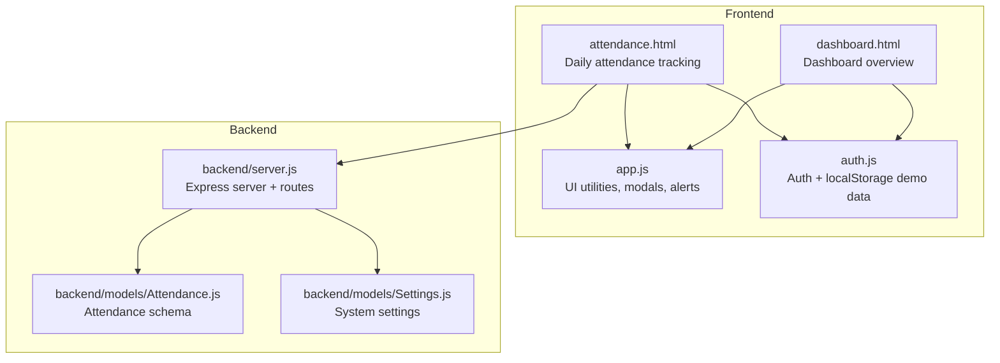

**Diagram sources**
- [attendance.html:1-542](file://attendance.html#L1-L542)
- [dashboard.html:1-381](file://dashboard.html#L1-L381)
- [app.js:1-412](file://app.js#L1-L412)
- [auth.js:1-213](file://auth.js#L1-L213)
- [backend/server.js:1-184](file://backend/server.js#L1-L184)
- [backend/models/Attendance.js:1-226](file://backend/models/Attendance.js#L1-L226)
- [backend/models/Settings.js:62-132](file://backend/models/Settings.js#L62-L132)

**Section sources**
- [attendance.html:1-542](file://attendance.html#L1-L542)
- [dashboard.html:1-381](file://dashboard.html#L1-L381)
- [app.js:1-412](file://app.js#L1-L412)
- [auth.js:1-213](file://auth.js#L1-L213)
- [backend/server.js:1-184](file://backend/server.js#L1-L184)
- [backend/models/Attendance.js:1-226](file://backend/models/Attendance.js#L1-L226)
- [backend/models/Settings.js:62-132](file://backend/models/Settings.js#L62-L132)

## Core Components
- Attendance page: displays stats, pending approvals, and today’s attendance table with filtering and actions.
- Dashboard: shows summary cards for attendance and pending items.
- Utilities: shared modal, alert, and form helpers.
- Authentication and demo data: initializes localStorage with demo workers and other entities.
- Backend models: comprehensive attendance schema supporting multiple check-in methods, approvals, and work hour calculations.

Key responsibilities:
- Attendance page: load, filter, and render attendance; manage pending approvals; handle manual entry modal.
- Dashboard: summarize attendance metrics for quick visibility.
- Utilities: reusable UI behaviors for modals, alerts, and common actions.
- Backend: define data structures and constraints for production-grade attendance records.

**Section sources**
- [attendance.html:100-203](file://attendance.html#L100-L203)
- [dashboard.html:97-135](file://dashboard.html#L97-L135)
- [app.js:129-153](file://app.js#L129-L153)
- [auth.js:15-53](file://auth.js#L15-L53)
- [backend/models/Attendance.js:3-148](file://backend/models/Attendance.js#L3-L148)

## Architecture Overview
The frontend attendance page integrates with localStorage for data persistence during development/demo. The backend server exposes an API surface and defines the Attendance model with rich fields for check-in/out, status, approvals, and metadata. The dashboard consumes similar data to present summaries.

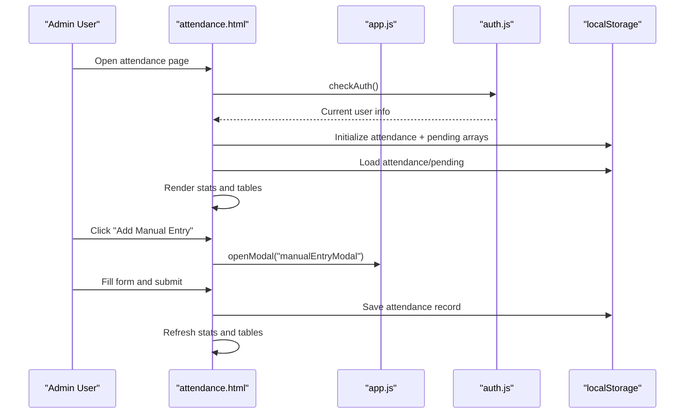

**Diagram sources**
- [attendance.html:264-284](file://attendance.html#L264-L284)
- [attendance.html:285-293](file://attendance.html#L285-L293)
- [attendance.html:494-517](file://attendance.html#L494-L517)
- [app.js:129-144](file://app.js#L129-L144)
- [auth.js:55-63](file://auth.js#L55-L63)

## Detailed Component Analysis

### Daily Attendance Tracking and Manual Entry
- Automatic clock-in/clock-out: The frontend demo does not implement automatic clock-in/clock-out; it focuses on manual entry via a modal.
- Manual entry modal: Provides fields for worker selection, date, status, check-in/out times, and notes. On submit, it saves to localStorage under the attendance key and refreshes the UI.
- Validation: The modal form uses HTML5 required attributes; additional validation helpers exist in the shared utilities but are not invoked in the modal save flow.

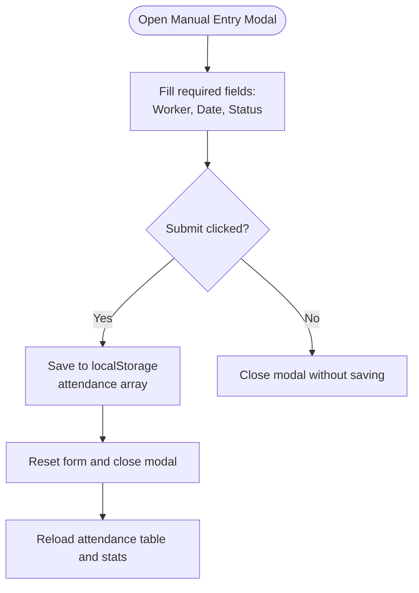

**Diagram sources**
- [attendance.html:207-260](file://attendance.html#L207-L260)
- [attendance.html:494-517](file://attendance.html#L494-L517)
- [app.js:129-144](file://app.js#L129-L144)

**Section sources**
- [attendance.html:207-260](file://attendance.html#L207-L260)
- [attendance.html:494-517](file://attendance.html#L494-L517)
- [app.js:352-370](file://app.js#L352-L370)

### Attendance Status System
The frontend recognizes the following statuses for display and counting:
- Present
- Absent
- Leave
- Half-day
- Pending (from pending approvals)
- Approved (shown as approved in stats)
- No-record (implicit absence when no record exists)

These are mapped to badge classes for visual indication in the table.

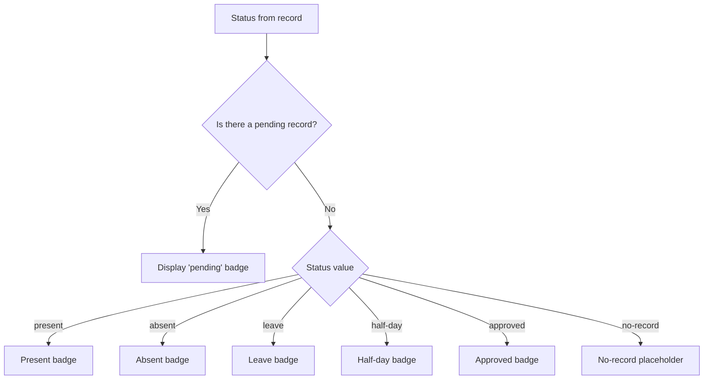

**Diagram sources**
- [attendance.html:389-401](file://attendance.html#L389-L401)
- [attendance.html:305-318](file://attendance.html#L305-L318)

**Section sources**
- [attendance.html:389-401](file://attendance.html#L389-L401)
- [attendance.html:305-318](file://attendance.html#L305-L318)

### Approval Workflow for Attendance Requests
- Pending approvals section: Lists entries awaiting admin review with action buttons to approve or reject.
- Approve: Moves the pending record into the main attendance array, sets status to approved, and records approver and timestamp.
- Reject: Removes the pending record without adding to attendance.

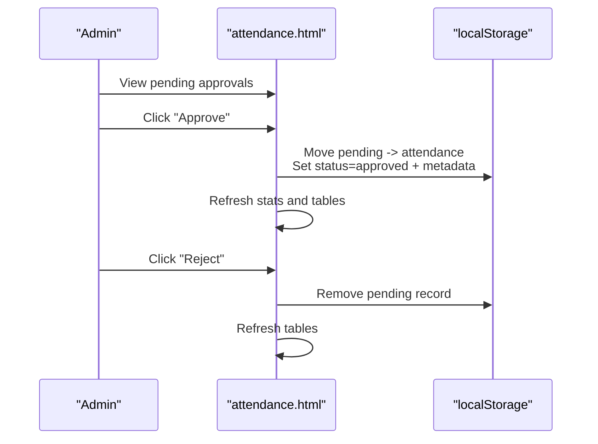

**Diagram sources**
- [attendance.html:141-166](file://attendance.html#L141-L166)
- [attendance.html:450-484](file://attendance.html#L450-L484)

**Section sources**
- [attendance.html:141-166](file://attendance.html#L141-L166)
- [attendance.html:450-484](file://attendance.html#L450-L484)

### Statistics Dashboard
- Today’s attendance summary: Shows present, absent, pending, and leave counts for the selected date.
- Stats grid: Displays counts for present, absent, pending, and leave on the attendance page.
- Dashboard overview: Presents a broader summary card layout for quick insights.

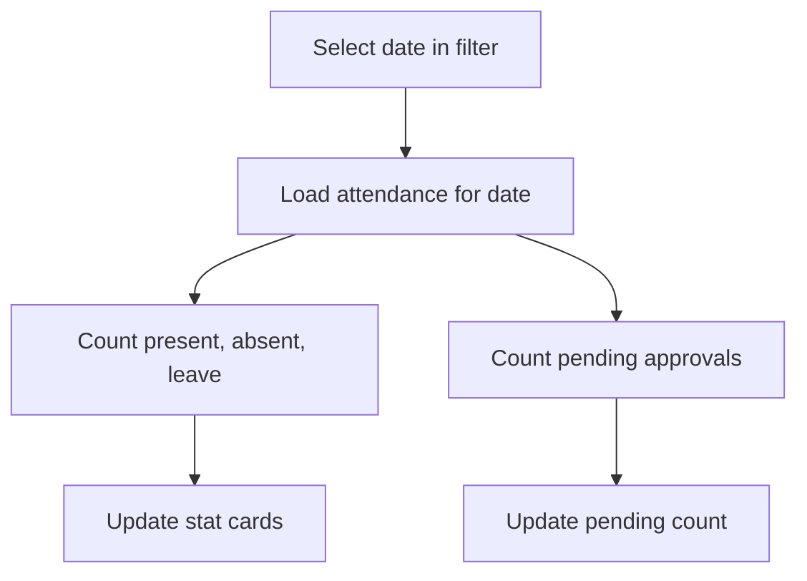

**Diagram sources**
- [attendance.html:173-177](file://attendance.html#L173-L177)
- [attendance.html:305-318](file://attendance.html#L305-L318)
- [dashboard.html:198-235](file://dashboard.html#L198-L235)

**Section sources**
- [attendance.html:173-177](file://attendance.html#L173-L177)
- [attendance.html:305-318](file://attendance.html#L305-L318)
- [dashboard.html:198-235](file://dashboard.html#L198-L235)

### Manual Attendance Entry Modal
- Fields: worker selection dropdown, date, status dropdown, optional check-in/out times, and notes.
- Worker options: populated from localStorage workers.
- Submission: validates required fields, creates a new record with metadata, persists to localStorage, resets the form, and refreshes views.

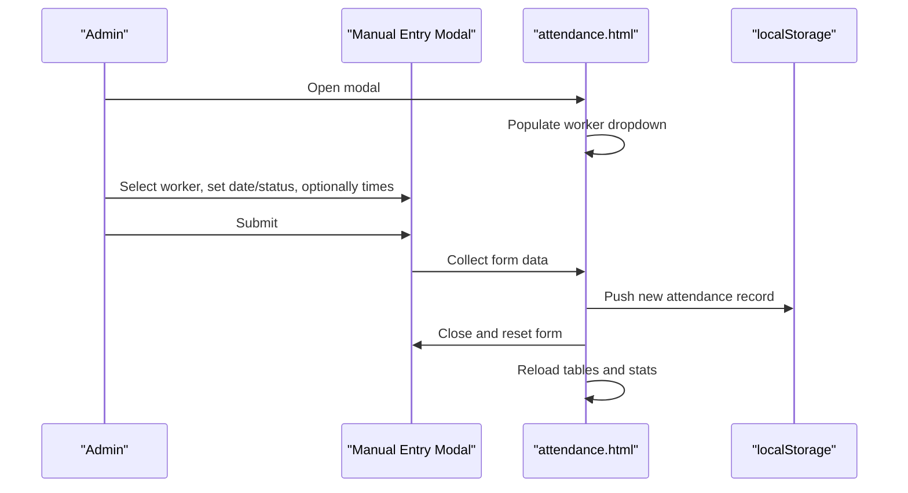

**Diagram sources**
- [attendance.html:207-260](file://attendance.html#L207-L260)
- [attendance.html:486-492](file://attendance.html#L486-L492)
- [attendance.html:494-517](file://attendance.html#L494-L517)

**Section sources**
- [attendance.html:207-260](file://attendance.html#L207-L260)
- [attendance.html:486-492](file://attendance.html#L486-L492)
- [attendance.html:494-517](file://attendance.html#L494-L517)

### Attendance Table Functionality
- Date filtering: A date picker allows selecting a specific day; the table reloads filtered data.
- Status badges: Visual indicators per status (present, absent, leave, half-day, pending, approved, no-record).
- Action buttons:
  - Pending records: Approve or Reject buttons.
  - Approved/no-pending records: Edit button to modify existing records.

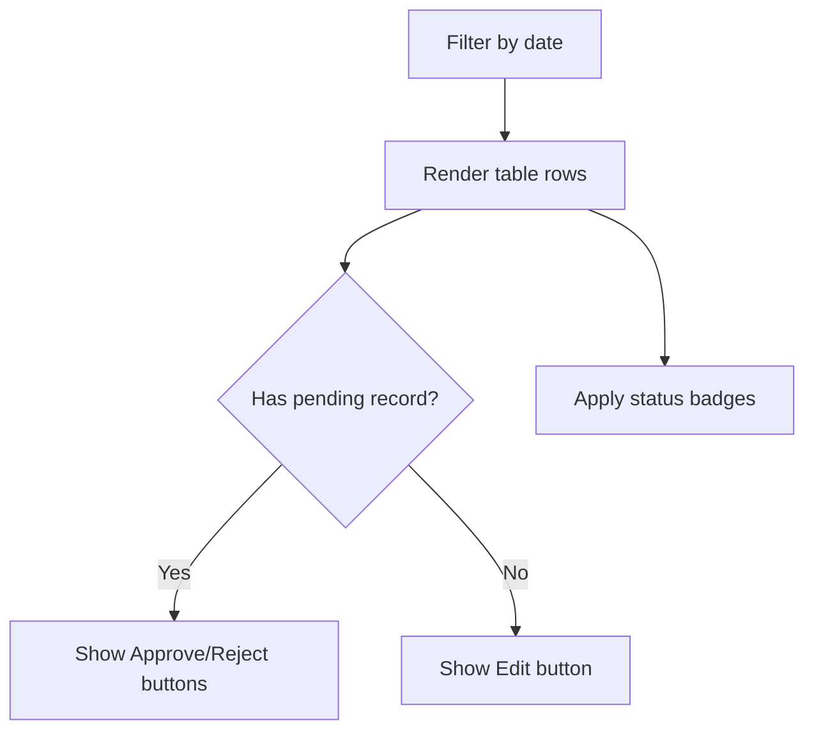

**Diagram sources**
- [attendance.html:173-177](file://attendance.html#L173-L177)
- [attendance.html:389-435](file://attendance.html#L389-L435)

**Section sources**
- [attendance.html:173-177](file://attendance.html#L173-L177)
- [attendance.html:389-435](file://attendance.html#L389-L435)

### Data Persistence Using localStorage
- Initialization: Ensures attendance and pending arrays exist in localStorage.
- Storage keys:
  - attendance: main attendance records
  - pendingAttendance: pending approval records
- Retrieval and updates: Functions fetch and update these arrays; the page writes back after approvals or manual entries.

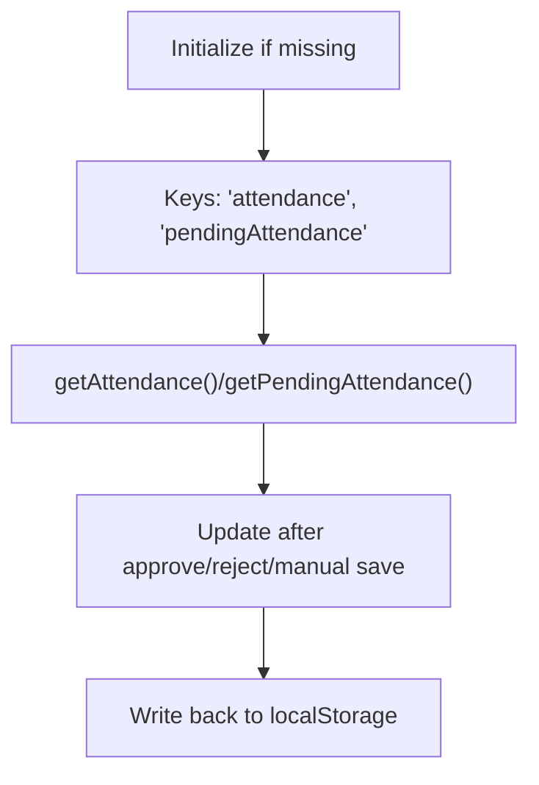

**Diagram sources**
- [attendance.html:285-293](file://attendance.html#L285-L293)
- [attendance.html:295-302](file://attendance.html#L295-L302)

**Section sources**
- [attendance.html:285-293](file://attendance.html#L285-L293)
- [attendance.html:295-302](file://attendance.html#L295-L302)

### Backend Schema for Production
While the frontend uses localStorage for demo, the backend defines a robust Attendance model:
- Fields: worker reference, date, check-in/out details, status, work hours, overtime, late/early minutes, shift info, breaks, approval workflow, QR code, notes, and metadata.
- Indexes: compound index on worker+date, plus indexes on date, status, and approval status.
- Pre-save: calculates work hours, subtracts break durations, and computes overtime.
- Methods: late minute calculation against shift start time.
- Statics: aggregation for summary by status and time range.

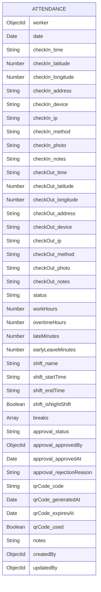

**Diagram sources**
- [backend/models/Attendance.js:3-148](file://backend/models/Attendance.js#L3-L148)

**Section sources**
- [backend/models/Attendance.js:3-148](file://backend/models/Attendance.js#L3-L148)
- [backend/models/Attendance.js:150-183](file://backend/models/Attendance.js#L150-L183)
- [backend/models/Attendance.js:185-197](file://backend/models/Attendance.js#L185-L197)
- [backend/models/Attendance.js:199-223](file://backend/models/Attendance.js#L199-L223)

## Dependency Analysis
- Frontend dependencies:
  - attendance.html depends on app.js for modal/alert utilities and auth.js for user/session checks and demo data initialization.
  - Both pages rely on localStorage for data persistence during demos.
- Backend dependencies:
  - server.js wires up Express, CORS, rate limiting, compression, logging, static files, database connection, and routes.
  - Attendance model depends on Mongoose and defines rich schema and indexes.

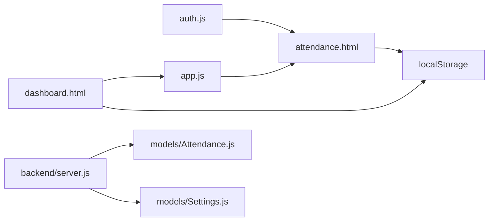

**Diagram sources**
- [auth.js:55-63](file://auth.js#L55-L63)
- [attendance.html:264-284](file://attendance.html#L264-L284)
- [app.js:129-144](file://app.js#L129-L144)
- [backend/server.js:95-118](file://backend/server.js#L95-L118)
- [backend/models/Attendance.js:1-226](file://backend/models/Attendance.js#L1-L226)
- [backend/models/Settings.js:62-132](file://backend/models/Settings.js#L62-L132)

**Section sources**
- [auth.js:55-63](file://auth.js#L55-L63)
- [attendance.html:264-284](file://attendance.html#L264-L284)
- [app.js:129-144](file://app.js#L129-L144)
- [backend/server.js:95-118](file://backend/server.js#L95-L118)
- [backend/models/Attendance.js:1-226](file://backend/models/Attendance.js#L1-L226)
- [backend/models/Settings.js:62-132](file://backend/models/Settings.js#L62-L132)

## Performance Considerations
- Frontend:
  - Filtering and rendering are client-side; for large datasets, consider pagination or server-side queries.
  - Stats computation is linear in the number of records for the selected date.
- Backend:
  - Attendance model includes indexes on worker+date, date, status, and approval status to optimize queries.
  - Pre-save middleware computes derived fields (work hours, overtime) to avoid recomputation on reads.

[No sources needed since this section provides general guidance]

## Troubleshooting Guide
- Authentication redirection:
  - Non-admin users are redirected away from the attendance page. Ensure the current user role is checked and handled appropriately.
- Empty states:
  - If no records exist for a date, the table shows an empty state; pending approvals section hides itself when none are present.
- Alerts:
  - Success and danger messages appear for approvals and actions; ensure the alert container is present in the DOM.

**Section sources**
- [attendance.html:264-274](file://attendance.html#L264-L274)
- [attendance.html:326-330](file://attendance.html#L326-L330)
- [app.js:107-127](file://app.js#L107-L127)

## Conclusion
The attendance recording system combines a user-friendly frontend interface with localStorage-backed persistence for demonstration and a robust backend schema for production. It supports manual attendance entry, pending approvals, status badges, and statistics dashboards. For production, integrate the backend API and replace localStorage with database-backed storage while leveraging the provided models and indexes for efficient queries.