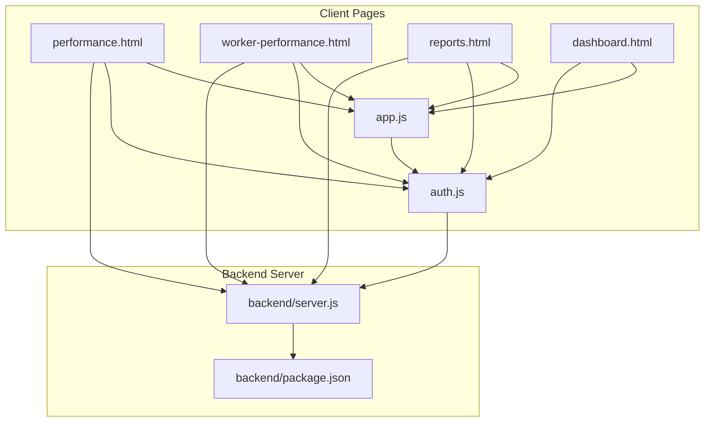
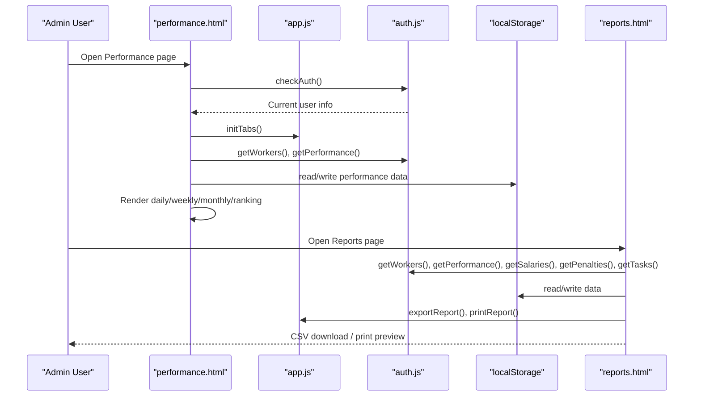
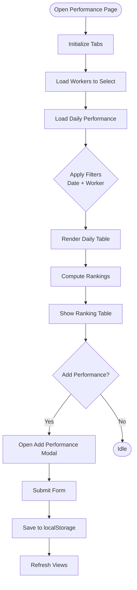
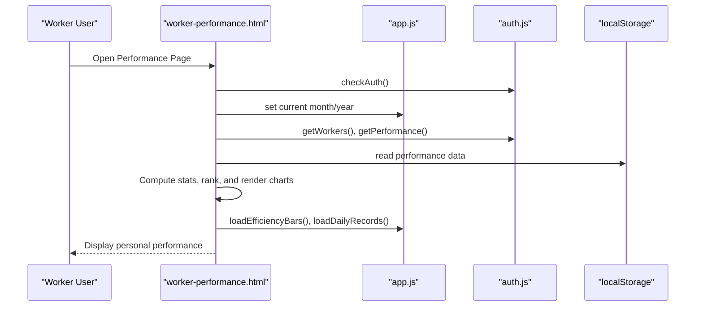
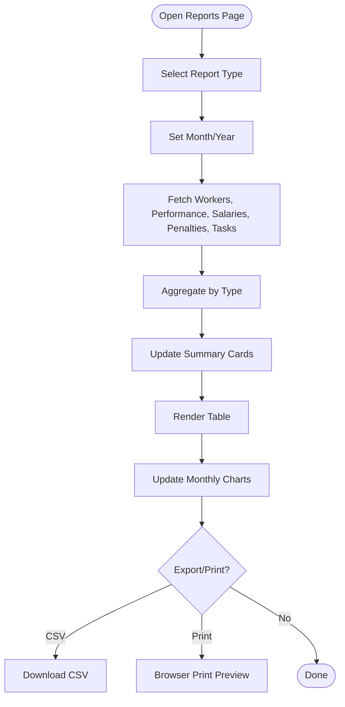
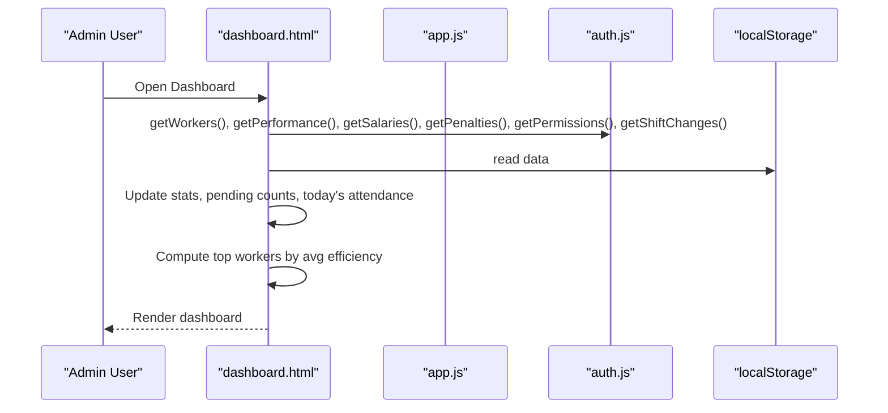
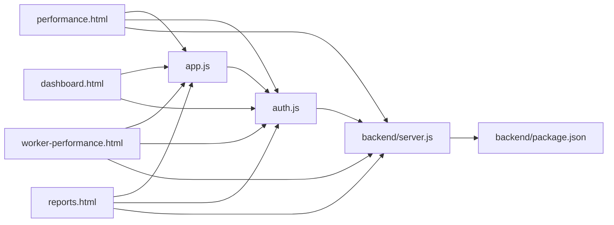

# Performance Analytics

<cite>
**Referenced Files in This Document**
- [performance.html](file://performance.html)
- [worker-performance.html](file://worker-performance.html)
- [reports.html](file://reports.html)
- [dashboard.html](file://dashboard.html)
- [app.js](file://app.js)
- [auth.js](file://auth.js)
- [backend/server.js](file://backend/server.js)
- [backend/package.json](file://backend/package.json)
</cite>

## Table of Contents
1. [Introduction](#introduction)
2. [Project Structure](#project-structure)
3. [Core Components](#core-components)
4. [Architecture Overview](#architecture-overview)
5. [Detailed Component Analysis](#detailed-component-analysis)
6. [Dependency Analysis](#dependency-analysis)
7. [Performance Considerations](#performance-considerations)
8. [Troubleshooting Guide](#troubleshooting-guide)
9. [Conclusion](#conclusion)

## Introduction
This document describes the performance analytics system for the construction workforce management platform. It covers how performance metrics are calculated (attendance rates, efficiency ratios, productivity indicators), how data is aggregated for reports and trends, and how dashboards present statistics. It also documents reporting features (CSV export and printing), dashboard layouts, filtering/sorting capabilities, and integration with attendance data for work days, punctuality, and performance bonuses.

## Project Structure
The performance analytics system spans client-side pages and utilities, plus a backend server that exposes APIs and manages persistence. Key areas:
- Client-side pages for administrators and workers to view and manage performance data
- Shared utilities for data access, formatting, and UI helpers
- Backend server exposing routes for various modules including performance, attendance, and reports

**Diagram sources**
- [performance.html](file://performance.html)
- [worker-performance.html](file://worker-performance.html)
- [reports.html](file://reports.html)
- [dashboard.html](file://dashboard.html)
- [app.js](file://app.js)
- [auth.js](file://auth.js)
- [backend/server.js](file://backend/server.js)
- [backend/package.json](file://backend/package.json)

**Section sources**
- [performance.html](file://performance.html)
- [worker-performance.html](file://worker-performance.html)
- [reports.html](file://reports.html)
- [dashboard.html](file://dashboard.html)
- [app.js](file://app.js)
- [auth.js](file://auth.js)
- [backend/server.js](file://backend/server.js)
- [backend/package.json](file://backend/package.json)

## Core Components
- Performance administration page: daily/weekly/monthly views, ranking, and adding performance entries
- Worker performance page: personal stats, monthly filters, attendance breakdown, efficiency chart, and daily records
- Reporting page: configurable report types, summary cards, tabular data, charts, and export/print
- Dashboard: top workers, attendance summary, and quick actions
- Utilities: CSV export, print, modal handling, tab switching, and data helpers

Key calculations implemented:
- Attendance rate: (present + late) / total days
- Average efficiency: average of recorded efficiency values per worker
- Worker ranking: weighted score combining efficiency and attendance
- Monthly aggregation: filtering by month/year for personal and report views

**Section sources**
- [performance.html](file://performance.html)
- [worker-performance.html](file://worker-performance.html)
- [reports.html](file://reports.html)
- [dashboard.html](file://dashboard.html)
- [app.js](file://app.js)
- [auth.js](file://auth.js)

## Architecture Overview
The system uses a frontend-first approach with local storage for data persistence during development/demo. The backend server provides API routes for modules and sets up security, logging, and database connectivity. The client pages rely on shared utilities for consistent behavior and formatting.

**Diagram sources**
- [performance.html](file://performance.html)
- [reports.html](file://reports.html)
- [app.js](file://app.js)
- [auth.js](file://auth.js)

## Detailed Component Analysis

### Performance Administration Page
- Tabs: daily, weekly, monthly, ranking
- Filters: date picker and worker selector for daily view
- Data rendering: daily performance table with status badges, progress bars for efficiency, and notes
- Ranking computation: average efficiency, presence days, attendance rate, and composite score
- Adding performance: modal form with worker, date, status, hours worked, efficiency, and notes

**Diagram sources**
- [performance.html](file://performance.html)

**Section sources**
- [performance.html](file://performance.html)

### Worker Performance Page
- Personal stats cards: total work days, attendance rate, average efficiency, and personal rank
- Monthly filter: month and year selectors
- Attendance breakdown: present, late, absent, excused counts
- Efficiency chart: bar visualization of last 10 daily efficiency values
- Daily records: table of daily entries with status badges and progress bars

**Diagram sources**
- [worker-performance.html](file://worker-performance.html)
- [app.js](file://app.js)
- [auth.js](file://auth.js)

**Section sources**
- [worker-performance.html](file://worker-performance.html)
- [app.js](file://app.js)
- [auth.js](file://auth.js)

### Reporting Page
- Report types: attendance, salary, performance, penalty, summary
- Filters: report type, month, year
- Summary cards: total workers, attendance rate, total salaries, total penalties
- Table: dynamic columns based on report type
- Charts: monthly participation distribution
- Export: CSV download with BOM and semicolon-separated values
- Print: browser print preview

**Diagram sources**
- [reports.html](file://reports.html)

**Section sources**
- [reports.html](file://reports.html)
- [app.js](file://app.js)
- [auth.js](file://auth.js)

### Dashboard Overview
- Stats grid: total workers, active workers, total bonus, total penalty
- Recent activities, pending requests, today’s attendance summary
- Top workers: computed average efficiency leaderboard

**Diagram sources**
- [dashboard.html](file://dashboard.html)

**Section sources**
- [dashboard.html](file://dashboard.html)
- [auth.js](file://auth.js)

## Dependency Analysis
- Client-side utilities depend on shared helpers for CSV export, print, modals, tabs, and data access
- Pages depend on authentication module for user context and data initialization
- Backend server initializes security middleware, rate limiting, CORS, static file serving, and routes for modules
- Routes are organized by domain (workers, attendance, salary, tasks, projects, permissions, reports, etc.)

**Diagram sources**
- [app.js](file://app.js)
- [auth.js](file://auth.js)
- [performance.html](file://performance.html)
- [worker-performance.html](file://worker-performance.html)
- [reports.html](file://reports.html)
- [dashboard.html](file://dashboard.html)
- [backend/server.js](file://backend/server.js)
- [backend/package.json](file://backend/package.json)

**Section sources**
- [app.js](file://app.js)
- [auth.js](file://auth.js)
- [backend/server.js](file://backend/server.js)
- [backend/package.json](file://backend/package.json)

## Performance Considerations
- Data locality: client-side localStorage simplifies deployment but limits scalability; consider migrating to backend APIs for production
- Sorting and filtering: client-side arrays are efficient for small datasets; pagination or virtualization would help with larger datasets
- Rendering: progress bars and charts are lightweight; avoid frequent DOM updates by batching renders
- Export/print: CSV generation and print previews are client-side; ensure adequate memory for large datasets

[No sources needed since this section provides general guidance]

## Troubleshooting Guide
Common issues and resolutions:
- Authentication failures: ensure correct role and credentials; verify demo users initialization
- Empty tables: confirm localStorage initialization and that filters match available data
- Export errors: check CSV generation logic and browser support for Blob downloads
- Print problems: verify print styles and ensure report content is rendered before invoking print

**Section sources**
- [auth.js](file://auth.js)
- [app.js](file://app.js)
- [reports.html](file://reports.html)

## Conclusion
The performance analytics system provides a comprehensive front-end solution for tracking and visualizing workforce performance. It computes attendance rates, average efficiency, and composite rankings, and offers robust reporting with export and print capabilities. While the current implementation uses client-side storage for simplicity, integrating with backend APIs would enable scalable, centralized data management and richer analytics.