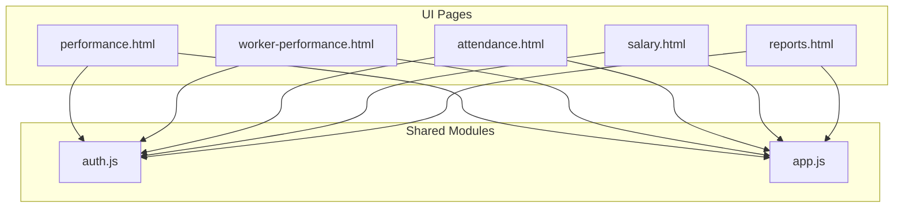
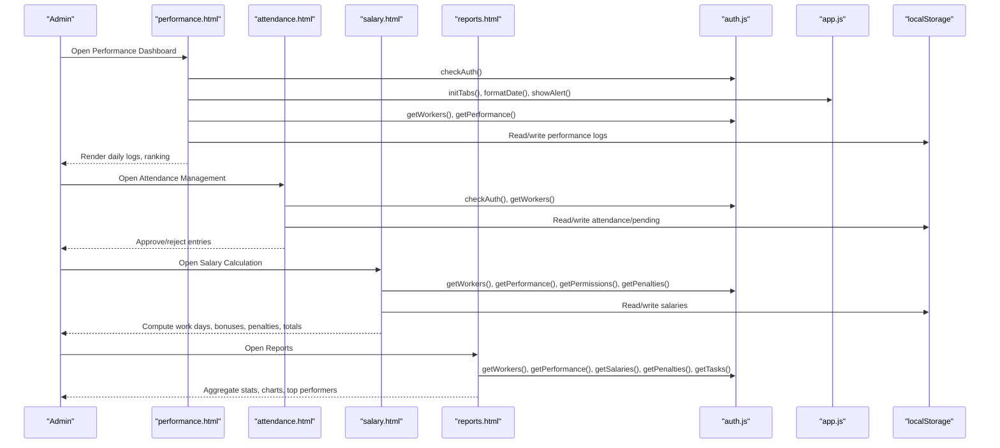
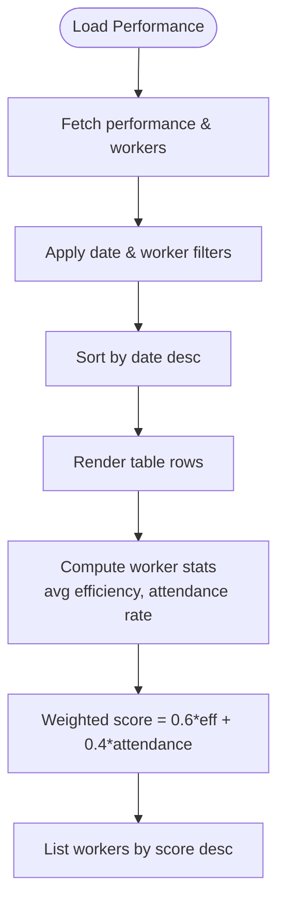
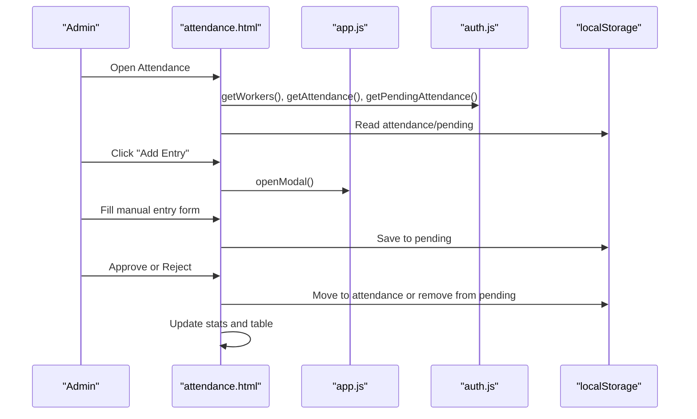
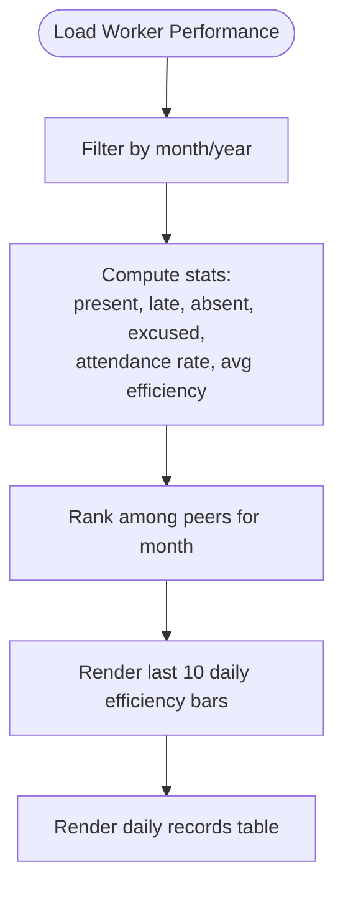
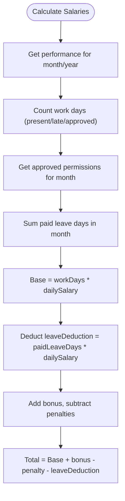
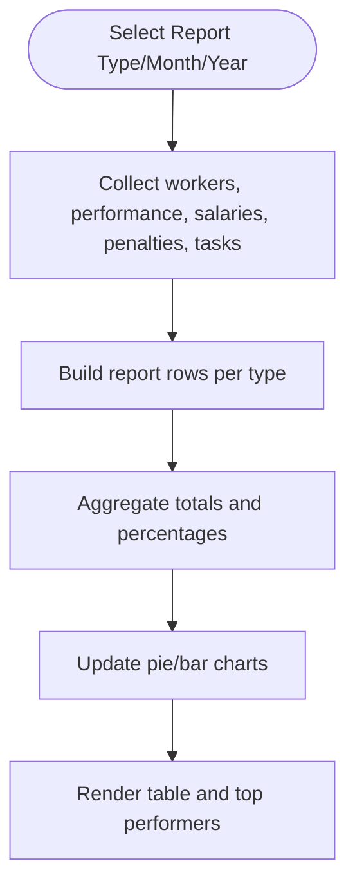
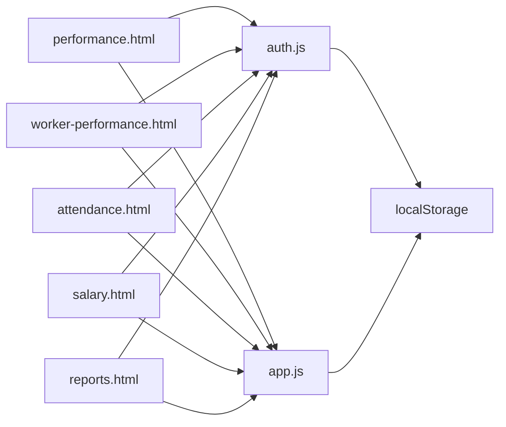

# Performance Tracking

<cite>
**Referenced Files in This Document**
- [performance.html](file://performance.html)
- [worker-performance.html](file://worker-performance.html)
- [attendance.html](file://attendance.html)
- [salary.html](file://salary.html)
- [reports.html](file://reports.html)
- [auth.js](file://auth.js)
- [app.js](file://app.js)
</cite>

## Table of Contents
1. [Introduction](#introduction)
2. [Project Structure](#project-structure)
3. [Core Components](#core-components)
4. [Architecture Overview](#architecture-overview)
5. [Detailed Component Analysis](#detailed-component-analysis)
6. [Dependency Analysis](#dependency-analysis)
7. [Performance Considerations](#performance-considerations)
8. [Troubleshooting Guide](#troubleshooting-guide)
9. [Conclusion](#conclusion)
10. [Appendices](#appendices)

## Introduction
This document explains the performance tracking system used to monitor worker attendance, log daily performance, compute efficiency metrics, and generate reports. It covers the data model for attendance and performance records, the attendance marking and approval workflow, automated analytics for attendance rates and rankings, and the integration with salary calculations through work days tracking. It also describes the worker-specific performance view and administrative reporting capabilities.

## Project Structure
The performance tracking system is implemented as client-side Single Page Applications (SPA) pages with shared utilities for authentication, data persistence, and UI helpers. Key pages include:
- Administrative performance dashboard for daily logs, rankings, and filtering
- Worker performance dashboard for personal attendance history and metrics
- Attendance management with manual entry and pending approvals
- Salary calculation integrating performance and permissions
- Reporting module aggregating attendance, salary, and performance data

**Diagram sources**
- [performance.html](file://performance.html)
- [worker-performance.html](file://worker-performance.html)
- [attendance.html](file://attendance.html)
- [salary.html](file://salary.html)
- [reports.html](file://reports.html)
- [auth.js](file://auth.js)
- [app.js](file://app.js)

**Section sources**
- [performance.html](file://performance.html)
- [worker-performance.html](file://worker-performance.html)
- [attendance.html](file://attendance.html)
- [salary.html](file://salary.html)
- [reports.html](file://reports.html)
- [auth.js](file://auth.js)
- [app.js](file://app.js)

## Core Components
- Data model and persistence:
  - Workers, tasks, performance logs, salaries, penalties, permissions, shift changes are stored in browser localStorage.
  - Utility functions provide getters, setters, and helpers for dates, currency, and IDs.
- Attendance recording:
  - Daily attendance entries with status (present, absent, leave, half-day) and optional check-in/check-out times.
  - Pending approvals for attendance entries awaiting admin review.
- Performance logging:
  - Daily performance records with status, hours worked, efficiency percentage, and notes.
  - Ranking computed from average efficiency and attendance rate.
- Salary integration:
  - Work days derived from performance logs (present/late/approved) and paid leave days from permissions.
- Reporting:
  - Administrative reports aggregating attendance, salary, performance, and penalties across workers and time periods.

**Section sources**
- [auth.js](file://auth.js)
- [app.js](file://app.js)
- [performance.html](file://performance.html)
- [worker-performance.html](file://worker-performance.html)
- [attendance.html](file://attendance.html)
- [salary.html](file://salary.html)
- [reports.html](file://reports.html)

## Architecture Overview
The system follows a client-side SPA architecture with a shared module for authentication and utilities. Each page initializes data, loads worker lists, and renders dynamic content. Data is persisted locally and accessed via helper functions.

**Diagram sources**
- [performance.html](file://performance.html)
- [attendance.html](file://attendance.html)
- [salary.html](file://salary.html)
- [reports.html](file://reports.html)
- [auth.js](file://auth.js)
- [app.js](file://app.js)

## Detailed Component Analysis

### Performance Logging and Rankings
- Daily performance logs capture worker status, hours worked, efficiency percentage, and notes.
- Filtering by date and worker allows targeted views.
- Ranking computes weighted score combining average efficiency and attendance rate.

**Diagram sources**
- [performance.html](file://performance.html)

**Section sources**
- [performance.html](file://performance.html)

### Attendance Recording and Approval Workflow
- Manual attendance entry supports status and check-in/check-out times.
- Pending approvals require admin review; approved entries move to main attendance list.
- Statistics summarize present, absent, pending, and leave counts for the selected date.

**Diagram sources**
- [attendance.html](file://attendance.html)
- [auth.js](file://auth.js)
- [app.js](file://app.js)

**Section sources**
- [attendance.html](file://attendance.html)
- [auth.js](file://auth.js)
- [app.js](file://app.js)

### Worker-Specific Performance View
- Personal monthly filter displays attendance breakdown, average efficiency, and ranking among peers.
- Daily records show status badges, hours worked, and efficiency progress bars.
- Stats cards present total work days, attendance rate, average efficiency, and personal rank.

**Diagram sources**
- [worker-performance.html](file://worker-performance.html)

**Section sources**
- [worker-performance.html](file://worker-performance.html)

### Salary Calculation and Work Days Tracking
- Work days are derived from performance logs where status indicates presence (present/late/approved).
- Paid leave days are calculated from approved permissions overlapping the selected month.
- Bonuses and penalties influence the final salary; existing records can be edited.

**Diagram sources**
- [salary.html](file://salary.html)

**Section sources**
- [salary.html](file://salary.html)

### Reporting and Trend Analysis
- Administrative reports support multiple types: attendance, salary, performance, penalties, and summary.
- Charts visualize monthly participation distribution and top performers by average efficiency.
- Export to CSV and print capabilities aid sharing and archival.

**Diagram sources**
- [reports.html](file://reports.html)

**Section sources**
- [reports.html](file://reports.html)

## Dependency Analysis
- Pages depend on shared utilities for:
  - Authentication checks and redirection
  - Modal management, alerts, and UI helpers
  - Data accessors and formatters
- Data is centralized in localStorage with helper functions for CRUD-like operations.

**Diagram sources**
- [performance.html](file://performance.html)
- [worker-performance.html](file://worker-performance.html)
- [attendance.html](file://attendance.html)
- [salary.html](file://salary.html)
- [reports.html](file://reports.html)
- [auth.js](file://auth.js)
- [app.js](file://app.js)

**Section sources**
- [auth.js](file://auth.js)
- [app.js](file://app.js)
- [performance.html](file://performance.html)
- [worker-performance.html](file://worker-performance.html)
- [attendance.html](file://attendance.html)
- [salary.html](file://salary.html)
- [reports.html](file://reports.html)

## Performance Considerations
- Client-side filtering and sorting are efficient for small datasets; consider pagination or server-side processing for larger workloads.
- Rendering charts and tables dynamically can be optimized by debouncing filter changes and limiting DOM updates.
- Currency and date formatting are handled centrally to reduce duplication and improve consistency.

[No sources needed since this section provides general guidance]

## Troubleshooting Guide
- Authentication issues:
  - Ensure the current user is loaded from localStorage and roles are validated on page load.
- Data not persisting:
  - Verify localStorage keys exist and are initialized during login.
- Empty tables:
  - Confirm filters are not overly restrictive; clear filters to inspect raw data.
- Salary discrepancies:
  - Review performance statuses used for counting work days and permission overlaps for paid leave.

**Section sources**
- [auth.js](file://auth.js)
- [app.js](file://app.js)
- [performance.html](file://performance.html)
- [worker-performance.html](file://worker-performance.html)
- [attendance.html](file://attendance.html)
- [salary.html](file://salary.html)
- [reports.html](file://reports.html)

## Conclusion
The performance tracking system integrates attendance, performance logging, analytics, and salary computation through a cohesive client-side architecture. It enables administrators to manage attendance approvals and generate insightful reports while allowing workers to review personal performance metrics and monthly summaries. The modular design and shared utilities facilitate maintainability and future enhancements.

[No sources needed since this section summarizes without analyzing specific files]

## Appendices

### Data Model Overview
- Workers: id, name, position, dailySalary
- Tasks: id, title, description, assignedTo, status, priority, createdAt
- Performance: id, workerId, date, status, hoursWorked, efficiency, notes
- Salaries: id, workerId, month, year, workDays, dailySalary, baseSalary, bonus, penalty, leaveDeduction, total
- Penalties: id, workerId, date, amount, reason, note, status, timestamps
- Permissions: id, workerId, startDate, endDate, reason, type, status, timestamps
- ShiftChanges: id, requesterId, targetId, date, reason, status, timestamps

[No sources needed since this section provides general guidance]