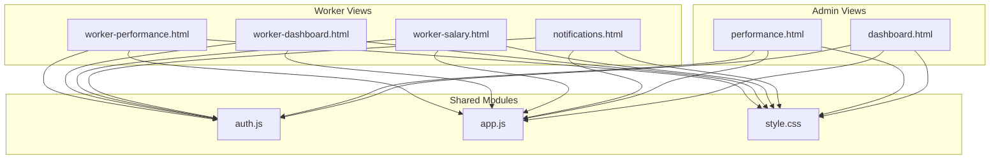
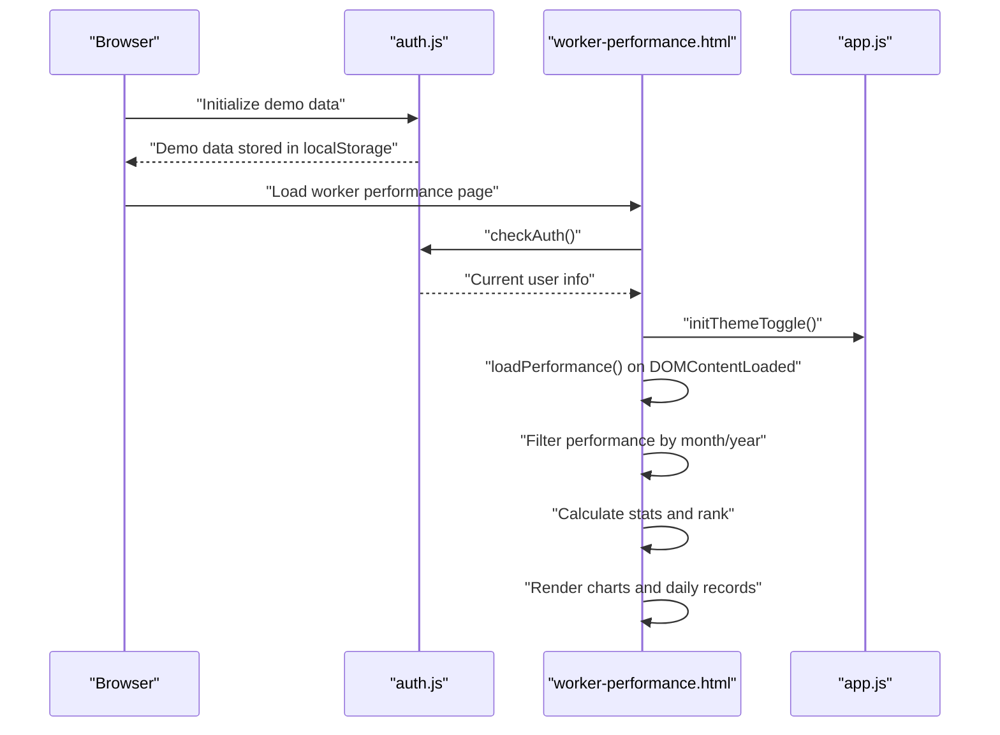
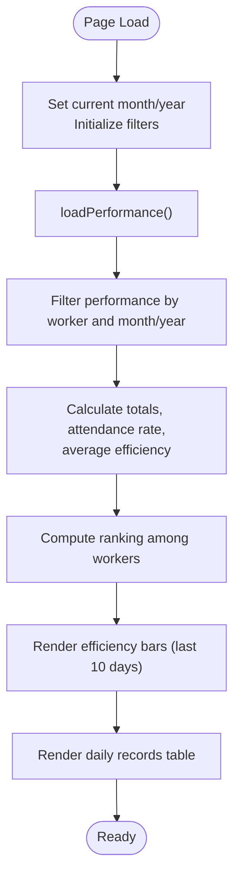
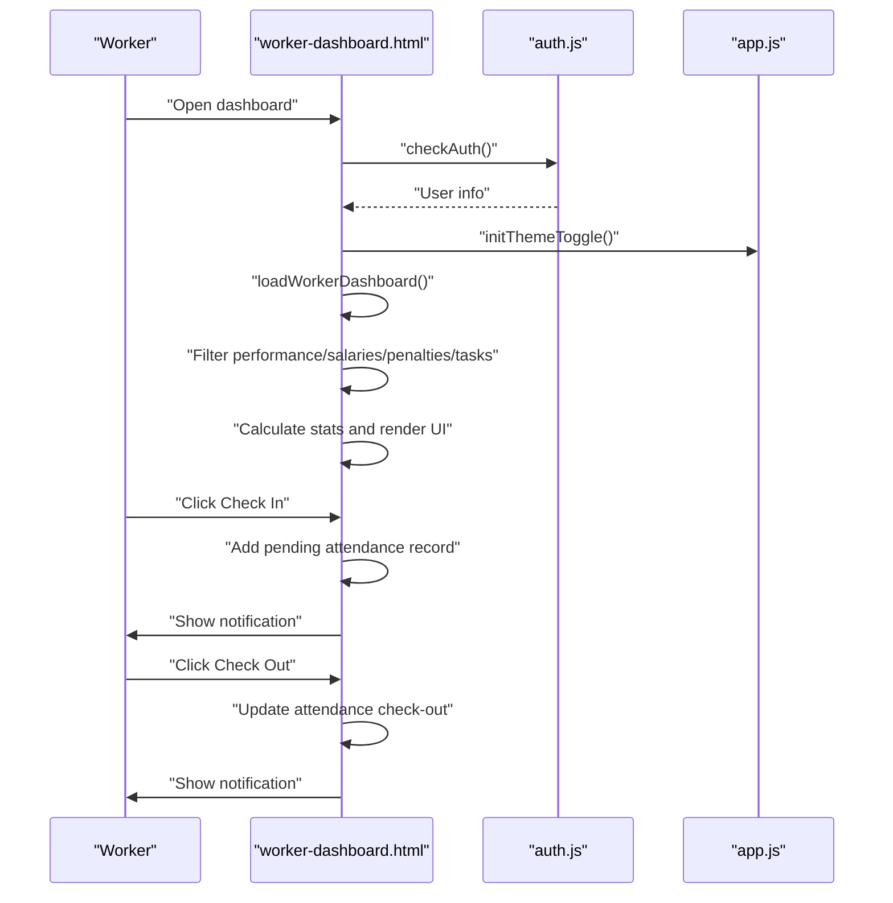
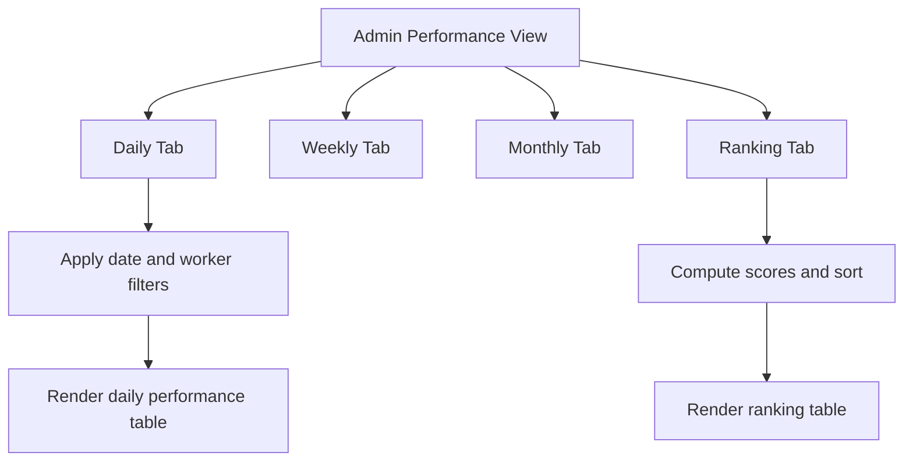
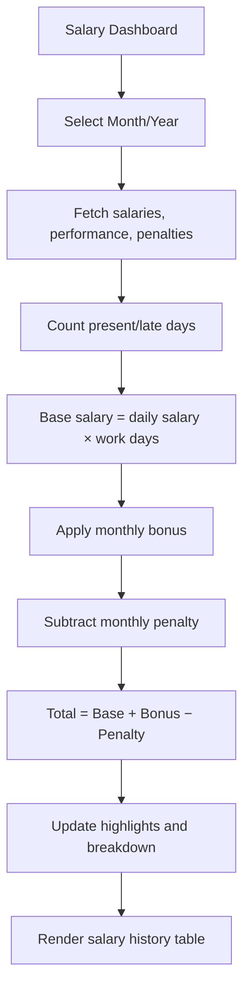
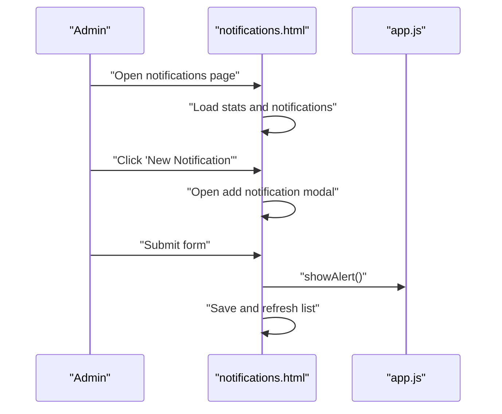
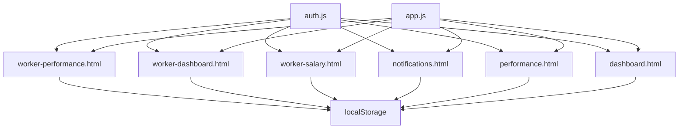

# Worker Performance View

<cite>
**Referenced Files in This Document**
- [worker-performance.html](file://worker-performance.html)
- [worker-dashboard.html](file://worker-dashboard.html)
- [performance.html](file://performance.html)
- [dashboard.html](file://dashboard.html)
- [worker-salary.html](file://worker-salary.html)
- [notifications.html](file://notifications.html)
- [auth.js](file://auth.js)
- [app.js](file://app.js)
- [style.css](file://style.css)
</cite>

## Table of Contents
1. [Introduction](#introduction)
2. [Project Structure](#project-structure)
3. [Core Components](#core-components)
4. [Architecture Overview](#architecture-overview)
5. [Detailed Component Analysis](#detailed-component-analysis)
6. [Dependency Analysis](#dependency-analysis)
7. [Performance Considerations](#performance-considerations)
8. [Troubleshooting Guide](#troubleshooting-guide)
9. [Conclusion](#conclusion)

## Introduction
This document describes the worker-specific performance viewing system, focusing on the personal performance dashboard that displays individual attendance history, work hours tracking, and performance metrics. It explains how worker profiles integrate personal statistics, monthly attendance records, and performance ratings, and how self-service features enable workers to view their own attendance records, verify hours worked, and track performance improvements. The system includes responsive design elements optimized for mobile access and a simplified interface focused on personal data visibility. Filtering options allow viewing performance by month, quarter, or year periods. The notification system supports performance alerts, attendance reminders, and milestone achievements. Finally, the system integrates with salary calculations through work day tracking and performance-based bonuses.

## Project Structure
The worker performance system is composed of several HTML pages and shared JavaScript modules:
- Worker performance dashboard: displays personal performance metrics, attendance breakdown, and daily records.
- Worker dashboard: provides quick access to check-in/out, salary preview, recent penalties, and tasks.
- Performance administration: allows administrators to manage daily, weekly, monthly, and ranking views.
- Salary dashboard: shows monthly salary calculations, bonuses, penalties, and historical salary records.
- Notifications: centralized notification management for system-wide messages.
- Shared modules: authentication and common application utilities.

**Diagram sources**
- [worker-performance.html](file://worker-performance.html)
- [worker-dashboard.html](file://worker-dashboard.html)
- [worker-salary.html](file://worker-salary.html)
- [notifications.html](file://notifications.html)
- [performance.html](file://performance.html)
- [dashboard.html](file://dashboard.html)
- [auth.js](file://auth.js)
- [app.js](file://app.js)
- [style.css](file://style.css)

**Section sources**
- [worker-performance.html](file://worker-performance.html)
- [worker-dashboard.html](file://worker-dashboard.html)
- [performance.html](file://performance.html)
- [dashboard.html](file://dashboard.html)
- [worker-salary.html](file://worker-salary.html)
- [notifications.html](file://notifications.html)
- [auth.js](file://auth.js)
- [app.js](file://app.js)
- [style.css](file://style.css)

## Core Components
- Personal Performance Dashboard: Presents total work days, attendance rate, average efficiency, and ranking within the selected month. Provides monthly filters and displays daily records with status badges and efficiency progress bars.
- Worker Dashboard: Offers quick check-in/check-out actions, today’s salary preview, bonus and penalty summaries, monthly attendance summary, recent penalties, and upcoming tasks.
- Performance Administration: Allows administrators to view daily, weekly, monthly, and ranking performance across all workers.
- Salary Dashboard: Calculates and displays current month’s salary breakdown, cumulative bonuses and penalties, and historical salary records filtered by month and year.
- Notifications: Centralized system for sending and managing notifications with categories (announcements, info, warnings, urgent, system).
- Authentication and Utilities: Manages user sessions, initializes demo data, and provides helper functions for data retrieval, formatting, and UI interactions.

**Section sources**
- [worker-performance.html](file://worker-performance.html)
- [worker-dashboard.html](file://worker-dashboard.html)
- [performance.html](file://performance.html)
- [worker-salary.html](file://worker-salary.html)
- [notifications.html](file://notifications.html)
- [auth.js](file://auth.js)
- [app.js](file://app.js)

## Architecture Overview
The system follows a client-side architecture using HTML, CSS, and JavaScript with localStorage for data persistence. Authentication ensures role-based access, redirecting workers to their dashboards and administrators to administrative views. Shared utilities handle UI interactions, theme toggling, modals, and common formatting.

**Diagram sources**
- [auth.js](file://auth.js)
- [worker-performance.html](file://worker-performance.html)
- [app.js](file://app.js)

**Section sources**
- [auth.js](file://auth.js)
- [worker-performance.html](file://worker-performance.html)
- [app.js](file://app.js)

## Detailed Component Analysis

### Personal Performance Dashboard
The worker performance dashboard aggregates personal performance metrics and presents them in an intuitive layout:
- Statistics cards: total work days, attendance rate, average efficiency, and ranking.
- Monthly filter: dropdowns for selecting month and year to view performance for a specific period.
- Attendance breakdown: counts for present, late, absent, and excused days.
- Efficiency chart: bar visualization of daily efficiency for the last 10 days.
- Daily records: table of daily entries with status badges, hours worked, efficiency percentage, and notes.

Key behaviors:
- On page load, the current month and year are preselected.
- Filters trigger recalculation of statistics and re-rendering of charts and tables.
- Ranking is computed by averaging efficiency across all workers for the selected month.

**Diagram sources**
- [worker-performance.html](file://worker-performance.html)

**Section sources**
- [worker-performance.html](file://worker-performance.html)

### Worker Dashboard
The worker dashboard provides quick access to daily operations and personal summaries:
- Welcome card with avatar and current date.
- Stats cards: today’s salary, total bonuses, total penalties, and work days in the current month.
- Monthly salary calculation: base salary, bonus, penalty, and total salary computation.
- Attendance summary: present, late, absent, and excused days for the current month.
- Recent penalties: recent penalty records with date, amount, and reason.
- My tasks: list of pending tasks with status badges.
- Quick actions: links to permission requests and shift change requests.

Self-service features:
- Check-in/out buttons: workers can record check-in with pending status and later check-out when approved.
- Notification system: animated notifications for check-in/out actions and other events.

**Diagram sources**
- [worker-dashboard.html](file://worker-dashboard.html)
- [auth.js](file://auth.js)
- [app.js](file://app.js)

**Section sources**
- [worker-dashboard.html](file://worker-dashboard.html)
- [auth.js](file://auth.js)
- [app.js](file://app.js)

### Performance Administration
The performance administration page enables administrators to view aggregated performance data:
- Tabs for daily, weekly, monthly, and ranking views.
- Daily performance table with worker name, date, status, hours worked, efficiency, and notes.
- Ranking table with average efficiency, attendance rate, and composite score.
- Modal for adding performance records with worker selection, date, status, hours worked, and efficiency.

Filtering and sorting:
- Date and worker filters for daily view.
- Ranking computed by weighted average of efficiency and attendance rate.

**Diagram sources**
- [performance.html](file://performance.html)

**Section sources**
- [performance.html](file://performance.html)

### Salary Dashboard
The worker salary dashboard computes and displays salary details:
- Current month highlight card showing total salary for the selected month.
- Salary breakdown: daily salary, work days, base salary, bonus, penalty, and total.
- Mini stats: total bonuses, total penalties, and average salary across history.
- Month filter: select month and year to view salary details.
- Salary history table: monthly records with work days, base salary, bonus, penalty, and total.

Integration with performance:
- Work days are derived from attendance records (present or late) for the selected month.
- Bonuses and penalties are pulled from salary and penalty records respectively.

**Diagram sources**
- [worker-salary.html](file://worker-salary.html)

**Section sources**
- [worker-salary.html](file://worker-salary.html)

### Notifications System
The notifications system supports sending and managing notifications:
- Stats: total, unread, read, and announcement counts.
- Tabs: filter by all, unread, announcements, or system notifications.
- Modal for creating notifications with title, message, type, and target audience.
- Actions: mark as read, delete, and mark all as read.

Worker-specific features:
- Animated notifications for check-in/out actions on the worker dashboard.
- Centralized notification storage in localStorage.

**Diagram sources**
- [notifications.html](file://notifications.html)
- [app.js](file://app.js)

**Section sources**
- [notifications.html](file://notifications.html)
- [app.js](file://app.js)

### Responsive Design and Mobile Access
The system is designed with responsive layouts optimized for mobile devices:
- Flexible grid layouts adapt to screen sizes.
- Touch-friendly controls and buttons.
- Sidebar navigation collapses on smaller screens.
- Theme toggle supports light/dark modes.

Common UI patterns:
- Cards with header/body structure for content organization.
- Progress bars and badges for visual indicators.
- Modal dialogs for forms and confirmations.

**Section sources**
- [style.css](file://style.css)
- [app.js](file://app.js)

## Dependency Analysis
The worker performance system relies on shared modules and localStorage for data:
- Authentication module provides user session management, demo data initialization, and helper functions for retrieving and saving data.
- Application utilities offer common UI behaviors, theme switching, modals, tabs, and formatting helpers.
- Pages depend on these modules for consistent behavior and reduced duplication.

**Diagram sources**
- [auth.js](file://auth.js)
- [app.js](file://app.js)
- [worker-performance.html](file://worker-performance.html)
- [worker-dashboard.html](file://worker-dashboard.html)
- [worker-salary.html](file://worker-salary.html)
- [notifications.html](file://notifications.html)
- [performance.html](file://performance.html)
- [dashboard.html](file://dashboard.html)

**Section sources**
- [auth.js](file://auth.js)
- [app.js](file://app.js)
- [worker-performance.html](file://worker-performance.html)
- [worker-dashboard.html](file://worker-dashboard.html)
- [worker-salary.html](file://worker-salary.html)
- [notifications.html](file://notifications.html)
- [performance.html](file://performance.html)
- [dashboard.html](file://dashboard.html)

## Performance Considerations
- Client-side filtering and rendering: The system performs filtering and sorting in the browser. For large datasets, consider pagination or server-side filtering to improve responsiveness.
- Efficient DOM updates: Batch DOM updates when rendering charts and tables to minimize reflows.
- LocalStorage usage: Data is persisted in localStorage. For larger datasets, consider IndexedDB or server-side storage.
- Theme switching: Theme toggle reads and writes to localStorage; ensure minimal reflows during mode changes.
- Animation and transitions: Smooth animations enhance UX but can impact performance on low-end devices; keep animations lightweight.

## Troubleshooting Guide
Common issues and resolutions:
- Authentication errors: Ensure the user is logged in and has the correct role. The system redirects unauthorized users to appropriate dashboards.
- Missing data: Verify that demo data is initialized. The authentication module sets up default workers, tasks, performance, salaries, penalties, permissions, and shift changes.
- Filter not updating: Confirm that the month and year selectors are changed and that the page reloads or triggers the load function.
- Notifications not appearing: Check that the notification modal is closed and that the page has finished loading.
- Salary calculation discrepancies: Verify that work days are counted from attendance records (present or late) and that bonuses/penalties are correctly applied.

**Section sources**
- [auth.js](file://auth.js)
- [worker-performance.html](file://worker-performance.html)
- [worker-dashboard.html](file://worker-dashboard.html)
- [worker-salary.html](file://worker-salary.html)
- [notifications.html](file://notifications.html)

## Conclusion
The worker performance viewing system provides a comprehensive, self-service solution for workers to monitor attendance history, track work hours, and review performance metrics. With responsive design and simplified interfaces, it enhances accessibility and transparency. The integrated notification system keeps workers informed about performance milestones and administrative updates. Through tight integration with salary calculations, it supports fair compensation based on work day tracking and performance ratings. The modular architecture using shared utilities and localStorage ensures maintainability and scalability.