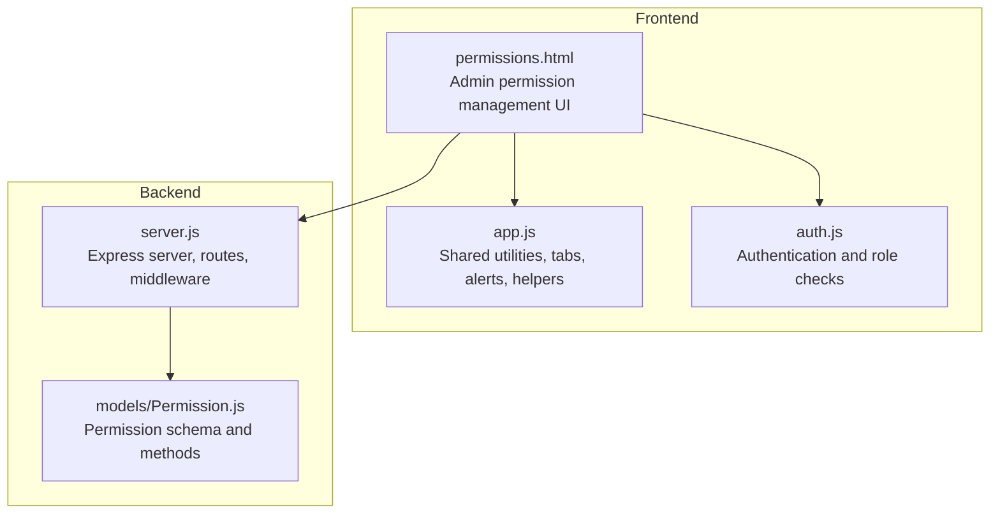
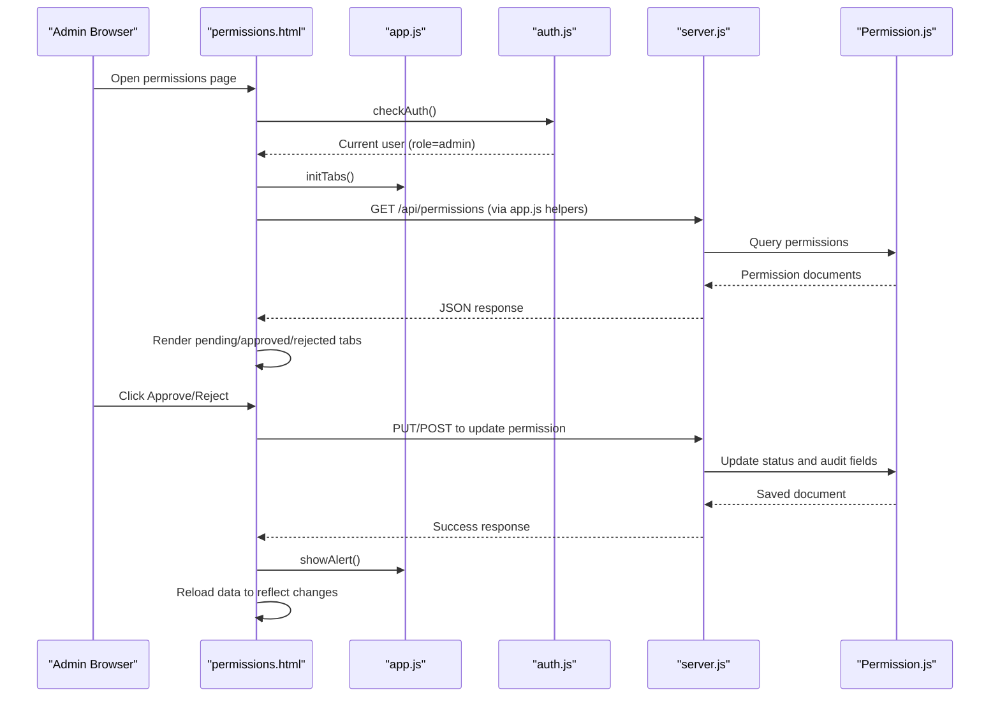
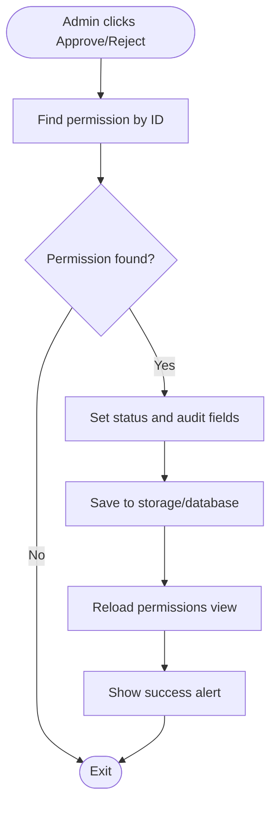
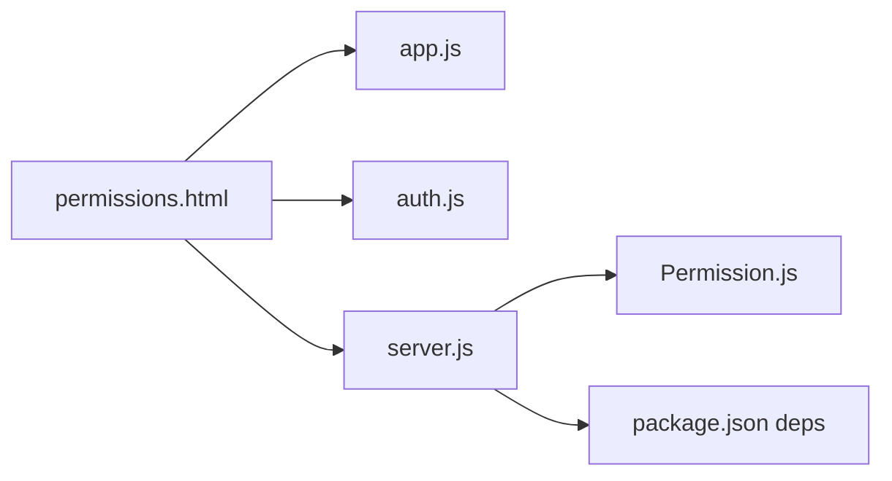

# Administrative Permission Management

<cite>
**Referenced Files in This Document**
- [permissions.html](file://permissions.html)
- [app.js](file://app.js)
- [auth.js](file://auth.js)
- [server.js](file://backend/server.js)
- [Permission.js](file://backend/models/Permission.js)
- [package.json](file://backend/package.json)
</cite>

## Table of Contents
1. [Introduction](#introduction)
2. [Project Structure](#project-structure)
3. [Core Components](#core-components)
4. [Architecture Overview](#architecture-overview)
5. [Detailed Component Analysis](#detailed-component-analysis)
6. [Dependency Analysis](#dependency-analysis)
7. [Performance Considerations](#performance-considerations)
8. [Troubleshooting Guide](#troubleshooting-guide)
9. [Conclusion](#conclusion)

## Introduction
This document describes the administrative permission management system used by supervisors and administrators to review, approve, and reject worker leave requests. It covers the complete workflow from request submission to final decision, the three-tab interface for pending, approved, and rejected requests, the approval and rejection processes, data display, administrative controls, notifications, and integration with the worker database. It also outlines permission data structures, approval workflows, and administrative reporting capabilities.

## Project Structure
The system consists of:
- Frontend pages for administration and worker views
- Shared frontend utilities and authentication
- Backend server exposing REST APIs and managing MongoDB data
- Mongoose models defining the permission data schema and approval workflow



**Diagram sources**
- [permissions.html:1-148](file://permissions.html#L1-L148)
- [app.js:1-412](file://app.js#L1-L412)
- [auth.js](file://auth.js)
- [server.js:1-184](file://backend/server.js#L1-L184)
- [Permission.js:1-213](file://backend/models/Permission.js#L1-L213)

**Section sources**
- [permissions.html:1-148](file://permissions.html#L1-L148)
- [app.js:1-412](file://app.js#L1-L412)
- [server.js:1-184](file://backend/server.js#L1-L184)
- [Permission.js:1-213](file://backend/models/Permission.js#L1-L213)

## Core Components
- Admin permission page: displays pending, approved, and rejected requests in separate tabs, supports inline approval/rejection actions for pending items, and shows worker name, leave type, date range, and reason.
- Shared utilities: tab switching, alerts, theme toggle, search, sorting, CSV export, printing, and local storage helpers.
- Authentication: ensures only administrators can access admin pages and sets user info in the sidebar.
- Backend server: exposes REST endpoints under /api, including permissions, and integrates with MongoDB via Mongoose.
- Permission model: defines the permission data structure, approval workflow with multiple levels, paid/unpaid flags, documents, substitutes, and metadata.

Key implementation references:
- Admin UI and actions: [permissions.html:54-148](file://permissions.html#L54-L148)
- Tab initialization and helpers: [app.js:155-172](file://app.js#L155-L172), [app.js:108-127](file://app.js#L108-L127)
- Authentication guard and user info: [permissions.html:86-89](file://permissions.html#L86-L89), [auth.js](file://auth.js)
- Backend routes registration: [server.js:95-118](file://backend/server.js#L95-L118)
- Permission schema and methods: [Permission.js:1-213](file://backend/models/Permission.js#L1-L213)

**Section sources**
- [permissions.html:54-148](file://permissions.html#L54-L148)
- [app.js:108-127](file://app.js#L108-L127)
- [auth.js](file://auth.js)
- [server.js:95-118](file://backend/server.js#L95-L118)
- [Permission.js:1-213](file://backend/models/Permission.js#L1-L213)

## Architecture Overview
The system follows a client-server architecture:
- The admin UI runs in the browser and fetches permission data from the backend.
- The backend server handles authentication, route dispatch, and interacts with MongoDB via Mongoose.
- The Permission model encapsulates the approval workflow and persistence logic.



**Diagram sources**
- [permissions.html:86-148](file://permissions.html#L86-L148)
- [app.js:155-172](file://app.js#L155-L172)
- [auth.js](file://auth.js)
- [server.js:95-118](file://backend/server.js#L95-L118)
- [Permission.js:153-201](file://backend/models/Permission.js#L153-L201)

## Detailed Component Analysis

### Three-Tab Interface and Filtering
- Tabs: Pending, Approved, Rejected. Switching handled by shared tab utilities.
- Filtering: Each tab filters the dataset by status and renders a table with worker name, type, start/end dates, reason, and action buttons for pending items.
- Empty states: Displays appropriate empty messages per tab.
- Data display: Shows worker name, leave type (paid/unpaid), date range, and reason. Action buttons for approve and reject are shown only in the pending tab.

Implementation references:
- Tab buttons and containers: [permissions.html:55-79](file://permissions.html#L55-L79)
- Tab initialization: [app.js:155-172](file://app.js#L155-L172)
- Data rendering and filtering: [permissions.html:92-117](file://permissions.html#L92-L117)
- Action buttons (approve/reject): [permissions.html:119-143](file://permissions.html#L119-L143)

**Section sources**
- [permissions.html:55-117](file://permissions.html#L55-L117)
- [app.js:155-172](file://app.js#L155-L172)

### Permission Approval and Rejection Workflow
- Approve: Updates status to approved, records approver ID and timestamp, and triggers UI feedback.
- Reject: Updates status to rejected, records approver ID and timestamp, and triggers UI feedback.
- Audit trail: Fields capture who approved/rejected and when.
- Notifications: Uses shared alert utilities to inform the admin of successful actions.



**Diagram sources**
- [permissions.html:119-143](file://permissions.html#L119-L143)

**Section sources**
- [permissions.html:119-143](file://permissions.html#L119-L143)
- [app.js:108-127](file://app.js#L108-L127)

### Permission Data Structures
The permission record includes:
- Worker reference and type (annual, sick, unpaid, maternity, paternity, bereavement, emergency, other)
- Start and end dates with calculated days
- Reason, status (pending, approved, rejected, cancelled)
- Multi-level approvals with approver, status, comment, and timestamp
- Final decision holder and timestamp
- Paid/unpaid flag, substitute, handover notes
- Supporting documents, emergency contact, return-to-work tracking
- Created/updated by metadata and timestamps

```mermaid
erDiagram
PERMISSION {
ObjectId id PK
ObjectId worker FK
string type
date startDate
date endDate
number days
string reason
string status
number currentApprovalLevel
boolean isPaid
ObjectId substitute FK
string[] documents.name
string[] documents.url
date documents.uploadedAt
string emergencyContact.name
string emergencyContact.phone
boolean returnToWork.returned
date returnToWork.returnedAt
string returnToWork.notes
ObjectId createdBy FK
ObjectId updatedBy FK
date createdAt
date updatedAt
}
APPROVAL {
number level
ObjectId approver FK
string status
string comment
date actionAt
}
PERMISSION ||--o{ APPROVAL : "approvals"
```

**Diagram sources**
- [Permission.js:3-136](file://backend/models/Permission.js#L3-L136)

**Section sources**
- [Permission.js:3-136](file://backend/models/Permission.js#L3-L136)

### Administrative Controls and Actions
- Inline actions: Approve and Reject buttons in the pending tab.
- Status updates: Immediate client-side status change and persistence.
- Audit fields: approvedBy, approvedAt, rejectedBy, rejectedAt.
- Alerts: Success notifications for approve/reject actions.

References:
- Action buttons and handlers: [permissions.html:119-143](file://permissions.html#L119-L143)
- Alert utility: [app.js:108-127](file://app.js#L108-L127)

**Section sources**
- [permissions.html:119-143](file://permissions.html#L119-L143)
- [app.js:108-127](file://app.js#L108-L127)

### Integration with Worker Database
- Worker lookup: The admin UI resolves worker names from stored worker IDs.
- Backend integration: The server exposes permissions endpoints and connects to MongoDB via Mongoose.
- Authentication: Role-based access ensures only admins can view and modify permissions.

References:
- Worker lookup and rendering: [permissions.html:105-115](file://permissions.html#L105-L115)
- Backend routes registration: [server.js:95-118](file://backend/server.js#L95-L118)
- Dependencies and environment: [package.json:11-32](file://backend/package.json#L11-L32)

**Section sources**
- [permissions.html:105-115](file://permissions.html#L105-L115)
- [server.js:95-118](file://backend/server.js#L95-L118)
- [package.json:11-32](file://backend/package.json#L11-L32)

### Administrative Reporting Capabilities
- Export to CSV: Built-in utility exports provided datasets to CSV.
- Print functionality: Dedicated function prints a given section.
- Sorting and search: Utilities support sorting and filtering for improved reporting.

References:
- CSV export: [app.js:225-244](file://app.js#L225-L244)
- Print: [app.js:247-265](file://app.js#L247-L265)
- Sorting and search helpers: [app.js:199-222](file://app.js#L199-L222), [app.js:175-196](file://app.js#L175-L196)

**Section sources**
- [app.js:225-244](file://app.js#L225-L244)
- [app.js:247-265](file://app.js#L247-L265)
- [app.js:199-222](file://app.js#L199-L222)
- [app.js:175-196](file://app.js#L175-L196)

## Dependency Analysis
- Frontend depends on shared utilities for tabs, alerts, and helpers.
- Admin page depends on authentication to enforce role-based access.
- Backend depends on Express, Mongoose, and various middleware for security, logging, and routing.
- Permission model encapsulates approval logic and persistence.



**Diagram sources**
- [permissions.html:86-148](file://permissions.html#L86-L148)
- [app.js:155-172](file://app.js#L155-L172)
- [auth.js](file://auth.js)
- [server.js:95-118](file://backend/server.js#L95-L118)
- [Permission.js:1-213](file://backend/models/Permission.js#L1-L213)
- [package.json:11-32](file://backend/package.json#L11-L32)

**Section sources**
- [permissions.html:86-148](file://permissions.html#L86-L148)
- [app.js:155-172](file://app.js#L155-L172)
- [server.js:95-118](file://backend/server.js#L95-L118)
- [Permission.js:1-213](file://backend/models/Permission.js#L1-L213)
- [package.json:11-32](file://backend/package.json#L11-L32)

## Performance Considerations
- Client-side filtering and rendering are efficient for small to medium datasets; consider pagination or server-side filtering for large datasets.
- Use indexes on frequently queried fields (worker, status, dates) to optimize backend queries.
- Debounce and throttle utilities can help reduce unnecessary computations during user interactions.
- Compression and caching strategies can improve server response times.

## Troubleshooting Guide
- Authentication errors: Verify the current user role and that the authentication guard redirects unauthorized users appropriately.
- Empty tabs: Ensure permissions data exists and matches the expected structure; confirm worker IDs resolve to valid worker records.
- Approval failures: Check that the permission ID exists and that the update operation persists successfully.
- Alerts not appearing: Confirm the alert utility is invoked and that the DOM insertion logic executes correctly.

**Section sources**
- [permissions.html:86-89](file://permissions.html#L86-L89)
- [permissions.html:119-143](file://permissions.html#L119-L143)
- [app.js:108-127](file://app.js#L108-L127)

## Conclusion
The administrative permission management system provides a clear, role-protected interface for reviewing and acting on leave requests. The three-tab layout, inline actions, and audit trail support efficient administration. The backend model supports multi-level approvals and comprehensive metadata, enabling robust tracking and reporting. With shared utilities for alerts, sorting, and export, administrators can manage permissions effectively while maintaining transparency and compliance.