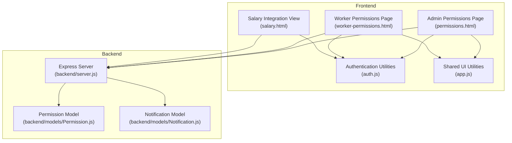
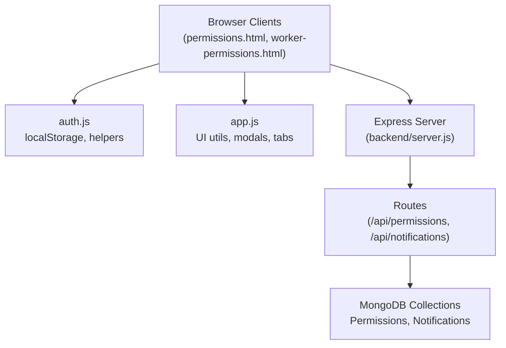
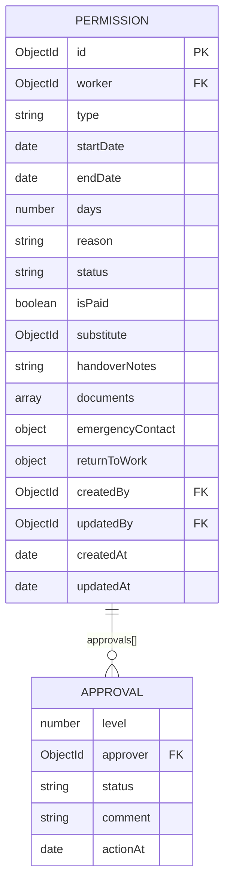
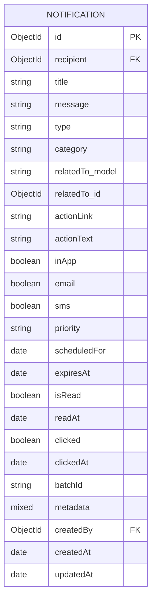
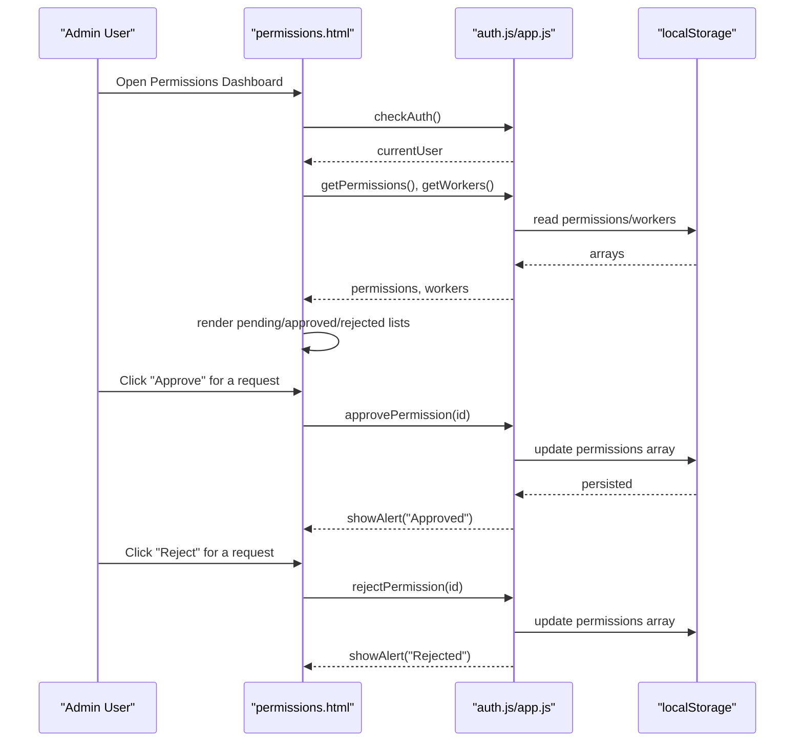
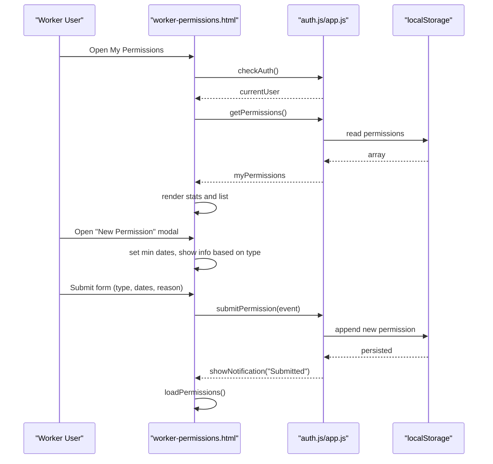
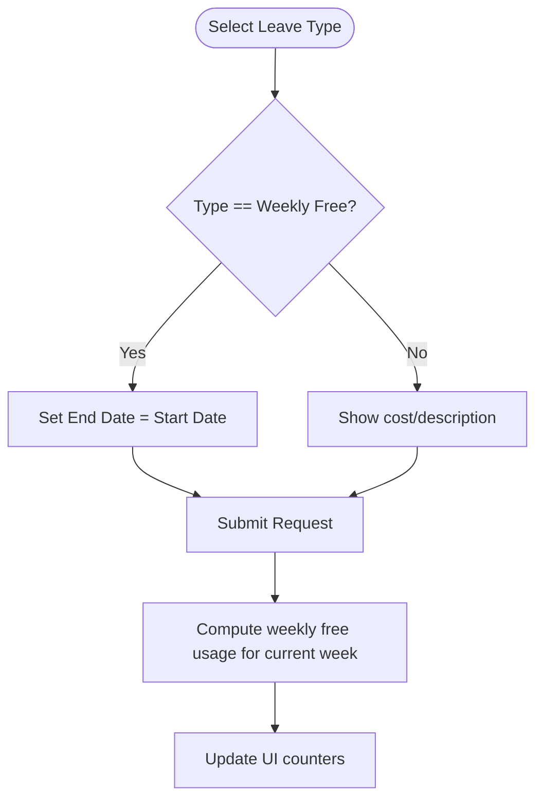
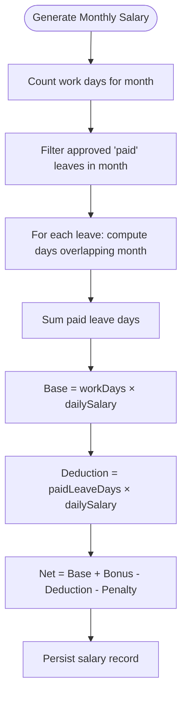
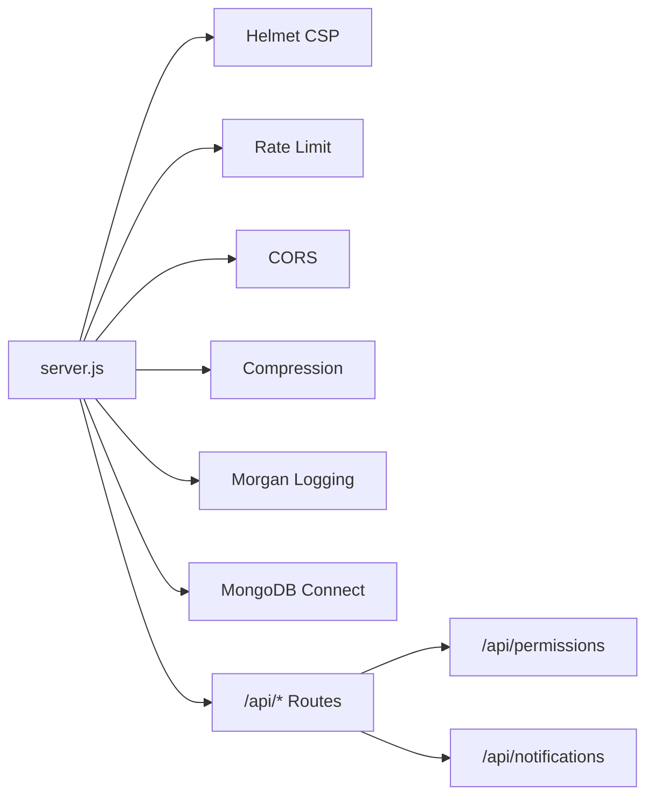
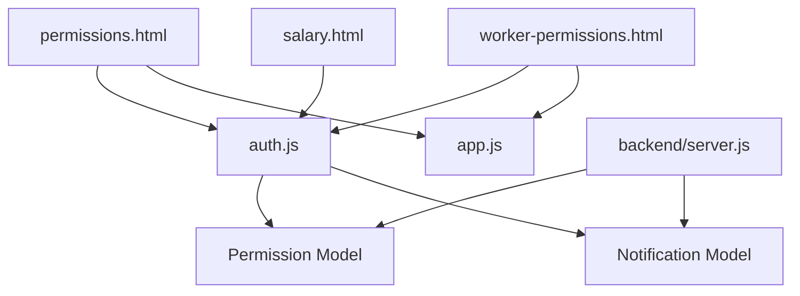

# Permission & Leave System

<cite>
**Referenced Files in This Document**
- [permissions.html](file://permissions.html)
- [worker-permissions.html](file://worker-permissions.html)
- [auth.js](file://auth.js)
- [app.js](file://app.js)
- [salary.html](file://salary.html)
- [backend/server.js](file://backend/server.js)
- [backend/models/Permission.js](file://backend/models/Permission.js)
- [backend/models/Notification.js](file://backend/models/Notification.js)
</cite>

## Table of Contents
1. [Introduction](#introduction)
2. [Project Structure](#project-structure)
3. [Core Components](#core-components)
4. [Architecture Overview](#architecture-overview)
5. [Detailed Component Analysis](#detailed-component-analysis)
6. [Dependency Analysis](#dependency-analysis)
7. [Performance Considerations](#performance-considerations)
8. [Troubleshooting Guide](#troubleshooting-guide)
9. [Conclusion](#conclusion)

## Introduction
This document describes the permission and leave management system used by the 555 İnşaat construction workforce management platform. It covers the end-to-end workflows for submitting leave requests, approval processes, tracking, and integration with salary calculations. It also documents the data model for permissions, administrative controls, notifications, and audit-ready activity tracking.

## Project Structure
The system comprises:
- Frontend pages for administrators and workers to manage and track permissions
- Shared frontend utilities for authentication, data access, and UI behaviors
- A backend server exposing REST APIs and managing MongoDB persistence
- Domain models for permissions and notifications

**Diagram sources**
- [permissions.html](file://permissions.html)
- [worker-permissions.html](file://worker-permissions.html)
- [auth.js](file://auth.js)
- [app.js](file://app.js)
- [salary.html](file://salary.html)
- [backend/server.js](file://backend/server.js)
- [backend/models/Permission.js](file://backend/models/Permission.js)
- [backend/models/Notification.js](file://backend/models/Notification.js)

**Section sources**
- [permissions.html](file://permissions.html)
- [worker-permissions.html](file://worker-permissions.html)
- [auth.js](file://auth.js)
- [app.js](file://app.js)
- [salary.html](file://salary.html)
- [backend/server.js](file://backend/server.js)
- [backend/models/Permission.js](file://backend/models/Permission.js)
- [backend/models/Notification.js](file://backend/models/Notification.js)

## Core Components
- Admin permissions dashboard: displays pending/approved/rejected requests, allows approvals and rejections, and shows request details.
- Worker permissions portal: enables employees to submit requests, view statistics, filter history, and see weekly free leave usage.
- Shared utilities: authentication, data persistence via localStorage, UI helpers, and formatting functions.
- Backend server: Express-based API surface, route exposure, and MongoDB integration.
- Domain models: Permission and Notification schemas with indexes, lifecycle hooks, and helper methods.

Key capabilities:
- Request types: annual, sick, unpaid, maternity, paternity, bereavement, emergency, other (backend model)
- Status tracking: pending, approved, rejected, cancelled (backend model)
- Approval workflow: multi-level approvals with per-level tracking and final decision
- Paid/unpaid flags and document attachments for supporting evidence
- Notifications: in-app, email, SMS delivery channels with categories and read tracking
- Salary integration: paid leave days calculation impacting monthly deductions

**Section sources**
- [permissions.html](file://permissions.html)
- [worker-permissions.html](file://worker-permissions.html)
- [auth.js](file://auth.js)
- [app.js](file://app.js)
- [backend/models/Permission.js](file://backend/models/Permission.js)
- [backend/models/Notification.js](file://backend/models/Notification.js)

## Architecture Overview
The system follows a client-server pattern:
- Clients (admin and worker dashboards) persist data locally in browser storage and interact with backend endpoints via REST.
- The backend server initializes security middleware, rate limiting, logging, and routes for permissions and notifications.
- MongoDB stores domain entities with indexes and pre-save logic for derived fields.

**Diagram sources**
- [backend/server.js](file://backend/server.js)
- [permissions.html](file://permissions.html)
- [worker-permissions.html](file://worker-permissions.html)
- [auth.js](file://auth.js)
- [app.js](file://app.js)

## Detailed Component Analysis

### Data Model: Permission
The Permission model defines the schema for leave/permission requests, including:
- Worker reference and type classification
- Start/end dates and computed days
- Reason, status, and paid/unpaid flag
- Multi-level approvals with per-level tracking
- Final decision metadata
- Optional substitute, handover notes, documents, emergency contact
- Return-to-work tracking
- Created/updated by metadata

**Diagram sources**
- [backend/models/Permission.js](file://backend/models/Permission.js)

**Section sources**
- [backend/models/Permission.js](file://backend/models/Permission.js)

### Data Model: Notification
Notifications support multi-channel delivery and categorization:
- Recipient, title, message, type (info/success/warning/error), category (permission, salary, etc.)
- Related entity linkage, action link/text
- Delivery channels (in-app/email/SMS), priority, scheduling, expiration
- Read/click tracking and metadata

**Diagram sources**
- [backend/models/Notification.js](file://backend/models/Notification.js)

**Section sources**
- [backend/models/Notification.js](file://backend/models/Notification.js)

### Admin Permissions Dashboard Workflow
The admin page organizes permissions by status and supports approval/rejection actions. It loads permission records, worker details, and renders a tabbed interface.

**Diagram sources**
- [permissions.html](file://permissions.html)
- [auth.js](file://auth.js)
- [app.js](file://app.js)

**Section sources**
- [permissions.html](file://permissions.html)
- [auth.js](file://auth.js)
- [app.js](file://app.js)

### Worker Permissions Submission and Tracking
The worker portal allows employees to:
- Submit new requests with type selection (weekly free, paid, unpaid, sick, family)
- View statistics (total, weekly free, pending, paid leave)
- Filter and sort their permission history
- See status badges and calculated durations

**Diagram sources**
- [worker-permissions.html](file://worker-permissions.html)
- [auth.js](file://auth.js)
- [app.js](file://app.js)

**Section sources**
- [worker-permissions.html](file://worker-permissions.html)
- [auth.js](file://auth.js)
- [app.js](file://app.js)

### Leave Entitlements and Weekly Free Day Logic
The worker interface enforces a weekly free day entitlement:
- Weekly free day is limited to one day per week
- The UI restricts end date to match start date for weekly free selections
- Statistics compute used weekly free days vs. allowance

**Diagram sources**
- [worker-permissions.html](file://worker-permissions.html)

**Section sources**
- [worker-permissions.html](file://worker-permissions.html)

### Salary Integration and Paid Leave Deductions
Monthly salary computation considers:
- Work days (present, late, approved)
- Paid leave days (approved "paid" type) within the month
- Daily wage and deductions
- Penalties and bonuses adjustments

**Diagram sources**
- [salary.html](file://salary.html)

**Section sources**
- [salary.html](file://salary.html)

### Backend Server and Route Exposure
The backend server configures:
- Security (Helmet), rate limiting, CORS, compression, logging
- Static file serving for uploads/public
- MongoDB connection and cron job initialization
- Route registration for permissions and notifications
- Health check and global error handling

**Diagram sources**
- [backend/server.js](file://backend/server.js)

**Section sources**
- [backend/server.js](file://backend/server.js)

## Dependency Analysis
- Frontend depends on shared utilities for authentication, data access, and UI behaviors.
- Admin and worker dashboards share common helpers for modals, tabs, alerts, and date formatting.
- Backend depends on Mongoose for modeling and MongoDB for persistence.
- Permission model encapsulates approval workflow and derived fields.
- Notification model supports multi-channel delivery and read tracking.

**Diagram sources**
- [permissions.html](file://permissions.html)
- [worker-permissions.html](file://worker-permissions.html)
- [auth.js](file://auth.js)
- [app.js](file://app.js)
- [salary.html](file://salary.html)
- [backend/server.js](file://backend/server.js)
- [backend/models/Permission.js](file://backend/models/Permission.js)
- [backend/models/Notification.js](file://backend/models/Notification.js)

**Section sources**
- [permissions.html](file://permissions.html)
- [worker-permissions.html](file://worker-permissions.html)
- [auth.js](file://auth.js)
- [app.js](file://app.js)
- [salary.html](file://salary.html)
- [backend/server.js](file://backend/server.js)
- [backend/models/Permission.js](file://backend/models/Permission.js)
- [backend/models/Notification.js](file://backend/models/Notification.js)

## Performance Considerations
- Client-side filtering and rendering are lightweight but can be optimized by virtualizing large lists.
- UI animations and counters should be throttled to avoid layout thrashing.
- Backend queries should leverage indexes on worker, status, dates, and type for efficient filtering.
- Pre-save hooks compute derived fields; ensure minimal overhead by validating inputs early.
- Consider pagination for large datasets in admin dashboards.

## Troubleshooting Guide
Common issues and resolutions:
- Authentication failures: verify credentials and role checks; ensure localStorage initialization runs before page logic.
- Empty permission lists: confirm localStorage keys exist and are populated; check date filters and status conditions.
- Approval/rejection not reflected: ensure the update routine persists to localStorage and refreshes the view.
- Salary calculation discrepancies: validate monthly overlap logic for partial-month leaves and paid leave counts.
- Notification delivery: verify channel flags and category routing; ensure recipients exist and notifications are not expired.

**Section sources**
- [auth.js](file://auth.js)
- [permissions.html](file://permissions.html)
- [worker-permissions.html](file://worker-permissions.html)
- [salary.html](file://salary.html)
- [backend/models/Notification.js](file://backend/models/Notification.js)

## Conclusion
The permission and leave system integrates a straightforward client-side workflow with backend models for robust approval tracking, multi-level approvals, and salary impact calculations. Administrators can efficiently review and act on requests, while workers benefit from a clear submission and tracking experience, including weekly free day enforcement and monthly deduction computations.