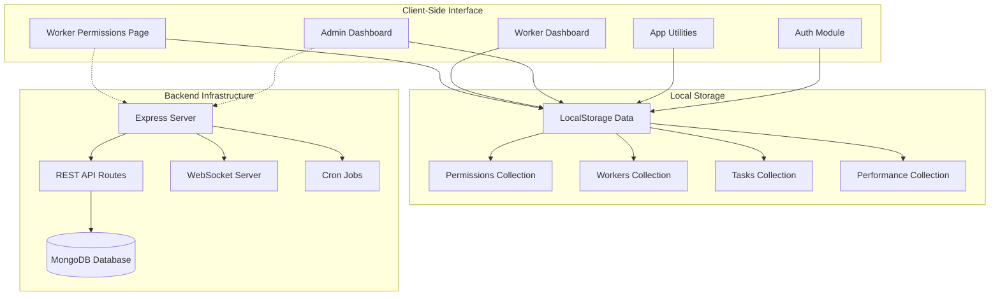
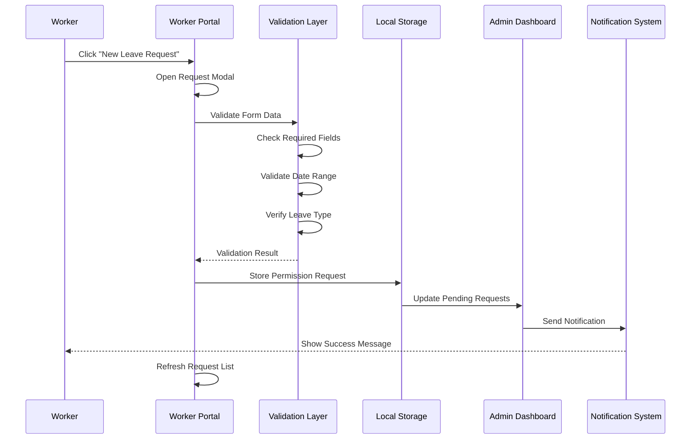
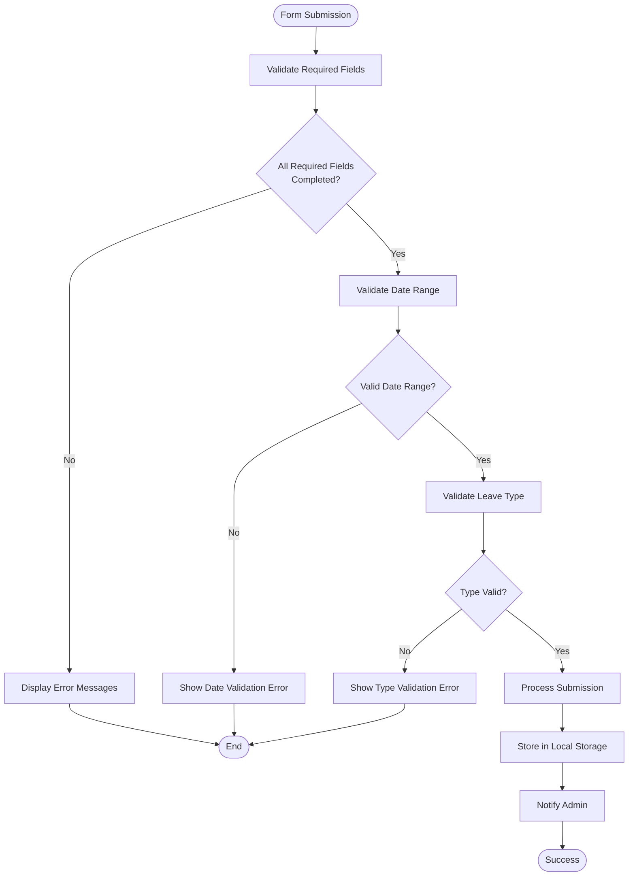
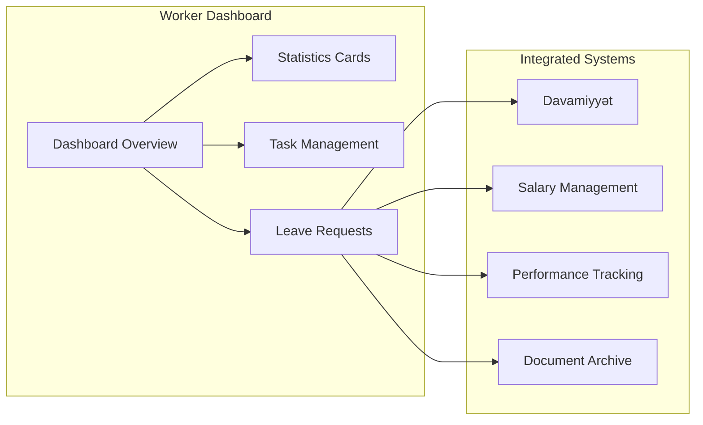

# Worker Leave Request Interface

<cite>
**Referenced Files in This Document**
- [worker-permissions.html](file://worker-permissions.html)
- [permissions.html](file://permissions.html)
- [auth.js](file://auth.js)
- [app.js](file://app.js)
- [worker-dashboard.html](file://worker-dashboard.html)
- [dashboard.html](file://dashboard.html)
- [style.css](file://style.css)
- [backend/server.js](file://backend/server.js)
- [backend/package.json](file://backend/package.json)
</cite>

## Table of Contents
1. [Introduction](#introduction)
2. [System Architecture](#system-architecture)
3. [Worker Leave Request Interface](#worker-leave-request-interface)
4. [Leave Request Submission Process](#leave-request-submission-process)
5. [Form Validation and Processing](#form-validation-and-processing)
6. [Request History Tracking](#request-history-tracking)
7. [Worker Dashboard Integration](#worker-dashboard-integration)
8. [Leave Type Selection System](#leave-type-selection-system)
9. [Date Range Validation](#date-range-validation)
10. [Notification System](#notification-system)
11. [Admin Approval Workflow](#admin-approval-workflow)
12. [Performance Considerations](#performance-considerations)
13. [Troubleshooting Guide](#troubleshooting-guide)
14. [Conclusion](#conclusion)

## Introduction

The Worker Leave Request Interface is a comprehensive self-service system designed for construction workers to manage their leave requests within the 555 İnşaat worker management platform. This system provides workers with the ability to submit leave applications, track request status, view historical records, and manage their leave entitlements independently, while maintaining integration with administrative oversight and approval workflows.

The interface supports multiple leave types including annual leave, sick leave, unpaid leave, family emergencies, and weekly free leave, with automatic validation and notification systems ensuring smooth operation across all user roles.

## System Architecture

The leave request system follows a client-side architecture pattern with local storage persistence, integrated with a comprehensive backend API infrastructure supporting real-time communication and advanced features.

**Diagram sources**
- [worker-permissions.html](file://worker-permissions.html)
- [auth.js](file://auth.js)
- [backend/server.js](file://backend/server.js)

The system architecture ensures scalability through modular design, with clear separation between presentation logic, business logic, and data persistence layers.

## Worker Leave Request Interface

The worker leave request interface is built around a responsive HTML structure with Bootstrap Icons integration, providing an intuitive user experience for leave management operations.

### Interface Components

The primary interface consists of several key components:

**Weekly Free Day Information Card**
- Displays weekly unpaid leave entitlement (1 day per week)
- Shows current usage status and remaining balance
- Provides clear policy information for workers

**Statistics Dashboard**
- Total leave count tracking
- Pending request monitoring
- Approved vs rejected request ratios
- Paid leave day calculations

**Request Filtering System**
- All requests view
- Pending approval filtering
- Approved request tracking
- Rejected request history

**Submission Modal Interface**
- Date range selection with validation
- Leave type categorization
- Reason input with character limits
- Real-time validation feedback

### Visual Design Elements

The interface utilizes a cohesive color scheme with status-specific indicators:
- Success green for approved requests
- Warning yellow for pending requests  
- Danger red for rejected requests
- Information blue for system notifications

**Section sources**
- [worker-permissions.html:85-171](file://worker-permissions.html#L85-L171)
- [style.css:1-27](file://style.css#L1-L27)

## Leave Request Submission Process

The leave request submission process follows a structured workflow ensuring data integrity and user guidance throughout the entire process.

**Diagram sources**
- [worker-permissions.html:352-391](file://worker-permissions.html#L352-L391)
- [auth.js:150-156](file://auth.js#L150-L156)

### Submission Workflow Steps

1. **Modal Initialization**: The request modal opens with pre-configured minimum date restrictions
2. **Form Population**: Workers fill in required information including dates, leave type, and reason
3. **Real-time Validation**: Automatic validation prevents invalid submissions
4. **Data Persistence**: Successful submissions are stored in local storage with timestamp metadata
5. **Administrative Notification**: Admin dashboards receive immediate updates for pending approvals
6. **Confirmation Feedback**: Workers receive instant confirmation messages

**Section sources**
- [worker-permissions.html:342-391](file://worker-permissions.html#L342-L391)

## Form Validation and Processing

The form validation system implements comprehensive client-side validation to ensure data integrity and prevent invalid submissions.

### Validation Rules

**Required Field Validation**
- All mandatory fields must be completed before submission
- Visual error indicators highlight incomplete fields
- Real-time validation prevents submission of incomplete forms

**Date Range Validation**
- End date cannot precede start date
- Future date restriction prevents past date submissions
- Weekly free leave automatically limits to single day duration

**Leave Type Validation**
- Weekly free leave restricted to 1-day maximum
- Paid leave automatically calculates daily deduction
- Unpaid leave properly categorized without financial impact

### Processing Logic

The validation system employs a multi-layered approach:

**Diagram sources**
- [worker-permissions.html:364-368](file://worker-permissions.html#L364-L368)
- [worker-permissions.html:421-445](file://worker-permissions.html#L421-L445)

**Section sources**
- [worker-permissions.html:352-445](file://worker-permissions.html#L352-L445)

## Request History Tracking

The system maintains comprehensive historical tracking of all leave requests with detailed status monitoring and timeline visualization.

### Historical Data Structure

Each leave request maintains detailed metadata:

**Core Request Properties**
- Unique identifier for tracking
- Worker identification for ownership
- Date range specification (start/end dates)
- Leave type categorization
- Reason for leave request
- Status progression tracking
- Timestamp metadata for chronological ordering

**Status Timeline Management**
- Creation timestamp for request initiation
- Approval timestamp for administrative action
- Rejection timestamp for negative outcomes
- Modification timestamps for status changes

### Historical View Features

**Filtering Capabilities**
- All requests regardless of status
- Pending approval requests only
- Approved request history
- Rejected request archive

**Sorting and Organization**
- Chronological sorting by creation date
- Status-based grouping
- Leave type categorization
- Duration-based organization

**Statistical Analysis**
- Total leave taken calculations
- Pending request monitoring
- Approval rate tracking
- Usage pattern analysis

**Section sources**
- [worker-permissions.html:240-340](file://worker-permissions.html#L240-L340)

## Worker Dashboard Integration

The leave request interface integrates seamlessly with the broader worker dashboard ecosystem, providing unified access to all workforce management features.

### Dashboard Navigation

The worker dashboard serves as the central hub for leave management:

**Navigation Structure**
- Dashboard overview with key metrics
- Performance statistics integration
- Task management coordination
- Leave request quick access
- Document management linkage

**Information Integration**
- Leave balance displays
- Pending approval indicators
- Historical usage patterns
- Policy compliance tracking

### Cross-System Coordination

The dashboard facilitates coordination between different workforce management aspects:

**Diagram sources**
- [worker-dashboard.html:261-282](file://worker-dashboard.html#L261-L282)

**Section sources**
- [worker-dashboard.html:261-282](file://worker-dashboard.html#L261-L282)

## Leave Type Selection System

The leave type selection system provides comprehensive categorization supporting various employment scenarios and company policies.

### Leave Type Categories

**Weekly Free Leave**
- One unpaid leave day per week
- Automatic daily limitation
- No financial deduction
- Policy compliance tracking

**Paid Leave Options**
- Annual leave with full pay
- Sick leave with medical coverage
- Family emergency leave
- Other special circumstances

**Unpaid Leave Types**
- Personal leave without pay
- Administrative leave
- Study leave arrangements

### Type-Specific Processing

Each leave type undergoes specialized validation and processing:

**Weekly Free Leave Processing**
- Automatic 1-day duration limitation
- Weekly cycle tracking
- Usage balance calculation
- Policy compliance verification

**Paid Leave Processing**
- Daily wage calculation
- Financial impact assessment
- Payroll integration coordination
- Deduction tracking

**Unpaid Leave Processing**
- No financial impact
- Documentation requirements
- Supervisor notification
- Record maintenance

**Section sources**
- [worker-permissions.html:195-203](file://worker-permissions.html#L195-L203)
- [worker-permissions.html:421-445](file://worker-permissions.html#L421-L445)

## Date Range Validation

The date range validation system ensures temporal accuracy and prevents logical inconsistencies in leave scheduling.

### Validation Rules

**Temporal Logic Validation**
- End date must be on or after start date
- Future date restriction prevents historical entries
- Weekly free leave automatic limitation
- Maximum duration enforcement

**Business Logic Integration**
- Work schedule consideration
- Company holiday calendar integration
- Peak season restrictions
- Minimum notice period requirements

### Implementation Details

The validation system operates through multiple layers:

**Client-Side Validation**
- Real-time date comparison
- Immediate user feedback
- Preventive error handling
- Enhanced user experience

**Server-Side Verification**
- Data integrity assurance
- Cross-session validation
- Audit trail maintenance
- Compliance monitoring

**Section sources**
- [worker-permissions.html:364-368](file://worker-permissions.html#L364-L368)
- [worker-permissions.html:408-411](file://worker-permissions.html#L408-L411)

## Notification System

The notification system provides real-time communication between workers, administrators, and the leave management system.

### Notification Types

**Worker Notifications**
- Request submission confirmation
- Status change alerts
- Approval/rejection notifications
- System maintenance updates

**Administrative Notifications**
- New request alerts
- Pending approval reminders
- System error notifications
- User activity logs

**System Notifications**
- Feature availability updates
- Policy change announcements
- Maintenance schedule notifications
- Performance improvement alerts

### Notification Delivery Mechanisms

The system supports multiple notification channels:

**Visual Notifications**
- Inline status indicators
- Modal confirmation dialogs
- Toast-style alerts
- Dashboard banners

**System Integration**
- Local storage synchronization
- Real-time database updates
- Cross-platform compatibility
- Mobile-responsive design

**Section sources**
- [worker-permissions.html:393-406](file://worker-permissions.html#L393-L406)
- [auth.js:55-88](file://auth.js#L55-L88)

## Admin Approval Workflow

The administrative approval workflow provides comprehensive oversight and control over leave request processing.

### Approval Stages

**Initial Review**
- Request completeness verification
- Policy compliance checking
- Documentation review
- Manager assignment

**Multi-Level Approval**
- Department head review
- HR department verification
- Senior management approval
- Final authorization

**Decision Processing**
- Approval with conditions
- Conditional approval
- Rejection with justification
- Request modification

### Administrative Tools

**Dashboard Integration**
- Pending request monitoring
- Approval queue management
- Statistical reporting
- Trend analysis

**Communication Features**
- Direct messaging capability
- Comment attachment
- Decision documentation
- Audit trail maintenance

**Section sources**
- [permissions.html:119-143](file://permissions.html#L119-L143)

## Performance Considerations

The leave request system is optimized for performance across multiple operational scenarios.

### Client-Side Optimization

**Memory Management**
- Efficient local storage utilization
- Minimal DOM manipulation
- Optimized rendering cycles
- Lazy loading implementation

**Network Efficiency**
- Reduced API calls
- Batch data processing
- Caching strategies
- Connection pooling

### Scalability Features

**Database Design**
- Indexed query optimization
- Partitioned data structures
- Efficient join operations
- Query performance monitoring

**Load Distribution**
- Horizontal scaling support
- Session management optimization
- Resource allocation strategies
- Performance monitoring

## Troubleshooting Guide

Common issues and their resolution strategies for the leave request system.

### Authentication Issues

**Problem**: Users unable to access worker portal
- **Solution**: Verify role-based authentication
- **Prevention**: Regular session validation checks

**Problem**: Incorrect user redirection
- **Solution**: Check authentication middleware
- **Prevention**: Implement proper route guards

### Data Synchronization Issues

**Problem**: Leave requests not appearing in lists
- **Solution**: Verify local storage synchronization
- **Prevention**: Implement data refresh mechanisms

**Problem**: Duplicate request submissions
- **Solution**: Check form validation logic
- **Prevention**: Implement submission throttling

### Performance Issues

**Problem**: Slow page loading
- **Solution**: Optimize JavaScript execution
- **Prevention**: Minimize DOM operations

**Problem**: Memory leaks in long sessions
- **Solution**: Implement proper cleanup procedures
- **Prevention**: Regular memory monitoring

**Section sources**
- [auth.js:55-88](file://auth.js#L55-L88)
- [app.js:352-370](file://app.js#L352-L370)

## Conclusion

The Worker Leave Request Interface represents a comprehensive solution for modern workforce management, combining intuitive user experience with robust administrative oversight. The system successfully balances worker autonomy with organizational control, providing essential tools for effective leave management in construction environments.

Key strengths of the system include its responsive design, comprehensive validation framework, real-time notification capabilities, and seamless integration with broader workforce management tools. The multi-level approval system ensures appropriate oversight while maintaining efficient processing workflows.

Future enhancements could include expanded integration with external calendar systems, advanced analytics capabilities, and mobile application support. The modular architecture provides a solid foundation for these potential improvements while maintaining system stability and performance.

The implementation demonstrates best practices in client-side application development, with clear separation of concerns, comprehensive error handling, and user-centric design principles that enhance both worker satisfaction and administrative efficiency.