# Project Overview

<cite>
**Referenced Files in This Document**
- [index.html](file://index.html)
- [login.html](file://login.html)
- [dashboard.html](file://dashboard.html)
- [auth.js](file://auth.js)
- [app.js](file://app.js)
- [style.css](file://style.css)
- [workers.html](file://workers.html)
- [tasks.html](file://tasks.html)
- [salary.html](file://salary.html)
- [performance.html](file://performance.html)
- [worker-dashboard.html](file://worker-dashboard.html)
- [seller-dashboard.html](file://seller-dashboard.html)
- [backend/server.js](file://backend/server.js)
- [backend/package.json](file://backend/package.json)
</cite>

## Table of Contents
1. [Introduction](#introduction)
2. [Project Structure](#project-structure)
3. [Core Components](#core-components)
4. [Architecture Overview](#architecture-overview)
5. [Detailed Component Analysis](#detailed-component-analysis)
6. [Dependency Analysis](#dependency-analysis)
7. [Performance Considerations](#performance-considerations)
8. [Troubleshooting Guide](#troubleshooting-guide)
9. [Conclusion](#conclusion)

## Introduction
The 555 İnşaat İşçi İdarəetmə Sistemi is a comprehensive workforce management solution tailored for construction companies. It centralizes key HR and operational functions—employee management, task tracking, performance monitoring, and salary processing—into a unified web application. The system supports three roles: Admin, Seller, and Worker, each with distinct dashboards and capabilities. Built with modern frontend technologies and a modular architecture, it enables efficient workforce administration, real-time visibility, and streamlined payroll calculations.

## Project Structure
The project is organized into a frontend-focused structure with role-specific pages and shared utilities, complemented by a backend server that exposes RESTful APIs for future scalability.

- Frontend
  - Landing and authentication: index.html, login.html
  - Admin dashboard and modules: dashboard.html, workers.html, tasks.html, salary.html, performance.html, and related pages
  - Role-specific dashboards: worker-dashboard.html, seller-dashboard.html
  - Shared assets: style.css, app.js, auth.js
- Backend
  - Server entrypoint and routing: backend/server.js
  - Dependencies and scripts: backend/package.json

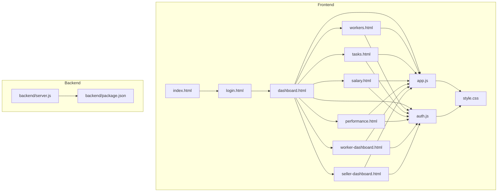

**Diagram sources**
- [index.html](file://index.html)
- [login.html](file://login.html)
- [dashboard.html](file://dashboard.html)
- [workers.html](file://workers.html)
- [tasks.html](file://tasks.html)
- [salary.html](file://salary.html)
- [performance.html](file://performance.html)
- [worker-dashboard.html](file://worker-dashboard.html)
- [seller-dashboard.html](file://seller-dashboard.html)
- [style.css](file://style.css)
- [app.js](file://app.js)
- [auth.js](file://auth.js)
- [backend/server.js](file://backend/server.js)
- [backend/package.json](file://backend/package.json)

**Section sources**
- [index.html](file://index.html)
- [login.html](file://login.html)
- [dashboard.html](file://dashboard.html)
- [workers.html](file://workers.html)
- [tasks.html](file://tasks.html)
- [salary.html](file://salary.html)
- [performance.html](file://performance.html)
- [worker-dashboard.html](file://worker-dashboard.html)
- [seller-dashboard.html](file://seller-dashboard.html)
- [style.css](file://style.css)
- [app.js](file://app.js)
- [auth.js](file://auth.js)
- [backend/server.js](file://backend/server.js)
- [backend/package.json](file://backend/package.json)

## Core Components
- Authentication and session management
  - Role-based login and redirection
  - Demo users and local data initialization
  - Utility functions for data retrieval and formatting
- Shared application utilities
  - Theme switching, tooltips, modals, tabs, search, sorting, CSV export, printing, and validation helpers
- Role-specific dashboards
  - Admin: centralized oversight of employees, tasks, performance, payroll, permissions, and reports
  - Worker: personal performance, tasks, projects, overtime, advances, salary, targets, permissions, documents, and shift changes
  - Seller: sales, orders, materials, and reporting
- Backend server
  - Express-based API server with security middleware, rate limiting, logging, static file serving, and modular routes

Key features supported by the frontend:
- Employee management: add, filter, and view workers
- Task tracking: create, assign, update status, and manage priorities
- Performance monitoring: daily logs, efficiency metrics, and ranking
- Salary processing: calculation, bonuses, penalties, and exports
- Permissions and shift changes: requests and approvals
- Reports and notifications: summaries and alerts

**Section sources**
- [auth.js](file://auth.js)
- [app.js](file://app.js)
- [dashboard.html](file://dashboard.html)
- [workers.html](file://workers.html)
- [tasks.html](file://tasks.html)
- [salary.html](file://salary.html)
- [performance.html](file://performance.html)
- [worker-dashboard.html](file://worker-dashboard.html)
- [seller-dashboard.html](file://seller-dashboard.html)
- [backend/server.js](file://backend/server.js)

## Architecture Overview
The system follows a modular frontend architecture with role-based UIs and a shared utility layer. Authentication and data persistence are handled client-side using localStorage with demo datasets. The backend provides a scalable foundation for future API integration.

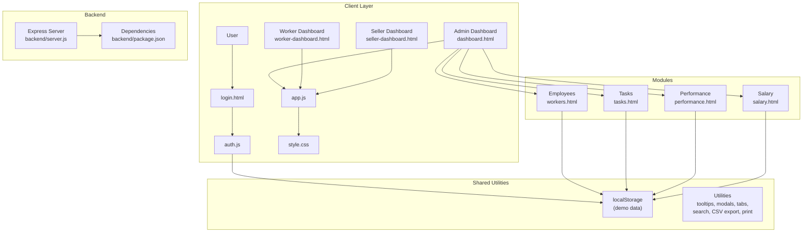

**Diagram sources**
- [login.html](file://login.html)
- [auth.js](file://auth.js)
- [app.js](file://app.js)
- [style.css](file://style.css)
- [dashboard.html](file://dashboard.html)
- [worker-dashboard.html](file://worker-dashboard.html)
- [seller-dashboard.html](file://seller-dashboard.html)
- [workers.html](file://workers.html)
- [tasks.html](file://tasks.html)
- [performance.html](file://performance.html)
- [salary.html](file://salary.html)
- [backend/server.js](file://backend/server.js)
- [backend/package.json](file://backend/package.json)

**Section sources**
- [auth.js](file://auth.js)
- [app.js](file://app.js)
- [style.css](file://style.css)
- [dashboard.html](file://dashboard.html)
- [worker-dashboard.html](file://worker-dashboard.html)
- [seller-dashboard.html](file://seller-dashboard.html)
- [workers.html](file://workers.html)
- [tasks.html](file://tasks.html)
- [performance.html](file://performance.html)
- [salary.html](file://salary.html)
- [backend/server.js](file://backend/server.js)
- [backend/package.json](file://backend/package.json)

## Detailed Component Analysis

### Authentication and Session Management
The authentication module manages role-based login, session storage, and demo data initialization. It validates credentials against predefined users and redirects to the appropriate dashboard. It also provides helper functions for retrieving and manipulating data stored in localStorage.

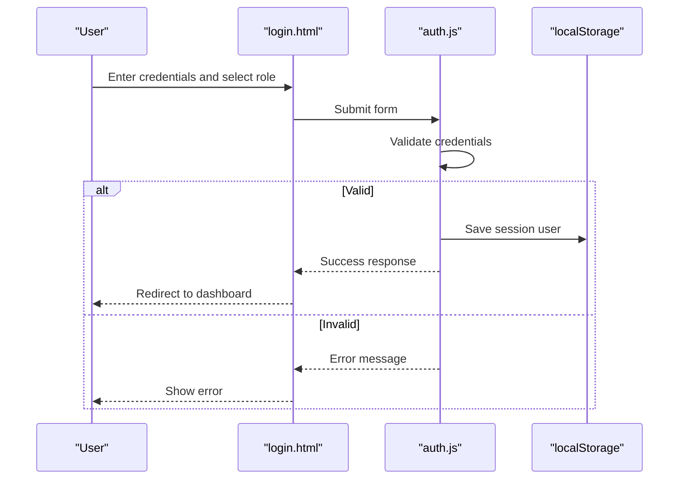

**Diagram sources**
- [login.html](file://login.html)
- [auth.js](file://auth.js)

**Section sources**
- [login.html](file://login.html)
- [auth.js](file://auth.js)

### Admin Dashboard and Modules
The Admin Dashboard aggregates key metrics, recent activities, top performers, pending requests, and today’s attendance. It links to dedicated modules for employees, tasks, performance, and salary management. The dashboard dynamically loads data from localStorage and updates UI elements accordingly.

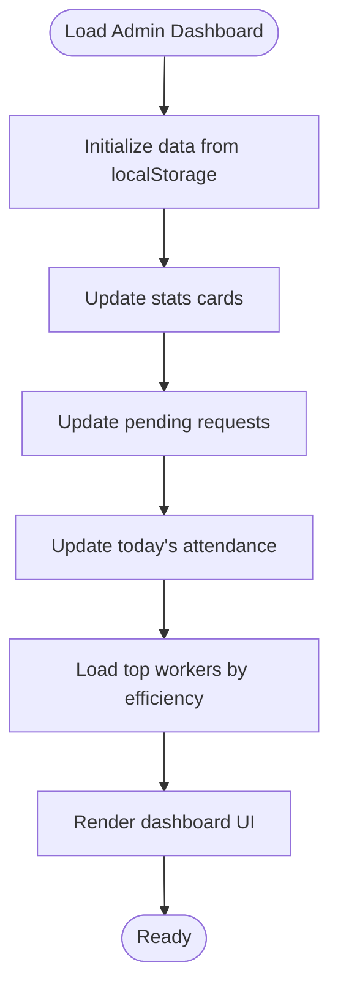

**Diagram sources**
- [dashboard.html](file://dashboard.html)
- [auth.js](file://auth.js)

**Section sources**
- [dashboard.html](file://dashboard.html)
- [auth.js](file://auth.js)

### Employee Management
The Employees page allows filtering by position, role, and status, and supports adding new workers via a modal form. It uses shared utilities for modals, forms, and data persistence.

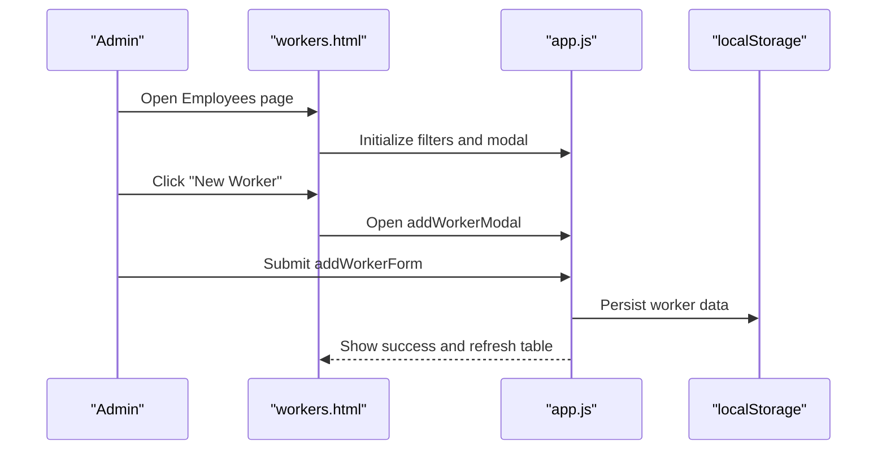

**Diagram sources**
- [workers.html](file://workers.html)
- [app.js](file://app.js)
- [auth.js](file://auth.js)

**Section sources**
- [workers.html](file://workers.html)
- [app.js](file://app.js)
- [auth.js](file://auth.js)

### Task Tracking
The Tasks page enables creation, assignment, and status updates of tasks. It integrates with the workers list to populate assignees and applies filters for status.

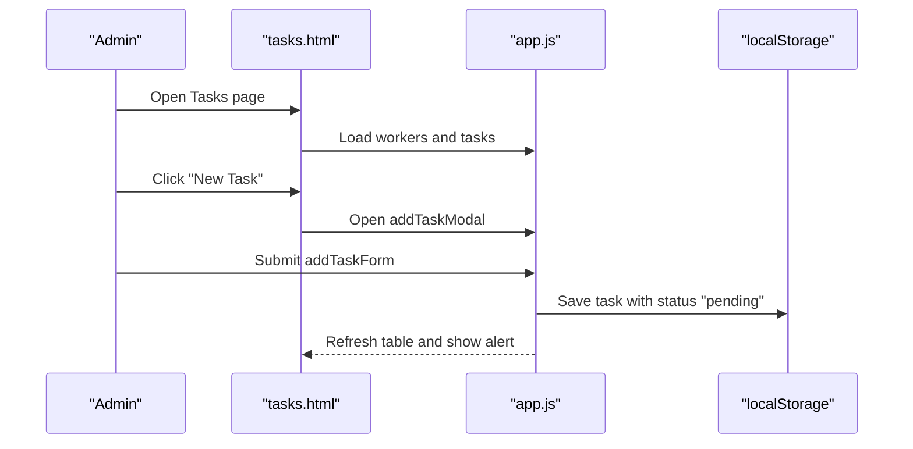

**Diagram sources**
- [tasks.html](file://tasks.html)
- [app.js](file://app.js)
- [auth.js](file://auth.js)

**Section sources**
- [tasks.html](file://tasks.html)
- [app.js](file://app.js)
- [auth.js](file://auth.js)

### Performance Monitoring
The Performance page supports daily, weekly, monthly views and ranking. It provides forms to log daily performance entries and calculates efficiency metrics.

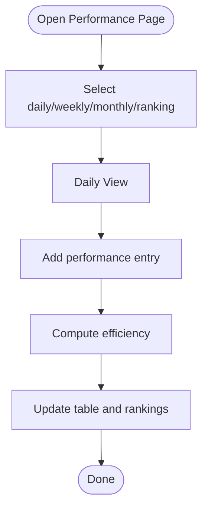

**Diagram sources**
- [performance.html](file://performance.html)
- [auth.js](file://auth.js)

**Section sources**
- [performance.html](file://performance.html)
- [auth.js](file://auth.js)

### Salary Processing
The Salary page computes monthly wages based on workdays, paid leave, bonuses, and penalties. It supports filtering by worker, month, and year, and allows editing bonus/penalty amounts.

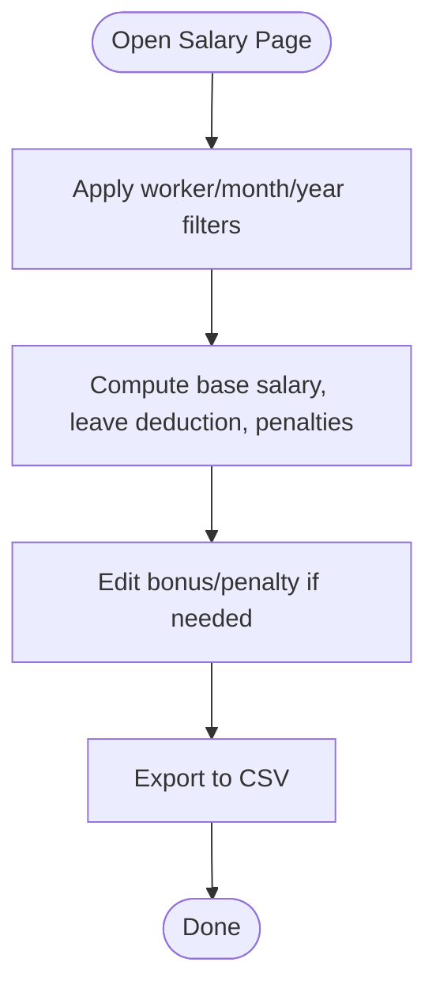

**Diagram sources**
- [salary.html](file://salary.html)
- [auth.js](file://auth.js)

**Section sources**
- [salary.html](file://salary.html)
- [auth.js](file://auth.js)

### Worker Dashboard
The Worker Dashboard presents personal statistics, salary calculations, recent penalties, and quick actions for tasks, projects, overtime, advances, and permissions.

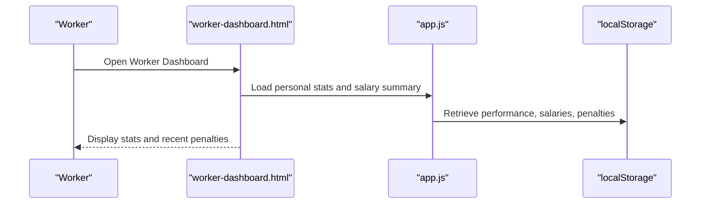

**Diagram sources**
- [worker-dashboard.html](file://worker-dashboard.html)
- [app.js](file://app.js)
- [auth.js](file://auth.js)

**Section sources**
- [worker-dashboard.html](file://worker-dashboard.html)
- [app.js](file://app.js)
- [auth.js](file://auth.js)

### Seller Dashboard
The Seller Dashboard focuses on sales, orders, materials, and reporting, enabling quick actions for adding sales and viewing low-stock materials.

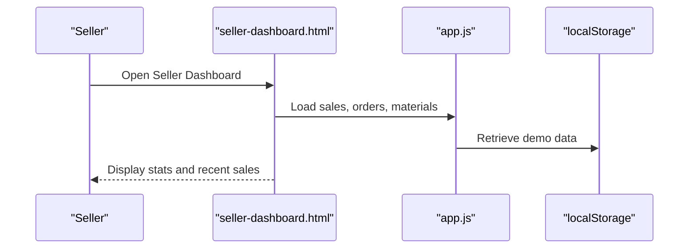

**Diagram sources**
- [seller-dashboard.html](file://seller-dashboard.html)
- [app.js](file://app.js)
- [auth.js](file://auth.js)

**Section sources**
- [seller-dashboard.html](file://seller-dashboard.html)
- [app.js](file://app.js)
- [auth.js](file://auth.js)

## Dependency Analysis
The frontend relies on shared utilities and localStorage for data management. The backend provides a robust foundation for future API expansion, including security, rate limiting, logging, and modular route organization.

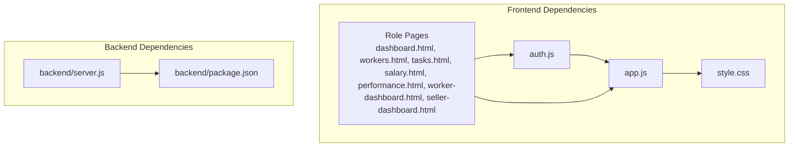

**Diagram sources**
- [app.js](file://app.js)
- [auth.js](file://auth.js)
- [style.css](file://style.css)
- [dashboard.html](file://dashboard.html)
- [workers.html](file://workers.html)
- [tasks.html](file://tasks.html)
- [salary.html](file://salary.html)
- [performance.html](file://performance.html)
- [worker-dashboard.html](file://worker-dashboard.html)
- [seller-dashboard.html](file://seller-dashboard.html)
- [backend/server.js](file://backend/server.js)
- [backend/package.json](file://backend/package.json)

**Section sources**
- [app.js](file://app.js)
- [auth.js](file://auth.js)
- [style.css](file://style.css)
- [backend/server.js](file://backend/server.js)
- [backend/package.json](file://backend/package.json)

## Performance Considerations
- Client-side data management with localStorage is suitable for small-scale demos but may require server-side persistence for production environments.
- Modular frontend architecture improves maintainability and reduces coupling between components.
- Shared utilities (tooltips, modals, tabs, CSV export) enhance user experience and reduce code duplication.
- Future enhancements could include pagination, debounced search, and lazy loading for large datasets.

## Troubleshooting Guide
Common issues and resolutions:
- Authentication failures: Verify username, password, and role selection; ensure demo users exist in localStorage.
- Data not persisting: Confirm localStorage availability and correct keys used by utilities.
- UI not updating: Ensure event listeners are attached after DOMContentLoaded and that shared utilities are loaded.
- Styling inconsistencies: Validate CSS variable usage and responsive breakpoints.

**Section sources**
- [auth.js](file://auth.js)
- [app.js](file://app.js)
- [login.html](file://login.html)

## Conclusion
The 555 İnşaat İşçi İdarəetmə Sistemi delivers a practical, role-based workforce management platform for construction companies. Its modular frontend architecture, combined with robust shared utilities and a scalable backend foundation, enables efficient administration of employees, tasks, performance, and payroll. By leveraging localStorage for demo data and providing role-specific dashboards, the system offers immediate value while laying the groundwork for future API-driven enhancements.