# Administrative Salary Interface

<cite>
**Referenced Files in This Document**
- [salary.html](file://salary.html)
- [app.js](file://app.js)
- [auth.js](file://auth.js)
- [style.css](file://style.css)
- [performance.html](file://performance.html)
- [permissions.html](file://permissions.html)
- [worker-salary.html](file://worker-salary.html)
</cite>

## Table of Contents
1. [Introduction](#introduction)
2. [Project Structure](#project-structure)
3. [Core Components](#core-components)
4. [Architecture Overview](#architecture-overview)
5. [Detailed Component Analysis](#detailed-component-analysis)
6. [Dependency Analysis](#dependency-analysis)
7. [Performance Considerations](#performance-considerations)
8. [Troubleshooting Guide](#troubleshooting-guide)
9. [Conclusion](#conclusion)

## Introduction
The Administrative Salary Interface is a comprehensive payroll management system designed for construction company administrators. This interface enables authorized personnel to calculate, manage, and track employee compensation through an intuitive web-based dashboard. The system integrates with performance tracking, leave management, and penalty systems to provide automated salary calculations based on actual work records.

The interface serves as a centralized hub for salary administration, featuring advanced filtering capabilities, real-time calculations, and comprehensive reporting tools. It ensures accurate payroll processing while maintaining transparency and auditability of all compensation-related activities.

## Project Structure
The salary management system follows a modular architecture with distinct components for different user roles and functional areas:

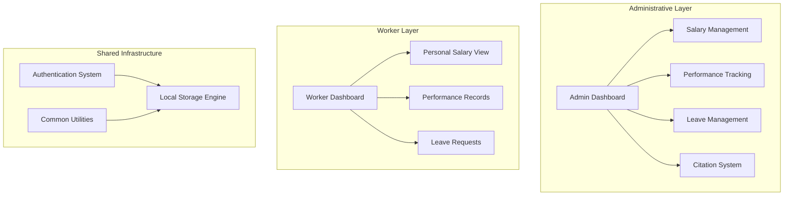

**Diagram sources**
- [salary.html:1-260](file://salary.html#L1-L260)
- [auth.js:1-213](file://auth.js#L1-L213)

**Section sources**
- [salary.html:1-260](file://salary.html#L1-L260)
- [auth.js:1-213](file://auth.js#L1-L213)

## Core Components

### Role-Based Access Control System
The system implements strict role-based access control to ensure only authorized administrators can access sensitive payroll functions:

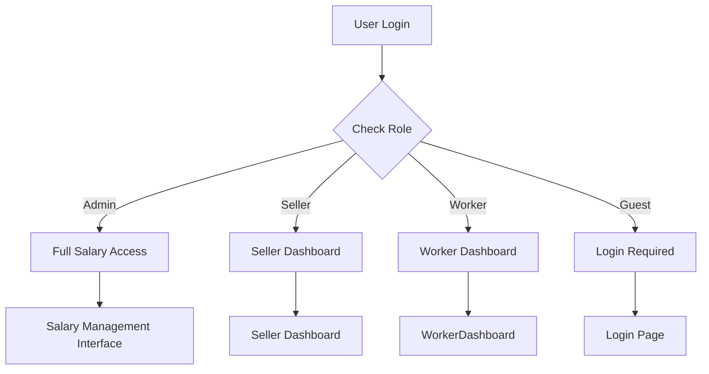

**Diagram sources**
- [auth.js:55-88](file://auth.js#L55-L88)
- [salary.html:97-99](file://salary.html#L97-L99)

The access control mechanism operates at two levels:
- **Page-level protection**: Direct URL access prevention
- **Feature-level protection**: Real-time validation during navigation

### Filter System Architecture
The administrative interface provides sophisticated filtering capabilities for precise salary management:

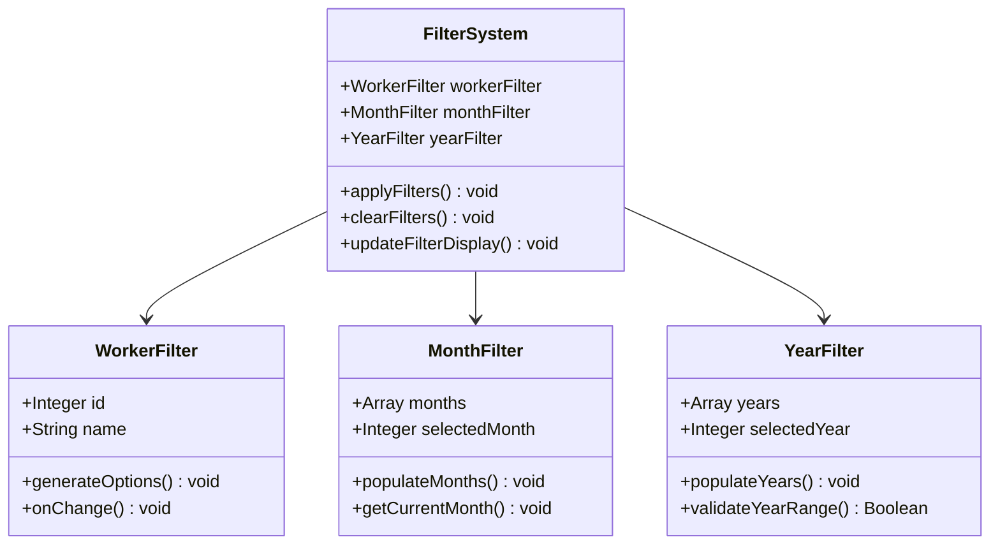

**Diagram sources**
- [salary.html:103-109](file://salary.html#L103-L109)
- [salary.html:111-143](file://salary.html#L111-L143)

**Section sources**
- [salary.html:54-61](file://salary.html#L54-L61)
- [salary.html:103-109](file://salary.html#L103-L109)

### Salary Calculation Engine
The system employs an automated calculation engine that processes multiple data sources to determine accurate compensation amounts:

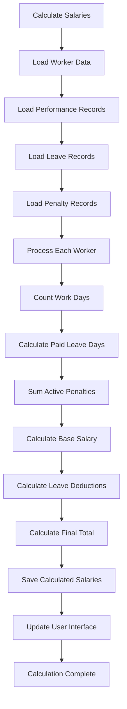

**Diagram sources**
- [salary.html:145-218](file://salary.html#L145-L218)

**Section sources**
- [salary.html:145-218](file://salary.html#L145-L218)

## Architecture Overview

### Data Flow Architecture
The salary management system operates on a reactive data flow model that ensures real-time updates and consistency:

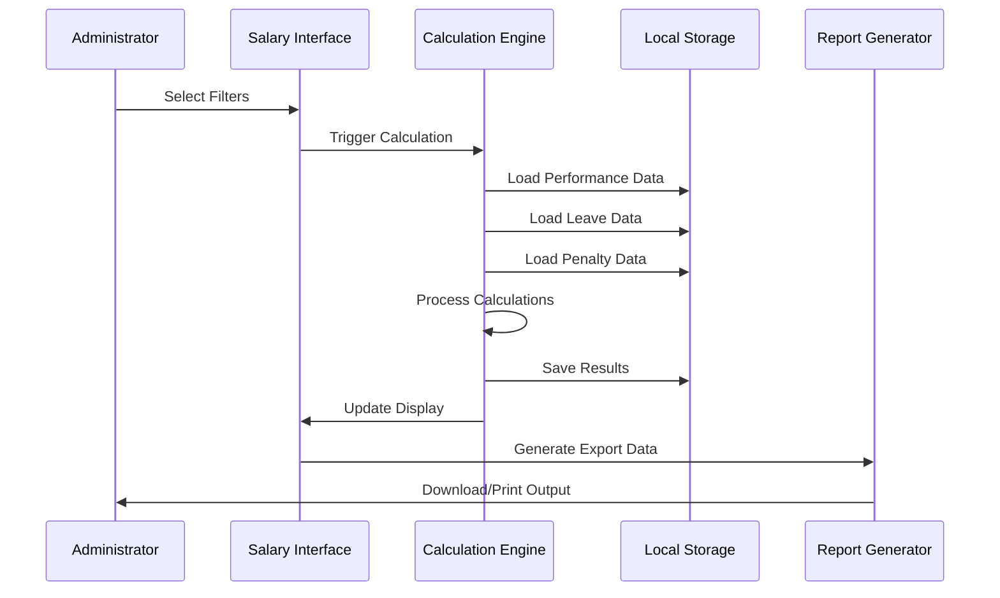

**Diagram sources**
- [salary.html:145-218](file://salary.html#L145-L218)
- [app.js:224-244](file://app.js#L224-L244)

### Component Interaction Model
The system maintains loose coupling between components through well-defined interfaces:

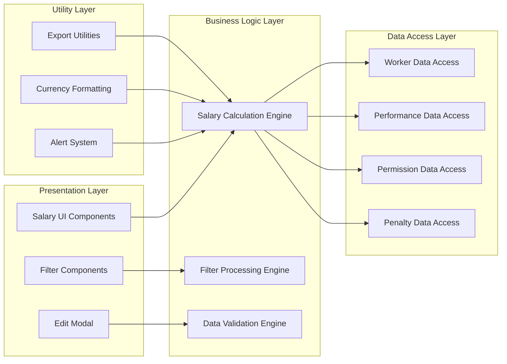

**Diagram sources**
- [salary.html:1-260](file://salary.html#L1-L260)
- [app.js:1-412](file://app.js#L1-L412)

**Section sources**
- [salary.html:1-260](file://salary.html#L1-L260)
- [app.js:1-412](file://app.js#L1-L412)

## Detailed Component Analysis

### Administrative Salary Management Interface
The primary interface serves as the central hub for administrator salary management activities:

#### Filter System Implementation
The filter system provides granular control over salary data presentation:

| Filter Type | Purpose | Implementation | Data Source |
|-------------|---------|----------------|-------------|
| Worker Selection | Individual employee filtering | Dropdown with dynamic options | Worker database |
| Month Selection | Monthly period filtering | Calendar month dropdown | Static month array |
| Year Selection | Annual period filtering | Fixed year options | Hardcoded years |

**Section sources**
- [salary.html:56-59](file://salary.html#L56-L59)
- [salary.html:103-109](file://salary.html#L103-L109)

#### Salary Table Display System
The salary table presents comprehensive compensation information with real-time formatting:

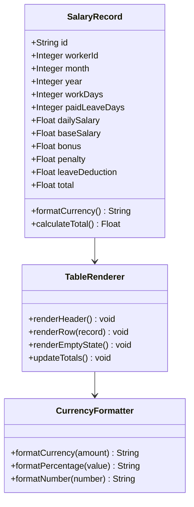

**Diagram sources**
- [salary.html:111-143](file://salary.html#L111-L143)
- [auth.js:173-179](file://auth.js#L173-L179)

**Section sources**
- [salary.html:67-75](file://salary.html#L67-L75)
- [salary.html:111-143](file://salary.html#L111-L143)

### Salary Calculation Workflow
The calculation engine processes multiple data sources to determine accurate compensation amounts:

#### Performance Data Integration
The system integrates with the performance tracking module to automatically count work days:

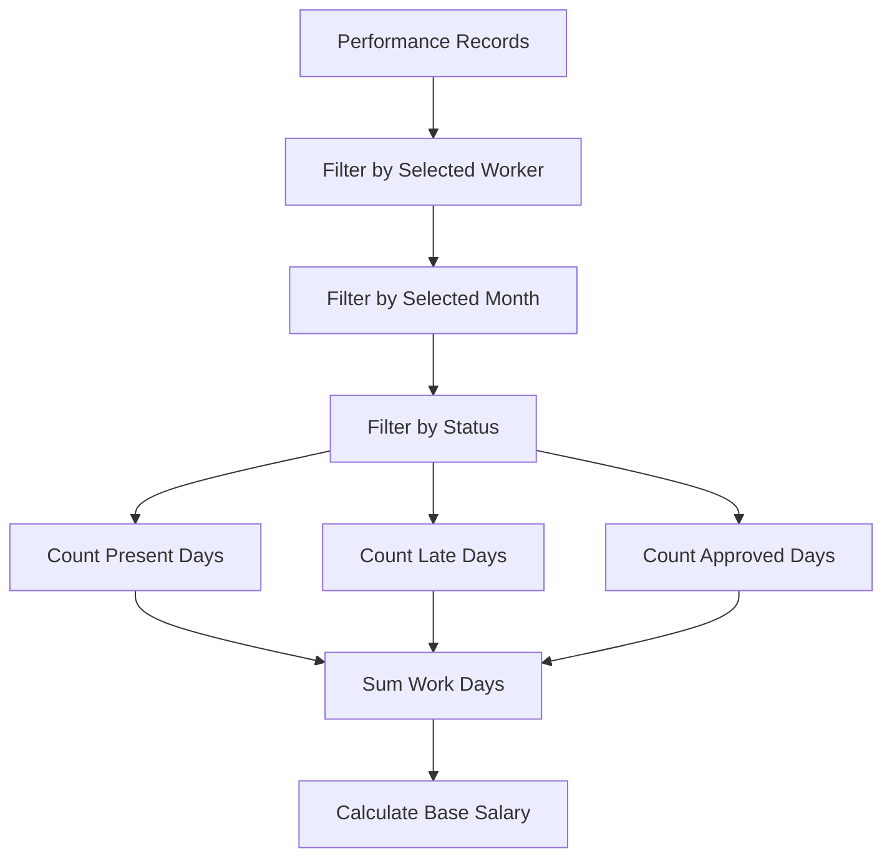

**Diagram sources**
- [salary.html:153-157](file://salary.html#L153-L157)

#### Leave Calculation Algorithm
The system implements sophisticated leave calculation logic for paid leave days:

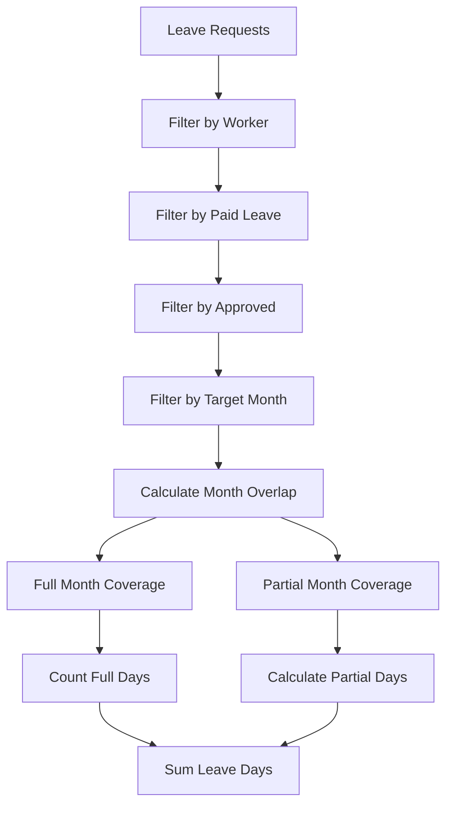

**Diagram sources**
- [salary.html:160-185](file://salary.html#L160-L185)

**Section sources**
- [salary.html:145-218](file://salary.html#L145-L218)

### Salary Editing Modal System
The editing modal provides administrators with direct control over individual salary records:

#### Modal Architecture
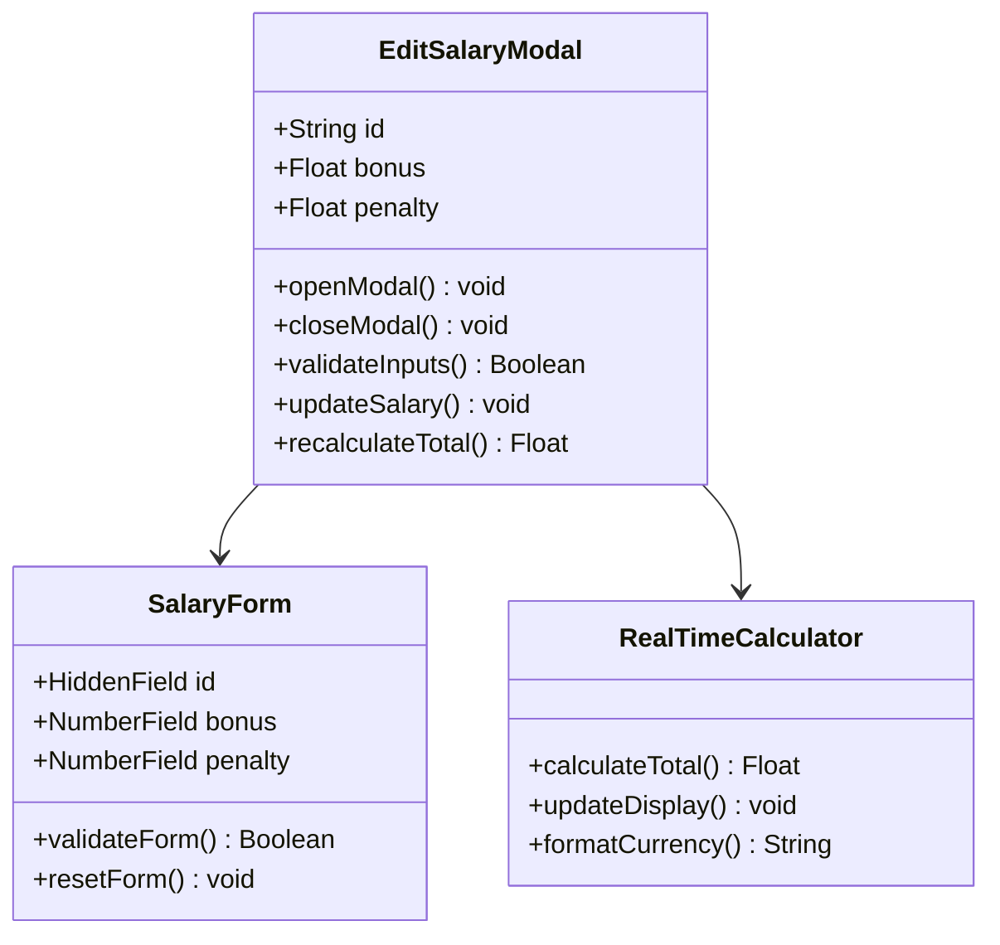

**Diagram sources**
- [salary.html:80-93](file://salary.html#L80-L93)
- [salary.html:220-247](file://salary.html#L220-L247)

#### Real-Time Calculation Updates
The modal system provides immediate feedback through real-time calculation updates:

**Section sources**
- [salary.html:220-247](file://salary.html#L220-L247)

### Export and Reporting System
The system provides comprehensive export capabilities for salary data:

#### CSV Export Implementation
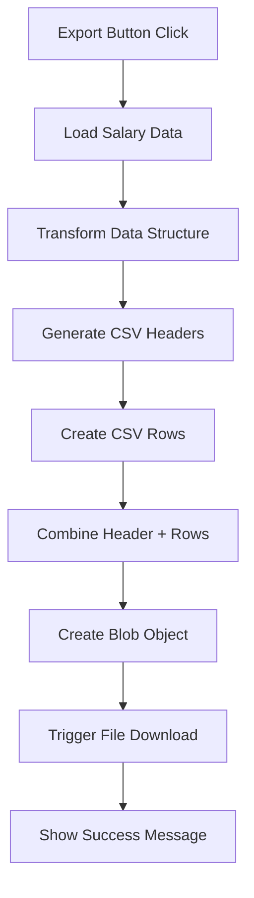

**Diagram sources**
- [salary.html:249-252](file://salary.html#L249-L252)
- [app.js:224-244](file://app.js#L224-L244)

**Section sources**
- [salary.html:64](file://salary.html#L64)
- [salary.html:249-252](file://salary.html#L249-L252)

### Role-Based Access Control Implementation
The system enforces strict access control through multiple validation layers:

#### Authentication Flow
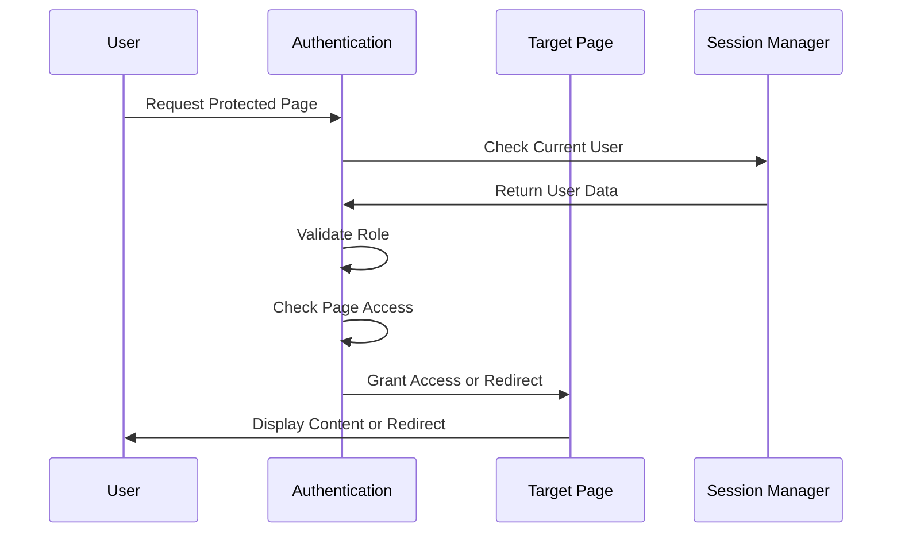

**Diagram sources**
- [auth.js:55-88](file://auth.js#L55-L88)
- [salary.html:97-99](file://salary.html#L97-L99)

**Section sources**
- [auth.js:55-88](file://auth.js#L55-L88)
- [salary.html:97-99](file://salary.html#L97-L99)

## Dependency Analysis

### Component Dependencies
The salary management system exhibits well-structured dependency relationships:

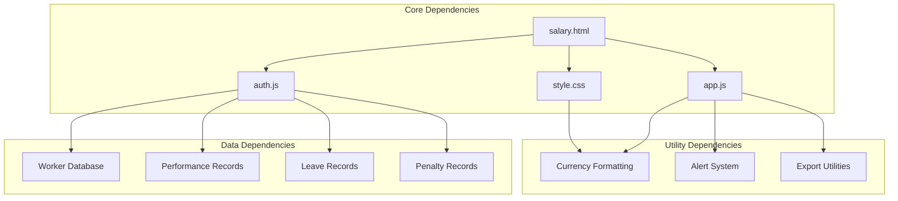

**Diagram sources**
- [salary.html:95-96](file://salary.html#L95-L96)
- [auth.js:129-165](file://auth.js#L129-L165)
- [app.js:224-244](file://app.js#L224-L244)

### Data Persistence Architecture
The system utilizes local storage for data persistence with structured organization:

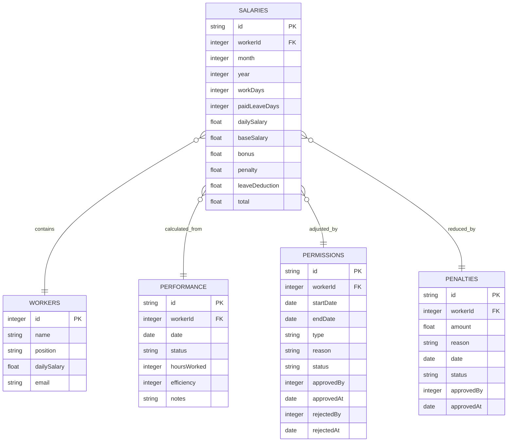

**Diagram sources**
- [auth.js:32-47](file://auth.js#L32-L47)
- [auth.js:142-152](file://auth.js#L142-L152)

**Section sources**
- [auth.js:32-47](file://auth.js#L32-L47)
- [auth.js:142-152](file://auth.js#L142-L152)

## Performance Considerations
The salary management system is designed with performance optimization in mind:

### Data Processing Efficiency
- **Lazy Loading**: Filter options are populated only when needed
- **Debounced Updates**: Filter changes trigger delayed calculations to prevent excessive processing
- **Efficient Filtering**: Multi-level filtering reduces dataset size progressively

### Memory Management
- **Object Pooling**: Reusable DOM elements minimize memory allocation
- **Event Delegation**: Single event handlers manage multiple interactive elements
- **Cleanup Functions**: Proper cleanup of event listeners and timers

### Scalability Factors
- **Modular Design**: Independent components enable selective updates
- **Caching Strategy**: Frequently accessed data is cached locally
- **Batch Operations**: Multiple updates are batched to reduce DOM manipulation

## Troubleshooting Guide

### Common Issues and Solutions

#### Authentication Problems
**Issue**: Non-admin users accessing salary interface
**Solution**: Verify role-based redirection logic in the salary page initialization

**Section sources**
- [salary.html:97-99](file://salary.html#L97-L99)

#### Data Loading Failures
**Issue**: Empty salary table despite existing records
**Solution**: Check localStorage data integrity and ensure proper initialization

**Section sources**
- [auth.js:16-53](file://auth.js#L16-L53)

#### Calculation Errors
**Issue**: Incorrect salary calculations
**Solution**: Verify performance data filtering and ensure proper date comparisons

**Section sources**
- [salary.html:153-185](file://salary.html#L153-L185)

#### Export Failures
**Issue**: CSV export not working
**Solution**: Check browser compatibility and ensure data availability before export

**Section sources**
- [app.js:224-244](file://app.js#L224-L244)

### Debugging Tools
The system includes built-in debugging capabilities:
- **Console Logging**: Detailed operation logs for troubleshooting
- **Alert System**: User-friendly error messages and notifications
- **Data Validation**: Input validation prevents invalid calculations

## Conclusion
The Administrative Salary Interface represents a comprehensive solution for construction company payroll management. The system successfully combines intuitive user interface design with robust backend functionality to provide administrators with complete control over salary calculations and management.

Key strengths of the implementation include:
- **Role-based Security**: Strict access controls prevent unauthorized access
- **Automated Calculations**: Integration with performance and leave systems ensures accuracy
- **Real-time Updates**: Interactive interface provides immediate feedback
- **Export Capabilities**: Comprehensive reporting tools support compliance and auditing
- **Scalable Architecture**: Modular design supports future enhancements

The system effectively addresses the core requirements of modern payroll management while maintaining simplicity and reliability. Its foundation in local storage technology ensures offline accessibility and fast response times, making it suitable for various operational environments.

Future enhancements could include cloud synchronization, advanced reporting dashboards, and integration with external payroll systems to further expand the system's capabilities and enterprise readiness.