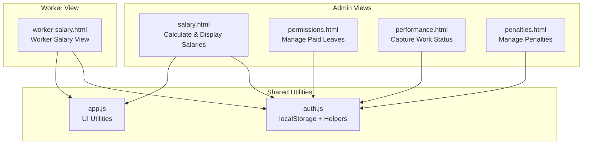
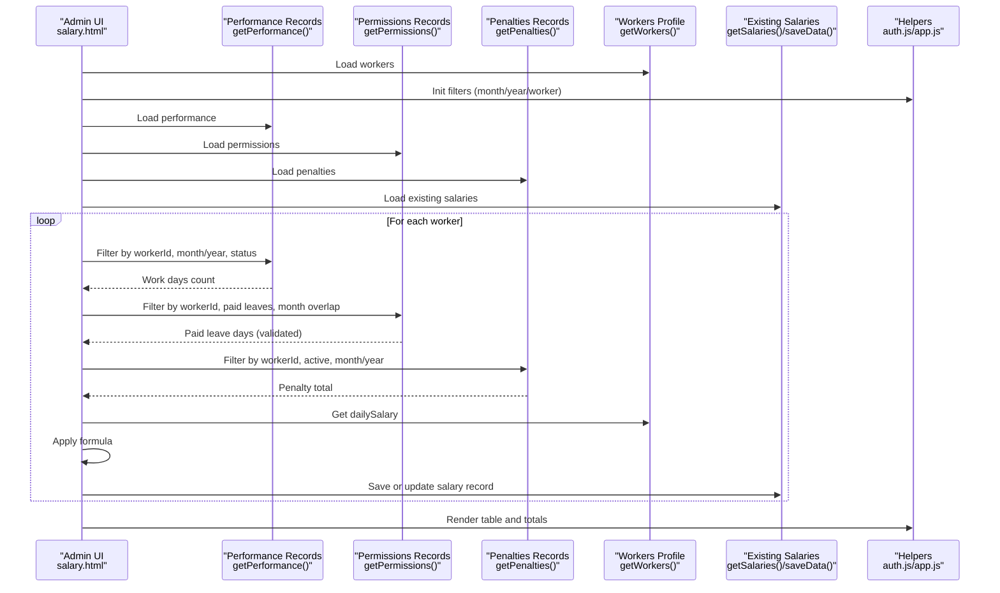
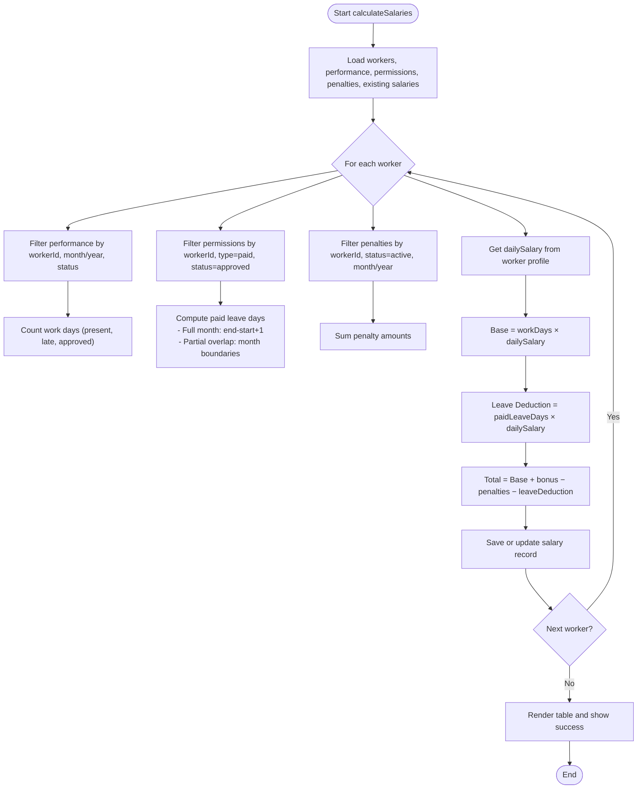
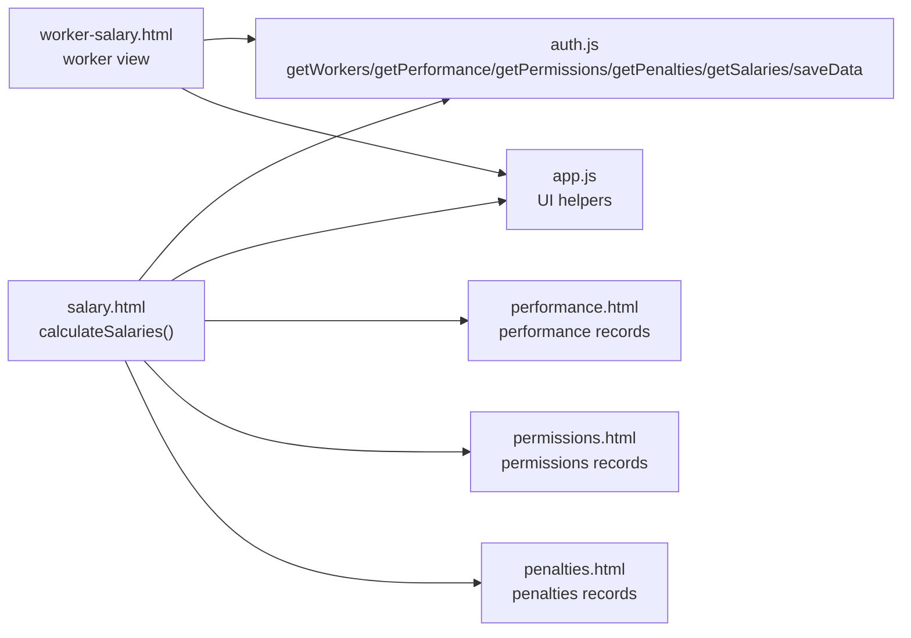

# Salary Calculation Algorithm

<cite>
**Referenced Files in This Document**
- [salary.html](file://salary.html)
- [auth.js](file://auth.js)
- [app.js](file://app.js)
- [performance.html](file://performance.html)
- [permissions.html](file://permissions.html)
- [penalties.html](file://penalties.html)
- [worker-salary.html](file://worker-salary.html)
</cite>

## Table of Contents
1. [Introduction](#introduction)
2. [Project Structure](#project-structure)
3. [Core Components](#core-components)
4. [Architecture Overview](#architecture-overview)
5. [Detailed Component Analysis](#detailed-component-analysis)
6. [Dependency Analysis](#dependency-analysis)
7. [Performance Considerations](#performance-considerations)
8. [Troubleshooting Guide](#troubleshooting-guide)
9. [Conclusion](#conclusion)

## Introduction
This document explains the automatic salary calculation algorithm used in the construction workforce management system. It covers how work days are counted from performance records, how daily rates are applied, how paid leave days are calculated with date-range validation, and how penalty deductions are computed from penalty records. The mathematical formula implemented is:

**Total Salary = (Work Days × Daily Rate) + Bonus − Penalties − Leave Deduction**

The system integrates multiple data sources:
- Performance tracking for work day counting
- Permission system for paid leaves
- Penalty management for deductions
- Worker profile daily salary values

## Project Structure
The salary calculation spans several HTML pages and shared JavaScript utilities:
- Salary calculation and display: [salary.html](file://salary.html)
- Data persistence and helpers: [auth.js](file://auth.js)
- Shared UI utilities: [app.js](file://app.js)
- Performance data capture: [performance.html](file://performance.html)
- Paid leave permissions: [permissions.html](file://permissions.html)
- Penalty management: [penalties.html](file://penalties.html)
- Worker-side salary view: [worker-salary.html](file://worker-salary.html)

**Diagram sources**
- [salary.html](file://salary.html)
- [auth.js](file://auth.js)
- [app.js](file://app.js)
- [performance.html](file://performance.html)
- [permissions.html](file://permissions.html)
- [penalties.html](file://penalties.html)
- [worker-salary.html](file://worker-salary.html)

**Section sources**
- [salary.html](file://salary.html)
- [auth.js](file://auth.js)
- [app.js](file://app.js)

## Core Components
- **Salary Calculation Engine**: Centralized in [salary.html](file://salary.html) under the `calculateSalaries()` function. It:
  - Iterates workers
  - Counts work days from performance records (present, late, approved)
  - Computes paid leave days from permission records (only paid leaves, within month)
  - Sums active penalties for the month
  - Applies the formula: (Work Days × Daily Rate) + Bonus − Penalties − Leave Deduction
  - Persists results to localStorage and refreshes the UI

- **Data Access Layer**: Provided by [auth.js](file://auth.js) helper functions:
  - `getWorkers()`, `getPerformance()`, `getPermissions()`, `getPenalties()`, `getSalaries()`, `saveData()`, `generateId()`, `formatCurrency()`, `formatDate()`

- **UI Utilities**: Shared helpers in [app.js](file://app.js) for modals, alerts, CSV export, and table sorting

- **Worker Salary View**: [worker-salary.html](file://worker-salary.html) shows individual monthly breakdown and historical records

**Section sources**
- [salary.html](file://salary.html)
- [auth.js](file://auth.js)
- [app.js](file://app.js)
- [worker-salary.html](file://worker-salary.html)

## Architecture Overview
The salary calculation follows a data-driven pipeline:
1. Collect worker and monthly filters
2. Load performance, permissions, penalties, and existing salary records
3. For each worker:
   - Count work days from performance (present, late, approved)
   - Compute paid leave days from permission records (only paid leaves, within month)
   - Sum active penalties for the month
   - Compute daily salary from worker profile
   - Apply the formula and persist/update salary record
4. Render the salary table with totals and editable bonus/penalty fields

**Diagram sources**
- [salary.html](file://salary.html)
- [auth.js](file://auth.js)

## Detailed Component Analysis

### Salary Calculation Engine (`calculateSalaries`)
Key steps:
- Filter performance records by worker, month, year, and acceptable statuses (present, late, approved)
- Count work days as the number of matching records
- Compute paid leave days:
  - Filter permissions by workerId, type=paid, status=approved
  - Check month overlap: either start/end within the target month, or spanning the month
  - For partial-month overlaps, compute only days within the target month
- Sum active penalties for the worker within the month
- Retrieve daily salary from worker profile
- Compute base salary = workDays × dailySalary
- Compute leave deduction = paidLeaveDays × dailySalary
- Compute total = baseSalary + bonus − penalties − leaveDeduction
- Persist updated salary records and refresh UI

Edge cases handled:
- Partial month leaves: Only days within the target month are counted
- Weekly free days exclusion: Not explicitly excluded in code; work day counting relies on performance statuses
- Salary record updates: Existing records are updated; new ones are created with unique IDs

**Diagram sources**
- [salary.html](file://salary.html)

**Section sources**
- [salary.html](file://salary.html)

### Data Sources and Validation

#### Performance Tracking (Work Day Counting)
- Source: [performance.html](file://performance.html) and [auth.js](file://auth.js)
- Data structure: Each performance record includes workerId, date, status, hoursWorked, efficiency, notes
- Validation: Only records with status present, late, or approved contribute to work day count for the given month/year

**Section sources**
- [performance.html](file://performance.html)
- [auth.js](file://auth.js)

#### Paid Leave Management (Leave Days and Date Range Validation)
- Source: [permissions.html](file://permissions.html) and [salary.html](file://salary.html)
- Data structure: Permissions include workerId, startDate, endDate, type (paid/unpaid), status (pending/approved/rejected)
- Validation logic:
  - Only type=paid and status=approved are considered
  - Only days falling within the target month/year are counted
  - For leaves spanning multiple months, only overlapping days are included

**Section sources**
- [permissions.html](file://permissions.html)
- [salary.html](file://salary.html)

#### Penalty Management (Deductions)
- Source: [penalties.html](file://penalties.html) and [auth.js](file://auth.js)
- Data structure: Penalties include workerId, date, amount, reason, status (active/paid/cancelled), timestamps
- Deduction logic:
  - Only penalties with status=active are summed for the month
  - Amounts are aggregated per worker per month

**Section sources**
- [penalties.html](file://penalties.html)
- [auth.js](file://auth.js)

### Worker-Side Salary View
- Source: [worker-salary.html](file://worker-salary.html)
- Displays:
  - Current month’s daily salary, work days, base salary, bonus, penalties, and total
  - Historical salary records for the worker
  - Filters for month and year selection
- Uses the same underlying data sources and helpers for calculations

**Section sources**
- [worker-salary.html](file://worker-salary.html)

## Dependency Analysis
The salary calculation depends on:
- Worker profiles for daily salary values
- Performance records for work day counts
- Permissions for paid leave day computations
- Penalties for monthly deductions
- Shared utilities for data access, formatting, and UI interactions

**Diagram sources**
- [salary.html](file://salary.html)
- [auth.js](file://auth.js)
- [app.js](file://app.js)
- [performance.html](file://performance.html)
- [permissions.html](file://permissions.html)
- [penalties.html](file://penalties.html)
- [worker-salary.html](file://worker-salary.html)

**Section sources**
- [salary.html](file://salary.html)
- [auth.js](file://auth.js)
- [app.js](file://app.js)

## Performance Considerations
- Data filtering and aggregation are linear in the number of records; typical datasets are small for a construction company
- Date comparisons and arithmetic are lightweight operations
- UI rendering updates occur after bulk calculations; consider debouncing filter changes if performance becomes an issue
- Storing all data in localStorage simplifies deployment but may require periodic cleanup for large histories

## Troubleshooting Guide
Common issues and resolutions:
- No work days recorded:
  - Verify performance records exist for the selected month/year and statuses include present, late, or approved
  - Check that the worker is assigned to the correct month/year

- Incorrect paid leave days:
  - Ensure permissions are approved and of type paid
  - Confirm the leave period overlaps with the selected month/year
  - For partial-month leaves, only days within the month are counted

- Penalties not deducted:
  - Confirm penalties are active and within the selected month/year
  - Check that penalty records belong to the correct worker

- Daily salary mismatch:
  - Confirm the worker profile contains a dailySalary value
  - Ensure the salary record reflects the correct daily rate

- Editable bonus/penalty not updating totals:
  - Use the edit modal in the salary table to adjust bonus and penalty values
  - The update function recalculates the total accordingly

**Section sources**
- [salary.html](file://salary.html)
- [auth.js](file://auth.js)

## Conclusion
The salary calculation algorithm integrates performance, permissions, and penalties to produce accurate monthly compensation. Its modular design, centralized in the admin salary page, ensures maintainability and clarity. By validating date ranges, aggregating active penalties, and applying the core formula, the system supports fair and transparent payroll administration. Extending the algorithm to handle weekly free days would require explicit exclusion logic in the work day counting phase.