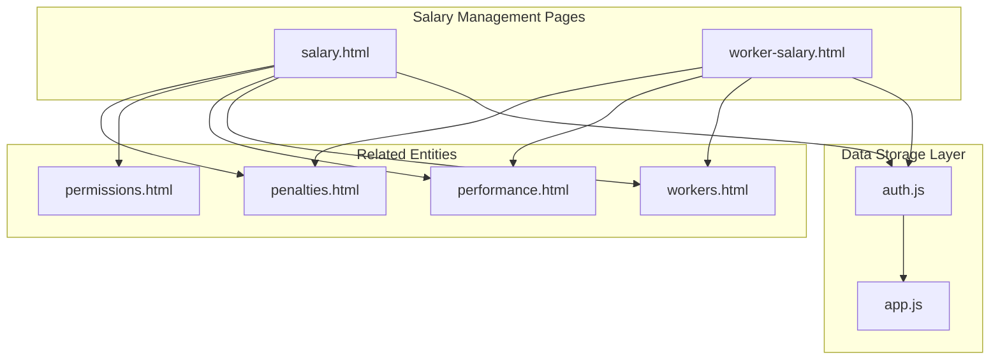
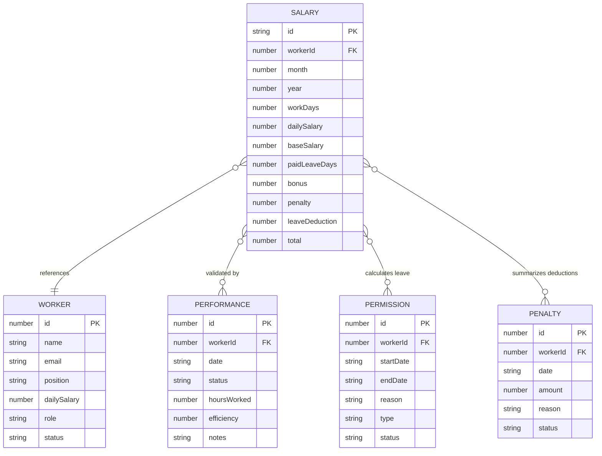
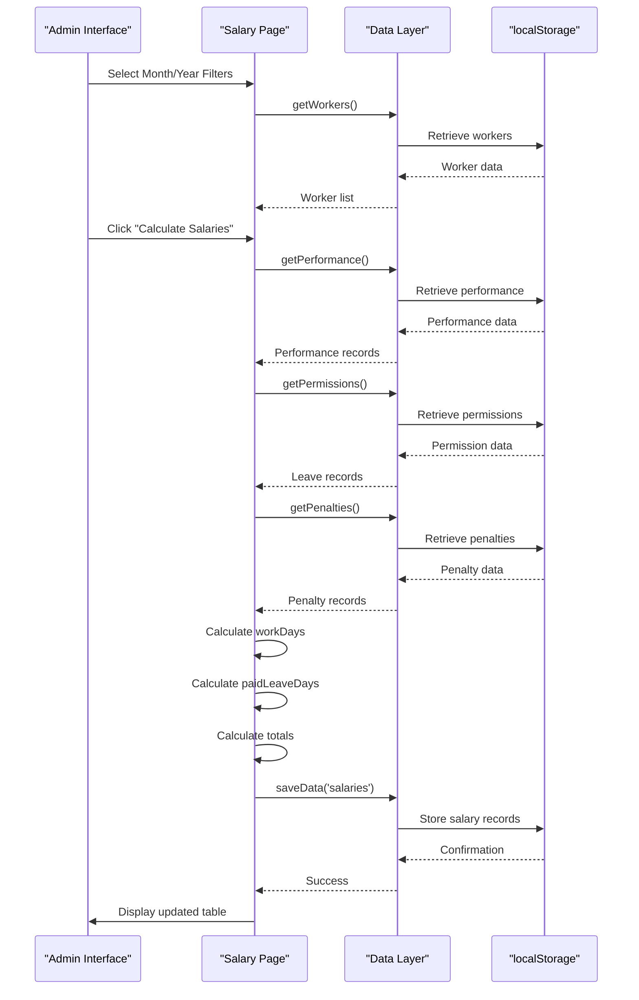
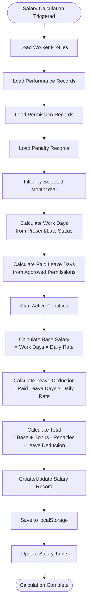
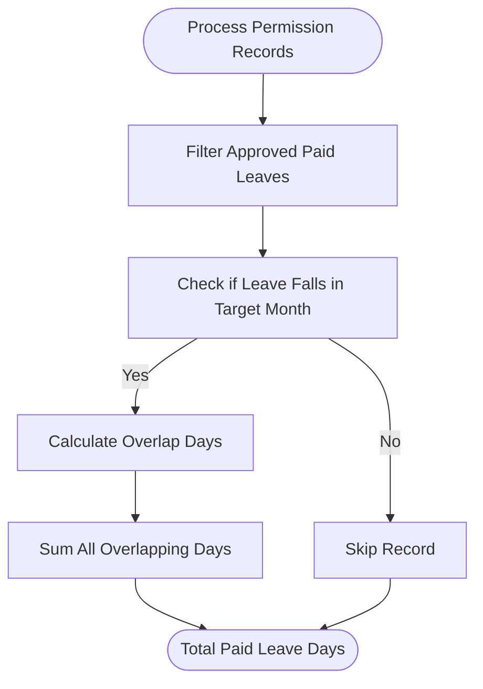
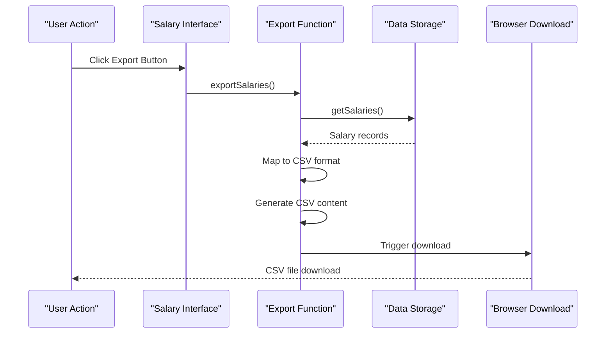
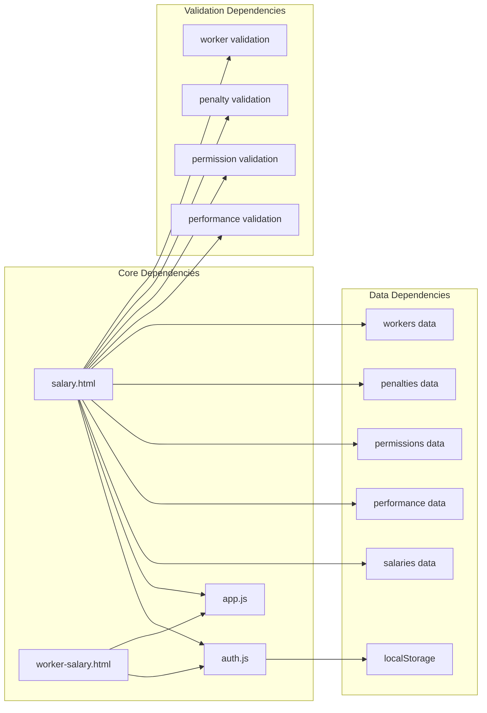

# Salary Data Model

<cite>
**Referenced Files in This Document**
- [salary.html](file://salary.html)
- [auth.js](file://auth.js)
- [app.js](file://app.js)
- [workers.html](file://workers.html)
- [performance.html](file://performance.html)
- [permissions.html](file://permissions.html)
- [penalties.html](file://penalties.html)
- [worker-salary.html](file://worker-salary.html)
</cite>

## Table of Contents
1. [Introduction](#introduction)
2. [Project Structure](#project-structure)
3. [Core Components](#core-components)
4. [Architecture Overview](#architecture-overview)
5. [Detailed Component Analysis](#detailed-component-analysis)
6. [Dependency Analysis](#dependency-analysis)
7. [Performance Considerations](#performance-considerations)
8. [Troubleshooting Guide](#troubleshooting-guide)
9. [Conclusion](#conclusion)

## Introduction
This document provides comprehensive data model documentation for salary records in the construction workforce management system. It details the salary object structure, lifecycle from creation through updates and exports, and the relationships between salary records and related entities including worker profiles, performance records, permission records, and penalty records. The document also covers data validation rules, constraint checking, data integrity measures, and the salary storage format in localStorage with export capabilities for CSV generation.

## Project Structure
The salary data model spans multiple HTML pages and JavaScript modules that handle data storage, validation, and presentation:

**Diagram sources**
- [salary.html:1-260](file://salary.html#L1-L260)
- [auth.js:1-213](file://auth.js#L1-L213)
- [app.js:1-412](file://app.js#L1-L412)

**Section sources**
- [salary.html:1-260](file://salary.html#L1-L260)
- [auth.js:15-53](file://auth.js#L15-L53)

## Core Components
The salary data model consists of several interconnected components that work together to manage employee compensation:

### Salary Object Structure
The salary record maintains the following core attributes:

| Field | Type | Description | Validation Rules |
|-------|------|-------------|------------------|
| `id` | String | Unique identifier for the salary record | Generated automatically |
| `workerId` | Number | Reference to the worker profile | Must correspond to existing worker |
| `month` | Number | Month of the salary period (1-12) | Range validation required |
| `year` | Number | Year of the salary period | Valid calendar year |
| `workDays` | Number | Actual working days in the month | Non-negative integer |
| `dailySalary` | Number | Daily wage rate in AZN | Non-negative decimal |
| `baseSalary` | Number | Workdays × daily salary | Calculated field |
| `paidLeaveDays` | Number | Paid leave days in the month | Non-negative integer |
| `bonus` | Number | Additional compensation | Non-negative decimal |
| `penalty` | Number | Deductions for infractions | Non-negative decimal |
| `leaveDeduction` | Number | Deduction for paid leave | Calculated field |
| `total` | Number | Net salary amount | Calculated field |

### Data Storage Architecture
The system uses localStorage as the primary data persistence mechanism with automatic initialization:

**Diagram sources**
- [auth.js:32-47](file://auth.js#L32-L47)
- [salary.html:194-205](file://salary.html#L194-L205)

**Section sources**
- [salary.html:194-205](file://salary.html#L194-L205)
- [auth.js:142-144](file://auth.js#L142-L144)

## Architecture Overview
The salary management system follows a client-side architecture with localStorage-based persistence:

**Diagram sources**
- [salary.html:145-218](file://salary.html#L145-L218)
- [auth.js:129-160](file://auth.js#L129-L160)

## Detailed Component Analysis

### Salary Calculation Engine
The salary calculation process integrates multiple data sources to ensure accurate compensation:

**Diagram sources**
- [salary.html:145-218](file://salary.html#L145-L218)
- [salary.html:154-205](file://salary.html#L154-L205)

#### Work Day Validation Logic
The system validates work days using performance records with specific criteria:

| Status | Included in Work Days? | Reason |
|--------|----------------------|---------|
| `present` | ✅ Yes | Full attendance |
| `late` | ✅ Yes | Partially late but present |
| `absent` | ❌ No | No work performed |
| `excused` | ❓ Depends | Only if approved |

#### Leave Calculation Algorithm
Paid leave days are calculated from approved permission records:

**Diagram sources**
- [salary.html:160-185](file://salary.html#L160-L185)

**Section sources**
- [salary.html:145-218](file://salary.html#L145-L218)
- [salary.html:154-205](file://salary.html#L154-L205)

### Data Integrity and Validation
The system implements multiple layers of data validation:

#### Input Validation Rules
- **Numeric Fields**: All monetary values use `min="0"` with `step="0.01"` precision
- **Date Validation**: Automatic date filtering ensures month/year consistency
- **Reference Validation**: Worker IDs are validated against existing worker profiles
- **Range Validation**: Month values constrained to 1-12, year values to valid calendar years

#### Constraint Checking
- **Unique Identifiers**: Salaries are uniquely identified by `(workerId, month, year)`
- **Calculation Consistency**: Derived fields (baseSalary, leaveDeduction, total) are recalculated
- **Data Type Integrity**: All numeric values maintained as Number type
- **Null Safety**: Graceful handling of missing or undefined values

#### Data Storage Constraints
- **Primary Keys**: Generated using timestamp-based unique identifiers
- **Foreign Keys**: Worker references validated through worker lookup
- **Atomic Operations**: Entire salary arrays replaced atomically during updates

**Section sources**
- [salary.html:86-87](file://salary.html#L86-L87)
- [salary.html:230-247](file://salary.html#L230-L247)

### Export and Reporting
The system provides comprehensive export capabilities:

#### CSV Export Format
Salary records are exported with the following structure:
- **Headers**: All salary record fields plus worker name
- **Data Format**: Comma-separated values with proper quoting
- **File Naming**: `maaslar_YYYY-MM-DD.csv` format
- **Encoding**: UTF-8 with BOM for Excel compatibility

#### Export Workflow

**Diagram sources**
- [salary.html:249-252](file://salary.html#L249-L252)
- [app.js:225-244](file://app.js#L225-L244)

**Section sources**
- [salary.html:249-252](file://salary.html#L249-L252)
- [app.js:225-244](file://app.js#L225-L244)

### Relationship Management
The salary system maintains relationships with multiple entity types:

#### Worker Profile Integration
- **Daily Rate Reference**: Uses worker's `dailySalary` as base rate
- **Worker Identification**: Maintains `workerId` for profile linkage
- **Profile Updates**: Changes in worker profiles affect future salary calculations

#### Performance Integration
- **Attendance Validation**: Work days validated against performance records
- **Status Tracking**: Differentiates between present, late, absent, excused
- **Historical Data**: Maintains complete work history for each worker

#### Permission Integration
- **Leave Calculation**: Paid leave days calculated from approved permissions
- **Date Range Processing**: Handles multi-day leave spanning month boundaries
- **Type Validation**: Only `paid` permissions contribute to leave calculations

#### Penalty Integration
- **Deduction Summation**: All active penalties summed for deduction calculation
- **Monthly Filtering**: Penalties filtered by target month/year
- **Status Validation**: Only active penalties considered in calculations

**Section sources**
- [salary.html:149-218](file://salary.html#L149-L218)
- [auth.js:182-213](file://auth.js#L182-L213)

## Dependency Analysis
The salary system exhibits the following dependency relationships:

**Diagram sources**
- [salary.html:95-96](file://salary.html#L95-L96)
- [auth.js:129-160](file://auth.js#L129-L160)

### Coupling and Cohesion
- **High Cohesion**: Salary calculation logic is centralized in salary.html
- **Moderate Coupling**: Relies on shared data access functions from auth.js
- **External Dependencies**: Minimal external libraries, primarily Bootstrap Icons
- **Internal Dependencies**: Strong coupling between salary calculation and data validation

### Potential Issues and Mitigations
- **Data Synchronization**: Risk of stale data if multiple tabs modify simultaneously
- **Memory Limits**: Large datasets may exceed localStorage capacity
- **Data Loss**: Single point of failure with localStorage persistence
- **Cross-Browser Compatibility**: Different localStorage implementations across browsers

**Section sources**
- [auth.js:158-160](file://auth.js#L158-L160)
- [salary.html:215](file://salary.html#L215)

## Performance Considerations
The salary system is designed for optimal performance in client-side environments:

### Calculation Performance
- **Linear Complexity**: Salary calculations scale linearly with dataset size
- **Single Pass Processing**: Each data source processed once per calculation
- **Efficient Filtering**: Date-based filtering reduces unnecessary comparisons
- **Memory Efficiency**: Temporary objects garbage collected after calculations

### Storage Performance
- **Atomic Writes**: Entire salary arrays replaced in single operations
- **Minimal Serialization**: Data stored in compact JSON format
- **Lazy Loading**: Data loaded only when needed for calculations
- **Cache Benefits**: Frequently accessed data remains in memory

### Scalability Limitations
- **LocalStorage Size**: Limited to approximately 5-10MB depending on browser
- **JavaScript Heap**: Large datasets may impact browser performance
- **Memory Usage**: All data loaded into memory for processing
- **Processing Time**: Complex calculations may block UI thread for large datasets

## Troubleshooting Guide

### Common Issues and Solutions

#### Salary Calculation Errors
**Problem**: Incorrect work day counts or miscalculated totals
**Causes**:
- Performance records with invalid dates
- Missing worker profiles
- Incorrect daily salary values
- Permission records outside target month

**Solutions**:
1. Verify performance records have valid dates and statuses
2. Ensure worker profiles exist for all workerIds
3. Check daily salary values are positive numbers
4. Validate permission records fall within target month/year

#### Data Persistence Issues
**Problem**: Salary records not saving or disappearing
**Causes**:
- Browser privacy settings blocking localStorage
- Insufficient storage space
- Cross-browser compatibility issues
- Data corruption in localStorage

**Solutions**:
1. Check browser console for localStorage errors
2. Clear browser cache and cookies
3. Test in different browsers
4. Verify available storage space

#### Export Problems
**Problem**: CSV export fails or produces empty files
**Causes**:
- No salary records available
- Browser download restrictions
- File encoding issues
- Missing worker names

**Solutions**:
1. Ensure salary records exist before export
2. Check browser download settings
3. Verify UTF-8 encoding support
4. Confirm worker profiles have names

### Debugging Tools
The system provides built-in debugging capabilities:
- **Console Logging**: Detailed calculation steps and intermediate values
- **Alert Messages**: User-friendly error notifications
- **Data Validation**: Real-time validation feedback
- **Filter Testing**: Month/year filters for targeted debugging

**Section sources**
- [salary.html:217](file://salary.html#L217)
- [app.js:108-127](file://app.js#L108-L127)

## Conclusion
The salary data model provides a robust foundation for managing construction worker compensation with strong data integrity, comprehensive validation, and flexible calculation capabilities. The system effectively integrates with related entities while maintaining clear separation of concerns through its modular architecture.

Key strengths include:
- **Comprehensive Data Integration**: Seamless connection between workers, performance, permissions, and penalties
- **Flexible Calculation Engine**: Adaptable formulas for various compensation scenarios
- **Robust Validation**: Multi-layered validation ensuring data quality
- **User-Friendly Interface**: Intuitive calculation and export processes
- **Persistent Storage**: Reliable localStorage-based data persistence

Areas for potential improvement include:
- **Server-Side Implementation**: Migration to server-side database for scalability
- **Real-Time Synchronization**: WebSocket implementation for multi-user scenarios
- **Advanced Analytics**: Enhanced reporting and forecasting capabilities
- **Audit Trail**: Comprehensive change tracking for compliance purposes

The current implementation successfully balances simplicity with functionality, providing a solid foundation for construction workforce management while maintaining extensibility for future enhancements.