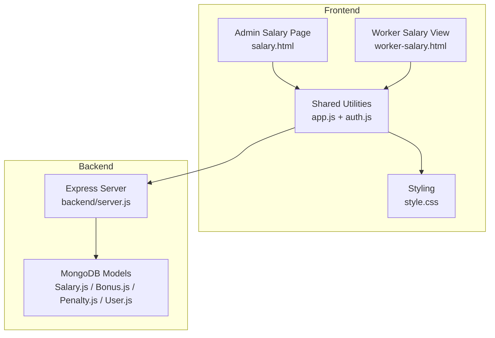
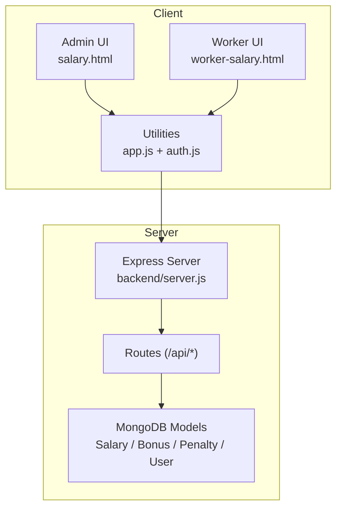
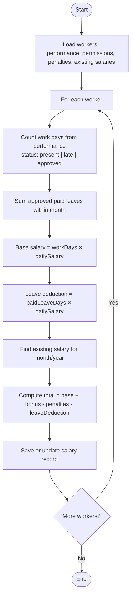
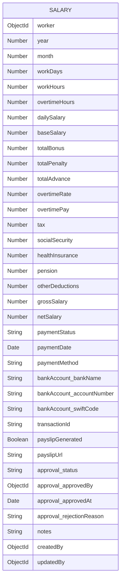
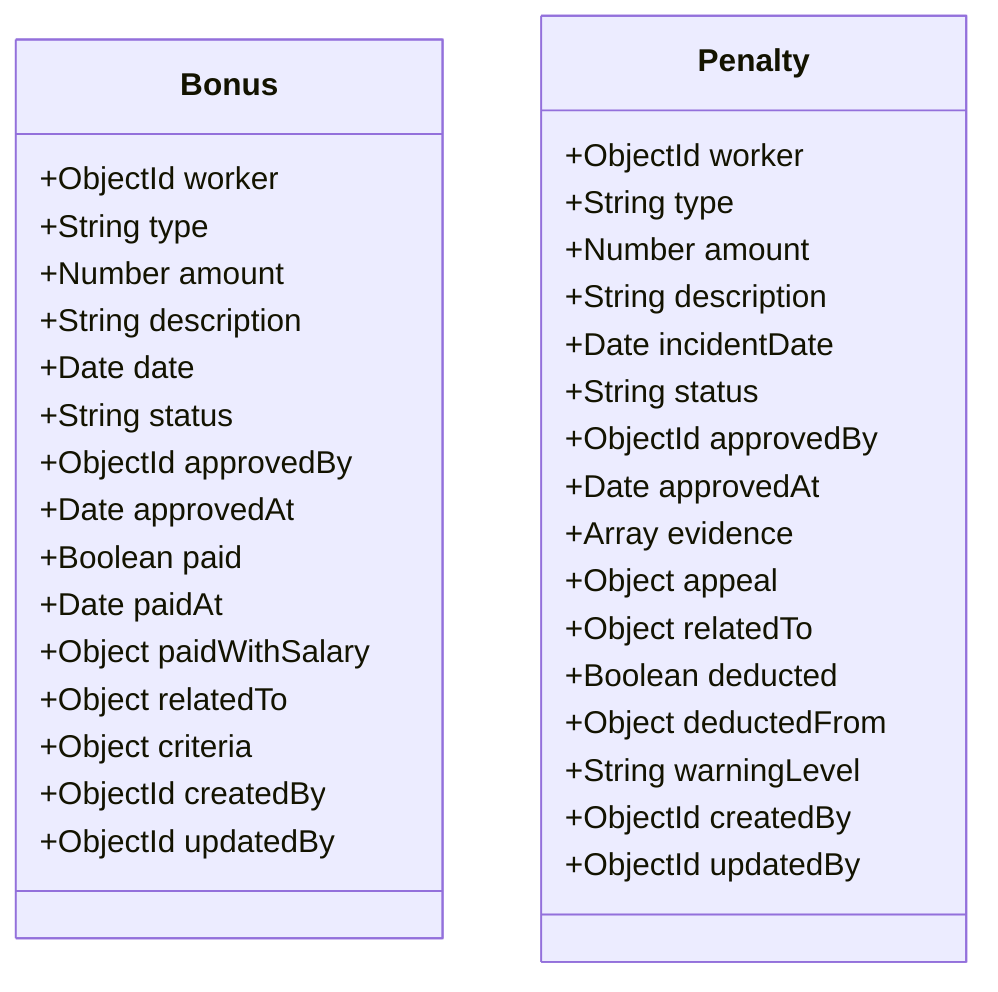
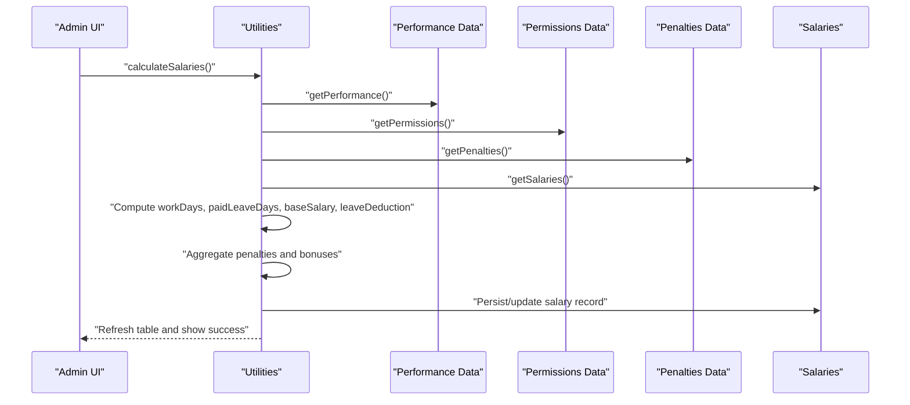
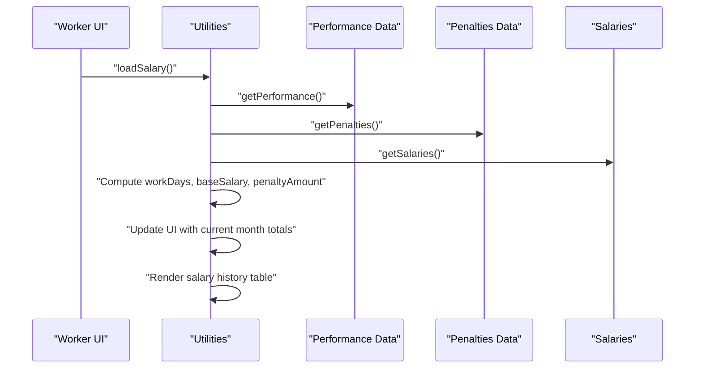
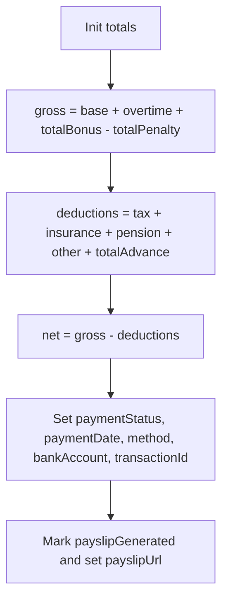
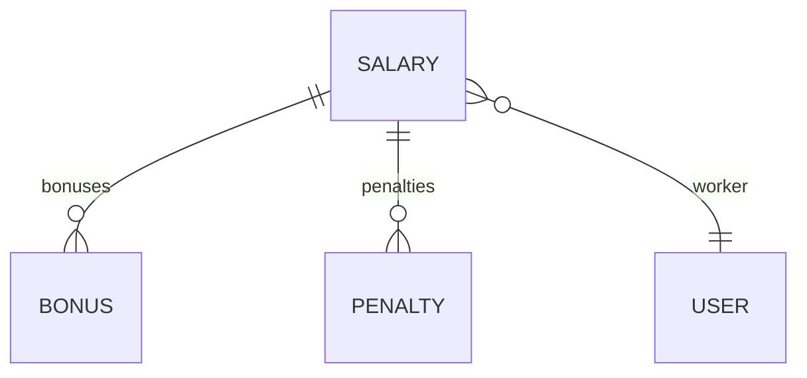
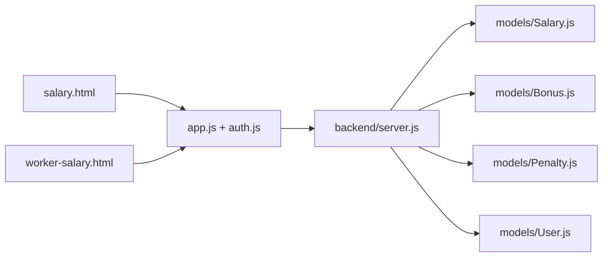

# Salary Management

<cite>
**Referenced Files in This Document**
- [salary.html](file://salary.html)
- [worker-salary.html](file://worker-salary.html)
- [app.js](file://app.js)
- [auth.js](file://auth.js)
- [style.css](file://style.css)
- [backend/server.js](file://backend/server.js)
- [backend/models/Salary.js](file://backend/models/Salary.js)
- [backend/models/Bonus.js](file://backend/models/Bonus.js)
- [backend/models/Penalty.js](file://backend/models/Penalty.js)
- [backend/models/User.js](file://backend/models/User.js)
</cite>

## Table of Contents
1. [Introduction](#introduction)
2. [Project Structure](#project-structure)
3. [Core Components](#core-components)
4. [Architecture Overview](#architecture-overview)
5. [Detailed Component Analysis](#detailed-component-analysis)
6. [Dependency Analysis](#dependency-analysis)
7. [Performance Considerations](#performance-considerations)
8. [Troubleshooting Guide](#troubleshooting-guide)
9. [Conclusion](#conclusion)
10. [Appendices](#appendices)

## Introduction
This document describes the salary management system for the construction workforce management platform. It covers the automatic salary calculation algorithm based on work days, daily rates, bonuses, and penalties; the salary data model including monthly records, payment history, and breakdown components; bonus and penalty management; salary adjustment processes; payment tracking; monthly processing workflow; salary statement generation; worker-specific views; reporting; and integration with performance tracking for work day validation.

## Project Structure
The system consists of:
- Frontend pages for administrators and workers to manage and view salaries
- Shared frontend utilities for data access, formatting, and UI helpers
- A backend server exposing REST APIs and managing MongoDB models for salary, bonuses, penalties, and users
- Local storage-based demo data for development and demonstration

**Diagram sources**
- [salary.html:1-253](file://salary.html#L1-L253)
- [worker-salary.html:1-373](file://worker-salary.html#L1-L373)
- [app.js:1-412](file://app.js#L1-L412)
- [auth.js:1-213](file://auth.js#L1-L213)
- [style.css:1-1200](file://style.css#L1-L1200)
- [backend/server.js:1-184](file://backend/server.js#L1-L184)
- [backend/models/Salary.js:1-325](file://backend/models/Salary.js#L1-L325)
- [backend/models/Bonus.js:1-133](file://backend/models/Bonus.js#L1-L133)
- [backend/models/Penalty.js:1-164](file://backend/models/Penalty.js#L1-L164)
- [backend/models/User.js:1-362](file://backend/models/User.js#L1-L362)

**Section sources**
- [salary.html:1-253](file://salary.html#L1-L253)
- [worker-salary.html:1-373](file://worker-salary.html#L1-L373)
- [app.js:1-412](file://app.js#L1-L412)
- [auth.js:1-213](file://auth.js#L1-L213)
- [style.css:1-1200](file://style.css#L1-L1200)
- [backend/server.js:1-184](file://backend/server.js#L1-L184)
- [backend/models/Salary.js:1-325](file://backend/models/Salary.js#L1-L325)
- [backend/models/Bonus.js:1-133](file://backend/models/Bonus.js#L1-L133)
- [backend/models/Penalty.js:1-164](file://backend/models/Penalty.js#L1-L164)
- [backend/models/User.js:1-362](file://backend/models/User.js#L1-L362)

## Core Components
- Automatic salary calculation engine (admin page): Computes work days from performance, applies daily rate, adds bonuses, subtracts penalties and leave deductions, and persists monthly records.
- Worker-specific salary view: Shows current month’s calculated salary, breakdown, and historical records filtered by month/year.
- Data models: Salary, Bonus, Penalty, and User define the schema and business logic for salary computation, approvals, and payment tracking.
- Shared utilities: Local storage-based data access, formatting, alerts, modals, CSV export, and currency formatting.

Key responsibilities:
- Admin page: Filters, calculates, edits, and exports monthly salaries.
- Worker page: Displays current month’s salary, breakdown, and historical records.
- Backend: Provides REST endpoints and models for persistent storage and advanced workflows.

**Section sources**
- [salary.html:138-211](file://salary.html#L138-L211)
- [worker-salary.html:273-366](file://worker-salary.html#L273-L366)
- [auth.js:129-165](file://auth.js#L129-L165)
- [app.js:108-127](file://app.js#L108-L127)
- [app.js:225-244](file://app.js#L225-L244)

## Architecture Overview
The system follows a client-side-first approach with local storage for demo data and a backend server for production-grade persistence and APIs.

**Diagram sources**
- [salary.html:88-89](file://salary.html#L88-L89)
- [worker-salary.html:251-252](file://worker-salary.html#L251-L252)
- [app.js:1-412](file://app.js#L1-L412)
- [auth.js:129-165](file://auth.js#L129-L165)
- [backend/server.js:95-119](file://backend/server.js#L95-L119)
- [backend/models/Salary.js:1-325](file://backend/models/Salary.js#L1-L325)
- [backend/models/Bonus.js:1-133](file://backend/models/Bonus.js#L1-L133)
- [backend/models/Penalty.js:1-164](file://backend/models/Penalty.js#L1-L164)
- [backend/models/User.js:1-362](file://backend/models/User.js#L1-L362)

## Detailed Component Analysis

### Automatic Salary Calculation Algorithm
The algorithm computes monthly salary for each worker by:
- Counting validated work days from performance records (present, late, approved)
- Calculating paid leave days from approved permission records within the month
- Computing base salary as workDays × dailySalary
- Deducting leaveDeduction (paidLeaveDays × dailySalary)
- Summing bonuses and subtracting penalties
- Persisting or updating the monthly salary record

**Diagram sources**
- [salary.html:138-211](file://salary.html#L138-L211)

**Section sources**
- [salary.html:138-211](file://salary.html#L138-L211)

### Salary Data Model
The salary record aggregates:
- Worker identity and period (year, month)
- Work metrics (workDays, workHours, overtimeHours, dailySalary, baseSalary)
- Bonuses and penalties arrays with metadata
- Deductions (tax, socialSecurity, healthInsurance, pension, otherDeductions)
- Totals (grossSalary, netSalary)
- Payment details (paymentStatus, paymentDate, paymentMethod, bankAccount, transactionId)
- Payslip generation flag and URL
- Approval workflow (status, approver, timestamps)
- Notes and audit fields

**Diagram sources**
- [backend/models/Salary.js:3-223](file://backend/models/Salary.js#L3-L223)

**Section sources**
- [backend/models/Salary.js:3-223](file://backend/models/Salary.js#L3-L223)

### Bonus and Penalty Management
- Bonuses: Typed, approved, and optionally linked to a salary period; tracked as unpaid until applied.
- Penalties: Typed incidents with evidence, appeal workflow, and deduction tracking per period.

**Diagram sources**
- [backend/models/Bonus.js:3-95](file://backend/models/Bonus.js#L3-L95)
- [backend/models/Penalty.js:3-127](file://backend/models/Penalty.js#L3-L127)

**Section sources**
- [backend/models/Bonus.js:3-95](file://backend/models/Bonus.js#L3-L95)
- [backend/models/Penalty.js:3-127](file://backend/models/Penalty.js#L3-L127)

### Monthly Salary Processing Workflow
- Admin selects month/year and optional worker filter
- System loads performance and permissions to compute work days and paid leave
- System loads existing penalties and bonuses for the period
- Calculates base salary, leave deduction, and total
- Saves or updates salary records and refreshes the table

**Diagram sources**
- [salary.html:138-211](file://salary.html#L138-L211)
- [auth.js:138-152](file://auth.js#L138-L152)

**Section sources**
- [salary.html:138-211](file://salary.html#L138-L211)
- [auth.js:138-152](file://auth.js#L138-L152)

### Worker-Specific Salary View
- Worker sees current month’s total, daily salary, work days, base salary, bonuses, penalties, and net salary
- Historical salary records are sorted by year/month
- Stats include total bonuses, total penalties, and average salary

**Diagram sources**
- [worker-salary.html:273-366](file://worker-salary.html#L273-L366)
- [auth.js:138-152](file://auth.js#L138-L152)

**Section sources**
- [worker-salary.html:273-366](file://worker-salary.html#L273-L366)
- [auth.js:138-152](file://auth.js#L138-L152)

### Payment Tracking and Statement Generation
- Payment status supports pending, processing, paid, failed, partial
- Payment method supports cash, bank transfer, check, mobile payment
- Bank account details and transaction ID are recorded
- Payslip generation flag and URL support statement creation
- Net salary computed as gross minus taxes, insurance, pension, other deductions, and advances

**Diagram sources**
- [backend/models/Salary.js:232-263](file://backend/models/Salary.js#L232-L263)

**Section sources**
- [backend/models/Salary.js:232-263](file://backend/models/Salary.js#L232-L263)

### Reporting and Tax Calculations
- The salary model includes dedicated fields for tax, socialSecurity, healthInsurance, pension, and otherDeductions
- Statistics aggregation supports total gross, total net, total bonuses, total penalties, total advances, and average salary
- Payslip data extraction provides structured breakdown for statements

**Diagram sources**
- [backend/models/Salary.js:3-223](file://backend/models/Salary.js#L3-L223)
- [backend/models/Bonus.js:3-95](file://backend/models/Bonus.js#L3-L95)
- [backend/models/Penalty.js:3-127](file://backend/models/Penalty.js#L3-L127)
- [backend/models/User.js:1-362](file://backend/models/User.js#L1-362)

**Section sources**
- [backend/models/Salary.js:266-286](file://backend/models/Salary.js#L266-L286)
- [backend/models/Salary.js:289-322](file://backend/models/Salary.js#L289-L322)

## Dependency Analysis
- Frontend depends on shared utilities for data access, formatting, alerts, and CSV export
- Admin and worker pages share the same data access layer and formatting helpers
- Backend server exposes routes and uses MongoDB models for persistence
- Models encapsulate business rules and pre-save calculations

**Diagram sources**
- [salary.html:88-89](file://salary.html#L88-L89)
- [worker-salary.html:251-252](file://worker-salary.html#L251-L252)
- [app.js:1-412](file://app.js#L1-L412)
- [auth.js:129-165](file://auth.js#L129-L165)
- [backend/server.js:95-119](file://backend/server.js#L95-L119)
- [backend/models/Salary.js:1-325](file://backend/models/Salary.js#L1-L325)
- [backend/models/Bonus.js:1-133](file://backend/models/Bonus.js#L1-L133)
- [backend/models/Penalty.js:1-164](file://backend/models/Penalty.js#L1-L164)
- [backend/models/User.js:1-362](file://backend/models/User.js#L1-L362)

**Section sources**
- [salary.html:88-89](file://salary.html#L88-L89)
- [worker-salary.html:251-252](file://worker-salary.html#L251-L252)
- [app.js:1-412](file://app.js#L1-L412)
- [auth.js:129-165](file://auth.js#L129-L165)
- [backend/server.js:95-119](file://backend/server.js#L95-L119)
- [backend/models/Salary.js:1-325](file://backend/models/Salary.js#L1-L325)
- [backend/models/Bonus.js:1-133](file://backend/models/Bonus.js#L1-L133)
- [backend/models/Penalty.js:1-164](file://backend/models/Penalty.js#L1-L164)
- [backend/models/User.js:1-362](file://backend/models/User.js#L1-L362)

## Performance Considerations
- Client-side filtering and rendering: Efficient for small datasets; consider pagination or server-side filtering for larger workforces.
- Pre-save calculations: Centralized in the salary model to ensure consistency and reduce frontend duplication.
- Indexes on salary model: Unique compound index on worker-year-month and additional indexes on paymentStatus and approval status improve query performance.
- Currency formatting and CSV export: Use locale-aware formatting to avoid expensive computations during rendering.

[No sources needed since this section provides general guidance]

## Troubleshooting Guide
Common issues and resolutions:
- No salary data shown: Ensure performance and permission records exist for the selected month/year and worker filter.
- Incorrect work days: Verify performance statuses and dates; only present, late, and approved statuses count toward work days.
- Export fails: Confirm data exists and CSV export helper is invoked with proper headers.
- Alerts not dismissing: Check alert initialization and auto-dismiss logic.

**Section sources**
- [salary.html:104-136](file://salary.html#L104-L136)
- [app.js:97-105](file://app.js#L97-L105)
- [app.js:225-244](file://app.js#L225-L244)

## Conclusion
The salary management system integrates performance tracking, bonus/penalty management, and payment workflows into a cohesive monthly processing pipeline. The frontend provides intuitive admin and worker views, while the backend models enforce data integrity and enable scalable reporting and statement generation.

[No sources needed since this section summarizes without analyzing specific files]

## Appendices

### Data Access and Formatting Helpers
- Local storage-based data retrieval and saving
- Currency formatting and date formatting
- Modal and alert utilities
- CSV export functionality

**Section sources**
- [auth.js:129-165](file://auth.js#L129-L165)
- [auth.js:174-179](file://auth.js#L174-L179)
- [app.js:108-127](file://app.js#L108-L127)
- [app.js:225-244](file://app.js#L225-L244)