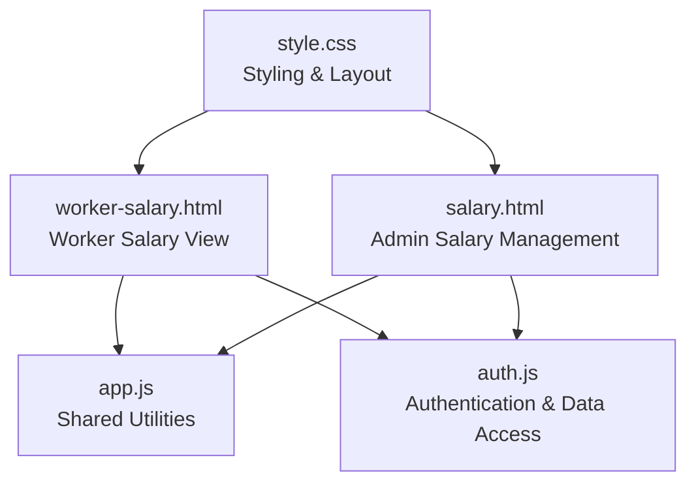
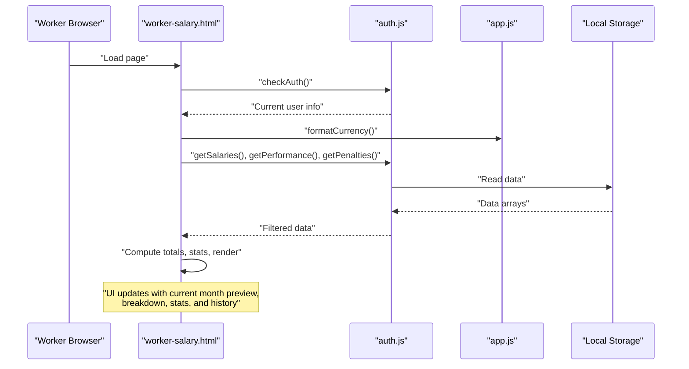
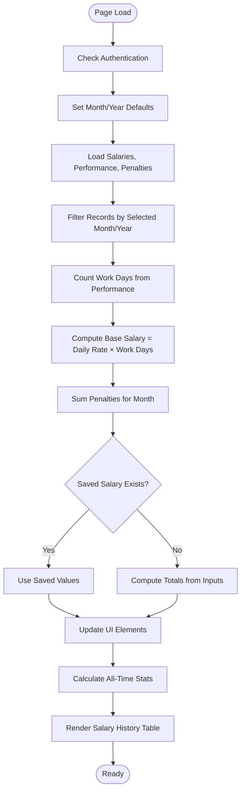
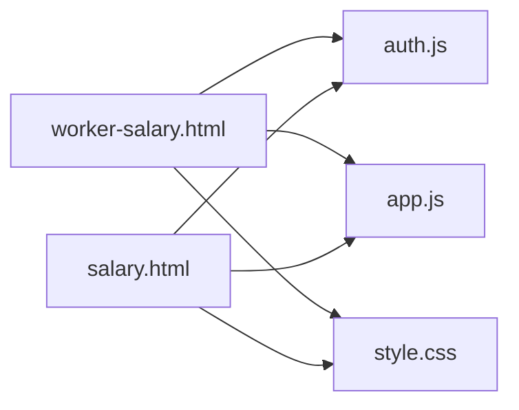

# Worker Salary View

<cite>
**Referenced Files in This Document**
- [worker-salary.html](file://worker-salary.html)
- [salary.html](file://salary.html)
- [app.js](file://app.js)
- [auth.js](file://auth.js)
- [style.css](file://style.css)
</cite>

## Table of Contents
1. [Introduction](#introduction)
2. [Project Structure](#project-structure)
3. [Core Components](#core-components)
4. [Architecture Overview](#architecture-overview)
5. [Detailed Component Analysis](#detailed-component-analysis)
6. [Dependency Analysis](#dependency-analysis)
7. [Performance Considerations](#performance-considerations)
8. [Troubleshooting Guide](#troubleshooting-guide)
9. [Conclusion](#conclusion)

## Introduction
This document describes the worker-specific salary viewing interface, focusing on how workers can view their personal salary history, current month preview, payment details, and related administrative capabilities. It explains the interface layout, data filtering by month/year, and export capabilities for personal records. The system integrates with shared utilities for authentication, data management, and formatting.

## Project Structure
The salary viewing experience is implemented as a dedicated HTML page for workers, complemented by shared JavaScript utilities for data access, formatting, and UI interactions. Administrative pages handle salary calculations and exports for managers.

**Diagram sources**
- [worker-salary.html:1-373](file://worker-salary.html#L1-L373)
- [salary.html:1-260](file://salary.html#L1-L260)
- [app.js:1-412](file://app.js#L1-L412)
- [auth.js:1-213](file://auth.js#L1-L213)
- [style.css:1-2177](file://style.css#L1-L2177)

**Section sources**
- [worker-salary.html:1-373](file://worker-salary.html#L1-L373)
- [salary.html:1-260](file://salary.html#L1-L260)
- [app.js:1-412](file://app.js#L1-L412)
- [auth.js:1-213](file://auth.js#L1-L213)
- [style.css:1-2177](file://style.css#L1-L2177)

## Core Components
- Worker Salary View Page: Presents current month preview, salary breakdown, statistics, filters, and historical records for the logged-in worker.
- Shared Utilities: Provide authentication checks, data access helpers, currency formatting, and export/print functions.
- Admin Salary Management: Handles salary calculation, editing, and exporting for administrators.

Key responsibilities:
- Personal salary history display with monthly payment records, amounts, and status indicators.
- Current month salary preview including work day count, daily rate application, and calculated totals.
- Payment history section showing past payments, bonus/penalty adjustments, and leave deductions.
- Salary statement generation, print functionality, and download options.
- Worker profile integration showing personal payment records and monthly salary breakdowns.
- Interface layout, data filtering by month/year, and export capabilities for personal records.

**Section sources**
- [worker-salary.html:80-247](file://worker-salary.html#L80-L247)
- [app.js:224-265](file://app.js#L224-L265)
- [auth.js:173-185](file://auth.js#L173-L185)

## Architecture Overview
The worker salary view is a client-side application leveraging local storage for data persistence. It uses shared modules for authentication, data retrieval, formatting, and export/printing. The admin page performs salary calculations and manages edits, while the worker page displays computed and stored results.

**Diagram sources**
- [worker-salary.html:253-370](file://worker-salary.html#L253-L370)
- [auth.js:142-148](file://auth.js#L142-L148)
- [auth.js:173-179](file://auth.js#L173-L179)
- [app.js:224-244](file://app.js#L224-L244)

## Detailed Component Analysis

### Worker Salary View Page
The worker salary view page organizes information into:
- Current Month Salary Preview: Displays the computed total for the selected month.
- Salary Breakdown: Shows daily rate, work days, base salary, bonus, penalty, and total.
- Statistics: Total bonuses, total penalties, and average salary across history.
- Month Filter: Allows selection of month and year to view specific periods.
- Salary History: Lists monthly records with work days, base salary, bonus, penalty, and total.

Processing logic:
- Authentication check ensures only workers can access the page.
- On load, sets default month/year to current date.
- Loads performance, penalties, and salary records.
- Computes work days from performance records for the selected period.
- Calculates base salary as daily rate × work days.
- Retrieves penalties for the selected month and sums them.
- Uses saved salary data if available; otherwise computes totals.
- Updates UI with formatted currency values and computed statistics.
- Renders historical records sorted by year/month descending.

**Diagram sources**
- [worker-salary.html:272-369](file://worker-salary.html#L272-L369)

**Section sources**
- [worker-salary.html:80-247](file://worker-salary.html#L80-L247)
- [worker-salary.html:272-369](file://worker-salary.html#L272-L369)

### Salary Breakdown and Statistics
The salary breakdown presents:
- Daily rate
- Work days
- Base salary
- Bonus
- Penalty
- Total

Statistics include:
- Total bonuses
- Total penalties
- Average salary

These values are computed from stored salary records and penalties, and displayed with currency formatting.

**Section sources**
- [worker-salary.html:97-182](file://worker-salary.html#L97-L182)
- [worker-salary.html:320-335](file://worker-salary.html#L320-L335)

### Month Filtering and History Rendering
The month filter allows selecting month and year. The salary history table lists monthly records with:
- Month and year
- Work days
- Base salary
- Bonus (+)
- Penalty (-)
- Total

Sorting is performed by year descending, then month descending.

**Section sources**
- [worker-salary.html:184-219](file://worker-salary.html#L184-L219)
- [worker-salary.html:222-247](file://worker-salary.html#L222-L247)
- [worker-salary.html:338-366](file://worker-salary.html#L338-L366)

### Export and Print Capabilities
While the worker page does not expose explicit export/print buttons, the shared utilities provide:
- Export to CSV: Converts data to CSV and triggers download.
- Print section: Opens a new window with styled content for printing.

Administrators can export salary data from the admin page. Workers can rely on browser print functionality for current page content.

**Section sources**
- [app.js:224-265](file://app.js#L224-L265)
- [salary.html:63-75](file://salary.html#L63-L75)

### Worker Profile Integration
The worker’s profile influences salary computation:
- Daily rate is taken from the current user’s profile.
- Historical records are filtered by worker ID.
- Performance and penalty records are filtered by worker ID.

**Section sources**
- [worker-salary.html:294-295](file://worker-salary.html#L294-L295)
- [worker-salary.html:280-282](file://worker-salary.html#L280-L282)

## Dependency Analysis
The worker salary view depends on:
- Authentication module for user context and data access helpers.
- Shared utilities for formatting currency and managing UI interactions.
- Style sheet for layout and responsive design.

**Diagram sources**
- [worker-salary.html:251-252](file://worker-salary.html#L251-L252)
- [salary.html:95](file://salary.html#L95)
- [app.js:1-19](file://app.js#L1-L19)
- [auth.js:1-13](file://auth.js#L1-L13)
- [style.css:1-27](file://style.css#L1-L27)

**Section sources**
- [worker-salary.html:251-252](file://worker-salary.html#L251-L252)
- [salary.html:95](file://salary.html#L95)
- [app.js:1-19](file://app.js#L1-L19)
- [auth.js:1-13](file://auth.js#L1-L13)
- [style.css:1-27](file://style.css#L1-L27)

## Performance Considerations
- Data filtering and sorting are performed client-side; ensure datasets remain manageable for smooth operation.
- Currency formatting uses locale-aware conversion; keep formatting consistent across views.
- Computation of totals and statistics occurs on demand; cache results when appropriate to reduce repeated calculations.

## Troubleshooting Guide
Common issues and resolutions:
- Authentication redirect: If the worker is not logged in or role is incorrect, the page redirects to the dashboard. Verify login credentials and role.
- No salary data: Ensure salary records exist for the selected month/year. Admins can calculate salaries if missing.
- Incorrect totals: Verify daily rate in the worker profile and that performance records include present/late statuses for work day counting.
- Export/print not working: Confirm that the export/print functions are invoked from the correct context and that browser settings allow downloads/pop-ups.

**Section sources**
- [worker-salary.html:254-258](file://worker-salary.html#L254-L258)
- [auth.js:55-63](file://auth.js#L55-L63)
- [salary.html:145-218](file://salary.html#L145-L218)

## Conclusion
The worker salary view provides a focused interface for displaying personal salary information, including current month previews, detailed breakdowns, statistics, and historical records. It integrates with shared utilities for authentication, data access, formatting, and export/printing. Administrators manage salary calculations and exports, while workers can review and navigate their payment history with month/year filtering.