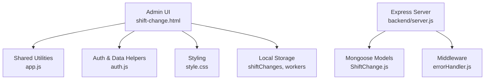
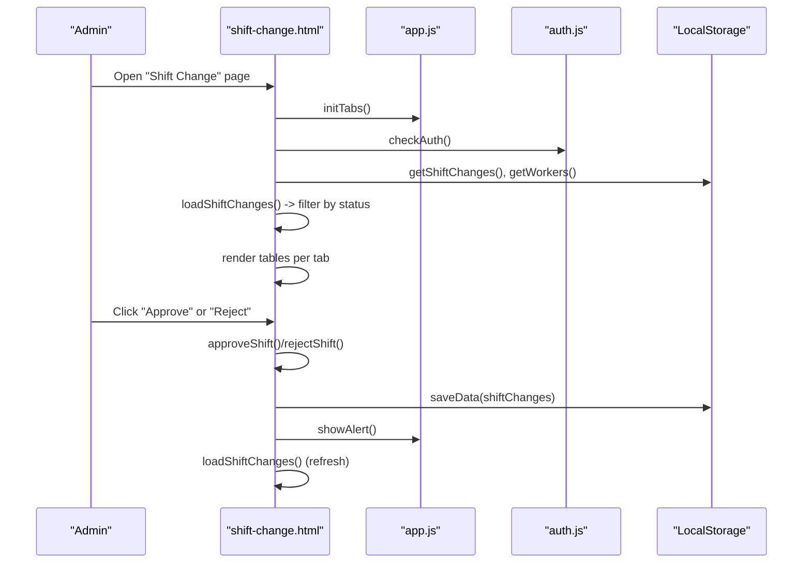
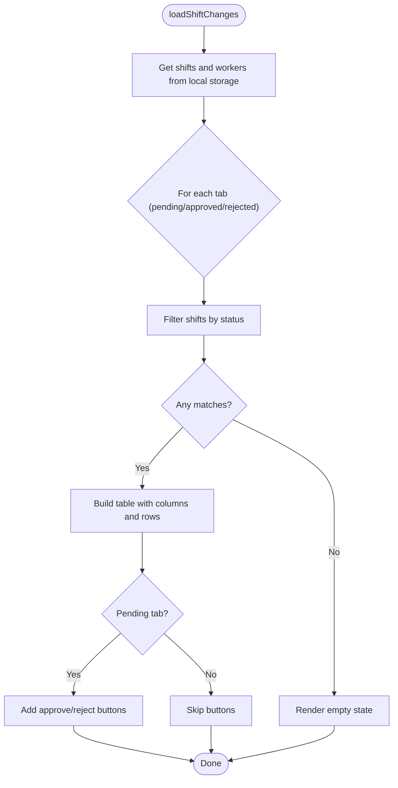
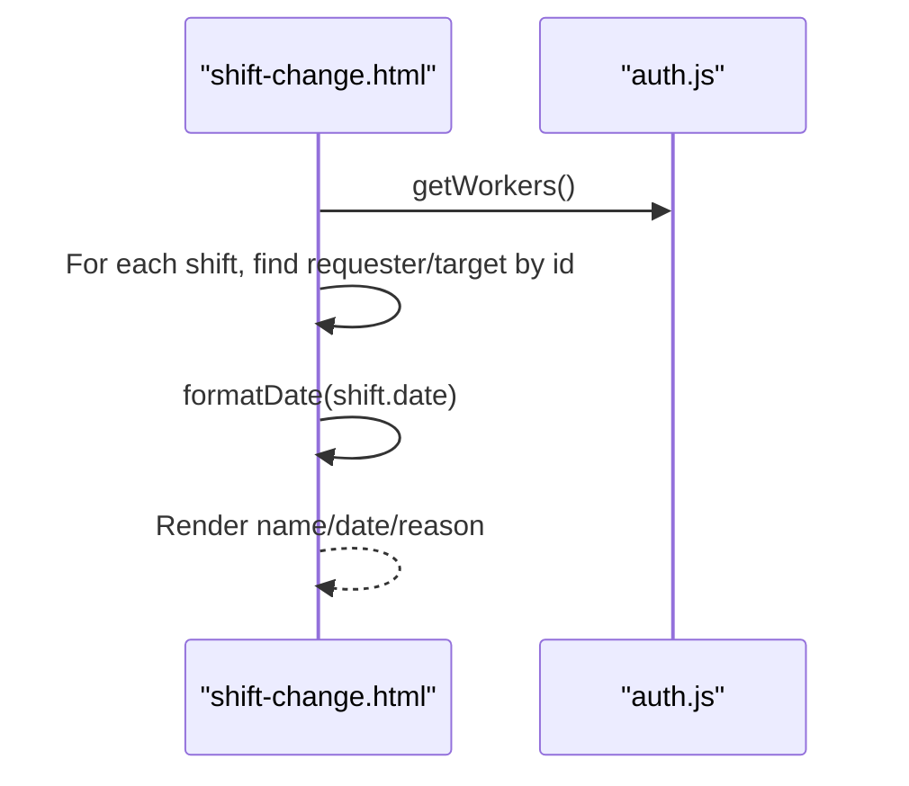
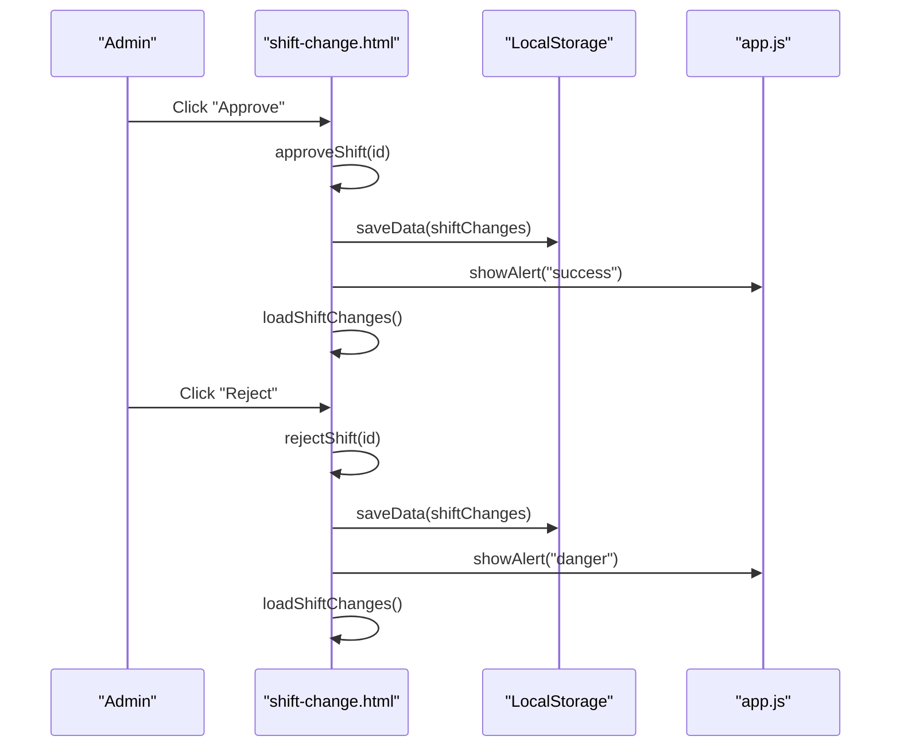
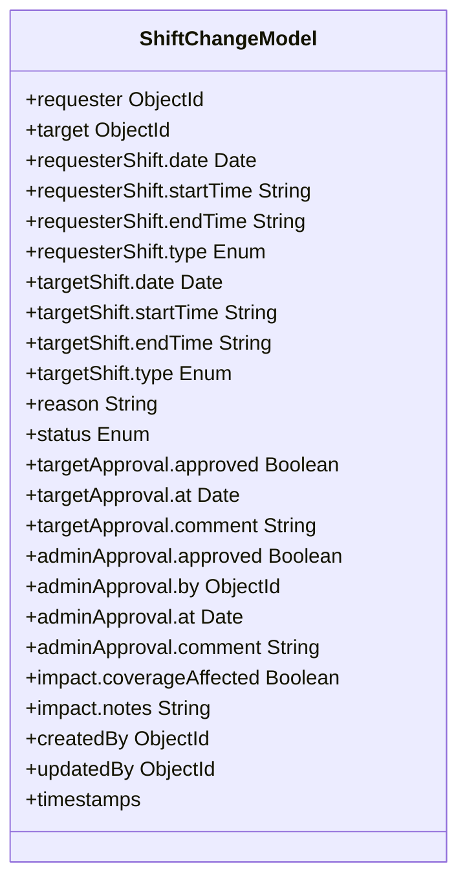
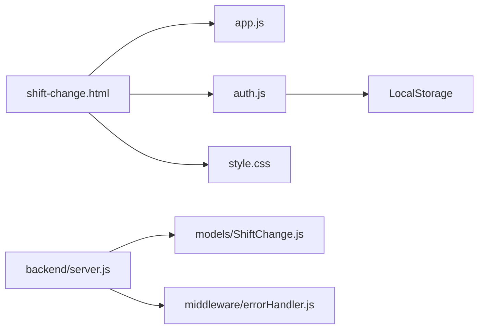

# Administrative Shift Management

<cite>
**Referenced Files in This Document**
- [shift-change.html](file://shift-change.html)
- [app.js](file://app.js)
- [auth.js](file://auth.js)
- [style.css](file://style.css)
- [backend/server.js](file://backend/server.js)
- [backend/models/ShiftChange.js](file://backend/models/ShiftChange.js)
- [backend/middleware/errorHandler.js](file://backend/middleware/errorHandler.js)
- [worker-shift-change.html](file://worker-shift-change.html)
</cite>

## Table of Contents
1. [Introduction](#introduction)
2. [Project Structure](#project-structure)
3. [Core Components](#core-components)
4. [Architecture Overview](#architecture-overview)
5. [Detailed Component Analysis](#detailed-component-analysis)
6. [Dependency Analysis](#dependency-analysis)
7. [Performance Considerations](#performance-considerations)
8. [Troubleshooting Guide](#troubleshooting-guide)
9. [Conclusion](#conclusion)

## Introduction
This document describes the administrative shift change management interface used by administrators to review and approve worker shift change requests. It explains the three-tab system (pending, approved, rejected), filtering and rendering logic, worker assignment display, date formatting, and the approval workflow. It also covers the integration with local data storage, request validation, alert notifications, and the tab-based navigation system. The goal is to help administrators efficiently track shift change history and manage workflow throughput.

## Project Structure
The administrative shift change page is a client-side HTML page with embedded JavaScript logic and Bootstrap Icons for UI. It integrates with shared application utilities and a small set of frontend helpers for authentication, alerts, and tab navigation. The backend is an Express server with Mongoose models for shift changes and supporting middleware.

**Diagram sources**
- [shift-change.html:1-141](file://shift-change.html#L1-L141)
- [app.js:154-172](file://app.js#L154-L172)
- [auth.js:154-160](file://auth.js#L154-L160)
- [style.css:1-200](file://style.css#L1-L200)
- [backend/server.js:95-118](file://backend/server.js#L95-L118)
- [backend/models/ShiftChange.js:1-146](file://backend/models/ShiftChange.js#L1-L146)
- [backend/middleware/errorHandler.js:64-112](file://backend/middleware/errorHandler.js#L64-L112)

**Section sources**
- [shift-change.html:1-141](file://shift-change.html#L1-L141)
- [app.js:154-172](file://app.js#L154-L172)
- [auth.js:154-160](file://auth.js#L154-L160)
- [style.css:1-200](file://style.css#L1-L200)
- [backend/server.js:95-118](file://backend/server.js#L95-L118)
- [backend/models/ShiftChange.js:1-146](file://backend/models/ShiftChange.js#L1-L146)
- [backend/middleware/errorHandler.js:64-112](file://backend/middleware/errorHandler.js#L64-L112)

## Core Components
- Three-tab interface for pending, approved, and rejected shift change requests.
- Table-based rendering with columns for requester, target, date, reason, and actions for pending items.
- Approval workflow with approveShift() and rejectShift() functions that update status and timestamps.
- Empty state handling per tab to guide administrators when no requests exist.
- Worker assignment display via local worker lookup.
- Date formatting using a localized function.
- Alert notifications for successful approvals or rejections.
- Tab navigation initialized via shared utilities.

**Section sources**
- [shift-change.html:47-73](file://shift-change.html#L47-L73)
- [shift-change.html:85-110](file://shift-change.html#L85-L110)
- [shift-change.html:112-136](file://shift-change.html#L112-L136)
- [auth.js:167-171](file://auth.js#L167-L171)
- [app.js:108-127](file://app.js#L108-L127)
- [app.js:154-172](file://app.js#L154-L172)

## Architecture Overview
The administrative interface is a single-page application that loads data from local storage, renders it into tabbed tables, and performs updates locally. The backend server exposes an API surface and defines the ShiftChange model with richer approval and audit fields. Administrators can navigate between tabs, review requests, and approve or reject them, which updates local state and triggers UI refresh.

**Diagram sources**
- [shift-change.html:78-139](file://shift-change.html#L78-L139)
- [app.js:154-172](file://app.js#L154-L172)
- [auth.js:56-82](file://auth.js#L56-L82)
- [auth.js:154-160](file://auth.js#L154-L160)

## Detailed Component Analysis

### Three-Tab System and Filtering
- Tabs: Pending, Approved, Rejected.
- Filtering: Each tab filters the in-memory shift change list by status.
- Rendering: For each filtered list, a table is built with headers and rows. Pending tab adds action buttons; others omit actions.

**Diagram sources**
- [shift-change.html:85-110](file://shift-change.html#L85-L110)

**Section sources**
- [shift-change.html:47-73](file://shift-change.html#L47-L73)
- [shift-change.html:85-110](file://shift-change.html#L85-L110)

### Worker Assignment Display and Date Formatting
- Worker names are resolved by matching requesterId and targetId against the workers array.
- Dates are formatted using a localized function to az-AZ locale.

**Diagram sources**
- [shift-change.html:98-108](file://shift-change.html#L98-L108)
- [auth.js:130-132](file://auth.js#L130-L132)
- [auth.js:167-171](file://auth.js#L167-L171)

**Section sources**
- [shift-change.html:98-108](file://shift-change.html#L98-L108)
- [auth.js:130-132](file://auth.js#L130-L132)
- [auth.js:167-171](file://auth.js#L167-L171)

### Approval Workflow: approveShift() and rejectShift()
- approveShift():
  - Finds the shift by id.
  - Sets status to approved.
  - Records approvedBy as current admin id and approvedAt as ISO timestamp.
  - Saves to local storage, refreshes UI, and shows success alert.
- rejectShift():
  - Similar logic with status rejected, rejectedBy, and rejectedAt.

**Diagram sources**
- [shift-change.html:112-136](file://shift-change.html#L112-L136)
- [app.js:108-127](file://app.js#L108-L127)

**Section sources**
- [shift-change.html:112-136](file://shift-change.html#L112-L136)
- [app.js:108-127](file://app.js#L108-L127)

### Audit Trail Creation and Fields
- Current implementation (client-side) stores approver identity and timestamps in the shift record:
  - approvedBy and approvedAt for approvals.
  - rejectedBy and rejectedAt for rejections.
- The backend model supports richer audit fields:
  - targetApproval.approved, at, comment.
  - adminApproval.approved, by, at, comment.
  - Additional impact assessment and metadata.

**Diagram sources**
- [backend/models/ShiftChange.js:3-100](file://backend/models/ShiftChange.js#L3-L100)

**Section sources**
- [shift-change.html:116-118](file://shift-change.html#L116-L118)
- [shift-change.html:129-131](file://shift-change.html#L129-L131)
- [backend/models/ShiftChange.js:56-97](file://backend/models/ShiftChange.js#L56-L97)

### Table-Based Interface and Action Buttons
- Pending tab displays action buttons for each row:
  - Approve button invokes approveShift().
  - Reject button invokes rejectShift().
- Approved and Rejected tabs show data without action buttons.

**Section sources**
- [shift-change.html:98-108](file://shift-change.html#L98-L108)
- [shift-change.html:112-136](file://shift-change.html#L112-L136)

### Empty State Handling
- When a tab has no matching requests, an empty state is rendered with an icon and a localized message indicating no requests exist for that status.

**Section sources**
- [shift-change.html:93-96](file://shift-change.html#L93-L96)

### Integration with Worker Data Lookup and Validation
- Worker lookup:
  - getWorkers() retrieves worker records from local storage.
  - For each shift, requester and target names are resolved by id.
- Request validation:
  - The client-side demo initializes default shift change entries with required fields and statuses.
  - The backend model enforces schema constraints (enums, required fields, length limits).

**Section sources**
- [auth.js:130-132](file://auth.js#L130-L132)
- [auth.js:48-52](file://auth.js#L48-L52)
- [backend/models/ShiftChange.js:42-54](file://backend/models/ShiftChange.js#L42-L54)

### Notification Systems
- The backend defines a Notification model with categories including shift_change, enabling future integration with in-app, email, or SMS notifications.
- The admin UI currently uses showAlert() for immediate feedback.

**Section sources**
- [backend/models/Notification.js:1-64](file://backend/models/Notification.js#L1-L64)
- [app.js:108-127](file://app.js#L108-L127)

### Tab-Based Navigation
- initTabs() toggles active classes among tab buttons and corresponding tab content containers.
- The page initializes tabs on load.

**Section sources**
- [app.js:154-172](file://app.js#L154-L172)
- [shift-change.html:83](file://shift-change.html#L83)

### Relationship Between Worker and Admin Interfaces
- Worker interface allows employees to submit shift change requests and view their own history.
- Admin interface reviews and approves requests submitted by workers.
- Both use the same underlying data structure stored in local storage.

**Section sources**
- [worker-shift-change.html:270-285](file://worker-shift-change.html#L270-L285)
- [auth.js:48-52](file://auth.js#L48-L52)

## Dependency Analysis
- shift-change.html depends on:
  - app.js for tab initialization and alert utilities.
  - auth.js for authentication checks, data retrieval, and date formatting.
  - style.css for layout and theming.
- Backend server (Express) depends on:
  - Mongoose models (ShiftChange) for persistence and schema enforcement.
  - Middleware (errorHandler) for consistent error handling.

**Diagram sources**
- [shift-change.html:77-139](file://shift-change.html#L77-L139)
- [app.js:154-172](file://app.js#L154-L172)
- [auth.js:154-160](file://auth.js#L154-L160)
- [backend/server.js:95-118](file://backend/server.js#L95-L118)
- [backend/models/ShiftChange.js:1-146](file://backend/models/ShiftChange.js#L1-L146)
- [backend/middleware/errorHandler.js:64-112](file://backend/middleware/errorHandler.js#L64-L112)

**Section sources**
- [shift-change.html:77-139](file://shift-change.html#L77-L139)
- [app.js:154-172](file://app.js#L154-L172)
- [auth.js:154-160](file://auth.js#L154-L160)
- [backend/server.js:95-118](file://backend/server.js#L95-L118)
- [backend/models/ShiftChange.js:1-146](file://backend/models/ShiftChange.js#L1-L146)
- [backend/middleware/errorHandler.js:64-112](file://backend/middleware/errorHandler.js#L64-L112)

## Performance Considerations
- Client-side filtering and rendering are efficient for small datasets stored in localStorage.
- For larger datasets, consider pagination, virtual scrolling, or server-side filtering/sorting.
- Debouncing search inputs (when integrated) can reduce unnecessary re-renders.
- Minimizing DOM updates by building innerHTML fragments once per tab reduces layout thrashing.

## Troubleshooting Guide
- Authentication redirection:
  - If the current user is not an admin, the page redirects to the worker dashboard.
- No requests shown:
  - Ensure demo data is initialized and shiftChanges contains entries with the expected status.
- Approve/Reject not working:
  - Verify that the shift id exists and that saveData persists changes.
- Alerts not appearing:
  - Confirm showAlert is called and the page-content container exists.

**Section sources**
- [shift-change.html:79-81](file://shift-change.html#L79-L81)
- [auth.js:16-53](file://auth.js#L16-L53)
- [auth.js:154-160](file://auth.js#L154-L160)
- [app.js:108-127](file://app.js#L108-L127)

## Conclusion
The administrative shift change interface provides a streamlined, tabbed view for reviewing and approving shift change requests. It leverages local storage for simplicity, offers clear empty states, and integrates with shared utilities for alerts and tab navigation. While the current implementation focuses on client-side updates, the backend model supports richer audit trails and multi-stage approvals suitable for future enhancements.