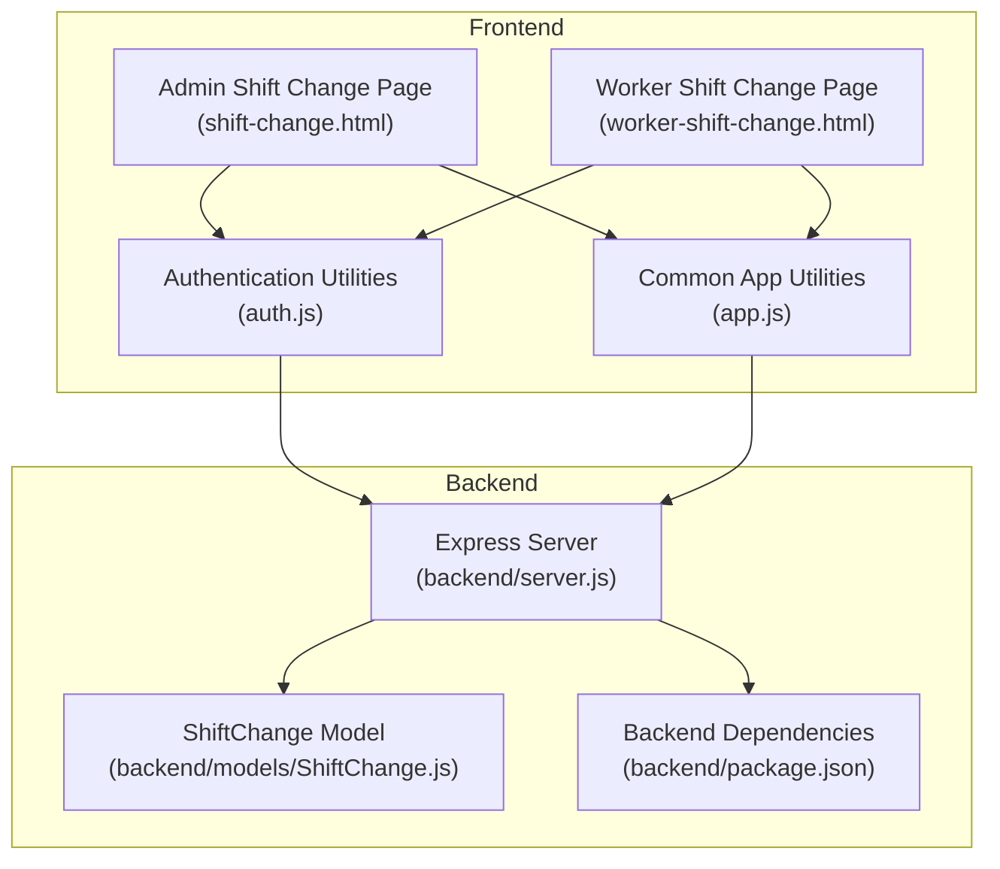
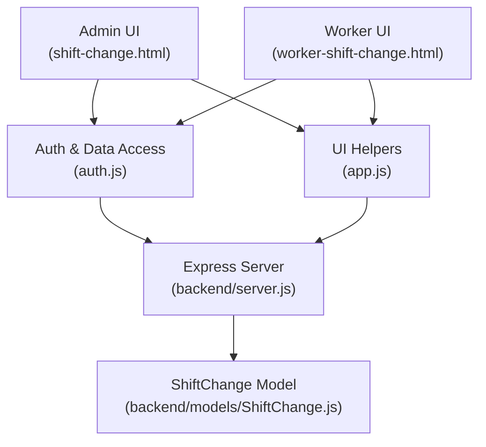
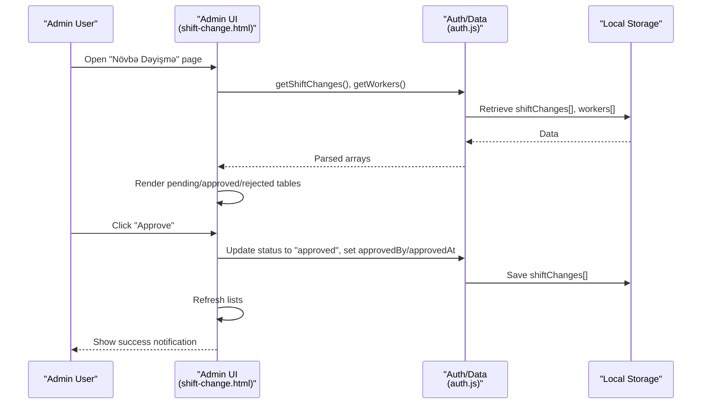
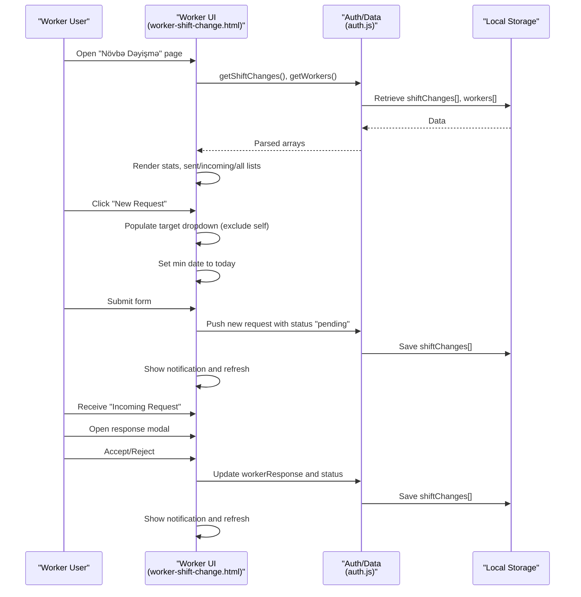
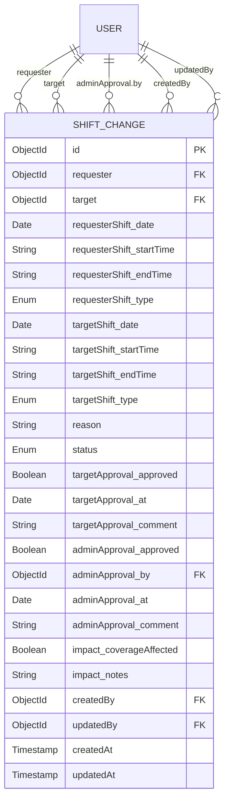
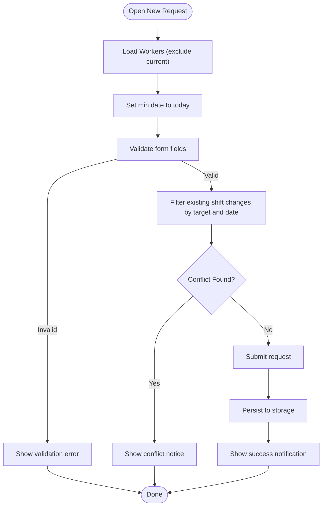
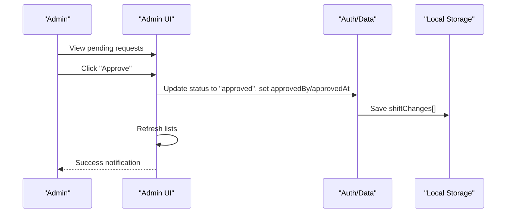
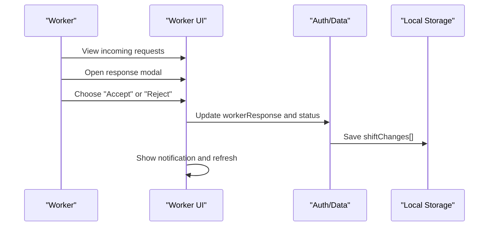
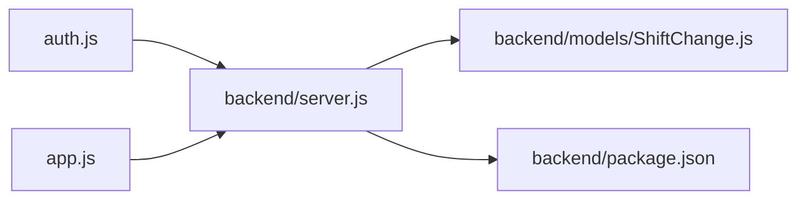

# Shift Change Management

<cite>
**Referenced Files in This Document**
- [shift-change.html](file://shift-change.html)
- [worker-shift-change.html](file://worker-shift-change.html)
- [auth.js](file://auth.js)
- [app.js](file://app.js)
- [server.js](file://backend/server.js)
- [ShiftChange.js](file://backend/models/ShiftChange.js)
- [package.json](file://backend/package.json)
</cite>

## Table of Contents
1. [Introduction](#introduction)
2. [Project Structure](#project-structure)
3. [Core Components](#core-components)
4. [Architecture Overview](#architecture-overview)
5. [Detailed Component Analysis](#detailed-component-analysis)
6. [Dependency Analysis](#dependency-analysis)
7. [Performance Considerations](#performance-considerations)
8. [Troubleshooting Guide](#troubleshooting-guide)
9. [Conclusion](#conclusion)

## Introduction
This document describes the shift change management system for the 555 İnşaat worker management platform. It covers the end-to-end workflow for requesting and approving shift changes, the data model, administrative approvals, notifications, conflict detection, and integration points with performance tracking and payroll calculations. The system supports both administrator and worker interfaces, with a frontend-only implementation using local storage and a backend-ready model designed for MongoDB/Mongoose persistence.

## Project Structure
The system comprises:
- Frontend pages for administrators and workers managing shift changes
- Shared authentication and utility modules
- Backend server with Express and Mongoose
- A MongoDB model for shift changes with rich status tracking and approval metadata

**Diagram sources**
- [shift-change.html](file://shift-change.html)
- [worker-shift-change.html](file://worker-shift-change.html)
- [auth.js](file://auth.js)
- [app.js](file://app.js)
- [server.js](file://backend/server.js)
- [ShiftChange.js](file://backend/models/ShiftChange.js)
- [package.json](file://backend/package.json)

**Section sources**
- [shift-change.html](file://shift-change.html)
- [worker-shift-change.html](file://worker-shift-change.html)
- [auth.js](file://auth.js)
- [app.js](file://app.js)
- [server.js](file://backend/server.js)
- [ShiftChange.js](file://backend/models/ShiftChange.js)
- [package.json](file://backend/package.json)

## Core Components
- Admin interface for reviewing pending shift change requests and approving/rejecting them
- Worker self-service interface for submitting requests, responding to incoming requests, and viewing history
- Shared utilities for authentication, data persistence, and UI helpers
- Backend server exposing API routes and connecting to MongoDB via Mongoose
- Shift change model supporting multi-stage approvals, impact assessment, and audit fields

Key responsibilities:
- Request lifecycle: submit → target approval → admin approval → finalized
- Conflict detection: performed client-side by filtering existing shift records
- Notifications: toast-style notifications and modal interactions
- Data persistence: local storage for frontend demo; Mongoose model for backend

**Section sources**
- [shift-change.html](file://shift-change.html)
- [worker-shift-change.html](file://worker-shift-change.html)
- [auth.js](file://auth.js)
- [app.js](file://app.js)
- [ShiftChange.js](file://backend/models/ShiftChange.js)

## Architecture Overview
The system follows a layered architecture:
- Presentation layer: HTML pages with embedded JavaScript logic
- Business logic: shared utilities for authentication, data access, and UI interactions
- Persistence layer: local storage for frontend demo; MongoDB via Mongoose for backend
- Backend service: Express server wiring routes, middleware, and database connectivity

**Diagram sources**
- [shift-change.html](file://shift-change.html)
- [worker-shift-change.html](file://worker-shift-change.html)
- [auth.js](file://auth.js)
- [app.js](file://app.js)
- [server.js](file://backend/server.js)
- [ShiftChange.js](file://backend/models/ShiftChange.js)

## Detailed Component Analysis

### Admin Shift Change Interface
The admin page displays three tabs: pending, approved, and rejected requests. It loads shift change records and worker metadata, renders a table per status, and allows approving or rejecting pending requests. Approval updates the record’s status and adds admin metadata.

**Diagram sources**
- [shift-change.html](file://shift-change.html)
- [auth.js](file://auth.js)

**Section sources**
- [shift-change.html](file://shift-change.html)
- [auth.js](file://auth.js)

### Worker Self-Service Interface
The worker interface provides:
- Statistics cards for total, pending, accepted, and approved requests
- Lists for sent and incoming requests
- A comprehensive table of all requests involving the worker
- Submission modal for new requests
- Response modal for incoming requests (accept/reject)

**Diagram sources**
- [worker-shift-change.html](file://worker-shift-change.html)
- [auth.js](file://auth.js)

**Section sources**
- [worker-shift-change.html](file://worker-shift-change.html)
- [auth.js](file://auth.js)

### Data Model: Shift Change
The backend model defines the canonical shift change entity with:
- Requester and target references
- Per-worker shift details (date, start/end time, shift type)
- Reason for change
- Multi-stage status (pending, target_approved, approved, rejected, cancelled)
- Target and admin approval metadata
- Impact assessment fields
- Audit fields for creation/update

**Diagram sources**
- [ShiftChange.js](file://backend/models/ShiftChange.js)

**Section sources**
- [ShiftChange.js](file://backend/models/ShiftChange.js)

### Conflict Detection and Resolution
Conflict detection is implemented client-side by filtering existing shift change records and workers’ shifts to prevent overlapping requests. The worker interface ensures the selected target is not the current user and sets the minimum request date to today.

**Diagram sources**
- [worker-shift-change.html](file://worker-shift-change.html)
- [auth.js](file://auth.js)

**Section sources**
- [worker-shift-change.html](file://worker-shift-change.html)
- [auth.js](file://auth.js)

### Administrative Approval Workflow
Administrators review pending requests and either approve or reject them. On approval, the system sets the status to approved and records the approver and timestamp. The worker receives notifications via the UI.

**Diagram sources**
- [shift-change.html](file://shift-change.html)
- [auth.js](file://auth.js)

**Section sources**
- [shift-change.html](file://shift-change.html)
- [auth.js](file://auth.js)

### Worker Response Workflow
When a worker receives an incoming request, they can accept or reject it. Accepting transitions the status to a target-approved state; rejecting sets a worker-rejected state. The system persists the worker’s note and updates the record accordingly.

**Diagram sources**
- [worker-shift-change.html](file://worker-shift-change.html)
- [auth.js](file://auth.js)

**Section sources**
- [worker-shift-change.html](file://worker-shift-change.html)
- [auth.js](file://auth.js)

### Notification System
Notifications are implemented as lightweight UI elements:
- Success/info/danger alerts with auto-dismiss
- Toast notifications for actions like submitting requests or approving/rejecting
- Modal interactions for confirmations and data entry

**Section sources**
- [app.js](file://app.js)
- [worker-shift-change.html](file://worker-shift-change.html)
- [shift-change.html](file://shift-change.html)

### Integration with Performance Tracking and Payroll
- The system stores daily salary and performance metrics per worker, enabling payroll calculations based on work days and bonuses/penalties.
- Shift change impacts can be recorded in the model’s impact fields for reporting and audit trails.
- Future backend integration would persist shift changes to MongoDB and compute hours based on shift types and durations.

**Section sources**
- [auth.js](file://auth.js)
- [ShiftChange.js](file://backend/models/ShiftChange.js)

## Dependency Analysis
The frontend depends on shared utilities for authentication and UI helpers. The backend server integrates Mongoose for data modeling and exposes routes for the application.

**Diagram sources**
- [auth.js](file://auth.js)
- [app.js](file://app.js)
- [server.js](file://backend/server.js)
- [ShiftChange.js](file://backend/models/ShiftChange.js)
- [package.json](file://backend/package.json)

**Section sources**
- [auth.js](file://auth.js)
- [app.js](file://app.js)
- [server.js](file://backend/server.js)
- [ShiftChange.js](file://backend/models/ShiftChange.js)
- [package.json](file://backend/package.json)

## Performance Considerations
- Client-side filtering is efficient for small datasets; consider pagination or server-side queries for larger datasets.
- Minimize DOM updates by batching rendering operations and using virtualization for long lists.
- Debounce search/filter inputs to reduce unnecessary computations.
- Use indexed fields in the backend model to optimize queries by requester, target, status, and shift date.

## Troubleshooting Guide
Common issues and resolutions:
- Authentication failures: Verify credentials and role checks; ensure demo users are initialized.
- Empty lists: Confirm data initialization and localStorage keys for workers, tasks, performance, salaries, penalties, permissions, and shiftChanges.
- Conflicting requests: Ensure date and target filters are applied before submission.
- UI not updating: Check that data is persisted and the page reloads or refreshes views after state changes.

**Section sources**
- [auth.js](file://auth.js)
- [app.js](file://app.js)
- [worker-shift-change.html](file://worker-shift-change.html)
- [shift-change.html](file://shift-change.html)

## Conclusion
The shift change management system provides a clear, staged workflow for requesting, reviewing, and finalizing shift changes. The frontend offers robust self-service capabilities for workers and administrative oversight for managers, while the backend-ready model supports scalable persistence and advanced features like impact assessments and audit trails. Integrating backend services would enable automated conflict detection, real-time notifications, and seamless payroll calculations aligned with performance tracking.