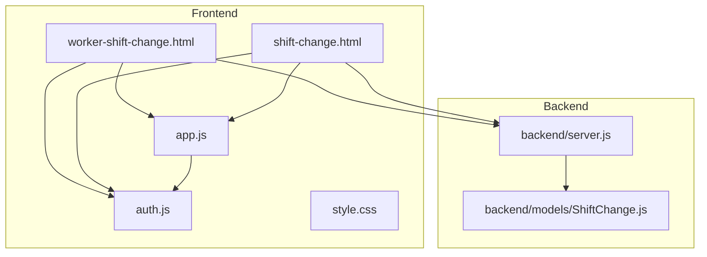
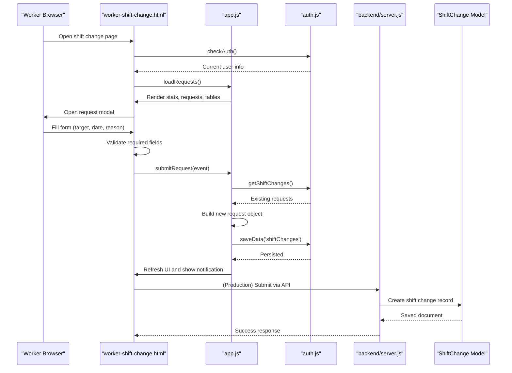
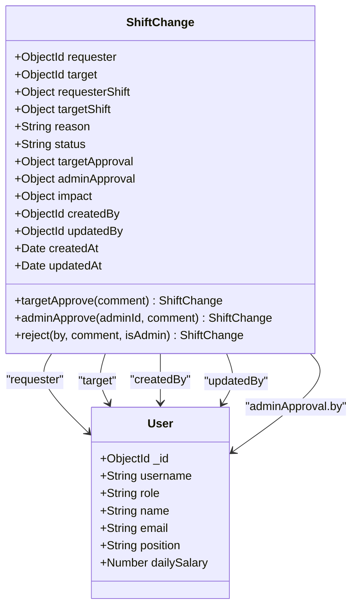
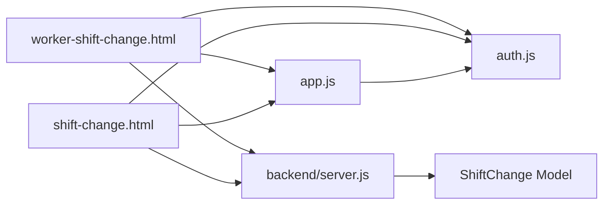

# Worker Shift Interface

<cite>
**Referenced Files in This Document**
- [worker-shift-change.html](file://worker-shift-change.html)
- [shift-change.html](file://shift-change.html)
- [app.js](file://app.js)
- [auth.js](file://auth.js)
- [style.css](file://style.css)
- [backend/server.js](file://backend/server.js)
- [backend/models/ShiftChange.js](file://backend/models/ShiftChange.js)
</cite>

## Table of Contents
1. [Introduction](#introduction)
2. [Project Structure](#project-structure)
3. [Core Components](#core-components)
4. [Architecture Overview](#architecture-overview)
5. [Detailed Component Analysis](#detailed-component-analysis)
6. [Dependency Analysis](#dependency-analysis)
7. [Performance Considerations](#performance-considerations)
8. [Troubleshooting Guide](#troubleshooting-guide)
9. [Conclusion](#conclusion)

## Introduction
This document describes the worker-specific shift change interface for the 555 İnşaat construction workforce management system. It covers the shift change request submission process, form validation, data collection, worker registration and profile integration, scheduling visibility, request form fields, submission workflow, status tracking, notifications, conflict detection against existing schedules, impact assessment on work hours, request history viewing, and supervisor communication capabilities. The system integrates a frontend interface with a centralized shift change database model and a backend server supporting REST APIs and real-time features.

## Project Structure
The worker shift interface consists of:
- Frontend pages for workers and administrators
- Shared application utilities and styling
- Backend server with MongoDB integration and API routing
- Centralized shift change data model supporting multi-stage approvals and impact tracking

**Diagram sources**
- [worker-shift-change.html](file://worker-shift-change.html)
- [shift-change.html](file://shift-change.html)
- [app.js](file://app.js)
- [auth.js](file://auth.js)
- [style.css](file://style.css)
- [backend/server.js](file://backend/server.js)
- [backend/models/ShiftChange.js](file://backend/models/ShiftChange.js)

**Section sources**
- [worker-shift-change.html](file://worker-shift-change.html)
- [shift-change.html](file://shift-change.html)
- [app.js](file://app.js)
- [auth.js](file://auth.js)
- [style.css](file://style.css)
- [backend/server.js](file://backend/server.js)
- [backend/models/ShiftChange.js](file://backend/models/ShiftChange.js)

## Core Components
- Worker shift change page: Provides request creation, statistics, personal requests, incoming requests, and global request table.
- Administrator shift change page: Manages pending/approved/rejected requests with approval actions.
- Shared utilities: Modal handling, tabs, alerts, theme toggle, and common helpers.
- Authentication module: Demo user management, session handling, and local data initialization.
- Backend server: Express server with CORS, rate limiting, logging, static file serving, and API routes.
- Shift change model: Mongoose schema defining fields, statuses, approvals, and impact assessment.

Key responsibilities:
- Worker submission of shift change requests with validation and persistence.
- Real-time status updates and notifications.
- Conflict detection against existing schedules and impact assessment.
- Supervisor review and administrative approval workflow.
- Request history and communication via notes/comments.

**Section sources**
- [worker-shift-change.html](file://worker-shift-change.html)
- [shift-change.html](file://shift-change.html)
- [app.js](file://app.js)
- [auth.js](file://auth.js)
- [backend/server.js](file://backend/server.js)
- [backend/models/ShiftChange.js](file://backend/models/ShiftChange.js)

## Architecture Overview
The system follows a client-server architecture with a frontend built using HTML, CSS, and JavaScript, and a backend powered by Node.js, Express, and MongoDB. The worker interface persists data locally during development and integrates with backend APIs in production. The shift change model supports multi-stage approvals and impact tracking.

**Diagram sources**
- [worker-shift-change.html](file://worker-shift-change.html)
- [app.js](file://app.js)
- [auth.js](file://auth.js)
- [backend/server.js](file://backend/server.js)
- [backend/models/ShiftChange.js](file://backend/models/ShiftChange.js)

## Detailed Component Analysis

### Worker Shift Change Interface
The worker interface enables viewing current statistics, submitting new requests, responding to incoming requests, and reviewing all related requests. It uses local storage for data persistence during development and integrates with backend APIs in production.

Key features:
- Statistics cards for total, pending, accepted, and approved requests.
- Personal requests list showing recent submissions and statuses.
- Incoming requests panel for requests targeting the logged-in worker.
- Full request table with requester, target, date, reason, worker/admin responses, and status.
- Modal forms for creating new requests and responding to incoming ones.
- Notifications for successful actions.

Validation and data collection:
- Required fields include target worker, date, and reason.
- Date minimum is set to the current day.
- Target worker dropdown is populated excluding the current user.
- Submission creates a new request with status "pending" and stores timestamps.

Status tracking and notifications:
- Status badges reflect pending, worker acceptance, admin approval, or rejection.
- Notifications appear for successful submissions and responses.
- Alerts are shown for admin actions.

Conflict detection and impact assessment:
- The backend model includes an impact section for coverage effects and notes.
- In the current frontend implementation, conflicts are not explicitly checked; this would be implemented in the backend API and integrated into the frontend.

Communication with supervisors:
- Notes fields in response modals allow adding comments.
- Status updates propagate to the request table for transparency.

**Section sources**
- [worker-shift-change.html](file://worker-shift-change.html)
- [app.js](file://app.js)
- [auth.js](file://auth.js)

### Administrator Shift Change Interface
The administrator interface manages shift change requests across three tabs: pending, approved, and rejected. Administrators can approve or reject pending requests, marking them with timestamps and approver identity.

Key features:
- Tabbed layout for filtering requests by status.
- Pending requests with action buttons to approve or reject.
- Approved and rejected sections for historical tracking.
- Alert system for operation feedback.

Approval workflow:
- Approve sets status to approved and records approver and timestamp.
- Reject sets status to rejected and records reason/comment.

**Section sources**
- [shift-change.html](file://shift-change.html)
- [app.js](file://app.js)

### Shared Utilities and Styling
Common utilities include modal management, tab switching, theme toggling, alerts, and helper functions for data retrieval and formatting. Styling provides responsive layouts, consistent theming, and visual feedback for actions.

**Section sources**
- [app.js](file://app.js)
- [style.css](file://style.css)

### Backend Server and Data Model
The backend server configures security middleware, CORS, rate limiting, compression, logging, and static file serving. It exposes numerous API routes and includes a health check endpoint. The shift change model defines the schema for storing shift change requests, including requester/target references, shift details, reasons, statuses, approvals, and impact assessments.

**Diagram sources**
- [backend/models/ShiftChange.js](file://backend/models/ShiftChange.js)

**Section sources**
- [backend/server.js](file://backend/server.js)
- [backend/models/ShiftChange.js](file://backend/models/ShiftChange.js)

## Dependency Analysis
The frontend components depend on shared utilities and authentication modules. The backend server depends on Mongoose for data modeling and exposes routes for various subsystems, including shift changes. The shift change model encapsulates the domain logic for approvals and impact tracking.

**Diagram sources**
- [worker-shift-change.html](file://worker-shift-change.html)
- [shift-change.html](file://shift-change.html)
- [app.js](file://app.js)
- [auth.js](file://auth.js)
- [backend/server.js](file://backend/server.js)
- [backend/models/ShiftChange.js](file://backend/models/ShiftChange.js)

**Section sources**
- [worker-shift-change.html](file://worker-shift-change.html)
- [shift-change.html](file://shift-change.html)
- [app.js](file://app.js)
- [auth.js](file://auth.js)
- [backend/server.js](file://backend/server.js)
- [backend/models/ShiftChange.js](file://backend/models/ShiftChange.js)

## Performance Considerations
- Local storage usage in development: Efficient for small datasets but may require pagination or server-side filtering for large histories.
- Frontend rendering: Sorting and filtering are client-side; consider virtualization or server-side queries for extensive request histories.
- Backend scalability: Use indexing on frequently queried fields (requester, target, status, dates) and implement pagination for request lists.
- Real-time updates: Integrate WebSocket connections for live notifications and status updates.

## Troubleshooting Guide
Common issues and resolutions:
- Authentication failures: Verify credentials and role checks; ensure demo users are initialized.
- Empty request lists: Confirm local storage initialization and that current user ID matches stored data.
- Form validation errors: Ensure required fields are filled; check for error classes applied by validation helpers.
- Modal not closing: Verify modal IDs and event handlers; ensure proper close functions are called.
- Theme toggle not persisting: Check local storage keys and theme state synchronization.
- Backend connectivity: Confirm server is running, routes are registered, and CORS settings permit frontend origin.

**Section sources**
- [auth.js](file://auth.js)
- [app.js](file://app.js)
- [worker-shift-change.html](file://worker-shift-change.html)
- [shift-change.html](file://shift-change.html)

## Conclusion
The worker shift change interface provides a comprehensive solution for shift change requests, enabling workers to submit requests, view statuses, and communicate with supervisors, while administrators can review and approve requests. The backend model supports multi-stage approvals and impact tracking, laying the groundwork for advanced conflict detection and reporting. Future enhancements should focus on integrating backend APIs, implementing conflict detection, and adding real-time notifications.