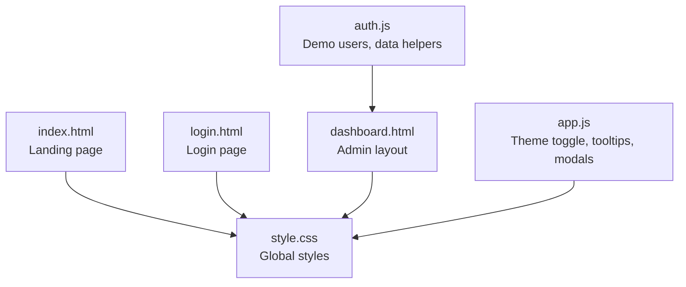
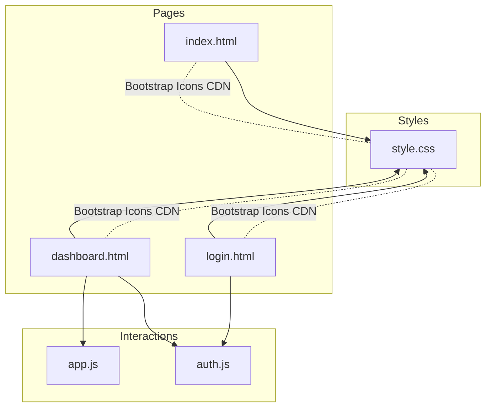
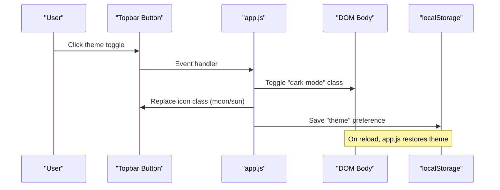
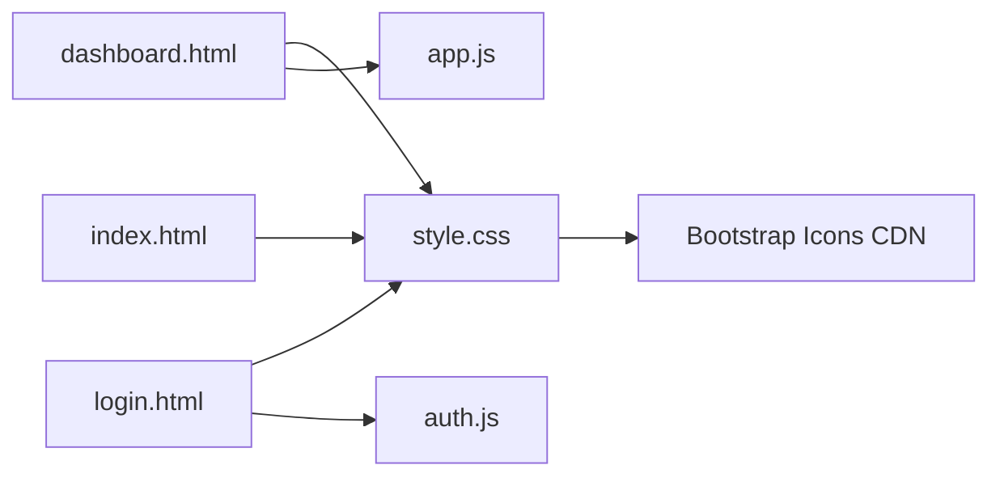

# Styling & Theming

<cite>
**Referenced Files in This Document**
- [style.css](file://style.css)
- [index.html](file://index.html)
- [login.html](file://login.html)
- [dashboard.html](file://dashboard.html)
- [app.js](file://app.js)
- [auth.js](file://auth.js)
</cite>

## Table of Contents
1. [Introduction](#introduction)
2. [Project Structure](#project-structure)
3. [Core Components](#core-components)
4. [Architecture Overview](#architecture-overview)
5. [Detailed Component Analysis](#detailed-component-analysis)
6. [Dependency Analysis](#dependency-analysis)
7. [Performance Considerations](#performance-considerations)
8. [Troubleshooting Guide](#troubleshooting-guide)
9. [Conclusion](#conclusion)
10. [Appendices](#appendices)

## Introduction
This document explains the styling and theming system used across the project’s pages. It covers the CSS architecture, custom properties, responsive design, component-based styling, dark/light theme implementation, Bootstrap Icons integration, typography and spacing conventions, breakpoints and mobile-first approach, customization guidelines, maintainability practices, browser compatibility, performance optimization, and accessibility considerations.

## Project Structure
The styling system is centralized in a single stylesheet and complemented by minimal JavaScript for theme switching and UI interactions. Pages share a consistent design language and responsive behavior.

**Diagram sources**
- [index.html:1-84](file://index.html#L1-L84)
- [login.html:1-169](file://login.html#L1-L169)
- [dashboard.html:1-381](file://dashboard.html#L1-L381)
- [style.css:1-2177](file://style.css#L1-L2177)
- [app.js:1-412](file://app.js#L1-L412)
- [auth.js:1-213](file://auth.js#L1-L213)

**Section sources**
- [index.html:1-84](file://index.html#L1-L84)
- [login.html:1-169](file://login.html#L1-L169)
- [dashboard.html:1-381](file://dashboard.html#L1-L381)
- [style.css:1-2177](file://style.css#L1-L2177)
- [app.js:1-412](file://app.js#L1-L412)
- [auth.js:1-213](file://auth.js#L1-L213)

## Core Components
- CSS custom properties define brand colors, shadows, radii, transitions, and spacing tokens. These variables are referenced throughout selectors to ensure consistent theming.
- Component-based classes encapsulate reusable UI patterns (buttons, cards, forms, badges, tabs, progress bars, modals).
- Responsive breakpoints adapt layouts for mobile-first experiences across devices.
- Theme switching toggles a body class and persists user preference in local storage.

Key areas:
- Color scheme and variables: [style.css:6-27](file://style.css#L6-L27)
- Base reset and typography: [style.css:29-45](file://style.css#L29-L45)
- Landing page navigation and hero: [style.css:62-142](file://style.css#L62-L142)
- Login page layout and form: [style.css:235-581](file://style.css#L235-L581)
- Admin layout, sidebar, and topbar: [style.css:670-878](file://style.css#L670-L878)
- Cards, tables, badges, buttons: [style.css:952-1084](file://style.css#L952-L1084)
- Responsive behavior and media queries: [style.css:1220-1289](file://style.css#L1220-L1289), [style.css:2079-2124](file://style.css#L2079-L2124)
- Theme toggle logic: [app.js:70-94](file://app.js#L70-L94)

**Section sources**
- [style.css:6-27](file://style.css#L6-L27)
- [style.css:29-45](file://style.css#L29-L45)
- [style.css:62-142](file://style.css#L62-L142)
- [style.css:235-581](file://style.css#L235-L581)
- [style.css:670-878](file://style.css#L670-L878)
- [style.css:952-1084](file://style.css#L952-L1084)
- [style.css:1220-1289](file://style.css#L1220-L1289)
- [style.css:2079-2124](file://style.css#L2079-L2124)
- [app.js:70-94](file://app.js#L70-L94)

## Architecture Overview
The styling architecture follows a component-driven approach with a central stylesheet and a small JS module for interactive behaviors. Bootstrap Icons are included via CDN and used extensively for visual affordances.

**Diagram sources**
- [index.html:1-84](file://index.html#L1-L84)
- [login.html:1-169](file://login.html#L1-L169)
- [dashboard.html:1-381](file://dashboard.html#L1-L381)
- [style.css:1-2177](file://style.css#L1-L2177)
- [app.js:1-412](file://app.js#L1-L412)
- [auth.js:1-213](file://auth.js#L1-L213)

## Detailed Component Analysis

### CSS Architecture and Custom Properties
- Centralized variables for brand palette, semantic colors, shadows, radii, and transitions enable consistent theming across components.
- Base styles normalize margins/padding and establish typography defaults.
- Component classes are scoped to page contexts (e.g., landing, login, admin) to avoid global conflicts.

Implementation highlights:
- Variables: [style.css:6-27](file://style.css#L6-L27)
- Resets and base: [style.css:29-45](file://style.css#L29-L45)
- Landing page components: [style.css:62-142](file://style.css#L62-L142)
- Login page components: [style.css:235-581](file://style.css#L235-L581)
- Admin layout components: [style.css:670-878](file://style.css#L670-L878)

**Section sources**
- [style.css:6-27](file://style.css#L6-L27)
- [style.css:29-45](file://style.css#L29-L45)
- [style.css:62-142](file://style.css#L62-L142)
- [style.css:235-581](file://style.css#L235-L581)
- [style.css:670-878](file://style.css#L670-L878)

### Dark/Light Theme Implementation
- Theme toggle adds/removes a body class and updates the icon accordingly.
- Preference is persisted in local storage and restored on page load.
- The theme switch is integrated into the admin dashboard topbar.

**Diagram sources**
- [dashboard.html:89-92](file://dashboard.html#L89-L92)
- [app.js:70-94](file://app.js#L70-L94)

**Section sources**
- [dashboard.html:89-92](file://dashboard.html#L89-L92)
- [app.js:70-94](file://app.js#L70-L94)

### Bootstrap Icons Integration
- Icons are loaded via CDN and used across pages for navigation, actions, alerts, and decorative elements.
- Consistent iconography improves usability and reduces cognitive load.

Usage examples:
- Landing page navigation and hero: [index.html:14-38](file://index.html#L14-L38)
- Login page branding and form icons: [login.html:15-94](file://login.html#L15-L94)
- Dashboard navigation and action icons: [dashboard.html:23-73](file://dashboard.html#L23-L73)

**Section sources**
- [index.html:14-38](file://index.html#L14-L38)
- [login.html:15-94](file://login.html#L15-L94)
- [dashboard.html:23-73](file://dashboard.html#L23-L73)

### Typography System and Spacing Conventions
- Typography defaults are set on the body element, with headings and components inheriting consistent sizes and weights.
- Spacing tokens are derived from custom properties for padding, margins, and gaps across components.

Typography and spacing references:
- Body and headings: [style.css:40-45](file://style.css#L40-L45)
- Landing hero headings: [style.css:125-136](file://style.css#L125-L136)
- Buttons and form controls: [style.css:145-172](file://style.css#L145-L172)
- Cards and grids: [style.css:880-951](file://style.css#L880-L951)

**Section sources**
- [style.css:40-45](file://style.css#L40-L45)
- [style.css:125-136](file://style.css#L125-L136)
- [style.css:145-172](file://style.css#L145-L172)
- [style.css:880-951](file://style.css#L880-L951)

### Responsive Design and Breakpoints
- Mobile-first approach with targeted media queries for larger screens.
- Breakpoints adjust navigation, hero layout, grid columns, and form layouts.

Breakpoint references:
- Admin layout sidebar and dashboard grid: [style.css:1221-1313](file://style.css#L1221-L1313)
- Landing page adjustments: [style.css:1240-1289](file://style.css#L1240-L1289)
- Login page adjustments: [style.css:2080-2124](file://style.css#L2080-L2124)
- Print styles: [style.css:2161-2177](file://style.css#L2161-L2177)

**Section sources**
- [style.css:1221-1313](file://style.css#L1221-L1313)
- [style.css:1240-1289](file://style.css#L1240-L1289)
- [style.css:2080-2124](file://style.css#L2080-L2124)
- [style.css:2161-2177](file://style.css#L2161-L2177)

### Component-Based Styling
- Reusable components include buttons, cards, tables, badges, progress indicators, modals, and tabs.
- Naming follows a consistent pattern (e.g., .btn, .card, .data-table, .badge-*).

Component references:
- Buttons and button variants: [style.css:145-172](file://style.css#L145-L172), [style.css:1053-1084](file://style.css#L1053-L1084)
- Cards and stat cards: [style.css:952-951](file://style.css#L952-L951)
- Tables and data tables: [style.css:984-1017](file://style.css#L984-L1017)
- Badges: [style.css:1018-1051](file://style.css#L1018-L1051)
- Progress bars and cells: [style.css:1341-1354](file://style.css#L1341-L1354), [style.css:1862-1882](file://style.css#L1862-L1882)
- Modals: [style.css:1123-1183](file://style.css#L1123-L1183)

**Section sources**
- [style.css:145-172](file://style.css#L145-L172)
- [style.css:952-951](file://style.css#L952-L951)
- [style.css:984-1017](file://style.css#L984-L1017)
- [style.css:1018-1051](file://style.css#L1018-L1051)
- [style.css:1341-1354](file://style.css#L1341-L1354)
- [style.css:1862-1882](file://style.css#L1862-L1882)
- [style.css:1123-1183](file://style.css#L1123-L1183)

### Theme Switching Functionality
- The theme toggle resides in the admin dashboard topbar and switches between light and dark modes.
- The icon reflects the current theme and persists the selection.

Integration points:
- HTML button and icon: [dashboard.html:89-92](file://dashboard.html#L89-L92)
- Theme toggle logic: [app.js:70-94](file://app.js#L70-L94)

**Section sources**
- [dashboard.html:89-92](file://dashboard.html#L89-L92)
- [app.js:70-94](file://app.js#L70-L94)

### Color Scheme Management
- Brand colors (primary, secondary) and semantic colors (success, danger, warning, info) are defined as CSS variables.
- Color tokens are applied consistently across components for visual coherence.

References:
- Variables: [style.css:6-27](file://style.css#L6-L27)
- Usage in components: [style.css:157-166](file://style.css#L157-L166), [style.css:1059-1084](file://style.css#L1059-L1084)

**Section sources**
- [style.css:6-27](file://style.css#L6-L27)
- [style.css:157-166](file://style.css#L157-L166)
- [style.css:1059-1084](file://style.css#L1059-L1084)

### Bootstrap Icons Integration Details
- CDN inclusion ensures availability of icons across pages.
- Icons are used for navigation items, action buttons, alerts, and decorative elements.

References:
- CDN link: [index.html:7](file://index.html#L7), [login.html:7](file://login.html#L7), [dashboard.html:7](file://dashboard.html#L7)
- Usage examples: [index.html:14-38](file://index.html#L14-L38), [login.html:15-94](file://login.html#L15-L94), [dashboard.html:23-73](file://dashboard.html#L23-L73)

**Section sources**
- [index.html:7](file://index.html#L7)
- [login.html:7](file://login.html#L7)
- [dashboard.html:7](file://dashboard.html#L7)
- [index.html:14-38](file://index.html#L14-L38)
- [login.html:15-94](file://login.html#L15-L94)
- [dashboard.html:23-73](file://dashboard.html#L23-L73)

### Customization Guidelines
- Brand colors: Modify variables in [style.css:6-27](file://style.css#L6-L27) to update primary/secondary palettes and semantic colors.
- Logo integration: Use the .brand-logo and .logo classes to place and style logos consistently across pages.
- Layout modifications: Adjust grid templates and media queries in [style.css:1221-1313](file://style.css#L1221-L1313) and [style.css:2080-2124](file://style.css#L2080-L2124).
- Component overrides: Extend existing component classes (e.g., .card, .btn) with new modifiers to maintain consistency.

**Section sources**
- [style.css:6-27](file://style.css#L6-L27)
- [style.css:1221-1313](file://style.css#L1221-L1313)
- [style.css:2080-2124](file://style.css#L2080-L2124)

### CSS Modules Organization and Maintainability
- Single stylesheet approach simplifies maintenance and reduces HTTP requests.
- Component-scoped selectors minimize global side effects.
- Media queries are grouped near relevant components for easy updates.

References:
- Component scoping: [style.css:62-142](file://style.css#L62-L142), [style.css:235-581](file://style.css#L235-L581), [style.css:670-878](file://style.css#L670-L878)
- Media queries: [style.css:1221-1313](file://style.css#L1221-L1313), [style.css:2080-2124](file://style.css#L2080-L2124)

**Section sources**
- [style.css:62-142](file://style.css#L62-L142)
- [style.css:235-581](file://style.css#L235-L581)
- [style.css:670-878](file://style.css#L670-L878)
- [style.css:1221-1313](file://style.css#L1221-L1313)
- [style.css:2080-2124](file://style.css#L2080-L2124)

## Dependency Analysis
The styling system depends on:
- Bootstrap Icons CDN for iconography.
- Local storage for theme persistence.
- Minimal JavaScript for interactive behaviors.

**Diagram sources**
- [index.html:7](file://index.html#L7)
- [login.html:7](file://login.html#L7)
- [dashboard.html:7](file://dashboard.html#L7)
- [style.css:1-2177](file://style.css#L1-L2177)
- [app.js:1-412](file://app.js#L1-L412)
- [auth.js:1-213](file://auth.js#L1-L213)

**Section sources**
- [index.html:7](file://index.html#L7)
- [login.html:7](file://login.html#L7)
- [dashboard.html:7](file://dashboard.html#L7)
- [style.css:1-2177](file://style.css#L1-L2177)
- [app.js:1-412](file://app.js#L1-L412)
- [auth.js:1-213](file://auth.js#L1-L213)

## Performance Considerations
- Single stylesheet reduces network overhead and render-blocking time.
- Minimal JavaScript for theme switching avoids heavy frameworks.
- Media queries are scoped to relevant components to prevent unnecessary recalculations.
- Print styles exclude non-print elements to optimize printing.

Recommendations:
- Keep selector specificity low to reduce cascade complexity.
- Prefer CSS custom properties for theming to avoid reflows.
- Use efficient grid/flex layouts for responsive adjustments.

**Section sources**
- [style.css:1221-1313](file://style.css#L1221-L1313)
- [style.css:2080-2124](file://style.css#L2080-L2124)
- [style.css:2161-2177](file://style.css#L2161-L2177)
- [app.js:70-94](file://app.js#L70-L94)

## Troubleshooting Guide
Common issues and resolutions:
- Theme not persisting: Verify local storage key and event handlers in [app.js:70-94](file://app.js#L70-L94).
- Icons not rendering: Ensure the Bootstrap Icons CDN link is present in [index.html:7](file://index.html#L7), [login.html:7](file://login.html#L7), [dashboard.html:7](file://dashboard.html#L7).
- Responsive layout glitches: Review breakpoint adjustments in [style.css:1221-1313](file://style.css#L1221-L1313) and [style.css:2080-2124](file://style.css#L2080-L2124).
- Form input focus styles: Confirm focus states in [style.css:412-416](file://style.css#L412-L416).

**Section sources**
- [app.js:70-94](file://app.js#L70-L94)
- [index.html:7](file://index.html#L7)
- [login.html:7](file://login.html#L7)
- [dashboard.html:7](file://dashboard.html#L7)
- [style.css:1221-1313](file://style.css#L1221-L1313)
- [style.css:2080-2124](file://style.css#L2080-L2124)
- [style.css:412-416](file://style.css#L412-L416)

## Conclusion
The styling and theming system employs a clean, component-based approach with centralized CSS custom properties, Bootstrap Icons integration, and a minimal JavaScript module for theme switching. The mobile-first responsive design and consistent component library ensure maintainability and scalability across pages.

## Appendices

### Accessibility Compliance Notes
- Ensure sufficient color contrast for text and interactive elements against backgrounds.
- Provide focus-visible styles for keyboard navigation (already present via focus states).
- Use semantic HTML and ARIA attributes where dynamic content is inserted via JavaScript.

[No sources needed since this section provides general guidance]