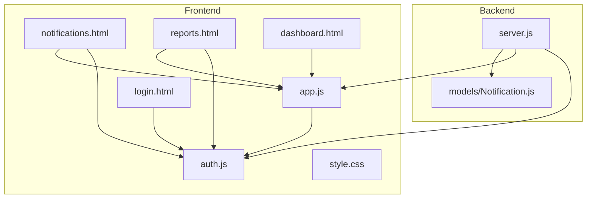
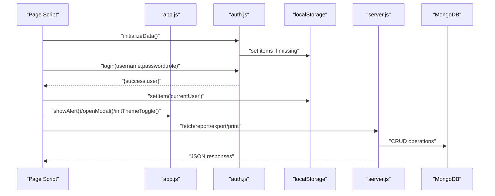
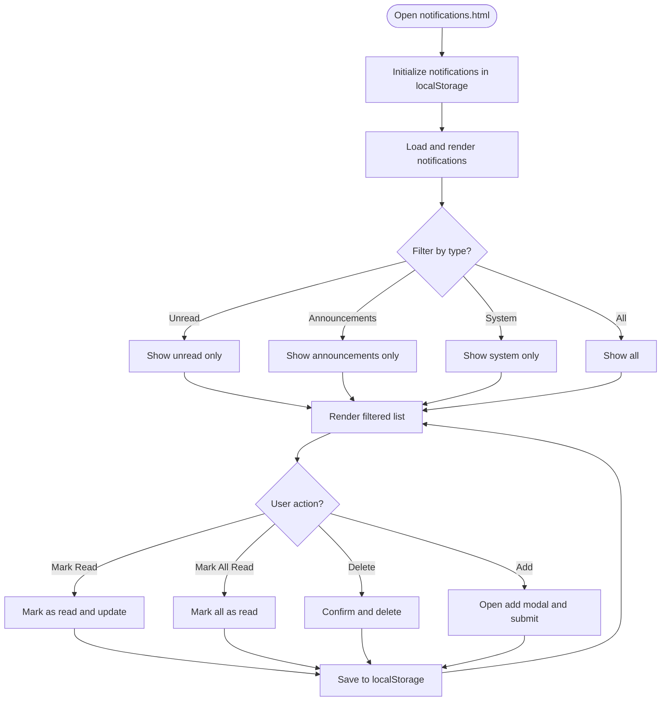
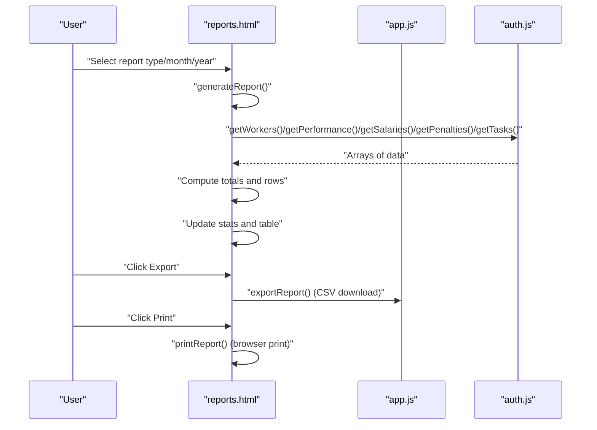
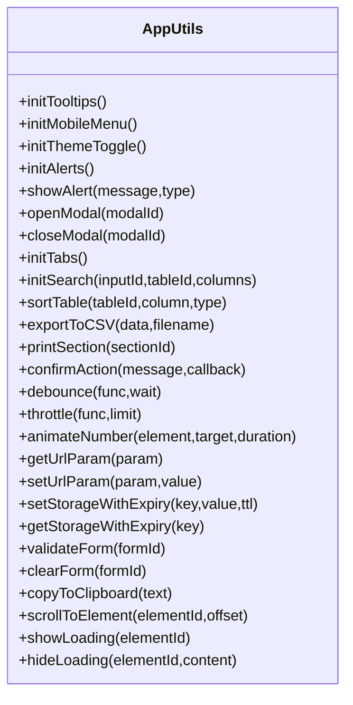
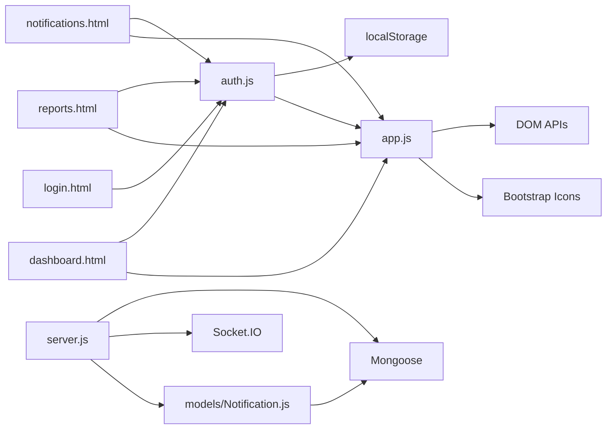

# System Utilities

<cite>
**Referenced Files in This Document**
- [app.js](file://app.js)
- [auth.js](file://auth.js)
- [style.css](file://style.css)
- [notifications.html](file://notifications.html)
- [reports.html](file://reports.html)
- [dashboard.html](file://dashboard.html)
- [login.html](file://login.html)
- [server.js](file://backend/server.js)
- [Notification.js](file://backend/models/Notification.js)
</cite>

## Table of Contents
1. [Introduction](#introduction)
2. [Project Structure](#project-structure)
3. [Core Components](#core-components)
4. [Architecture Overview](#architecture-overview)
5. [Detailed Component Analysis](#detailed-component-analysis)
6. [Dependency Analysis](#dependency-analysis)
7. [Performance Considerations](#performance-considerations)
8. [Troubleshooting Guide](#troubleshooting-guide)
9. [Conclusion](#conclusion)

## Introduction
This document describes the system utilities and helper functions that power the 555 İnşaat worker management platform. It covers:
- Notification system for alerts, reminders, and system messages
- Report generation, CSV export, and print integration
- Utility functions in app.js for data formatting, currency display, date handling, and common UI operations
- localStorage data persistence, backup/recovery strategies, and maintenance features
- Theme switching, responsive design utilities, and cross-browser compatibility
- Global styling system, icon integration, and accessibility features

## Project Structure
The frontend consists of HTML pages and shared JavaScript/CSS assets. The backend is an Express server with MongoDB integration and WebSocket support for real-time notifications.

**Diagram sources**
- [app.js](file://app.js)
- [auth.js](file://auth.js)
- [style.css](file://style.css)
- [notifications.html](file://notifications.html)
- [reports.html](file://reports.html)
- [dashboard.html](file://dashboard.html)
- [login.html](file://login.html)
- [server.js](file://backend/server.js)
- [Notification.js](file://backend/models/Notification.js)

**Section sources**
- [app.js](file://app.js)
- [auth.js](file://auth.js)
- [style.css](file://style.css)
- [notifications.html](file://notifications.html)
- [reports.html](file://reports.html)
- [dashboard.html](file://dashboard.html)
- [login.html](file://login.html)
- [server.js](file://backend/server.js)
- [Notification.js](file://backend/models/Notification.js)

## Core Components
- Shared utilities and UI helpers in app.js
- Authentication and localStorage data helpers in auth.js
- Styling and theme system in style.css
- Notification management in notifications.html
- Reporting, CSV export, and printing in reports.html
- Dashboard statistics and quick actions in dashboard.html
- Login form and demo accounts in login.html
- Backend server wiring and notification model in server.js and Notification.js

**Section sources**
- [app.js](file://app.js)
- [auth.js](file://auth.js)
- [style.css](file://style.css)
- [notifications.html](file://notifications.html)
- [reports.html](file://reports.html)
- [dashboard.html](file://dashboard.html)
- [login.html](file://login.html)
- [server.js](file://backend/server.js)
- [Notification.js](file://backend/models/Notification.js)

## Architecture Overview
The frontend uses a modular approach:
- app.js centralizes UI helpers, animations, storage helpers, and export/print utilities
- auth.js manages user sessions, initializes demo data, and exposes data accessors
- style.css defines global variables, themes, responsive breakpoints, and reusable components
- notifications.html integrates localStorage-backed notifications with UI controls
- reports.html generates dynamic reports, exports CSV, and prints sections
- dashboard.html aggregates stats and presents actionable widgets
- login.html provides role-based authentication and demo account injection

On the backend:
- server.js configures security, rate limiting, CORS, compression, logging, static serving, database connection, routes, health checks, and error handling
- Notification.js defines the schema, indexes, and methods for persistent notifications with real-time delivery via Socket.IO

**Diagram sources**
- [app.js](file://app.js)
- [auth.js](file://auth.js)
- [server.js](file://backend/server.js)

## Detailed Component Analysis

### Notification System
The notification system supports creation, filtering, marking read/unread, and bulk actions. It uses localStorage for persistence in the frontend HTML page and integrates with a backend model for scalable deployments.

Key behaviors:
- Initialization and persistence: Ensures a notifications array exists in localStorage
- Filtering: By all, unread, announcement, or system categories
- Creation: Adds new notifications with type, target audience, and metadata
- Read tracking: Marks individual and bulk as read with timestamps
- Deletion: Confirms and removes notifications
- Alerts: Inline toast notifications for user feedback

**Diagram sources**
- [notifications.html](file://notifications.html)

**Section sources**
- [notifications.html](file://notifications.html)

### Report Generation, CSV Export, and Print Integration
Reports.html provides:
- Dynamic report types (attendance, salary, performance, penalty, summary)
- Parameterized selection of month/year
- Live statistics cards and data tables
- CSV export with BOM and semicolon-separated values
- Browser print integration

**Diagram sources**
- [reports.html](file://reports.html)
- [app.js](file://app.js)
- [auth.js](file://auth.js)

**Section sources**
- [reports.html](file://reports.html)
- [app.js](file://app.js)
- [auth.js](file://auth.js)

### Utility Functions in app.js
Core utilities include:
- UI helpers: tooltips, mobile menu, theme toggle, alerts, modals, tabs, search, sorting, loading spinners
- Data export/print: exportToCSV, printSection
- Interaction helpers: confirmAction, debounce, throttle, animateNumber
- Storage helpers: setStorageWithExpiry/getStorageWithExpiry
- Form helpers: validateForm, clearForm
- Clipboard: copyToClipboard
- Navigation: scrollToElement
- URL helpers: getUrlParam/setUrlParam

**Diagram sources**
- [app.js](file://app.js)

**Section sources**
- [app.js](file://app.js)

### localStorage Data Persistence, Backup, Recovery, and Maintenance
Persistence strategy:
- auth.js initializes demo datasets for workers, tasks, performance, salaries, penalties, permissions, and shift changes if missing
- auth.js exposes getters for each dataset and a generic saveData function
- notifications.html maintains a notifications array in localStorage
- app.js provides setStorageWithExpiry/getStorageWithExpiry for time-bounded entries

Backup and recovery:
- No built-in backup/export of localStorage is implemented in the frontend scripts
- Recommendation: Use browser developer tools to export/import localStorage entries for manual backup/recovery
- For production, migrate to server-side storage (MongoDB) and implement API endpoints for backup/restore

Maintenance:
- Periodic cleanup of expired localStorage entries using getStorageWithExpiry
- Validation of forms before submission using validateForm
- Clearing forms with clearForm to reset state

**Section sources**
- [auth.js](file://auth.js)
- [notifications.html](file://notifications.html)
- [app.js](file://app.js)

### Theme Switching, Responsive Design, and Cross-Browser Compatibility
Theme switching:
- app.js toggles dark-mode class on body and updates icon in themeToggle
- Saves preference to localStorage for persistence across sessions
- Loads saved theme on initialization

Responsive design:
- style.css defines media queries and grid layouts for mobile and desktop
- Components like navigation, cards, and tables adapt to viewport size

Cross-browser compatibility:
- Uses vanilla JavaScript APIs available in modern browsers
- Bootstrap Icons CDN ensures consistent iconography
- No polyfills included; consider adding if targeting older browsers

**Section sources**
- [app.js](file://app.js)
- [style.css](file://style.css)
- [login.html](file://login.html)

### Global Styling System, Icon Integration, and Accessibility
Global styling:
- CSS custom properties define primary/secondary colors, shadows, radii, and transitions
- Reusable base styles for buttons, forms, alerts, and cards
- Dark mode variant applied via body class and icon swap

Icon integration:
- Bootstrap Icons CDN imported in HTML pages
- Icons used consistently across UI components (navigation, buttons, alerts)

Accessibility:
- Semantic HTML structure in pages
- Focusable elements styled appropriately
- Contrast and readable typography via CSS variables
- No explicit ARIA attributes observed; consider adding roles and labels for complex widgets

**Section sources**
- [style.css](file://style.css)
- [notifications.html](file://notifications.html)
- [reports.html](file://reports.html)
- [dashboard.html](file://dashboard.html)
- [login.html](file://login.html)

## Dependency Analysis
Frontend dependencies:
- app.js depends on DOM APIs and Bootstrap Icons
- auth.js depends on localStorage and provides data accessors
- HTML pages depend on both app.js and auth.js

Backend dependencies:
- server.js depends on Express, Helmet, CORS, compression, rate limiting, Morgan, Socket.IO, and Mongoose
- Notification.js defines a Mongoose model with indexes and methods

**Diagram sources**
- [app.js](file://app.js)
- [auth.js](file://auth.js)
- [notifications.html](file://notifications.html)
- [reports.html](file://reports.html)
- [dashboard.html](file://dashboard.html)
- [login.html](file://login.html)
- [server.js](file://backend/server.js)
- [Notification.js](file://backend/models/Notification.js)

**Section sources**
- [app.js](file://app.js)
- [auth.js](file://auth.js)
- [server.js](file://backend/server.js)
- [Notification.js](file://backend/models/Notification.js)

## Performance Considerations
- Debouncing/throttling: Use debounce for search inputs and throttle for frequent events to reduce reflows and network calls
- Efficient DOM updates: Batch UI updates and avoid excessive reflows
- CSV generation: For large datasets, consider streaming or server-side generation
- Printing: Limit heavy DOM content during print to improve rendering performance
- Storage: Prefer indexed access patterns and avoid serializing large objects frequently

## Troubleshooting Guide
Common issues and remedies:
- Alerts not appearing: Verify showAlert is called and DOM insertion occurs before auto-dismiss
- Theme toggle not persisting: Ensure localStorage is writable and themeToggle exists
- CSV export fails silently: Check data length and console for errors; confirm Blob and anchor download
- Print not working: Confirm printSection receives a valid element ID and browser print dialog opens
- Forms not validating: Ensure required fields exist and validateForm runs before submission
- Demo data missing: Call initializeData on login page load to seed localStorage

**Section sources**
- [app.js](file://app.js)
- [auth.js](file://auth.js)
- [login.html](file://login.html)
- [reports.html](file://reports.html)
- [notifications.html](file://notifications.html)

## Conclusion
The system utilities provide a robust foundation for UI interactions, data formatting, persistence, and reporting. The frontend relies on localStorage for quick prototyping and demo scenarios, while the backend model and server infrastructure support scalability and real-time features. For production, consider migrating critical data to server-side storage, implementing structured backup/restore, and enhancing accessibility and cross-browser compatibility as needed.