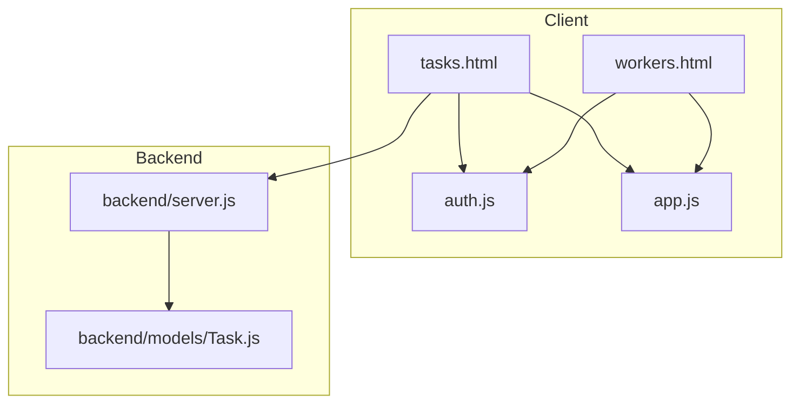
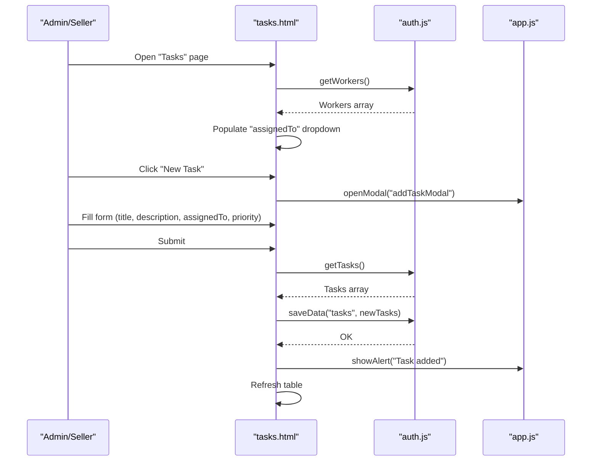
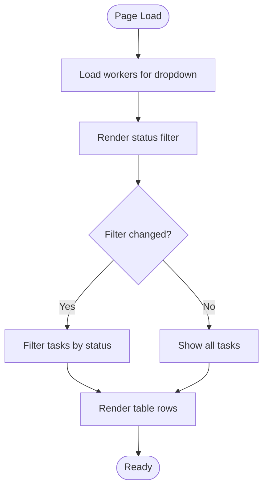
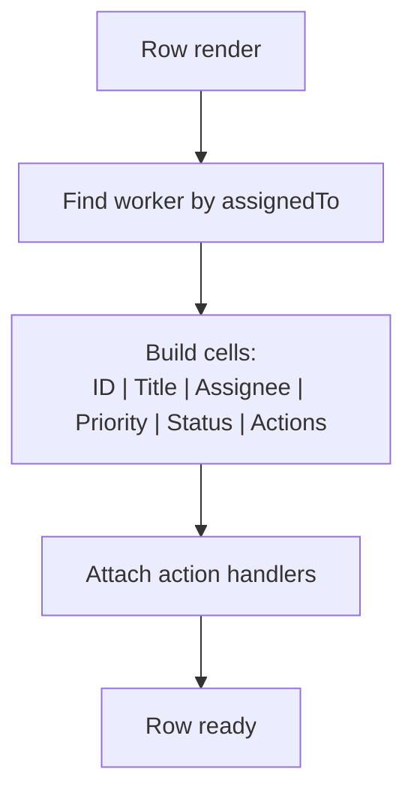
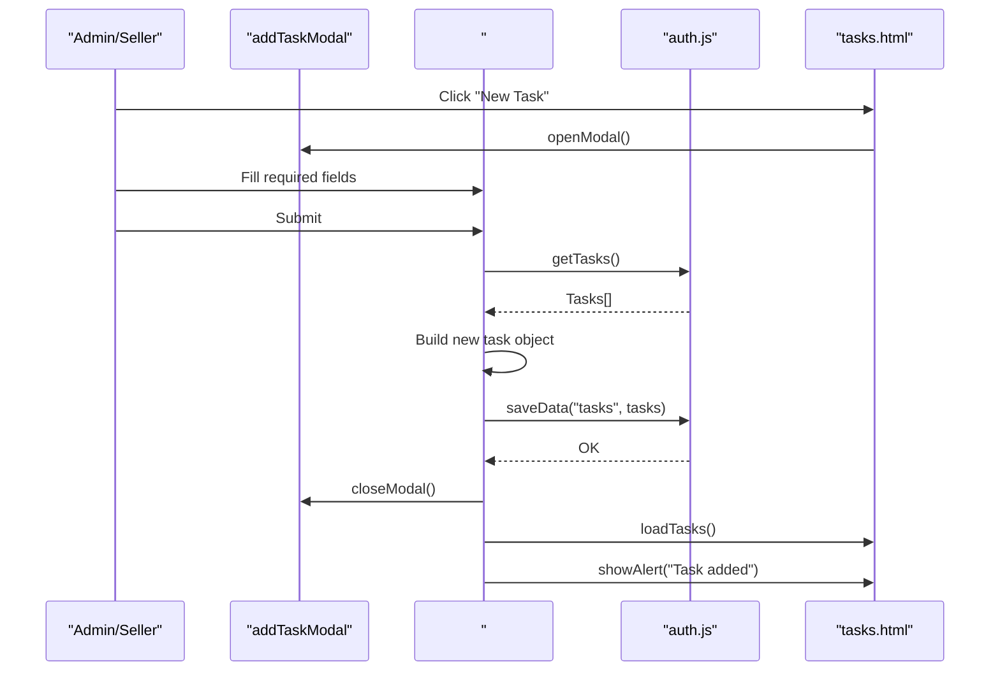
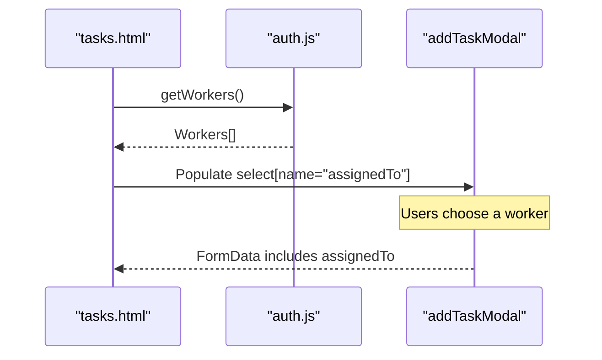
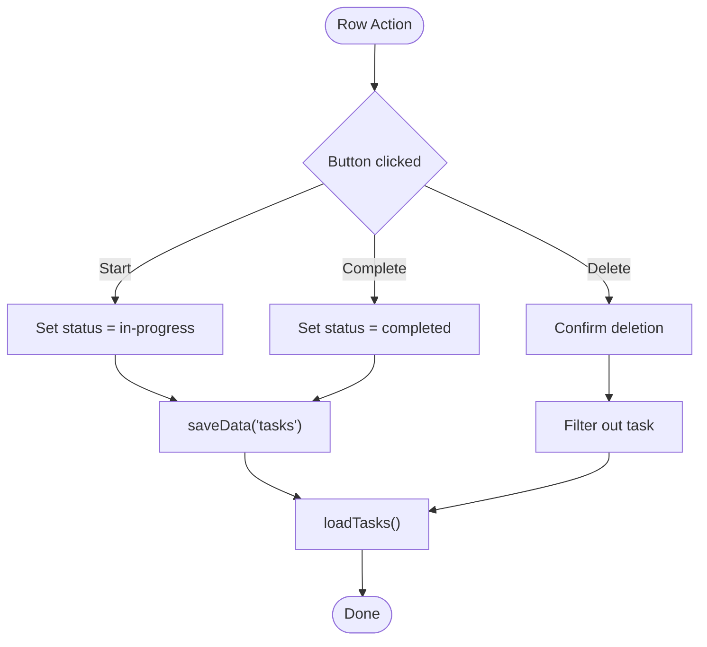
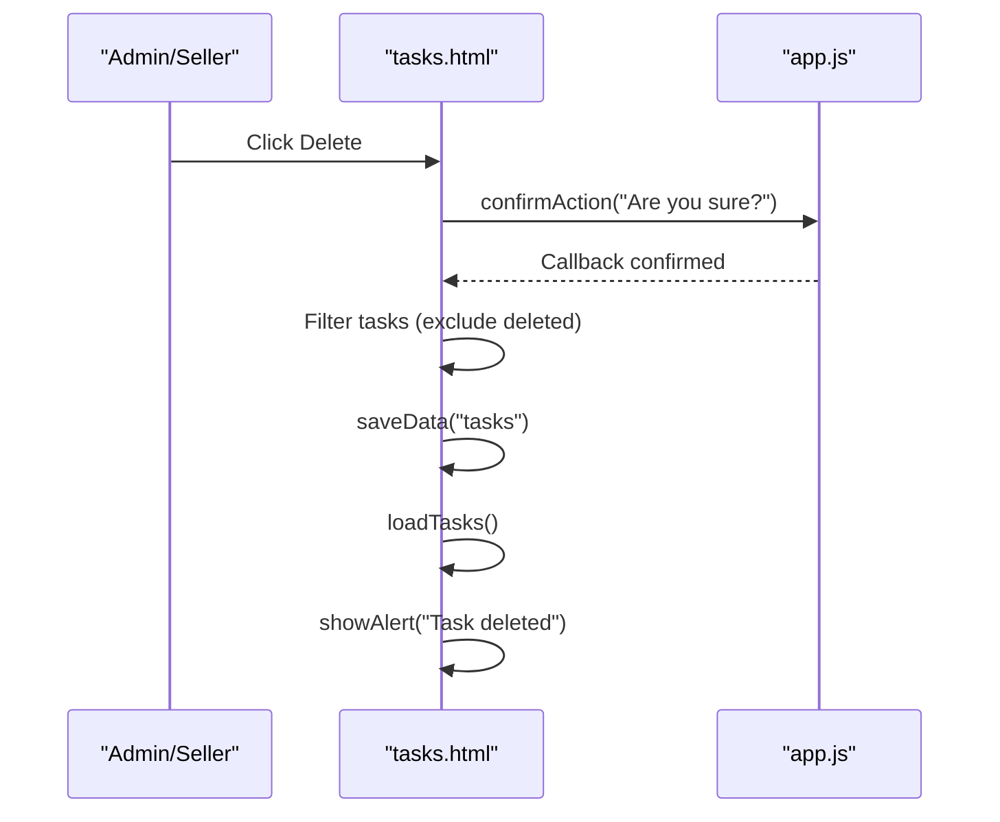
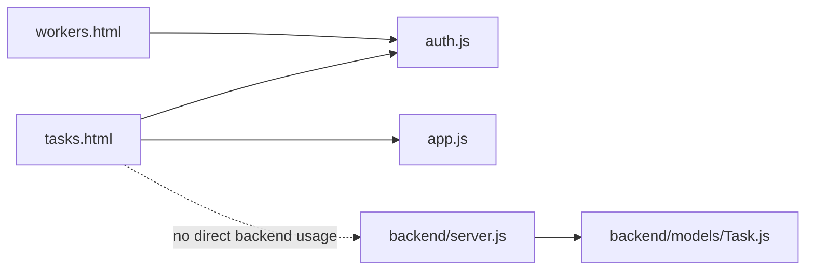

# Task Administration

<cite>
**Referenced Files in This Document**
- [tasks.html](file://tasks.html)
- [workers.html](file://workers.html)
- [auth.js](file://auth.js)
- [app.js](file://app.js)
- [backend/server.js](file://backend/server.js)
- [backend/models/Task.js](file://backend/models/Task.js)
</cite>

## Table of Contents
1. [Introduction](#introduction)
2. [Project Structure](#project-structure)
3. [Core Components](#core-components)
4. [Architecture Overview](#architecture-overview)
5. [Detailed Component Analysis](#detailed-component-analysis)
6. [Dependency Analysis](#dependency-analysis)
7. [Performance Considerations](#performance-considerations)
8. [Troubleshooting Guide](#troubleshooting-guide)
9. [Conclusion](#conclusion)

## Introduction
This document describes the task administration interface used by administrators and sellers to manage construction-related tasks. It covers the complete task creation workflow, assignment to workers, status management, filtering and search, table display, modal-based forms, deletion workflow, and the integration with worker data and local persistence.

## Project Structure
The task administration feature spans client-side pages and utilities, plus a backend server and model definitions:
- tasks.html: Task listing, filters, table display, and modal-based creation form
- workers.html: Worker listing and management used for assigning tasks
- auth.js: Authentication and localStorage-based data persistence helpers
- app.js: Shared UI utilities, modals, alerts, confirmations, and generic helpers
- backend/server.js: Express server wiring and route exposure
- backend/models/Task.js: Mongoose schema for tasks (used by the backend)

**Diagram sources**
- [tasks.html](file://tasks.html)
- [workers.html](file://workers.html)
- [auth.js](file://auth.js)
- [app.js](file://app.js)
- [backend/server.js](file://backend/server.js)
- [backend/models/Task.js](file://backend/models/Task.js)

**Section sources**
- [tasks.html](file://tasks.html)
- [workers.html](file://workers.html)
- [auth.js](file://auth.js)
- [app.js](file://app.js)
- [backend/server.js](file://backend/server.js)
- [backend/models/Task.js](file://backend/models/Task.js)

## Core Components
- Task listing and filtering: Status filter dropdown and “New Task” button to open the creation modal
- Task table: Displays ID, title, assignee, priority badges, status indicators, and action buttons
- Modal-based creation form: Required fields, priority selection, and worker assignment dropdown
- Worker integration: Worker list populates the assignment dropdown
- Persistence: Tasks stored in localStorage via helpers in auth.js
- Confirmation dialogs: Used for task deletion

Key behaviors:
- Filtering by status updates the table dynamically
- Creation form validates required fields and persists to localStorage
- Status transitions are handled per row actions
- Deletion uses a confirmation dialog before updating localStorage

**Section sources**
- [tasks.html](file://tasks.html)
- [auth.js](file://auth.js)
- [app.js](file://app.js)

## Architecture Overview
The task administration interface is a client-side SPA with localStorage persistence. Administrators and sellers can view tasks, filter by status, create tasks, assign workers, update statuses, and delete tasks. The backend server exposes API routes and defines the Task model, but the current client-side implementation uses localStorage for tasks.

**Diagram sources**
- [tasks.html](file://tasks.html)
- [auth.js](file://auth.js)
- [app.js](file://app.js)

## Detailed Component Analysis

### Task Listing and Filters
- Status filter dropdown supports “All”, “Pending”, “In Progress”, and “Completed”
- On change, the table reloads filtered tasks
- Empty state shown when no tasks match the filter

**Diagram sources**
- [tasks.html](file://tasks.html)

**Section sources**
- [tasks.html](file://tasks.html)

### Task Table Display
- Columns: ID, Title, Assignee, Priority, Status, Actions
- Priority badges: Low, Medium, High mapped to visual styles
- Status badges: Pending, In Progress, Completed mapped to styles
- Action buttons per row:
  - Start (set status to In Progress)
  - Complete (set status to Completed)
  - Delete (confirmation dialog)

**Diagram sources**
- [tasks.html](file://tasks.html)

**Section sources**
- [tasks.html](file://tasks.html)

### Modal-Based Task Creation
- Opens via “New Task” button
- Fields:
  - Title (required)
  - Description (optional)
  - Assign To (required, dropdown populated from workers)
  - Priority (optional, default Medium)
- Submission:
  - Validates required fields
  - Generates new ID
  - Sets status to Pending
  - Saves to localStorage
  - Resets form and refreshes table

**Diagram sources**
- [tasks.html](file://tasks.html)
- [auth.js](file://auth.js)

**Section sources**
- [tasks.html](file://tasks.html)
- [auth.js](file://auth.js)

### Task Assignment Mechanism
- Worker dropdown is populated on page load by fetching workers from localStorage
- The dropdown is rendered inside the modal’s form
- On submit, the selected worker ID is stored as the assignee

**Diagram sources**
- [tasks.html](file://tasks.html)
- [auth.js](file://auth.js)

**Section sources**
- [tasks.html](file://tasks.html)
- [workers.html](file://workers.html)
- [auth.js](file://auth.js)

### Task Status Management
- States: Pending, In Progress, Completed
- Actions:
  - Start: sets status to In Progress
  - Complete: sets status to Completed
- Updates are persisted immediately to localStorage and the table is refreshed

**Diagram sources**
- [tasks.html](file://tasks.html)

**Section sources**
- [tasks.html](file://tasks.html)

### Task Filtering and Search
- Status filter: Dropdown filters by Pending/In Progress/Completed
- Search: Not implemented in tasks.html; the shared search utility exists in app.js but is not wired to the tasks table in this file
- Recommendation: Integrate the shared search utility to support text-based filtering across columns

**Section sources**
- [tasks.html](file://tasks.html)
- [app.js](file://app.js)

### Task Deletion Workflow
- Clicking the Delete button triggers a confirmation dialog
- On confirmation, the task is removed from localStorage and the table is refreshed

**Diagram sources**
- [tasks.html](file://tasks.html)
- [app.js](file://app.js)

**Section sources**
- [tasks.html](file://tasks.html)
- [app.js](file://app.js)

### Integration with Worker Data
- Workers are loaded from localStorage and used to populate the assignment dropdown
- Assignee display resolves the worker’s name from the stored ID

**Section sources**
- [tasks.html](file://tasks.html)
- [workers.html](file://workers.html)
- [auth.js](file://auth.js)

### localStorage-Based Persistence
- Tasks are stored under the key "tasks"
- Workers are stored under the key "workers"
- Helpers:
  - getTasks(): retrieves tasks
  - saveData("tasks", data): persists tasks
  - getWorkers(): retrieves workers
  - getWorkerById(id): retrieves a single worker

**Section sources**
- [auth.js](file://auth.js)
- [tasks.html](file://tasks.html)

## Dependency Analysis
- tasks.html depends on:
  - auth.js for data retrieval/persistence and worker resolution
  - app.js for modal and confirmation utilities
- workers.html provides the worker dataset used by tasks.html
- backend/server.js exposes API routes and initializes the backend; tasks.html currently does not consume these routes
- backend/models/Task.js defines the Task schema and pre-save logic; tasks.html does not use the backend model directly

**Diagram sources**
- [tasks.html](file://tasks.html)
- [workers.html](file://workers.html)
- [auth.js](file://auth.js)
- [app.js](file://app.js)
- [backend/server.js](file://backend/server.js)
- [backend/models/Task.js](file://backend/models/Task.js)

**Section sources**
- [tasks.html](file://tasks.html)
- [workers.html](file://workers.html)
- [auth.js](file://auth.js)
- [app.js](file://app.js)
- [backend/server.js](file://backend/server.js)
- [backend/models/Task.js](file://backend/models/Task.js)

## Performance Considerations
- Client-side filtering and rendering are efficient for small datasets; consider pagination or virtualization for larger lists
- Debouncing search input could reduce DOM churn during typing
- Batch updates and avoiding repeated DOM queries can improve responsiveness

## Troubleshooting Guide
- Tasks not appearing:
  - Verify localStorage keys "tasks" and "workers" exist and are valid JSON
  - Ensure initialization runs on login to seed demo data
- Worker dropdown empty:
  - Confirm workers are loaded before the modal opens
- Status updates not reflected:
  - Ensure saveData("tasks") succeeds and loadTasks() is called afterward
- Delete confirmation not working:
  - Confirm confirmAction is defined and invoked properly

**Section sources**
- [auth.js](file://auth.js)
- [tasks.html](file://tasks.html)
- [app.js](file://app.js)

## Conclusion
The task administration interface provides a straightforward, client-side solution for managing tasks with localStorage persistence. Administrators and sellers can create tasks, assign workers, track status, and filter by status. For production, integrating with the backend API and implementing robust search would enhance scalability and usability.