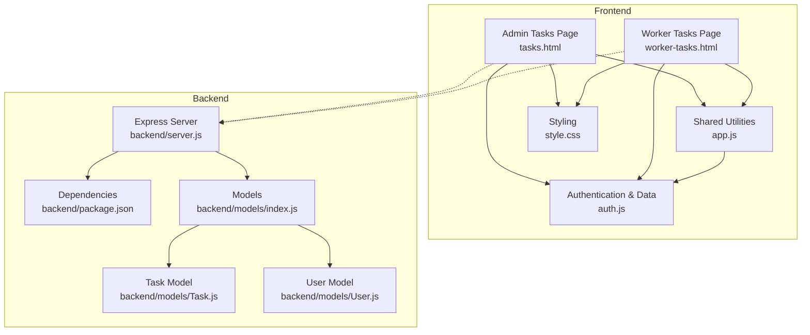
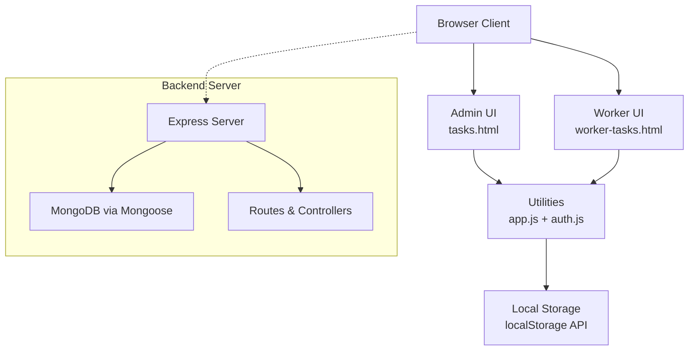
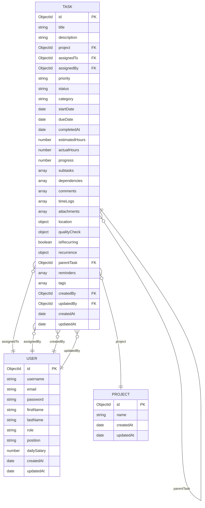
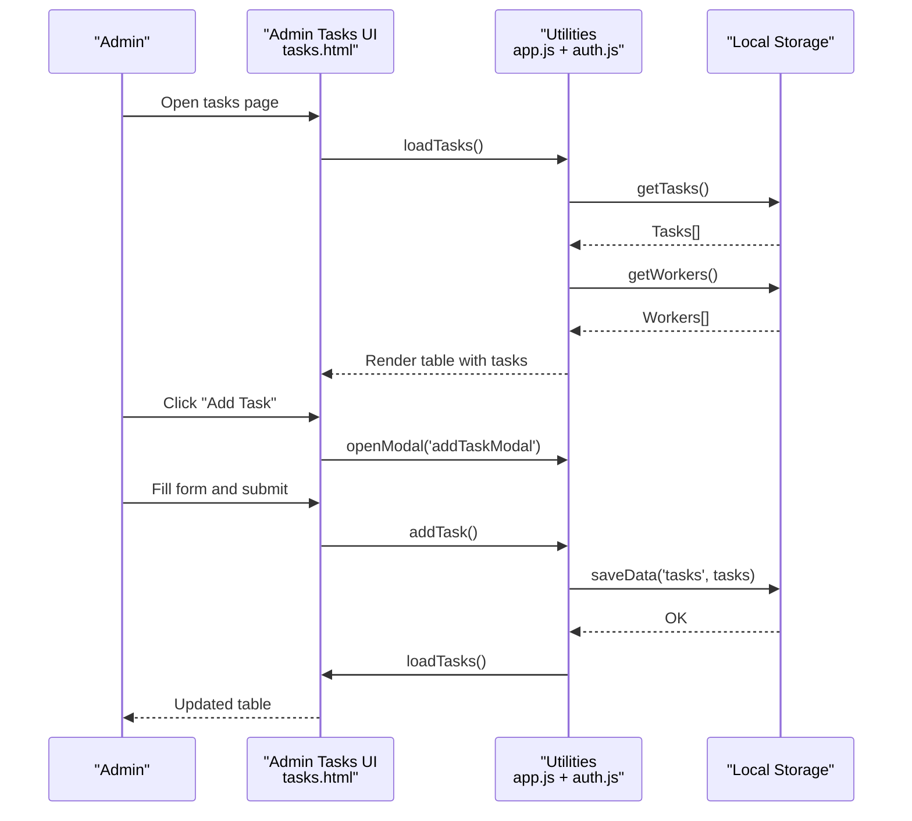
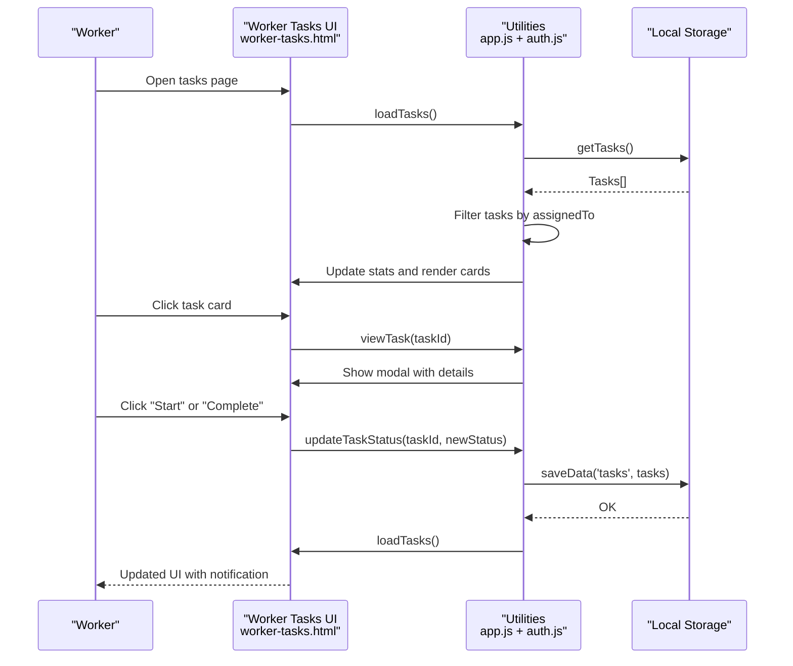
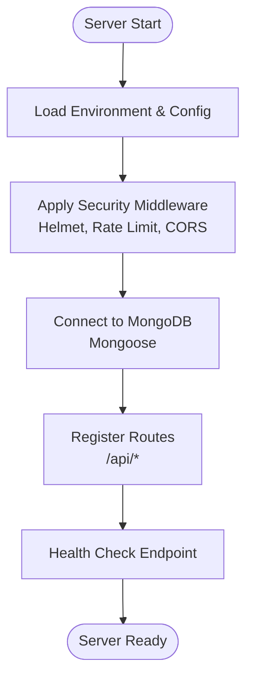
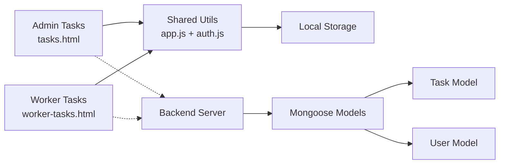

# Task Management System

<cite>
**Referenced Files in This Document**
- [tasks.html](file://tasks.html)
- [worker-tasks.html](file://worker-tasks.html)
- [app.js](file://app.js)
- [auth.js](file://auth.js)
- [style.css](file://style.css)
- [backend/server.js](file://backend/server.js)
- [backend/package.json](file://backend/package.json)
- [backend/models/Task.js](file://backend/models/Task.js)
- [backend/models/User.js](file://backend/models/User.js)
- [backend/models/index.js](file://backend/models/index.js)
</cite>

## Table of Contents
1. [Introduction](#introduction)
2. [Project Structure](#project-structure)
3. [Core Components](#core-components)
4. [Architecture Overview](#architecture-overview)
5. [Detailed Component Analysis](#detailed-component-analysis)
6. [Dependency Analysis](#dependency-analysis)
7. [Performance Considerations](#performance-considerations)
8. [Troubleshooting Guide](#troubleshooting-guide)
9. [Conclusion](#conclusion)

## Introduction
This document provides comprehensive documentation for the task management system used in the 555 İnşaat construction workforce management platform. It covers task creation workflows, assignment mechanisms, status tracking, and the complete task lifecycle. The system supports both administrative and worker-facing interfaces, with robust data modeling for priorities, deadlines, categories, dependencies, progress tracking, and integration with performance metrics.

## Project Structure
The system consists of:
- Frontend pages for administrators and workers managing tasks
- Shared frontend utilities for UI interactions, modals, alerts, and data persistence
- Backend server with Express.js, MongoDB via Mongoose, and comprehensive models for tasks and users
- Styling with a cohesive design system supporting dark/light themes and responsive layouts

**Diagram sources**
- [tasks.html](file://tasks.html)
- [worker-tasks.html](file://worker-tasks.html)
- [app.js](file://app.js)
- [auth.js](file://auth.js)
- [style.css](file://style.css)
- [backend/server.js](file://backend/server.js)
- [backend/package.json](file://backend/package.json)
- [backend/models/index.js](file://backend/models/index.js)
- [backend/models/Task.js](file://backend/models/Task.js)
- [backend/models/User.js](file://backend/models/User.js)

**Section sources**
- [tasks.html](file://tasks.html)
- [worker-tasks.html](file://worker-tasks.html)
- [app.js](file://app.js)
- [auth.js](file://auth.js)
- [style.css](file://style.css)
- [backend/server.js](file://backend/server.js)
- [backend/package.json](file://backend/package.json)
- [backend/models/index.js](file://backend/models/index.js)

## Core Components
- Administrative Task Management (tasks.html): Allows admins to create tasks, assign workers, filter by status, and update task statuses.
- Worker Task Interface (worker-tasks.html): Enables workers to view assigned tasks, track progress, update status, and see statistics.
- Shared Utilities (app.js): Provides reusable UI helpers, modals, alerts, search, sorting, CSV export, and local storage utilities.
- Authentication and Data Layer (auth.js): Manages user sessions, initializes demo data, and persists tasks/workers/performance locally.
- Backend Server (backend/server.js): Express server with security middleware, CORS, rate limiting, logging, static file serving, database connection, route registration, health checks, and global error handling.
- Data Models (backend/models): Comprehensive Mongoose models for Task and User with rich fields, enums, indexes, and computed virtuals.

**Section sources**
- [tasks.html](file://tasks.html)
- [worker-tasks.html](file://worker-tasks.html)
- [app.js](file://app.js)
- [auth.js](file://auth.js)
- [backend/server.js](file://backend/server.js)
- [backend/models/Task.js](file://backend/models/Task.js)
- [backend/models/User.js](file://backend/models/User.js)

## Architecture Overview
The system follows a client-side state management pattern for demonstration, persisting data in browser localStorage. The backend server is structured for scalability and includes comprehensive models for tasks and users, with support for advanced features like recurring tasks, dependencies, time tracking, and progress computation.

**Diagram sources**
- [tasks.html](file://tasks.html)
- [worker-tasks.html](file://worker-tasks.html)
- [app.js](file://app.js)
- [auth.js](file://auth.js)
- [backend/server.js](file://backend/server.js)

## Detailed Component Analysis

### Task Data Model
The Task model defines the complete schema for tasks, including:
- Basic information: title, description
- Assignment: assignedTo, assignedBy, createdBy, updatedBy
- Details: priority, status, category
- Timeline: startDate, dueDate, completedAt
- Hours tracking: estimatedHours, actualHours
- Progress: progress percentage with automatic updates
- Subtasks: checklist items with completion tracking
- Dependencies: relationships with other tasks
- Comments and attachments
- Time logs for field work
- Location data for site-based tasks
- Quality checks
- Recurrence settings
- Reminders
- Tags
- Timestamps for creation/update

**Diagram sources**
- [backend/models/Task.js](file://backend/models/Task.js)
- [backend/models/User.js](file://backend/models/User.js)

Key behaviors:
- Automatic completion timestamp and progress update when status becomes completed
- Progress calculation from subtasks with automatic status transitions
- Overdue detection and days-until-due computation via virtuals
- Time log aggregation into actual hours
- Statistics aggregation by status with estimated vs actual hours

**Section sources**
- [backend/models/Task.js](file://backend/models/Task.js)
- [backend/models/User.js](file://backend/models/User.js)

### Administrative Task Management Workflow
The admin interface enables:
- Creating new tasks with title, description, assignment, and priority
- Filtering tasks by status
- Updating task status (pending → in-progress → completed)
- Deleting tasks
- Viewing task details with priority badges and status indicators

**Diagram sources**
- [tasks.html](file://tasks.html)
- [app.js](file://app.js)
- [auth.js](file://auth.js)

**Section sources**
- [tasks.html](file://tasks.html)
- [app.js](file://app.js)
- [auth.js](file://auth.js)

### Worker Task Interface
The worker interface provides:
- Personalized task list filtered by assigned user
- Task statistics (total, pending, in-progress, completed)
- Tabbed filtering (all/pending/in-progress/completed)
- Card-based task display with priority and status badges
- Detailed modal view with action buttons based on current status
- Real-time status updates with notifications

**Diagram sources**
- [worker-tasks.html](file://worker-tasks.html)
- [app.js](file://app.js)
- [auth.js](file://auth.js)

**Section sources**
- [worker-tasks.html](file://worker-tasks.html)
- [app.js](file://app.js)
- [auth.js](file://auth.js)

### Priority Management and Status Tracking
Priority levels supported: low, medium, high, urgent
Status lifecycle: pending → in_progress → review → completed, with additional states: cancelled, on_hold
Automatic status transitions based on progress and completion:
- Progress > 0 and < 100 → in_progress
- Progress = 100 → completed with completion timestamp
- Status change to completed triggers progress = 100 and completion timestamp

**Section sources**
- [backend/models/Task.js](file://backend/models/Task.js)
- [worker-tasks.html](file://worker-tasks.html)

### Deadline Handling and Due Dates
- Required dueDate field with automatic overdue detection
- Virtual field for days until due
- Overdue tasks aggregation for managers and workers
- Notifications and UI indicators for overdue tasks

**Section sources**
- [backend/models/Task.js](file://backend/models/Task.js)

### Task Categorization and Dependencies
Categories: construction, electrical, plumbing, painting, finishing, inspection, maintenance, other
Dependencies: blocks, relates_to, duplicates with linked task references
These features enable complex project planning and inter-task relationships.

**Section sources**
- [backend/models/Task.js](file://backend/models/Task.js)

### Worker Task Lists and Completion Tracking
- Worker-specific filtering by assignedTo
- Sorting by creation date (newest first)
- Progress tracking via subtasks and time logs
- Completion verification with quality checks

**Section sources**
- [worker-tasks.html](file://worker-tasks.html)
- [backend/models/Task.js](file://backend/models/Task.js)

### Task Filtering, Search, and Bulk Operations
- Admin page: status filter dropdown
- Generic search utility supports live filtering across specified table columns
- Sorting capabilities for table columns (string, number, date)
- CSV export functionality for bulk data extraction
- Tabbed filtering for worker tasks (all/pending/in-progress/completed)

**Section sources**
- [tasks.html](file://tasks.html)
- [worker-tasks.html](file://worker-tasks.html)
- [app.js](file://app.js)

### Backend Integration and Scalability
The backend server provides:
- Express.js foundation with security middleware (Helmet), rate limiting, CORS, compression, and logging
- MongoDB connection via Mongoose with comprehensive indexing
- Route registration for all system modules
- Health check endpoint and API documentation
- Global error handling and graceful shutdown
- Socket.IO initialization for real-time features

**Diagram sources**
- [backend/server.js](file://backend/server.js)
- [backend/package.json](file://backend/package.json)

**Section sources**
- [backend/server.js](file://backend/server.js)
- [backend/package.json](file://backend/package.json)

## Dependency Analysis
The system exhibits clear separation of concerns:
- Frontend depends on shared utilities for consistent behavior
- Both admin and worker interfaces share common UI patterns and styling
- Backend models encapsulate business logic and data integrity
- No circular dependencies detected in the frontend modules
- Backend models maintain loose coupling through references and virtuals

**Diagram sources**
- [tasks.html](file://tasks.html)
- [worker-tasks.html](file://worker-tasks.html)
- [app.js](file://app.js)
- [auth.js](file://auth.js)
- [backend/server.js](file://backend/server.js)
- [backend/models/index.js](file://backend/models/index.js)

**Section sources**
- [tasks.html](file://tasks.html)
- [worker-tasks.html](file://worker-tasks.html)
- [app.js](file://app.js)
- [auth.js](file://auth.js)
- [backend/server.js](file://backend/server.js)
- [backend/models/index.js](file://backend/models/index.js)

## Performance Considerations
- Local storage usage: Efficient for demonstration but limits concurrent access and synchronization
- Frontend rendering: Uses DOM manipulation for dynamic content; consider pagination for large datasets
- CSS animations: Smooth transitions with minimal performance impact
- Theme switching: Lightweight localStorage-based persistence
- Backend scalability: Mongoose models include appropriate indexes for common queries
- Server middleware: Compression and rate limiting improve performance and security

## Troubleshooting Guide
Common issues and resolutions:
- Authentication failures: Verify username/password/role combination matches demo users
- Data not persisting: Ensure localStorage is enabled in the browser
- Task not updating: Check that the current user role allows task modifications
- Styling issues: Confirm style.css is loaded and theme toggle is functioning
- Backend connectivity: Verify MongoDB connection string and server startup logs

Diagnostic steps:
1. Check browser console for JavaScript errors
2. Verify localStorage keys exist ('currentUser', 'tasks', 'workers')
3. Confirm network requests to backend server are successful
4. Review server logs for connection and route errors

**Section sources**
- [auth.js](file://auth.js)
- [app.js](file://app.js)
- [backend/server.js](file://backend/server.js)

## Conclusion
The task management system provides a comprehensive solution for construction workforce task administration. It combines intuitive frontend interfaces with robust backend data modeling, supporting advanced features like task dependencies, progress tracking, deadline management, and integration with performance metrics. The modular architecture enables future enhancements while maintaining clean separation of concerns and consistent user experience across roles.