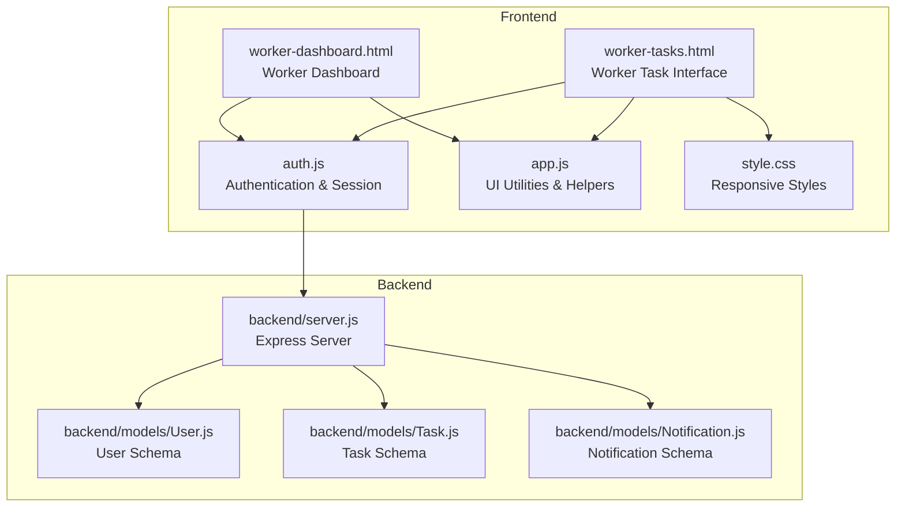
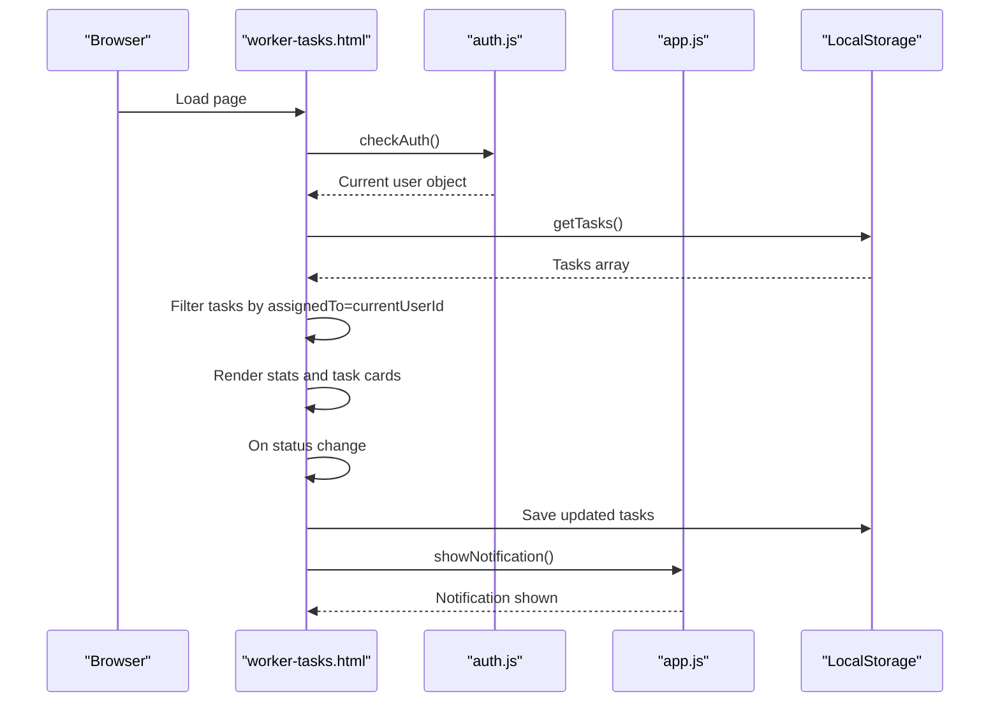
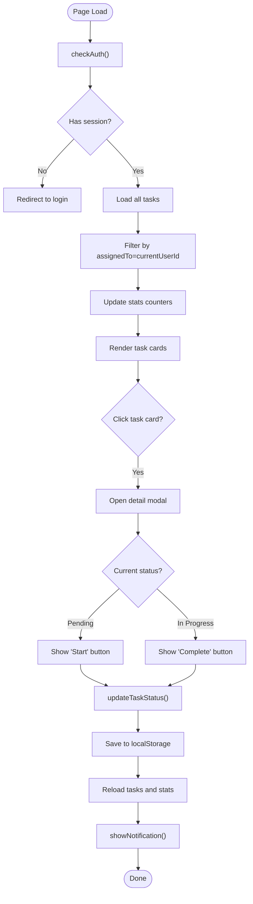
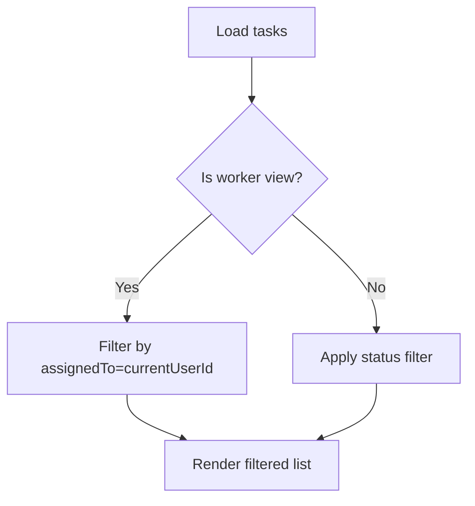
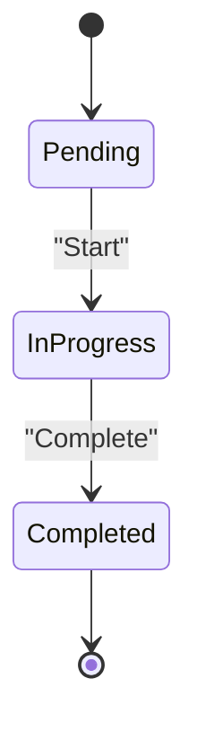
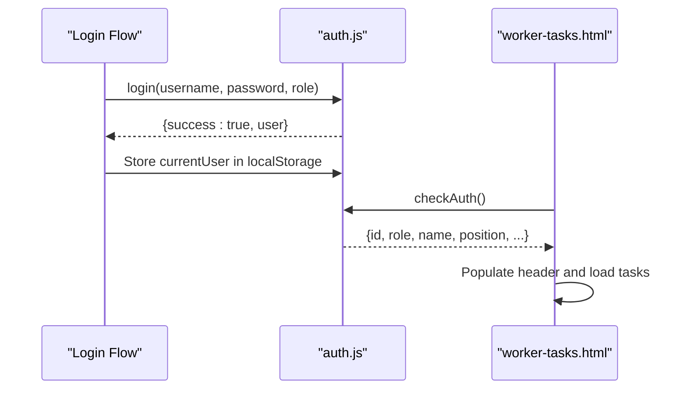
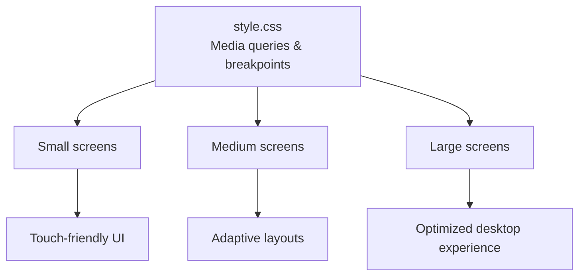
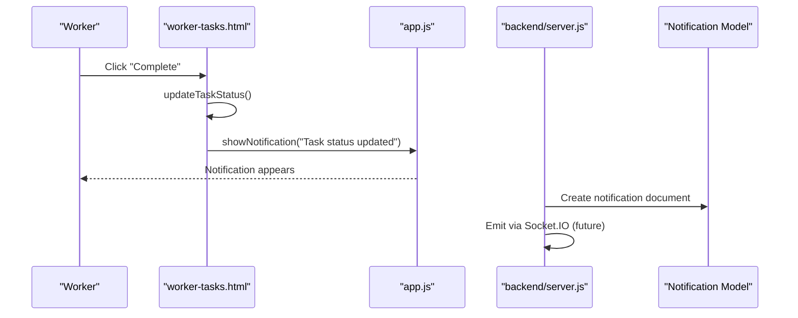
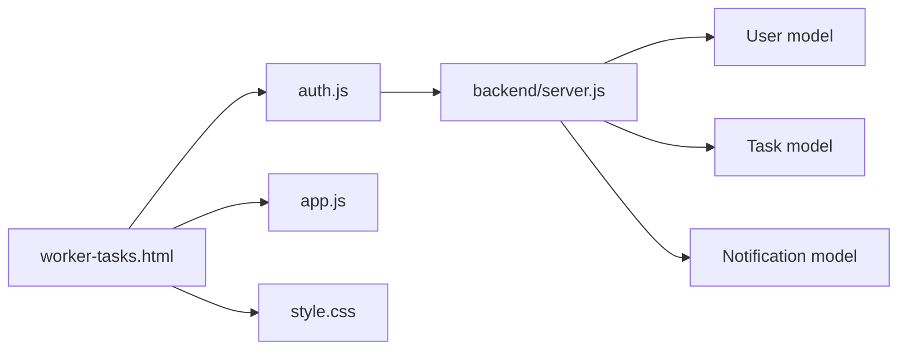

# Worker Task Interface

<cite>
**Referenced Files in This Document**
- [worker-tasks.html](file://worker-tasks.html)
- [tasks.html](file://tasks.html)
- [auth.js](file://auth.js)
- [app.js](file://app.js)
- [worker-dashboard.html](file://worker-dashboard.html)
- [style.css](file://style.css)
- [backend/server.js](file://backend/server.js)
- [backend/models/User.js](file://backend/models/User.js)
- [backend/models/Task.js](file://backend/models/Task.js)
- [backend/models/Notification.js](file://backend/models/Notification.js)
</cite>

## Table of Contents
1. [Introduction](#introduction)
2. [Project Structure](#project-structure)
3. [Core Components](#core-components)
4. [Architecture Overview](#architecture-overview)
5. [Detailed Component Analysis](#detailed-component-analysis)
6. [Dependency Analysis](#dependency-analysis)
7. [Performance Considerations](#performance-considerations)
8. [Troubleshooting Guide](#troubleshooting-guide)
9. [Conclusion](#conclusion)

## Introduction
This document describes the worker-specific task management interface for the 555 İnşaat construction workforce management system. It explains how workers view their assigned tasks in a personalized dashboard layout, how tasks are filtered and presented, how status tracking works from the worker's perspective, and how completion workflows operate. It also covers the integration with session data, responsive design considerations for mobile devices, and the notification system for new assignments and status updates.

## Project Structure
The worker task interface consists of:
- A dedicated worker task page that displays only tasks assigned to the logged-in worker
- Shared utility modules for authentication, data persistence, and UI helpers
- A responsive stylesheet supporting mobile-first design
- A backend server with database models for tasks, users, and notifications

**Diagram sources**
- [worker-tasks.html](file://worker-tasks.html)
- [worker-dashboard.html](file://worker-dashboard.html)
- [auth.js](file://auth.js)
- [app.js](file://app.js)
- [style.css](file://style.css)
- [backend/server.js](file://backend/server.js)
- [backend/models/User.js](file://backend/models/User.js)
- [backend/models/Task.js](file://backend/models/Task.js)
- [backend/models/Notification.js](file://backend/models/Notification.js)

**Section sources**
- [worker-tasks.html](file://worker-tasks.html)
- [auth.js](file://auth.js)
- [app.js](file://app.js)
- [style.css](file://style.css)
- [backend/server.js](file://backend/server.js)

## Core Components
- Worker Task Interface (worker-tasks.html): Personalized dashboard for viewing, filtering, and updating task statuses.
- Authentication and Session (auth.js): Manages login, role-based redirection, and local data initialization.
- UI Utilities (app.js): Provides reusable UI helpers such as modals, alerts, tooltips, and theme toggling.
- Responsive Styles (style.css): Implements mobile-first design with adaptive layouts and touch-friendly interactions.
- Backend Server (backend/server.js): Express server with security middleware, rate limiting, and route registration.
- Data Models: User, Task, and Notification schemas define the data structure and relationships.

Key responsibilities:
- Filter tasks by current worker ID
- Present task cards with status and priority badges
- Enable status transitions (pending → in-progress → completed)
- Persist updates locally and notify the user
- Support responsive navigation and touch interactions

**Section sources**
- [worker-tasks.html](file://worker-tasks.html)
- [auth.js](file://auth.js)
- [app.js](file://app.js)
- [style.css](file://style.css)
- [backend/server.js](file://backend/server.js)

## Architecture Overview
The worker task interface follows a client-side rendering pattern with local storage for data persistence during development. The backend provides a production-ready API with MongoDB models and real-time capabilities via Socket.IO.

**Diagram sources**
- [worker-tasks.html](file://worker-tasks.html)
- [auth.js](file://auth.js)
- [app.js](file://app.js)

**Section sources**
- [worker-tasks.html](file://worker-tasks.html)
- [auth.js](file://auth.js)
- [app.js](file://app.js)

## Detailed Component Analysis

### Worker Task Interface (worker-tasks.html)
- Authentication and role gating: Validates session and redirects non-workers to appropriate dashboards.
- Personalized task loading: Retrieves all tasks and filters to those assigned to the current user.
- Statistics: Displays counts for total, pending, in-progress, and completed tasks.
- Filtering: Tabs for "All", "Pending", "In Progress", "Completed".
- Rendering: Task cards with status and priority badges, sorted by creation date.
- Detail modal: Shows task details and presents actionable buttons based on current status.
- Status updates: Worker can start or complete tasks, persisting changes and notifying success.

**Diagram sources**
- [worker-tasks.html](file://worker-tasks.html)
- [auth.js](file://auth.js)
- [app.js](file://app.js)

**Section sources**
- [worker-tasks.html](file://worker-tasks.html)

### Task Filtering Mechanisms
- Worker view: Filters tasks by assignedTo equal to the current user ID, ensuring only personal tasks are shown.
- Administrative view: Uses a status dropdown filter to narrow down tasks across all workers.
- Both views support sorting and empty-state messaging.

**Diagram sources**
- [worker-tasks.html](file://worker-tasks.html)
- [tasks.html](file://tasks.html)

**Section sources**
- [worker-tasks.html](file://worker-tasks.html)
- [tasks.html](file://tasks.html)

### Task Status Tracking and Completion Workflows
- Status lifecycle: pending → in-progress → completed.
- Worker actions: Start (from pending) and Complete (from in-progress).
- Persistence: Updates are saved to localStorage immediately upon action.
- Notifications: Success messages inform the worker of status changes.

**Diagram sources**
- [worker-tasks.html](file://worker-tasks.html)

**Section sources**
- [worker-tasks.html](file://worker-tasks.html)

### Integration with Session Data and User Identity
- Session management: Stores current user in localStorage after login.
- Role enforcement: Worker pages redirect non-workers to appropriate dashboards.
- User identity: Sidebar displays avatar, name, and position derived from session.

**Diagram sources**
- [auth.js](file://auth.js)
- [worker-tasks.html](file://worker-tasks.html)

**Section sources**
- [auth.js](file://auth.js)
- [worker-tasks.html](file://worker-tasks.html)

### Responsive Design and Touch-Friendly Interactions
- Mobile-first CSS: Adapts layout for small screens, stacking topbar elements and adjusting spacing.
- Touch-friendly controls: Large buttons, clear badges, and modal dialogs optimized for finger interaction.
- Theme toggle: Persistent dark/light mode preference stored in localStorage.

**Diagram sources**
- [style.css](file://style.css)

**Section sources**
- [style.css](file://style.css)

### Notification System for New Assignments and Status Updates
- In-app notifications: Worker task interface uses a lightweight notification function to display success messages after status updates.
- Backend notification model: Defines notification schema with recipient, type, category, and delivery channels for production integration.
- Real-time potential: Backend initializes Socket.IO for real-time updates; production implementation would emit notifications to specific recipients.

**Diagram sources**
- [worker-tasks.html](file://worker-tasks.html)
- [app.js](file://app.js)
- [backend/server.js](file://backend/server.js)
- [backend/models/Notification.js](file://backend/models/Notification.js)

**Section sources**
- [worker-tasks.html](file://worker-tasks.html)
- [app.js](file://app.js)
- [backend/server.js](file://backend/server.js)
- [backend/models/Notification.js](file://backend/models/Notification.js)

## Dependency Analysis
The worker task interface depends on shared utilities and authentication modules, while the backend provides the foundation for future scalability and real-time features.

**Diagram sources**
- [worker-tasks.html](file://worker-tasks.html)
- [auth.js](file://auth.js)
- [app.js](file://app.js)
- [style.css](file://style.css)
- [backend/server.js](file://backend/server.js)
- [backend/models/User.js](file://backend/models/User.js)
- [backend/models/Task.js](file://backend/models/Task.js)
- [backend/models/Notification.js](file://backend/models/Notification.js)

**Section sources**
- [worker-tasks.html](file://worker-tasks.html)
- [auth.js](file://auth.js)
- [app.js](file://app.js)
- [backend/server.js](file://backend/server.js)

## Performance Considerations
- Client-side filtering: Efficient for small datasets; consider pagination or server-side filtering for larger workloads.
- Local storage persistence: Fast reads/writes; avoid excessive writes by batching updates.
- DOM updates: Use efficient templating or virtual DOM libraries for smoother rendering on low-powered devices.
- Images and assets: Lazy-load avatars and icons; minimize third-party resources.

## Troubleshooting Guide
Common issues and resolutions:
- Cannot access worker tasks: Verify session exists and role is worker; check authentication redirect logic.
- Tasks not appearing: Ensure localStorage contains tasks and that the current user ID matches assignedTo.
- Status update not reflected: Confirm updateTaskStatus persists to localStorage and triggers a reload; verify notification visibility.
- Mobile layout problems: Check media queries and ensure viewport meta tag is present.

**Section sources**
- [worker-tasks.html](file://worker-tasks.html)
- [auth.js](file://auth.js)
- [app.js](file://app.js)

## Conclusion
The worker task interface delivers a focused, personalized experience for construction workers to manage their assigned tasks. It leverages session-aware filtering, intuitive status workflows, and responsive design to support mobile usage. While currently using local storage, the backend architecture supports scalable enhancements including server-side persistence, real-time notifications, and advanced reporting.