# Technical Implementation

<cite>
**Referenced Files in This Document**
- [app.js](file://app.js)
- [auth.js](file://auth.js)
- [index.html](file://index.html)
- [login.html](file://login.html)
- [dashboard.html](file://dashboard.html)
- [workers.html](file://workers.html)
- [tasks.html](file://tasks.html)
- [performance.html](file://performance.html)
- [salary.html](file://salary.html)
- [style.css](file://style.css)
- [server.js](file://backend/server.js)
- [package.json](file://backend/package.json)
</cite>

## Table of Contents
1. [Introduction](#introduction)
2. [Project Structure](#project-structure)
3. [Core Components](#core-components)
4. [Architecture Overview](#architecture-overview)
5. [Detailed Component Analysis](#detailed-component-analysis)
6. [Dependency Analysis](#dependency-analysis)
7. [Performance Considerations](#performance-considerations)
8. [Troubleshooting Guide](#troubleshooting-guide)
9. [Conclusion](#conclusion)
10. [Appendices](#appendices)

## Introduction
This document presents a comprehensive technical overview of the 555 İnşaat worker management system. It covers the JavaScript architecture, modular design patterns, event-driven programming, and localStorage-based persistence strategies. It also documents utility functions, helper methods, common operations, data modeling approaches, DOM manipulation techniques, template rendering, error handling, validation, security considerations, code organization, and performance optimization practices.

## Project Structure
The project is organized into:
- Frontend static assets and pages: HTML, CSS, and shared JavaScript modules
- Backend server built with Node.js and Express
- Shared client-side utilities for UI, persistence, and common operations

Key frontend files:
- app.js: Shared UI utilities, modals, tabs, search/sort, CSV export, printing, animations, URL params, localStorage helpers, forms, clipboard, scrolling, loading spinners
- auth.js: Authentication, demo data initialization, localStorage-backed data accessors, helpers for formatting and statistics
- Pages: index.html, login.html, dashboard.html, workers.html, tasks.html, performance.html, salary.html
- style.css: Responsive layout, theming, cards, tables, badges, buttons, modals, and responsive breakpoints

Backend files:
- server.js: Express server with Helmet, CORS, compression, rate limiting, logging, static file serving, route registration, health checks, and global error handling
- package.json: Dependencies including Express, Mongoose, Helmet, compression, Morgan, rate limiting, Socket.IO, and development tools

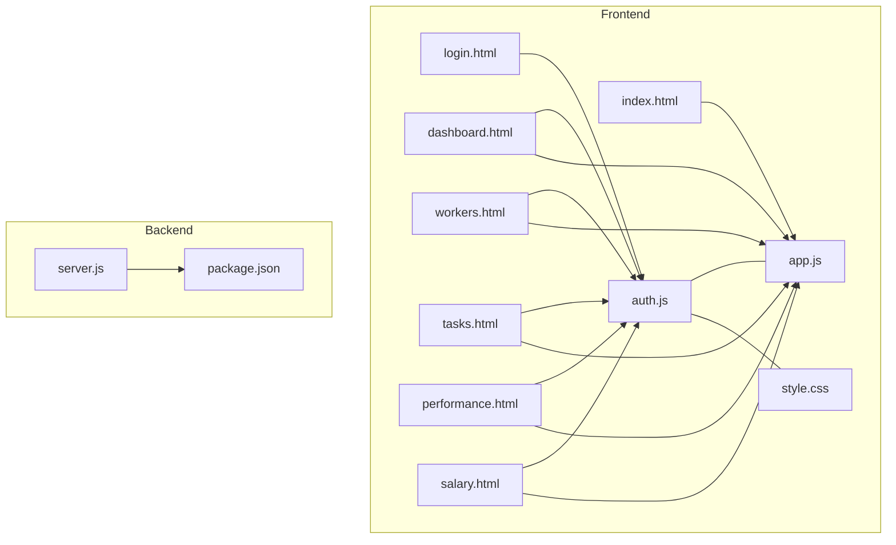

**Diagram sources**
- [index.html](file://index.html)
- [login.html](file://login.html)
- [dashboard.html](file://dashboard.html)
- [workers.html](file://workers.html)
- [tasks.html](file://tasks.html)
- [performance.html](file://performance.html)
- [salary.html](file://salary.html)
- [app.js](file://app.js)
- [auth.js](file://auth.js)
- [style.css](file://style.css)
- [server.js](file://backend/server.js)
- [package.json](file://backend/package.json)

**Section sources**
- [index.html](file://index.html)
- [login.html](file://login.html)
- [dashboard.html](file://dashboard.html)
- [workers.html](file://workers.html)
- [tasks.html](file://tasks.html)
- [performance.html](file://performance.html)
- [salary.html](file://salary.html)
- [app.js](file://app.js)
- [auth.js](file://auth.js)
- [style.css](file://style.css)
- [server.js](file://backend/server.js)
- [package.json](file://backend/package.json)

## Core Components
- Shared UI Utilities (app.js): Tooltips, mobile menu, theme toggle, alerts, modal controls, tabs, search, sorting, CSV export, printing, debouncing/throttling, number animation, URL param manipulation, localStorage with expiry, form validation/clearing, clipboard, scroll-to-element, loading spinners
- Authentication and Data Access (auth.js): Demo users, localStorage initialization, login/logout, session management, getters/setters for entities, helpers for formatting, currency/date, worker lookup, month name, worker stats aggregation
- Styling (style.css): CSS variables, responsive layout, cards, tables, badges, buttons, modals, and responsive breakpoints

Key patterns:
- Modular design: Separate concerns across app.js and auth.js
- Event-driven programming: DOMContentLoaded, click handlers, input events, window events
- localStorage data persistence: Centralized getters/setters and initialization helpers
- Template rendering: String templates for tables/modals
- Utility-first functions: Debounce/throttle, CSV export, printing, animations

**Section sources**
- [app.js](file://app.js)
- [auth.js](file://auth.js)
- [style.css](file://style.css)

## Architecture Overview
The system follows a thin-client architecture:
- Frontend pages are static with embedded scripts that rely on shared utilities
- Authentication and session management are handled via localStorage
- Data is persisted locally in the browser’s localStorage
- Backend server provides optional APIs and is configured for production-grade security and performance

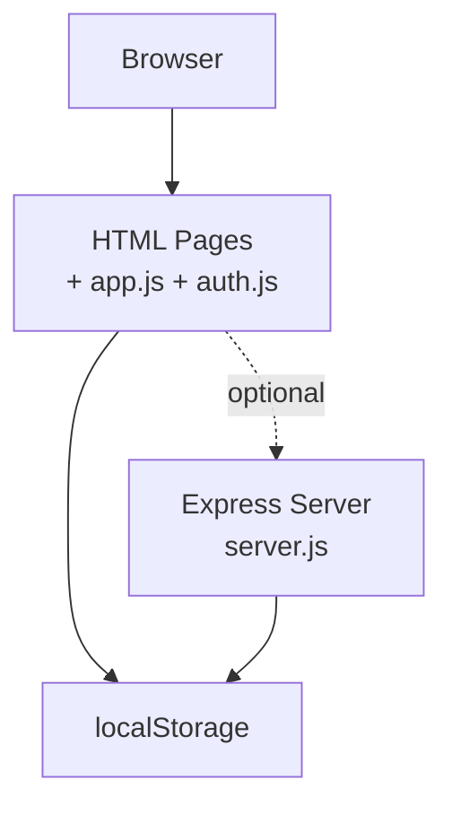

**Diagram sources**
- [app.js](file://app.js)
- [auth.js](file://auth.js)
- [server.js](file://backend/server.js)

**Section sources**
- [app.js](file://app.js)
- [auth.js](file://auth.js)
- [server.js](file://backend/server.js)

## Detailed Component Analysis

### Shared Utilities Module (app.js)
Responsibilities:
- UI lifecycle: tooltips, mobile menu, theme toggle, alerts
- Modals: open/close with overlay behavior
- Tabs: switch content dynamically
- Search and sort: generic table filtering and sorting
- Export/print: CSV export and print window generation
- Performance helpers: debounce/throttle, number animation
- URL manipulation: get/set params without reload
- Persistence helpers: localStorage with TTL
- Forms: validation, clearing, submission helpers
- Clipboard: copy-to-clipboard with feedback
- Scrolling and loading indicators

Implementation highlights:
- Event-driven initialization on DOMContentLoaded
- Generic table search/sort supporting multiple columns
- CSV export using Blob and anchor download
- Debounce/throttle for performance-sensitive events
- Animated counters using interval-based updates
- Safe localStorage with expiry checking

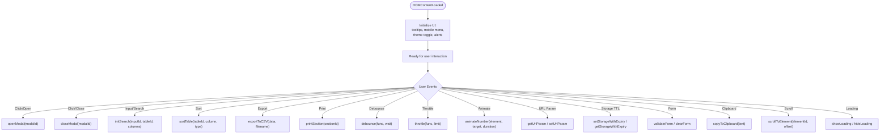

**Diagram sources**
- [app.js](file://app.js)

**Section sources**
- [app.js](file://app.js)

### Authentication and Data Access Module (auth.js)
Responsibilities:
- Demo user management and initialization
- Session handling via localStorage
- Entity getters/setters for workers, tasks, performance, salaries, penalties, permissions, shift changes
- Formatting helpers (date, currency)
- Worker lookup and statistics computation
- Unique ID generation and month name retrieval

Data modeling approach:
- Entities stored as arrays in localStorage under keys like workers, tasks, performance, salaries, penalties, permissions, shiftChanges
- Workers include dailySalary, monthlySalary, workDaysPerMonth, role, status
- Tasks include assignedTo, priority, status, createdAt
- Performance includes workerId, date, status, hoursWorked, efficiency, notes
- Salaries include workerId, month, year, workDays, dailySalary, baseSalary, bonus, penalty, leaveDeduction, total
- Penalties include workerId, amount, reason, date, status
- Permissions include workerId, startDate, endDate, reason, type, status
- ShiftChanges include requesterId, targetId, date, reason, status

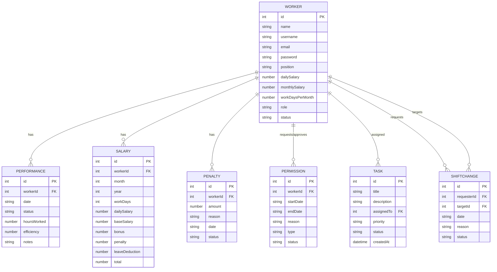

**Diagram sources**
- [auth.js](file://auth.js)

**Section sources**
- [auth.js](file://auth.js)

### Page-Level Components

#### Dashboard (dashboard.html)
- Role-aware navigation and redirection
- Stats rendering: total workers, active workers, total bonuses, total penalties
- Pending requests summary
- Today’s attendance counts
- Top workers ranking via average efficiency

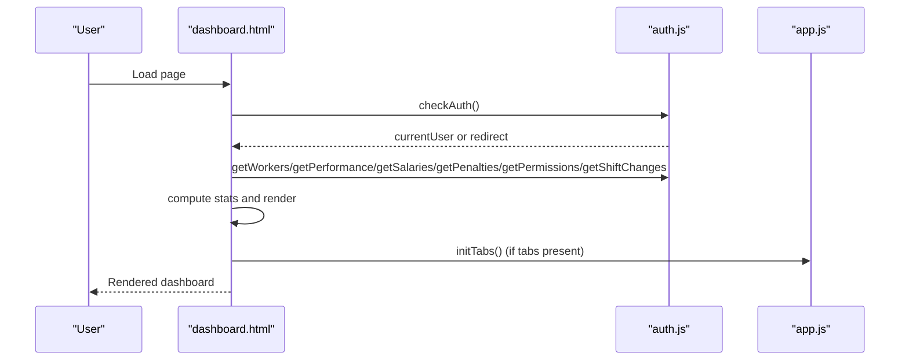

**Diagram sources**
- [dashboard.html](file://dashboard.html)
- [auth.js](file://auth.js)
- [app.js](file://app.js)

**Section sources**
- [dashboard.html](file://dashboard.html)

#### Workers (workers.html)
- CRUD operations for workers
- Search and filter by position, role, status
- Salary calculation helpers for monthly/daily conversion
- Modal-based forms for add/edit

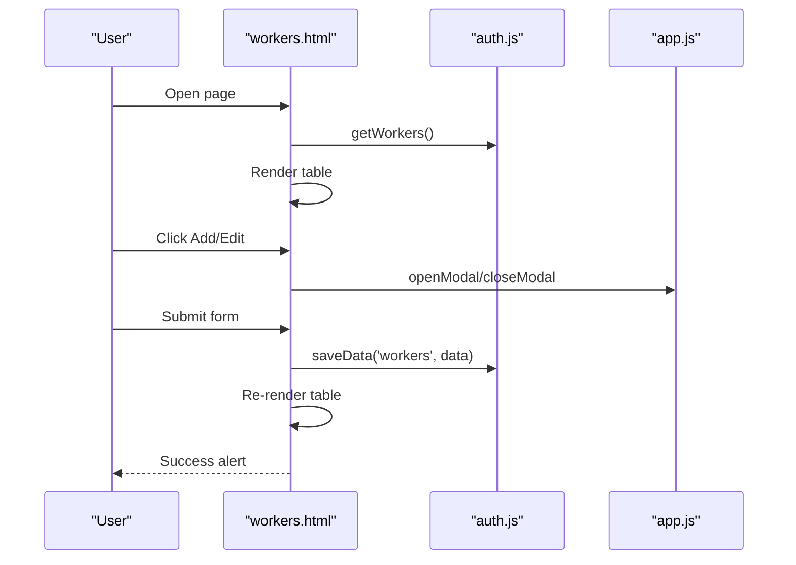

**Diagram sources**
- [workers.html](file://workers.html)
- [auth.js](file://auth.js)
- [app.js](file://app.js)

**Section sources**
- [workers.html](file://workers.html)

#### Tasks (tasks.html)
- Task listing with status filtering
- Assign worker dropdown population
- Status transitions (pending → in-progress → completed)
- Modal-based creation

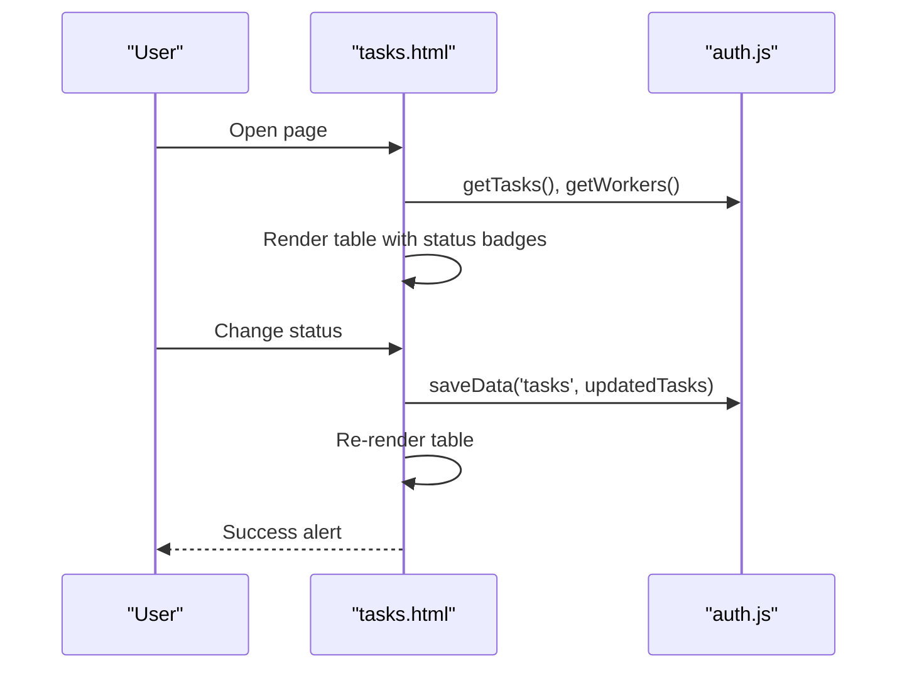

**Diagram sources**
- [tasks.html](file://tasks.html)
- [auth.js](file://auth.js)

**Section sources**
- [tasks.html](file://tasks.html)

#### Performance (performance.html)
- Daily/weekly/monthly/ranking tabs
- Daily performance entries with status, hours, efficiency
- Ranking computed from efficiency and attendance rate

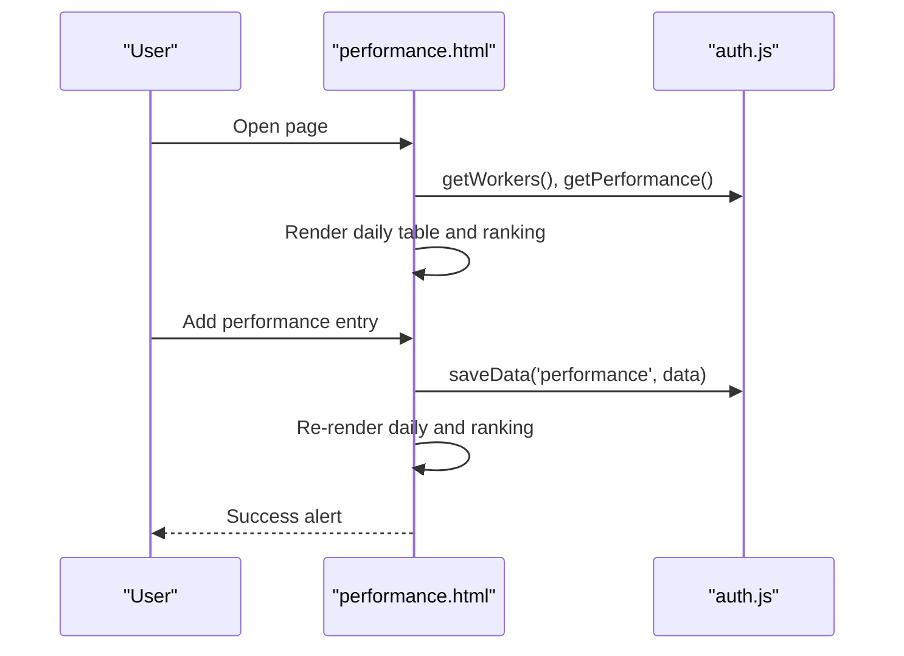

**Diagram sources**
- [performance.html](file://performance.html)
- [auth.js](file://auth.js)

**Section sources**
- [performance.html](file://performance.html)

#### Salary (salary.html)
- Month/year filters and worker filter
- Salary calculation based on work days, paid leave, penalties
- Edit bonus/penalty per worker
- Export to CSV

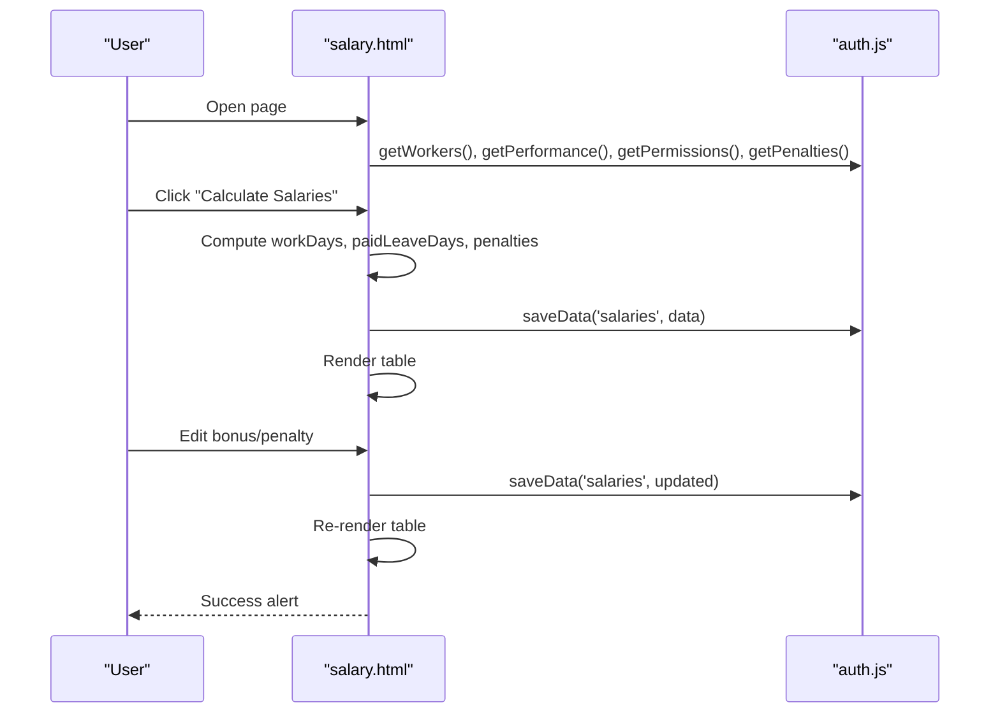

**Diagram sources**
- [salary.html](file://salary.html)
- [auth.js](file://auth.js)

**Section sources**
- [salary.html](file://salary.html)

### Login and Navigation
- Landing page (index.html) initializes app.js for tooltips and theme toggle
- Login page (login.html) handles form submission, toggles password visibility, fills demo accounts, and redirects based on role
- Auth module initializes demo data and manages sessions

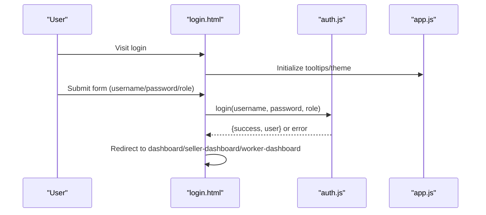

**Diagram sources**
- [login.html](file://login.html)
- [auth.js](file://auth.js)
- [app.js](file://app.js)

**Section sources**
- [index.html](file://index.html)
- [login.html](file://login.html)
- [auth.js](file://auth.js)
- [app.js](file://app.js)

## Dependency Analysis
Frontend dependencies:
- app.js depends on DOM APIs and shared utilities
- auth.js depends on localStorage and shared formatting helpers
- Pages depend on auth.js and app.js for functionality

Backend dependencies (server.js):
- Express, Helmet, CORS, compression, rate limiting, Morgan, Socket.IO, Mongoose, dotenv, and related packages

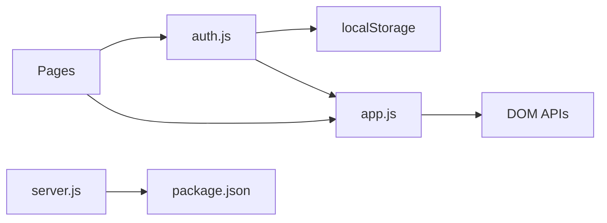

**Diagram sources**
- [app.js](file://app.js)
- [auth.js](file://auth.js)
- [server.js](file://backend/server.js)
- [package.json](file://backend/package.json)

**Section sources**
- [app.js](file://app.js)
- [auth.js](file://auth.js)
- [server.js](file://backend/server.js)
- [package.json](file://backend/package.json)

## Performance Considerations
- Debounce/throttle: Use debounce for search inputs and throttle for scroll events to reduce reflows and excessive computations
- Virtualization: For large datasets, consider virtualizing table rows
- Efficient DOM updates: Batch DOM updates and avoid frequent reflows
- Lazy initialization: Initialize heavy components on demand
- Minimize localStorage writes: Coalesce updates and write once per operation
- CSS performance: Prefer transform/opacity for animations; avoid layout thrashing
- Printing: Generate print content on-demand to minimize DOM overhead

[No sources needed since this section provides general guidance]

## Troubleshooting Guide
Common issues and resolutions:
- Authentication failures: Verify demo credentials and localStorage presence; ensure initializeData runs on login page load
- Empty tables: Confirm entity getters return arrays and localStorage keys exist
- Sorting/search not working: Ensure table IDs and column selectors match the DOM
- Modals not closing: Verify modal IDs and event delegation for overlay clicks
- Alerts not dismissing: Confirm auto-dismiss timeouts and container selection
- Export errors: Validate data shape and CSV generation logic

Validation and error handling patterns:
- Form validation adds/removes error classes on required fields
- Confirmation dialogs wrap destructive actions
- Safe localStorage access with null checks and expiry validation
- Graceful empty states with icons and messages

Security considerations:
- Client-side only: No server-side authentication; ensure sensitive operations are protected
- Input sanitization: Validate numeric inputs and dates
- Secure defaults: Helmet CSP, rate limiting, and compression enabled in backend

**Section sources**
- [auth.js](file://auth.js)
- [app.js](file://app.js)

## Conclusion
The 555 İnşaat system demonstrates a pragmatic, modular frontend architecture leveraging localStorage for persistence and shared utilities for cross-cutting concerns. The design emphasizes simplicity, maintainability, and user experience through consistent UI patterns, robust utilities, and clear separation of responsibilities. The backend complements the frontend with production-ready middleware and security configurations.

[No sources needed since this section summarizes without analyzing specific files]

## Appendices

### Naming Conventions and Organization
- Modules: app.js (utilities), auth.js (authentication/data)
- Pages: lowercase with hyphens (e.g., workers.html, salary.html)
- Functions: camelCase (e.g., openModal, validateForm)
- Constants: UPPERCASE (e.g., DEMO_USERS)
- Classes: PascalCase in HTML/CSS (e.g., .modal, .card)

### Browser Compatibility
- Modern browsers support: DOM APIs, localStorage, Fetch/XMLHttpRequest, CSS variables, Flexbox/Grid
- Progressive enhancement: Fallbacks for older environments where applicable
- Polyfills: Consider adding polyfills for legacy environments if needed

[No sources needed since this section provides general guidance]